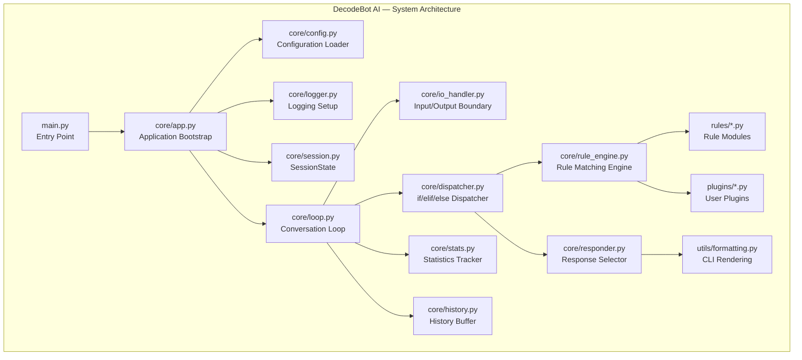
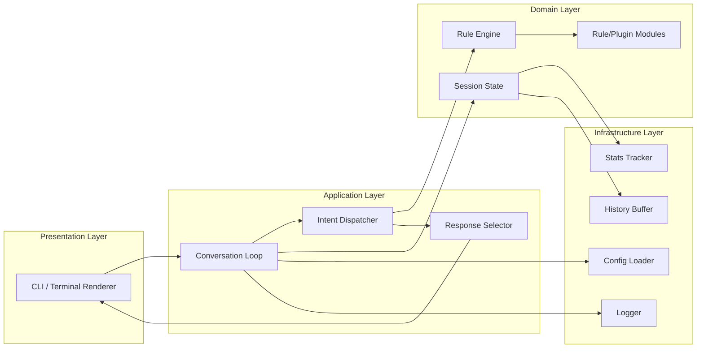
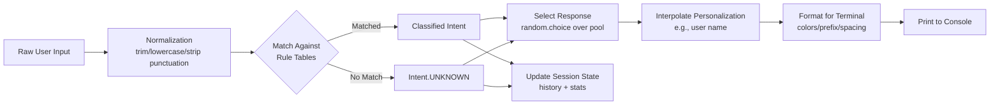
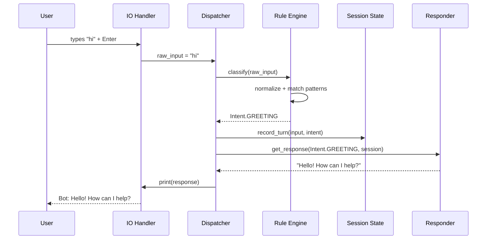
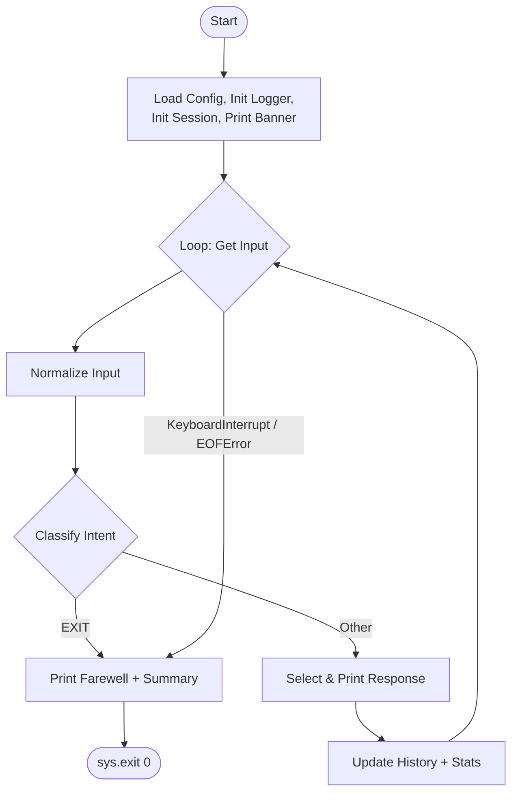
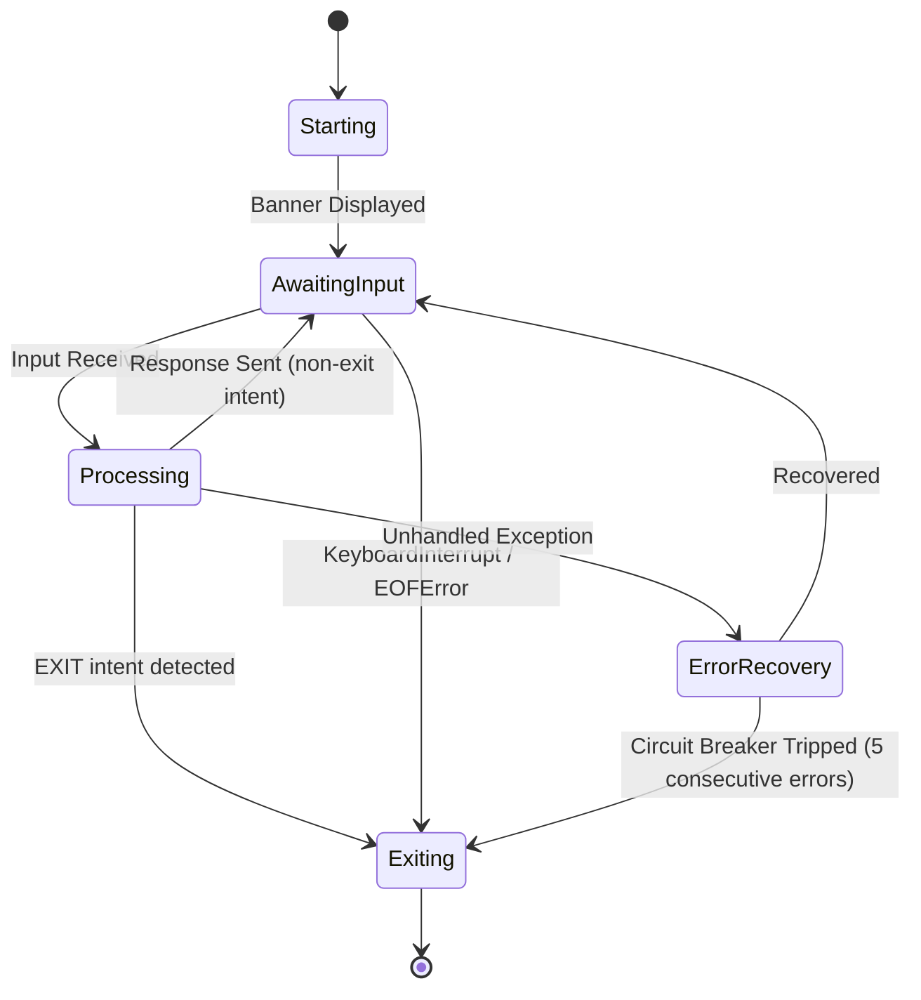
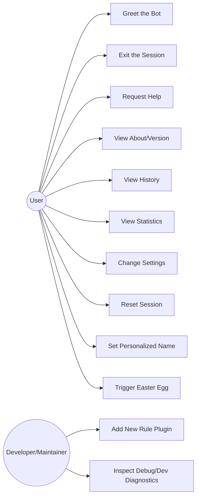

# SPEC.md — DecodeBot AI

> **A Production-Grade, 100% Rule-Based Conversational AI System**

---

## Cover Page

| Field | Value |
|---|---|
| **Project Name** | DecodeBot AI |
| **Document Type** | Software Requirements & Architecture Specification (SPEC.md) |
| **Version** | 1.0.0 |
| **Author** | `<AUTHOR NAME PLACEHOLDER>` |
| **Organization** | DecodeLabs Artificial Intelligence Internship — Week 1, Project 1 |
| **License** | MIT License |
| **Status** | ✅ Approved for Implementation |
| **Document Classification** | Public / Portfolio / Open Source |
| **Target Implementer** | OpenCode (AI Coding Agent) |
| **Date** | 2026-07-29 |
| **Revision History** | v1.0.0 — Initial complete specification |

> **Implementation Directive:** This document is the **single source of truth** for the DecodeBot AI project. Any ambiguity encountered by an implementing agent must be resolved by re-reading this document in full before making an assumption. No functional behavior should be invented that is not derivable from this specification.

---

## Table of Contents

1. [Executive Summary](#executive-summary)
2. [Project Vision](#project-vision)
3. [Problem Statement](#problem-statement)
4. [Objectives](#objectives)
5. [Scope](#scope)
6. [DecodeLabs Internship Compliance Matrix](#decodelabs-internship-compliance-matrix)
7. [IEEE Software Requirements Specification](#ieee-software-requirements-specification)
8. [Functional Requirements](#functional-requirements)
9. [Non-Functional Requirements](#non-functional-requirements)
10. [User Stories](#user-stories)
11. [Complete Feature Specification](#complete-feature-specification)
12. [Conversation Design](#conversation-design)
13. [Architecture](#architecture)
14. [Algorithms](#algorithms)
15. [Folder Structure](#folder-structure)
16. [Coding Standards](#coding-standards)
17. [Testing Specification](#testing-specification)
18. [Error Handling](#error-handling)
19. [CLI Specification](#cli-specification)
20. [Acceptance Criteria](#acceptance-criteria)
21. [GitHub Standards](#github-standards)
22. [Roadmap](#roadmap)
23. [Risks](#risks)
24. [Glossary](#glossary)
25. [References](#references)

---

## Executive Summary

**DecodeBot AI** is a fully rule-based, deterministic conversational agent implemented in pure Python with **zero third-party AI/ML/NLP dependencies**. It is designed to satisfy — and substantially exceed — the requirements of the DecodeLabs AI Internship Week 1 assignment, while being architected to the standard of a professional open-source software project suitable for a GitHub portfolio, LinkedIn showcase, and technical resume artifact.

The system uses explicit pattern-matching, keyword dictionaries, string normalization, and deterministic control flow (`if`/`elif`/`else`, `while` loops, functions, and data structures) to simulate conversational intelligence. No statistical model, embedding, tokenizer, or trained weight of any kind is used anywhere in the codebase. Every decision the bot makes is traceable to an explicit, human-readable rule.

Despite its simplicity of underlying technique, DecodeBot AI delivers a professional command-line experience: a modular rule engine, session statistics, configurable personalization, structured logging, a plugin-ready architecture, graceful error recovery, and a comprehensive automated test suite (100+ test cases).

This document defines **every requirement, behavior, module, algorithm, diagram, test case, and standard** needed for an AI coding agent (OpenCode) to implement DecodeBot AI end-to-end without further clarification.

---

## Project Vision

To demonstrate that disciplined software engineering — not model complexity — is what separates an amateur script from a professional system. DecodeBot AI's vision is to be **the reference implementation** of a rule-based chatbot: a project where a beginner-level AI concept (pattern matching) is elevated through professional architecture, exhaustive requirements engineering, rigorous testing, and polished developer experience into something indistinguishable, in engineering quality, from production software.

DecodeBot AI should serve simultaneously as:

1. A **compliant submission** for the DecodeLabs internship.
2. A **credible open-source artifact** for a public GitHub profile.
3. A **teaching example** of rule-based AI, requirements engineering, and clean Python architecture.
4. A **foundation** that could later be extended toward NLP/ML/LLM-backed systems without a rewrite.

---

## Problem Statement

Entry-level AI/ML internships frequently assign a "build a simple chatbot" exercise using only `if`/`elif`/`else` and a `while` loop. Most student submissions are single-file scripts of 20–40 lines with no error handling, no tests, no documentation, and no software engineering discipline. This satisfies the letter of the assignment but fails to demonstrate professional capability.

There is a gap between **"a chatbot that technically works"** and **"a chatbot that would pass a code review at a software company."** DecodeBot AI closes this gap by applying full software requirements engineering (IEEE SRS structure), modular architecture, comprehensive functional and non-functional requirements, a professional test suite, and GitHub-grade repository standards — all while remaining strictly within the rule-based paradigm mandated by the internship.

---

## Objectives

### Internship Objectives
- OBJ-INT-01: Fully satisfy all eight DecodeLabs Week 1 mandatory requirements (see [Compliance Matrix](#decodelabs-internship-compliance-matrix)).
- OBJ-INT-02: Submit a single runnable Python program demonstrating `while` loop and `if`/`elif`/`else` control flow.
- OBJ-INT-03: Demonstrate clear understanding of rule-based AI concepts through code comments and documentation.
- OBJ-INT-04: Deliver the project on or before the internship deadline in a reviewable repository.

### Technical Objectives
- OBJ-TECH-01: Implement a modular, layered architecture separating I/O, rule engine, and presentation.
- OBJ-TECH-02: Achieve 100% rule-based determinism — identical input under identical session state always yields the same categorical response.
- OBJ-TECH-03: Provide a plugin-ready rule engine that can accept new intents without modifying core logic.
- OBJ-TECH-04: Maintain zero external runtime dependencies beyond the Python 3 standard library.
- OBJ-TECH-05: Achieve automated test coverage across all conversational branches.

### Portfolio Objectives
- OBJ-PORT-01: Produce a repository presentable on GitHub with professional README, badges, and documentation.
- OBJ-PORT-02: Produce a project describable in a single LinkedIn post and a single resume bullet.
- OBJ-PORT-03: Demonstrate requirements engineering skill (SRS, FRs, NFRs, test plans) alongside coding skill.

### Learning Objectives
- OBJ-LEARN-01: Reinforce mastery of Python control flow, functions, modules, and data structures.
- OBJ-LEARN-02: Build practical experience with software specification writing.
- OBJ-LEARN-03: Build practical experience with structured software testing.
- OBJ-LEARN-04: Build experience with CLI/UX design constrained to a terminal.

### Stretch Goals
- OBJ-STRETCH-01: Configuration-file-driven behavior (JSON/INI) without code changes.
- OBJ-STRETCH-02: Session statistics dashboard rendered in the terminal.
- OBJ-STRETCH-03: Hidden "developer mode" and easter eggs for portfolio delight.
- OBJ-STRETCH-04: Architecture documented such that a future contributor could bolt on real NLP/LLM logic behind the same interface (explicitly **not implemented** in v1).

---

## Scope

### In Scope
- A single Python 3 CLI application (`decodebot`) running in an interactive REPL loop.
- Deterministic rule-based intent detection using string normalization, keyword/phrase matching, and pattern tables.
- Greeting, farewell/exit, help, about, version, and unknown-input handling.
- Session-only conversation history and runtime statistics (in-memory; not persisted to disk by default).
- Optional local configuration file (`config.json` or `config.ini`) for toggling personalization, colors, and debug/developer mode.
- Structured logging to a local log file.
- Hidden commands / easter eggs as fixed, deterministic responses.
- A modular, plugin-ready rule engine architecture.
- A full automated test suite (`pytest`-based) and manual test scripts.
- Complete project documentation: README, CONTRIBUTING, LICENSE, CHANGELOG.
- An optional Tkinter-based graphical interface (`--gui` launch flag) that reuses the exact same rule engine as the CLI � no duplicated conversational logic.
- Terminal animation effects (typewriter-style response printing, "thinking" indicator, animated banner) for the default CLI mode.

### Out of Scope
- Any machine learning, deep learning, NLP library, or LLM/API integration of any kind.
- Persistent storage of conversation data to a database.
- Multi-user, networked, or web-based deployment.
- Voice input/output.
- (Removed � GUI is now in scope as an optional secondary interface. See "GUI & Animation Layer" section.)
- Multilingual support (English-only for v1).
- Authentication, authorization, or user accounts.

### Future Scope
- Web-based front end (Flask/FastAPI) reusing the same rule engine (see [Roadmap](#roadmap)).
- Optional, clearly-labeled "Chapter 2" branch introducing NLP/ML/LLM capability as a **separate, opt-in mode** that never replaces the rule-based core.
- Database-backed persistent conversation history.
- Voice interface via speech-to-text/text-to-speech.


---

## DecodeLabs Internship Compliance Matrix

> **This section is mandatory and non-negotiable.** Every internship requirement below MUST be implemented exactly as mapped, and no advanced feature introduced elsewhere in this specification may alter, weaken, or replace the behavior guaranteed here. If any conflict arises between an "advanced feature" and this matrix, **this matrix wins.**

| # | Internship Requirement | Mandatory | Mapped Functional Requirements | Mapped Test Cases | Completion Criteria |
|---|---|---|---|---|---|
| 1 | Python program (`.py`) | Yes | FR-001, FR-002, FR-003 | TC-CORE-001, TC-CORE-002 | `main.py` exists, runs under Python 3.9+ with no syntax errors, `python main.py` launches the app |
| 2 | Uses `while` loop | Yes | FR-004, FR-005 | TC-CORE-003, TC-CORE-004 | The conversation loop in `run()` is implemented with an explicit `while` statement that continues until an exit condition is met |
| 3 | Uses `if`-`elif`-`else` | Yes | FR-006, FR-007, FR-127 | TC-CORE-005, TC-CORE-006 | The rule engine's intent dispatch and at least the top-level response logic use explicit `if`/`elif`/`else` chains (in addition to any data-driven dispatch tables used for extensibility) |
| 4 | Accepts user input | Yes | FR-011, FR-012 | TC-CORE-007, TC-CORE-008 | `input()` (or equivalent injectable I/O function) is called each loop iteration and the raw string is captured |
| 5 | Handles greetings | Yes | FR-026–FR-035 | TC-GREET-001 to TC-GREET-010 | Recognized greeting phrases produce a greeting-category response 100% of the time |
| 6 | Handles exit commands | Yes | FR-036–FR-045 | TC-EXIT-001 to TC-EXIT-010 | Recognized exit phrases terminate the loop cleanly with a farewell message and exit code `0` |
| 7 | Responds to unknown input | Yes | FR-046–FR-053 | TC-UNK-001 to TC-UNK-008 | Any input matching no known rule produces a fallback response; the program never crashes or hangs on unrecognized input |
| 8 | Runs until the user exits | Yes | FR-004, FR-005, FR-036–FR-045, FR-104–FR-111 | TC-CORE-003, TC-CORE-004, TC-EXIT-001–010, TC-ERR-001–010 | The program only terminates via: (a) a recognized exit command, (b) `Ctrl+C`/`Ctrl+D` handled gracefully, or (c) an unrecoverable OS-level signal. It never terminates due to unhandled input |

### Compliance Statement

DecodeBot AI's core requirement layer (FR-001 through FR-133, as constrained by this matrix) is a strict superset of the DecodeLabs Week 1 checklist. Implementers MUST verify all eight rows pass before implementing or enabling any feature outside this matrix (personalization, statistics, plugins, easter eggs, etc.). A CI gate (see [Testing Specification](#testing-specification)) SHALL run the compliance test group (`tests/test_compliance.py`) on every commit and MUST pass before any other test group is considered.


---

## IEEE Software Requirements Specification

> Structured per IEEE 830 / ISO/IEC/IEEE 29148 conventions, adapted for this project's scale.

### Purpose

This SRS defines the functional and non-functional requirements for **DecodeBot AI v1.0.0**, a rule-based command-line conversational agent. It is intended for use by the implementing engineer/agent (OpenCode), reviewers (internship instructors), and future contributors.

### Scope

DecodeBot AI is a single-user, single-process, terminal-based Python application. It accepts free-text input, classifies it into a fixed set of intents using deterministic string-matching rules, and returns a corresponding response. It maintains session-only state (history, statistics, user name) and terminates gracefully on user command or interrupt.

### Definitions, Acronyms, and Abbreviations

| Term | Definition |
|---|---|
| **Intent** | A discrete category of user input meaning (e.g., `GREETING`, `EXIT`, `HELP`) determined by rule matching |
| **Rule** | A deterministic condition (keyword, phrase, or pattern) mapped to an intent and a response set |
| **Rule Engine** | The module responsible for normalizing input and matching it against rules to produce an intent and response |
| **Session** | The lifetime of one running instance of the program, from launch to exit |
| **Fallback / Unknown Response** | The response category used when no rule matches |
| **Normalization** | The process of transforming raw input into a canonical form (lowercase, trimmed, punctuation-stripped) for matching |
| **CLI** | Command-Line Interface |
| **NFR** | Non-Functional Requirement |
| **FR** | Functional Requirement |
| **SRS** | Software Requirements Specification |
| **Presentation Adapter** | Either the CLI (core/loop.py) or GUI (gui/app_gui.py) � an interchangeable front end that never contains its own conversational logic |
| **Reduced Motion** | An accessibility mode that disables frame-cycling animation while preserving static informational equivalents || **REPL** | Read-Eval-Print Loop |

### References

See [References](#references) section.

### Assumptions

- ASM-01: The end user has Python 3.9+ installed locally and runs the program from a standard terminal (bash, zsh, PowerShell, cmd).
- ASM-02: The terminal supports UTF-8 text output; ANSI color support is optional and detected at runtime.
- ASM-03: The user interacts in English using a standard QWERTY-compatible keyboard.
- ASM-04: The user is a single local actor; no concurrent multi-user access is assumed.
- ASM-05: Network access is not required for any core feature.

### Constraints

- CON-01: No machine learning, deep learning, NLP, or LLM library or API may be used (see [Project](#project) prohibition list).
- CON-02: The implementation language is Python 3 only.
- CON-03: Only the Python standard library may be used for core functionality (`json`, `re`, `random`, `logging`, `datetime`, `configparser`, `argparse`, `sys`, `os`, `pathlib`, `dataclasses`, `enum`, `typing`, `unittest`/`pytest` for tests).
- CON-04: The application must remain runnable as a single `python main.py` invocation with zero mandatory configuration.
- CON-05: All conversational behavior must be traceable to an explicit, inspectable rule — no opaque or probabilistic decision-making beyond `random.choice()` over a fixed, authored response list.

### Dependencies

| Dependency | Type | Justification |
|---|---|---|
| Python 3.9+ | Runtime | Required language runtime |
| `pytest` | Dev/Test only | Test runner (not a runtime dependency of the shipped app) |
| `colorama` (optional, Windows only) | Optional runtime | Cross-platform ANSI color support; app must run correctly without it |

No other third-party packages are permitted.

### Operating Environment

- OS: Windows 10+, macOS 11+, Linux (any modern distribution) — pure Python, no OS-specific system calls required.
- Runtime: CPython 3.9, 3.10, 3.11, 3.12, or 3.13.
- Terminal: any ANSI-capable or plain-text terminal emulator.
- Hardware: negligible — runs on any machine capable of running Python (target: <50MB RAM, <1% sustained CPU).

### Stakeholders

| Stakeholder | Interest |
|---|---|
| DecodeLabs Instructor/Reviewer | Verifying internship compliance and code quality |
| Student/Developer (Author) | Learning outcomes, portfolio value, grade/certification |
| Recruiter/Hiring Manager | Evidence of engineering discipline and Python proficiency |
| Open Source Contributor | Ability to understand, extend, and contribute to the codebase |
| End User | A working, pleasant, non-frustrating CLI chatbot experience |
| Future Maintainer | Long-term extensibility (e.g., future NLP/LLM integration) |


---

## Functional Requirements

> **Format:** Each requirement lists Priority (P0=Critical/blocking, P1=High, P2=Medium, P3=Low/stretch), Description, Rationale, Dependencies, Acceptance Criteria, Edge Cases, and an Example. Requirements are grouped into 17 categories, FR-001 through FR-163.

### Category A — Core Program Structure & Execution Loop (FR-001 – FR-010)

**FR-001 — Single Python Entry Point**
- **Priority:** P0
- **Description:** The application shall expose one executable entry point, `main.py`, at the repository root, runnable via `python main.py`.
- **Rationale:** Required by internship rubric; establishes a discoverable, conventional start point.
- **Dependencies:** None
- **Acceptance Criteria:** `python main.py` launches the app with no arguments required; exit code `0` on normal exit.
- **Edge Cases:** Executed from a different working directory; executed via `python3` alias; executed as `./main.py` with a shebang.
- **Example:** `$ python main.py` → welcome banner appears.

**FR-002 — `if __name__ == "__main__"` Guard**
- **Priority:** P0
- **Description:** `main.py` shall guard its execution with the standard `if __name__ == "__main__":` idiom.
- **Rationale:** Allows safe importation of modules for testing without triggering the REPL.
- **Dependencies:** FR-001
- **Acceptance Criteria:** Importing `main` in a test file does not start the REPL loop.
- **Edge Cases:** Circular imports; running as a package (`python -m decodebot`).
- **Example:** `import main` in `tests/` does not print the banner or block on `input()`.

**FR-003 — Python Version Compatibility**
- **Priority:** P1
- **Description:** The codebase shall run unmodified on CPython 3.9 through 3.13.
- **Rationale:** Broad compatibility for graders/reviewers on varied environments.
- **Dependencies:** None
- **Acceptance Criteria:** CI test matrix passes on 3.9, 3.10, 3.11, 3.12, 3.13.
- **Edge Cases:** Use of syntax newer than 3.9 (e.g., `match` statements, added in 3.10) must be avoided or feature-gated.
- **Example:** `tox.ini`/CI workflow runs the suite across all five versions.

**FR-004 — Primary Conversation `while` Loop**
- **Priority:** P0
- **Description:** The core conversational cycle shall be implemented as an explicit `while True:` loop that reads input, processes it, and prints a response each iteration, breaking only on an exit condition.
- **Rationale:** Mandatory internship requirement; also the natural structure for a REPL.
- **Dependencies:** FR-001
- **Acceptance Criteria:** Loop body executes repeatedly until `should_exit` is set `True` by the rule engine or an interrupt is caught.
- **Edge Cases:** Infinite loop on malformed exit logic (must be prevented by tests); loop must not busy-wait or spin the CPU.
- **Example:** User enters `hi`, `help`, `bye` in sequence; loop iterates exactly 3 times before terminating.

**FR-005 — Loop Termination Conditions**
- **Priority:** P0
- **Description:** The loop shall terminate under exactly three conditions: (1) exit-intent detected, (2) `KeyboardInterrupt` caught, (3) `EOFError` caught.
- **Rationale:** Prevents unbounded execution and undefined termination states.
- **Dependencies:** FR-004, FR-036, FR-104, FR-105
- **Acceptance Criteria:** Each of the three conditions independently produces a clean exit with an appropriate farewell message and exit code `0`.
- **Edge Cases:** Simultaneous signal and exit-command race (not possible in single-threaded REPL, documented as N/A).
- **Example:** `Ctrl+C` during `input()` prints `"\nSession interrupted. Goodbye!"` and exits code `0`.

**FR-006 — Explicit `if`/`elif`/`else` Dispatch at Top Level**
- **Priority:** P0
- **Description:** The top-level response dispatcher shall use an explicit `if`/`elif`/`else` chain to route between at least: greeting, exit, help, about, version, unknown, and error-recovery categories, prior to delegating to the more granular data-driven rule table for specific phrase matches.
- **Rationale:** Explicit internship rubric requirement; also improves readability of the primary control path.
- **Dependencies:** FR-004
- **Acceptance Criteria:** Source code contains a readable `if`/`elif`/`else` chain in `core/dispatcher.py` mapping `Intent` enum values to handler functions.
- **Edge Cases:** New intents added via plugin architecture (FR-118+) must still route through this dispatcher, not bypass it.
- **Example:** `Intent.GREETING` → `elif intent == Intent.GREETING:` branch → `handle_greeting()`.

**FR-007 — Data-Driven Rule Table Beneath Dispatch**
- **Priority:** P1
- **Description:** Beneath the top-level `if`/`elif`/`else`, specific phrase-to-intent matching shall be implemented via inspectable data structures (dictionaries/lists of tuples), not nested `if` chains, for maintainability.
- **Rationale:** Balances the mandatory use of `if`/`elif`/`else` with professional maintainability at scale.
- **Dependencies:** FR-006
- **Acceptance Criteria:** Adding a new greeting synonym requires only a data change in `rules/greetings.py`, not a code change in the dispatcher.
- **Edge Cases:** Data table grows unbounded — must support namespacing/categorization.
- **Example:** `GREETING_PATTERNS = ["hello", "hi", "hey", ...]` consulted by `match_intent()`.

**FR-008 — Deterministic Behavior**
- **Priority:** P0
- **Description:** Given identical normalized input and identical session state, the system shall always classify the same intent (response *text* may vary only via `random.choice()` over an authored, fixed candidate list for that intent).
- **Rationale:** Core definition of "rule-based" — excludes any adaptive or learned behavior.
- **Dependencies:** FR-006, FR-007
- **Acceptance Criteria:** Unit test asserts `classify_intent("hello")` returns `Intent.GREETING` on every call across 1000 iterations.
- **Edge Cases:** Randomized response text must never change the *classified intent*, only the surface response.
- **Example:** `"hello"` always classifies as `GREETING`; the greeting *text* returned may vary among 5 authored strings.

**FR-009 — No Prohibited Dependencies**
- **Priority:** P0
- **Description:** The codebase and its dependency manifest shall contain zero references to ML/DL/NLP/LLM libraries (see prohibited list in Project Background).
- **Rationale:** Hard constraint of the internship and this specification.
- **Dependencies:** None
- **Acceptance Criteria:** A CI lint step (`tests/test_no_prohibited_imports.py`) scans all `.py` files and `requirements.txt` for prohibited package names and fails the build if found.
- **Edge Cases:** Transitive dependencies pulled in accidentally by an allowed package (must be checked in `pip list`).
- **Example:** `grep -r "import spacy" .` returns no matches; CI passes.
- **Warning:** ⚠️ Any implementing agent must not "helpfully" add an NLP library for "better matching." This is a hard, audited constraint.

**FR-010 — Graceful Startup**
- **Priority:** P1
- **Description:** On launch, the application shall initialize configuration, logging, and the rule engine, then display the welcome banner (see [CLI Specification](#cli-specification)) before entering the loop.
- **Rationale:** Predictable, professional startup sequence.
- **Dependencies:** FR-001, FR-088, FR-096
- **Acceptance Criteria:** Startup completes in under 300ms on reference hardware; no exceptions raised for missing optional config file (defaults are used).
- **Edge Cases:** Corrupt config file — must fail gracefully to defaults with a logged warning, not crash (see FR-108).
- **Example:** Deleting `config.json` still allows normal startup using built-in defaults.

### Category B — Input Acquisition & Normalization (FR-011 – FR-025)

**FR-011 — Input Capture via `input()`**
- **Priority:** P0
- **Description:** Each loop iteration shall capture one line of raw user text via Python's built-in `input()` (wrapped in an injectable I/O function for testability).
- **Rationale:** Mandatory internship requirement ("accepts user input").
- **Dependencies:** FR-004
- **Acceptance Criteria:** `get_user_input(prompt)` returns the exact string typed, unmodified, before normalization.
- **Edge Cases:** Piped/non-interactive stdin (automation, CI); must not hang indefinitely if stdin is closed (see FR-105).
- **Example:** Typing `Hello There` returns raw string `"Hello There"`.

**FR-012 — Prompt Display Before Input**
- **Priority:** P1
- **Description:** A configurable prompt string (default `"You: "`) shall be displayed immediately before each `input()` call.
- **Rationale:** Standard, professional CLI UX convention; clarifies turn-taking.
- **Dependencies:** FR-011
- **Acceptance Criteria:** Prompt string appears on its own visual turn before the cursor awaits input.
- **Edge Cases:** Custom prompt via config/personalization (e.g., `"{name}: "`).
- **Example:** `You: ` printed, cursor blinks, user types `hi`.

**FR-013 — Whitespace Trimming**
- **Priority:** P0
- **Description:** Raw input shall be stripped of leading/trailing whitespace before any matching occurs.
- **Rationale:** Prevents false negatives from accidental spaces.
- **Dependencies:** FR-011
- **Acceptance Criteria:** `"   hello   "` normalizes to `"hello"` and classifies as `GREETING`.
- **Edge Cases:** Input consisting entirely of whitespace (tabs, multiple spaces) must normalize to empty string and route to empty-input handling (FR-047).
- **Example:** `"\thi\n"` → normalized `"hi"`.

**FR-014 — Case-Insensitive Matching**
- **Priority:** P0
- **Description:** All rule matching shall be case-insensitive; input is lower-cased during normalization for comparison purposes only (original casing preserved for logging/history).
- **Rationale:** Users type in inconsistent casing; must not degrade UX.
- **Dependencies:** FR-013
- **Acceptance Criteria:** `"HELLO"`, `"Hello"`, `"hello"`, `"HeLLo"` all classify identically as `GREETING`.
- **Edge Cases:** Proper nouns (user's name) must preserve original casing when echoed back, even though matching is case-insensitive.
- **Example:** `"HeY tHeRe"` → matched against normalized `"hey there"`.

**FR-015 — Punctuation Normalization**
- **Priority:** P1
- **Description:** Trailing/leading punctuation (`. , ! ? ; :`) commonly appended to conversational input shall be stripped prior to matching, without altering internal punctuation meaningfully (e.g., contractions like `don't` are preserved).
- **Rationale:** `"hello!"` and `"hello"` should both match `GREETING`.
- **Dependencies:** FR-013
- **Acceptance Criteria:** `"hello!!!"`, `"hello?"`, `"hello."` all classify as `GREETING`.
- **Edge Cases:** Input that is *only* punctuation (e.g., `"???"`) must route to unknown/unclear-input handling, not crash.
- **Example:** `"how are you?"` → normalized to `"how are you"` for matching.

**FR-016 — Multiple Whitespace Collapsing**
- **Priority:** P2
- **Description:** Internal runs of multiple spaces/tabs shall be collapsed to a single space during normalization.
- **Rationale:** Robustness against irregular typing/copy-paste artifacts.
- **Dependencies:** FR-013
- **Acceptance Criteria:** `"hello    there"` normalizes to `"hello there"`.
- **Edge Cases:** Non-breaking spaces / unicode whitespace variants.
- **Example:** `"good    morning"` → `"good morning"`.

**FR-017 — Unicode-Safe Handling**
- **Priority:** P1
- **Description:** Input containing non-ASCII Unicode characters (accents, emoji, CJK characters) shall not crash the program; such input is normalized where possible and otherwise routed to unknown-input handling.
- **Rationale:** Real-world terminals frequently receive Unicode input (accidental or intentional).
- **Dependencies:** FR-013
- **Acceptance Criteria:** `"héllo"`, `"👋"`, `"你好"` are all accepted without raising an exception.
- **Edge Cases:** Emoji-only greeting (e.g., `"👋"`) MAY be special-cased as a recognized greeting (see FR-034) or routed to unknown — decision documented in Conversation Design.
- **Example:** `"héllo 👋"` does not raise `UnicodeDecodeError` or `UnicodeEncodeError`.

**FR-018 — Long Input Handling**
- **Priority:** P2
- **Description:** Input exceeding 500 characters shall be accepted without performance degradation or crash, truncated for logging/history display purposes only (full text still used for matching).
- **Rationale:** Defensive robustness against pasted large text blocks.
- **Dependencies:** FR-011
- **Acceptance Criteria:** A 5,000-character input string is processed in under 50ms and does not crash the app.
- **Edge Cases:** Extremely long input (>1MB) — must be bounded by a hard input-length safety cap (configurable, default 10,000 chars) with graceful truncation and a user-facing notice.
- **Example:** Pasting a long paragraph results in a fallback/unknown response, not a crash.

**FR-019 — Numeric-Only Input Handling**
- **Priority:** P2
- **Description:** Purely numeric input (e.g., `"42"`, `"3.14"`) shall be recognized as a distinct, valid input class and routed to a dedicated "numeric input" fallback response, distinct from generic unknown-input.
- **Rationale:** Improves perceived intelligence; numeric input is common (ages, counts) and deserves a tailored reply.
- **Dependencies:** FR-013
- **Acceptance Criteria:** `"42"` produces a response acknowledging a number was received, e.g., `"That's a number! I'm rule-based, so I can't do math, but I noticed 42."`
- **Edge Cases:** Negative numbers, decimals, numbers with commas (`"1,000"`).
- **Example:** `"7"` → numeric-input response.

**FR-020 — Special Character / Symbol-Only Input Handling**
- **Priority:** P2
- **Description:** Input consisting solely of special characters/symbols (e.g., `"@#$%"`) shall be routed to a dedicated fallback response distinct from the generic unknown-input response.
- **Rationale:** Avoids a generic, repetitive fallback for clearly non-linguistic input; improves polish.
- **Dependencies:** FR-013, FR-015
- **Acceptance Criteria:** `"!@#$%^&*"` produces a response such as `"That looks like symbols, not words — try typing 'help'."`
- **Edge Cases:** Mixed symbol+letter input must NOT be misclassified as symbol-only.
- **Example:** `"###"` → symbol-only fallback response.

**FR-021 — Empty Input Handling**
- **Priority:** P0
- **Description:** Pressing Enter with no text (empty string after normalization) shall produce a dedicated gentle prompt response (e.g., `"I didn't catch that — could you type something?"`) rather than the generic unknown-input response, and shall not crash or advance any statistic as a "real" message.
- **Rationale:** Extremely common user action; must be handled distinctly and gracefully.
- **Dependencies:** FR-013
- **Acceptance Criteria:** Pressing Enter alone at the prompt never raises an exception and always yields the empty-input response.
- **Edge Cases:** Repeated empty inputs in a row must not spam identical text — vary via `random.choice()` over an authored list.
- **Example:** User presses Enter 3 times → 3 (possibly varied) gentle prompts, loop continues.

**FR-022 — Injectable I/O Boundary**
- **Priority:** P1
- **Description:** Input and output operations shall be routed through thin wrapper functions (`get_user_input()`, `print_response()`), enabling substitution with mock I/O in automated tests.
- **Rationale:** Testability — the core loop must be testable without real stdin/stdout blocking.
- **Dependencies:** FR-011
- **Acceptance Criteria:** Test suite injects a list of scripted inputs and captures outputs without invoking real terminal I/O.
- **Edge Cases:** Mixing real and mocked I/O within the same test run must not leak state between tests.
- **Example:** `run_session(io=MockIO(inputs=["hi", "bye"]))` returns captured outputs list.

**FR-023 — Input Encoding Safety**
- **Priority:** P2
- **Description:** The application shall read stdin using UTF-8 decoding with error-tolerant handling (`errors="replace"` at the boundary) to avoid crashing on malformed byte sequences.
- **Rationale:** Defensive robustness on varied terminal/OS configurations.
- **Dependencies:** FR-011
- **Acceptance Criteria:** Malformed byte sequences piped via a test harness do not raise unhandled exceptions.
- **Edge Cases:** Windows `cp1252`-encoded terminals — must be documented as a known limitation if not fully solvable.
- **Example:** Piped binary garbage results in a logged warning and an unknown-input response, not a crash.

**FR-024 — Trailing Newline/Control Character Stripping**
- **Priority:** P2
- **Description:** Control characters (e.g., `\r`, `\n`, `\x00`) accidentally included in input (common when piping) shall be stripped during normalization.
- **Rationale:** Prevents matching failures and display artifacts from control characters.
- **Dependencies:** FR-013
- **Acceptance Criteria:** `"hello\r\n"` normalizes to `"hello"`.
- **Edge Cases:** Embedded control characters mid-string (rare) — stripped, not just trimmed from ends.
- **Example:** Input piped from a Windows-formatted file with `\r\n` line endings matches identically to Unix input.

**FR-025 — Input History Buffer (Raw)**
- **Priority:** P2
- **Description:** Each raw (pre-normalization) input string shall be appended to an in-memory session history list, bounded to the most recent 100 entries (configurable).
- **Rationale:** Supports the conversation-history feature (Category G) and debugging.
- **Dependencies:** FR-011, FR-064
- **Acceptance Criteria:** After 5 exchanges, `session.history` contains exactly 5 raw input entries in order.
- **Edge Cases:** History buffer overflow beyond configured max — oldest entries evicted first (FIFO).
- **Example:** 150 messages sent in one session → history retains the most recent 100.


### Category C — Greeting Intent Detection (FR-026 – FR-035)

**FR-026 — Greeting Pattern Table**
- **Priority:** P0
- **Description:** A dedicated, inspectable list of greeting trigger phrases (e.g., `hi`, `hello`, `hey`, `yo`, `good morning`, `good afternoon`, `good evening`, `greetings`, `howdy`, `sup`, `what's up`) shall exist in `rules/greetings.py`.
- **Rationale:** Mandatory internship requirement; centralizing patterns aids maintainability.
- **Dependencies:** FR-007
- **Acceptance Criteria:** At least 15 distinct greeting trigger phrases are defined.
- **Edge Cases:** Overlap with farewell phrases (none expected, but tested).
- **Example:** `GREETING_PATTERNS = ["hi", "hello", "hey", ...]`.

**FR-027 — Exact-Match Greeting Detection**
- **Priority:** P0
- **Description:** Normalized input exactly equal to any entry in the greeting pattern table shall classify as `Intent.GREETING`.
- **Rationale:** Baseline matching mechanism.
- **Dependencies:** FR-026, FR-013
- **Acceptance Criteria:** `"hello"` → `Intent.GREETING`.
- **Edge Cases:** Case and punctuation variants (delegated to FR-014/FR-015).
- **Example:** `"hi"` → `GREETING`.

**FR-028 — Substring/Contains Greeting Detection**
- **Priority:** P1
- **Description:** Normalized input that *contains* a greeting phrase as a whole word (not a substring of a larger unrelated word) shall also classify as `Intent.GREETING`, using word-boundary-aware matching.
- **Rationale:** Real users type `"hello there decodebot"`, not just `"hello"`.
- **Dependencies:** FR-026, FR-027
- **Acceptance Criteria:** `"hello there!"`, `"hey decodebot how are you"` classify as `GREETING`.
- **Edge Cases:** Must NOT match `"shell"` as containing `"hell"`-adjacent tokens, nor `"the"` inside `"hey there"` incorrectly; word-boundary regex (`\b`) required.
- **Example:** `"hey, what's going on"` → `GREETING`.

**FR-029 — Greeting Response Pool**
- **Priority:** P1
- **Description:** At least 8 distinct authored greeting responses shall exist; one is selected at random (`random.choice`) per greeting event.
- **Rationale:** Avoids robotic repetition; improves perceived polish.
- **Dependencies:** FR-026
- **Acceptance Criteria:** Across 100 greeting events, at least 4 distinct response strings are observed (statistically, with fixed seed for test determinism).
- **Edge Cases:** Single-response fallback if pool is misconfigured to empty — must not crash (defaults to a hardcoded safe string).
- **Example:** Responses include `"Hello! How can I help you today?"`, `"Hey there! 👋"`, `"Hi! Great to see you."`.

**FR-030 — Time-of-Day-Aware Greeting (Enhancement)**
- **Priority:** P2
- **Description:** If the user's input matches a generic greeting (not a specific "good morning/afternoon/evening"), the bot MAY optionally append a time-of-day-aware remark based on system clock (e.g., "Good morning!" before noon).
- **Rationale:** Professional, delightful enhancement layered on top of core rule-based matching using only `datetime`.
- **Dependencies:** FR-026, FR-029
- **Acceptance Criteria:** Feature is toggleable via config (`enable_time_aware_greeting`); when enabled and system time is 06:00–11:59, response includes a "morning" variant.
- **Edge Cases:** Time-zone ambiguity — uses local system time only, documented as a known limitation.
- **Example:** At 08:00 local time, `"hi"` → `"Good morning! Ready to chat?"`.

**FR-031 — First-Greeting-of-Session Detection**
- **Priority:** P2
- **Description:** The first greeting in a session shall optionally receive an extended "welcome" variant distinct from subsequent greetings in the same session.
- **Rationale:** Mimics natural conversation rhythm without any learning — purely a session-state rule.
- **Dependencies:** FR-026, FR-064
- **Acceptance Criteria:** First `"hi"` in a session produces a welcome-style response; a second `"hi"` later in the same session produces a standard greeting response.
- **Edge Cases:** Session reset (FR-... session reset feature) must reset this flag.
- **Example:** First: `"Hi! Welcome — I'm DecodeBot. Type 'help' anytime."` Second: `"Hey again!"`.

**FR-032 — Greeting + Name Extraction (Simple Pattern)**
- **Priority:** P2
- **Description:** Greetings following the pattern `"my name is <X>"` or `"i'm <X>"` / `"i am <X>"` shall trigger name extraction and store `<X>` as the session user name (see Category I, Personalization), using simple, deterministic string splitting — not NLP.
- **Rationale:** Enables personalization while remaining strictly rule-based (fixed pattern templates, not free-form parsing).
- **Dependencies:** FR-026, FR-080
- **Acceptance Criteria:** `"hi, my name is Sara"` → greeting response + stores `name = "Sara"` + subsequent responses may address the user as Sara.
- **Edge Cases:** Multi-word names (`"my name is Anna Marie"`); names containing punctuation must be sanitized.
- **Example:** `"hello, i am Ali"` → `"Nice to meet you, Ali!"`.

**FR-033 — Greeting Word-Boundary Safety**
- **Priority:** P1
- **Description:** Greeting matching shall never falsely trigger on unrelated words that merely contain a greeting substring (e.g., `"hi"` inside `"history"` or `"the"` inside `"weather"`).
- **Rationale:** Precision requirement to avoid embarrassing false positives.
- **Dependencies:** FR-028
- **Acceptance Criteria:** `"tell me about history"` does NOT classify as `GREETING` despite containing `"hi"`.
- **Edge Cases:** Compound sentences containing both a real greeting and a false-positive-prone word, e.g., `"hi, tell me the history"` — must still classify as `GREETING` due to the genuine `"hi"` token, not fail.
- **Example:** `"history"` alone → NOT `GREETING`; routed to unknown/topic fallback.

**FR-034 — Emoji Greeting Support (Optional Enhancement)**
- **Priority:** P3
- **Description:** A small fixed set of greeting-associated emoji (👋, 🙂, 😀) MAY be recognized as greeting triggers when sent alone or combined with text.
- **Rationale:** Modern chat convention; remains rule-based (fixed emoji set, not sentiment analysis).
- **Dependencies:** FR-017, FR-026
- **Acceptance Criteria:** `"👋"` alone classifies as `GREETING` when the feature flag is enabled.
- **Edge Cases:** Feature disabled by default in minimal/compliance mode to keep the core simple; documented as optional.
- **Example:** `"👋 hi!"` → `GREETING`.

**FR-035 — Greeting Aliases Configuration**
- **Priority:** P2
- **Description:** Greeting trigger phrases shall be defined in a way that allows additions via the plugin/config system without modifying core dispatch code.
- **Rationale:** Extensibility objective (OBJ-TECH-03).
- **Dependencies:** FR-026, FR-118
- **Acceptance Criteria:** Adding `"aloha"` to a config-provided alias list causes it to classify as `GREETING` without code changes.
- **Edge Cases:** Conflicting alias added to two categories simultaneously — first-registered wins, logged as a warning.
- **Example:** `config.json: {"greeting_aliases": ["aloha", "shalom"]}` → both recognized.

### Category D — Farewell / Exit Intent Detection (FR-036 – FR-045)

**FR-036 — Exit Pattern Table**
- **Priority:** P0
- **Description:** A dedicated list of exit trigger phrases (`bye`, `exit`, `quit`, `goodbye`, `see you`, `later`, `stop`, `end`, `close`, `q`) shall exist in `rules/exit.py`.
- **Rationale:** Mandatory internship requirement.
- **Dependencies:** FR-007
- **Acceptance Criteria:** At least 10 distinct exit trigger phrases defined.
- **Edge Cases:** `"q"` as a single-character alias must not accidentally match inside longer unrelated words (word-boundary matching required).
- **Example:** `EXIT_PATTERNS = ["bye", "exit", "quit", ...]`.

**FR-037 — Exact & Word-Boundary Exit Matching**
- **Priority:** P0
- **Description:** Exit detection shall use the same normalization + word-boundary matching approach as greetings (FR-027, FR-028).
- **Rationale:** Consistency of matching strategy across intents.
- **Dependencies:** FR-036, FR-013, FR-028
- **Acceptance Criteria:** `"goodbye!"`, `"ok bye"`, `"i quit"` all classify as `EXIT`.
- **Edge Cases:** `"quit"` inside `"quitter"` must NOT match.
- **Example:** `"gotta go, bye"` → `EXIT`.

**FR-038 — Clean Loop Termination on Exit**
- **Priority:** P0
- **Description:** Upon `EXIT` classification, the loop shall print a farewell message, flush any pending logs, and break out of the `while` loop, followed by `sys.exit(0)`.
- **Rationale:** Mandatory "runs until user exits" requirement.
- **Dependencies:** FR-036, FR-005
- **Acceptance Criteria:** Process exit code is `0`; no further prompt is displayed after farewell.
- **Edge Cases:** Exit triggered on the very first input (no prior conversation) — must still work correctly.
- **Example:** `$ python main.py` → immediately type `"bye"` → farewell + clean exit.

**FR-039 — Farewell Response Pool**
- **Priority:** P1
- **Description:** At least 6 distinct farewell responses shall exist, selected via `random.choice()`.
- **Rationale:** Avoids repetitive, robotic farewells.
- **Dependencies:** FR-038
- **Acceptance Criteria:** Farewell responses vary across repeated test-session exits (with fixed seed for determinism in tests).
- **Edge Cases:** N/A.
- **Example:** `"Goodbye! Have a great day."`, `"See you next time!"`, `"Bye! Thanks for chatting."`.

**FR-040 — Session Summary on Exit**
- **Priority:** P2
- **Description:** Immediately before the farewell message, the bot MAY display a one-line session summary (e.g., message count, session duration) if `show_summary_on_exit` is enabled in config.
- **Rationale:** Professional touch tying into the Runtime Statistics feature (Category H).
- **Dependencies:** FR-038, FR-072
- **Acceptance Criteria:** When enabled, exit sequence prints `"We exchanged 12 messages over 2m 14s."` before the farewell text.
- **Edge Cases:** Zero-message session (immediate exit) — summary must read `"We didn't get to chat much — see you next time!"` rather than "0 messages."
- **Example:** See Acceptance Criteria.

**FR-041 — Confirmation-Free Exit (No Prompt Trap)**
- **Priority:** P1
- **Description:** Exit commands shall terminate the session immediately without requiring a confirmation step (e.g., "are you sure?"), to respect explicit user intent and avoid UX friction.
- **Rationale:** UX best practice — respect unambiguous user commands immediately.
- **Dependencies:** FR-036
- **Acceptance Criteria:** Typing `"bye"` never produces a "Are you sure? (y/n)" prompt.
- **Edge Cases:** N/A — deliberately simple by design.
- **Example:** `"exit"` → immediate farewell + termination.

**FR-042 — Ambiguous Exit-Adjacent Phrase Handling**
- **Priority:** P2
- **Description:** Phrases that reference leaving but are not clean commands (e.g., `"I have to go now but this was fun"`) shall still classify as `EXIT` if a core exit token is present as a whole word, prioritizing user intent over syntactic complexity.
- **Rationale:** Real users phrase farewells conversationally, not as bare commands.
- **Dependencies:** FR-036, FR-037
- **Acceptance Criteria:** `"i have to go now, bye!"` → `EXIT`.
- **Edge Cases:** `"don't go"` must NOT classify as `EXIT` (negation awareness — see FR-... negation handling note in Risks/Limitations, as full negation parsing is out of scope for a rule-based system beyond simple fixed exclusion patterns).
- **Example:** A small, fixed exclusion list (`"don't go"`, `"never leaving"`) is checked before exit classification to avoid this specific false positive.

**FR-043 — Exit Aliases Configuration**
- **Priority:** P2
- **Description:** Like greetings (FR-035), exit phrases shall be extensible via configuration without core code changes.
- **Rationale:** Consistency of extensibility model.
- **Dependencies:** FR-036, FR-118
- **Acceptance Criteria:** Adding `"peace out"` via config causes it to be recognized as `EXIT`.
- **Edge Cases:** Same conflict-resolution rule as FR-035 (first-registered wins).
- **Example:** `config.json: {"exit_aliases": ["peace out", "gtg"]}`.

**FR-044 — Single-Character Exit Alias Safety**
- **Priority:** P2
- **Description:** Short aliases such as `"q"` shall only be treated as exit commands when they are the *entire* normalized input, never as part of a longer message.
- **Rationale:** Prevents accidental exits from messages that merely contain the letter "q".
- **Dependencies:** FR-036, FR-027
- **Acceptance Criteria:** `"q"` alone → `EXIT`. `"quick question"` → NOT `EXIT` (routes normally).
- **Edge Cases:** `"q "` (trailing space) → still `EXIT` after trimming (FR-013).
- **Example:** See Acceptance Criteria.

**FR-045 — Exit Logging**
- **Priority:** P2
- **Description:** The exit event, including timestamp and session duration, shall be written to the log file at `INFO` level.
- **Rationale:** Supports debugging and usage analytics for the developer.
- **Dependencies:** FR-038, FR-096
- **Acceptance Criteria:** Log file contains a line matching `INFO ... Session ended ... duration=...`.
- **Edge Cases:** Logging failure (e.g., read-only filesystem) must not prevent clean exit — logging errors are caught and suppressed with a fallback to console-only warning.
- **Example:** `2026-07-29 10:15:03 INFO Session ended. duration=00:02:14 messages=12`.

### Category E — Unknown Input Handling (FR-046 – FR-053)

**FR-046 — Fallback Classification**
- **Priority:** P0
- **Description:** Any normalized input that matches no rule in any category shall classify as `Intent.UNKNOWN` and receive a fallback response.
- **Rationale:** Mandatory internship requirement ("responds to unknown input").
- **Dependencies:** FR-006, FR-007
- **Acceptance Criteria:** `"asdkjfhalksjdhf"` → `Intent.UNKNOWN` → fallback response, no crash.
- **Edge Cases:** Must be the guaranteed final `else` branch in the dispatcher, ensuring total coverage of all possible input.
- **Example:** `"what is the meaning of life"` (unmapped) → `"I'm not sure I understand. Try typing 'help' to see what I can do."`

**FR-047 — Fallback Response Pool**
- **Priority:** P1
- **Description:** At least 8 distinct fallback responses shall exist, selected via `random.choice()`.
- **Rationale:** Avoids the "broken record" feel of repeated identical fallback text.
- **Dependencies:** FR-046
- **Acceptance Criteria:** Across repeated unknown inputs, at least 4 distinct fallback strings are observed (fixed seed in tests).
- **Edge Cases:** N/A.
- **Example:** `"I didn't quite get that."`, `"Hmm, not sure what you mean — try 'help'."`, `"That's outside what I know how to answer."`

**FR-048 — Escalating Fallback (Repeated Unknown Input)**
- **Priority:** P2
- **Description:** If the user sends 3+ consecutive `UNKNOWN`-classified inputs, the bot shall proactively suggest typing `help`, distinct from the standard fallback pool.
- **Rationale:** Improves user guidance without any learning — pure session-state counter rule.
- **Dependencies:** FR-046, FR-064
- **Acceptance Criteria:** After 3 consecutive unknowns, response includes `"...Not sure I follow. Type 'help' to see everything I can do!"`
- **Edge Cases:** Counter resets to 0 upon any successfully classified (non-unknown) intent.
- **Example:** Inputs `"xyz"`, `"foo"`, `"bar"` → 3rd response includes the help suggestion.

**FR-049 — Command Suggestion via Fuzzy-Distance Matching**
- **Priority:** P2
- **Description:** When `UNKNOWN` input closely resembles a known command word (edit distance ≤ 2, computed via a self-contained Levenshtein-distance function — no external library), the bot shall suggest the likely intended command.
- **Rationale:** "Intelligent command matching" feature requested; achievable with pure deterministic string algorithms (not NLP/ML).
- **Dependencies:** FR-046
- **Acceptance Criteria:** `"halp"` → `"Did you mean 'help'?"` `"exti"` → `"Did you mean 'exit'?"`
- **Edge Cases:** Multiple equally-close candidates — the first match in a fixed priority order (help > about > version > exit) is suggested.
- **Example:** `"hepl"` (distance 1 from "help") → suggestion response.

**FR-050 — Unknown Input Does Not Terminate Session**
- **Priority:** P0
- **Description:** No `UNKNOWN`-classified input shall ever cause the loop to exit or crash, regardless of content.
- **Rationale:** Core reliability requirement of the internship checklist.
- **Dependencies:** FR-046, FR-005
- **Acceptance Criteria:** 1,000 randomized fuzz-test strings classified as `UNKNOWN` result in zero crashes and zero unintended exits.
- **Edge Cases:** Strings that happen to contain exit keywords as a substring but not as a matched word must be correctly routed to `UNKNOWN`, not `EXIT` (protects FR-044's boundary logic).
- **Example:** `"the quitting season for antelope is spring"` → contains "quit" as substring of "quitting" — must NOT exit (word-boundary protects this) and instead → `UNKNOWN` or topic fallback.

**FR-051 — Topic-Adjacent Fallback (Enhancement)**
- **Priority:** P3
- **Description:** A small fixed set of recognizable non-actionable topics (e.g., weather, sports, personal opinions) MAY receive a topic-specific "I can't help with that, I'm rule-based" response rather than a fully generic fallback.
- **Rationale:** Improves conversational polish while remaining 100% rule-based (fixed keyword-to-topic-response map).
- **Dependencies:** FR-046
- **Acceptance Criteria:** `"what's the weather like"` → `"I don't have access to weather data — I'm a rule-based bot!"` rather than the generic fallback.
- **Edge Cases:** Topic keyword table must remain small and curated to avoid maintenance burden; documented as optional/stretch.
- **Example:** `"who will win the game tonight"` → sports-topic fallback.

**FR-052 — Unknown Input Logging**
- **Priority:** P2
- **Description:** Every `UNKNOWN`-classified input shall be logged at `DEBUG` level (raw text) to support future rule-table expansion by the developer.
- **Rationale:** Enables iterative improvement of the rule tables based on real gaps.
- **Dependencies:** FR-046, FR-096
- **Acceptance Criteria:** Log file contains a `DEBUG` entry for every unknown input during a debug-enabled session.
- **Edge Cases:** Logging of raw user text must be locally stored only (never transmitted anywhere), per NFR-SEC requirements.
- **Example:** `2026-07-29 10:16:02 DEBUG Unclassified input: "xyzzy plugh"`

**FR-053 — Unknown Input Statistics Tracking**
- **Priority:** P2
- **Description:** A running count of `UNKNOWN`-classified inputs in the current session shall be tracked and exposed via the statistics command.
- **Rationale:** Feeds the Runtime Statistics feature (Category H).
- **Dependencies:** FR-046, FR-072
- **Acceptance Criteria:** `stats` command output includes an "Unrecognized messages: N" line matching the true count.
- **Edge Cases:** Counter must reset on session reset command (FR-... session reset).
- **Example:** After 3 unknown inputs, `stats` shows `Unrecognized messages: 3`.


### Category F — Help / About / Version Commands (FR-054 – FR-063)

**FR-054 — `help` Command**
- **Priority:** P0
- **Description:** Input matching `help`, `commands`, `what can you do`, or `?` shall classify as `Intent.HELP` and display the full list of available commands with one-line descriptions.
- **Rationale:** Core discoverability feature; explicitly requested in features list.
- **Dependencies:** FR-007
- **Acceptance Criteria:** `"help"` displays a formatted list of at least 8 commands.
- **Edge Cases:** `"?"` alone must be handled without being confused for punctuation-stripped empty input.
- **Example:** `"help"` → see [CLI Specification](#cli-specification) Help Screen.

**FR-055 — `about` Command**
- **Priority:** P1
- **Description:** Input matching `about`, `who are you`, `what are you` shall classify as `Intent.ABOUT` and display project name, short description, and author placeholder.
- **Rationale:** Professional self-description; portfolio value.
- **Dependencies:** FR-007
- **Acceptance Criteria:** `"about"` output includes "DecodeBot AI" and "rule-based" in the text.
- **Edge Cases:** N/A.
- **Example:** See About Screen in CLI Specification.

**FR-056 — `version` Command**
- **Priority:** P1
- **Description:** Input matching `version`, `--version`, `v` shall classify as `Intent.VERSION` and display the current semantic version string sourced from a single canonical constant (`__version__`).
- **Rationale:** Standard software convention; supports GitHub release tracking.
- **Dependencies:** FR-007
- **Acceptance Criteria:** `"version"` output exactly matches `__version__` defined in `decodebot/__init__.py`.
- **Edge Cases:** Version string must never be hardcoded in more than one place (single source of truth).
- **Example:** `"version"` → `"DecodeBot AI v1.0.0"`.

**FR-057 — Command Case-Insensitivity**
- **Priority:** P1
- **Description:** All commands (`help`, `about`, `version`, `stats`, `clear`, `history`, `reset`) shall be matched case-insensitively, consistent with FR-014.
- **Rationale:** UX consistency.
- **Dependencies:** FR-014, FR-054–FR-056
- **Acceptance Criteria:** `"HELP"`, `"Help"`, `"help"` all trigger `Intent.HELP`.
- **Edge Cases:** N/A.
- **Example:** See Acceptance Criteria.

**FR-058 — Command List Single Source of Truth**
- **Priority:** P1
- **Description:** All available commands and their descriptions shall be defined once in a `COMMANDS` registry (name → description → handler), consumed both by the dispatcher and the `help` renderer.
- **Rationale:** Prevents documentation drift between actual behavior and displayed help text.
- **Dependencies:** FR-054
- **Acceptance Criteria:** Adding a new command to `COMMANDS` automatically appears in `help` output without separate edits.
- **Edge Cases:** N/A.
- **Example:** `COMMANDS = {"help": ("Show this help message", handle_help), ...}`.

**FR-059 — Command Aliases**
- **Priority:** P2
- **Description:** Each core command shall support at least one alias (e.g., `help`/`?`/`commands`; `about`/`info`; `version`/`v`/`--version`).
- **Rationale:** Requested feature ("command aliases"); improves usability.
- **Dependencies:** FR-054–FR-056
- **Acceptance Criteria:** All documented aliases route to the identical handler as their canonical command.
- **Edge Cases:** Alias collision across two different commands must be caught by a startup self-check (fails fast in dev, logs warning in prod).
- **Example:** `"?"` and `"help"` produce identical output.

**FR-060 — `clear` / Clear Screen Command**
- **Priority:** P2
- **Description:** Input matching `clear`, `cls` shall clear the terminal screen using a cross-platform method (`os.system("cls" if os.name == "nt" else "clear")` or ANSI escape codes) and redisplay the banner.
- **Rationale:** Requested feature ("clear screen"); professional CLI convention.
- **Dependencies:** FR-007
- **Acceptance Criteria:** `"clear"` results in a cleared terminal followed by the banner reprint, without ending the session.
- **Edge Cases:** Non-interactive/test environments — screen-clear call must be mockable/disabled during automated tests.
- **Example:** `"clear"` → screen clears, banner reprinted, prompt resumes.

**FR-061 — `history` Command**
- **Priority:** P2
- **Description:** Input matching `history`, `log` shall display the session's conversation history (user inputs and bot responses) in chronological order, up to the configured buffer size (FR-025).
- **Rationale:** Requested feature ("conversation history, session only").
- **Dependencies:** FR-025, FR-064
- **Acceptance Criteria:** `"history"` after 3 exchanges displays exactly those 3 exchanges with turn numbers.
- **Edge Cases:** Empty history (called as the very first command) → displays `"No conversation yet!"`
- **Example:** See Conversation History Screen.

**FR-062 — `stats` Command**
- **Priority:** P2
- **Description:** Input matching `stats`, `statistics` shall display runtime statistics per Category H.
- **Rationale:** Requested feature ("runtime statistics").
- **Dependencies:** FR-072–FR-079
- **Acceptance Criteria:** `"stats"` displays message count, session duration, intent breakdown, and unknown-input count.
- **Edge Cases:** N/A.
- **Example:** See Statistics Screen.

**FR-063 — `reset` / Session Reset Command**
- **Priority:** P2
- **Description:** Input matching `reset`, `restart` shall clear session history, statistics counters, and personalization name (with confirmation echoed), without terminating the process.
- **Rationale:** Requested feature ("session reset").
- **Dependencies:** FR-025, FR-064, FR-072, FR-080
- **Acceptance Criteria:** After `"reset"`, `"stats"` shows all counters at zero and `"history"` shows empty.
- **Edge Cases:** Reset must NOT clear persisted configuration (only session state).
- **Example:** `"reset"` → `"Session reset! Starting fresh. 🔄"`

### Category G — Conversation History & Session State (FR-064 – FR-071)

**FR-064 — Session State Object**
- **Priority:** P0
- **Description:** A single `SessionState` dataclass shall hold all session-scoped mutable state: raw history, normalized history, intent counts, user name, start timestamp, and flags (e.g., `first_greeting_sent`).
- **Rationale:** Centralizes state for testability and prevents scattered globals.
- **Dependencies:** None
- **Acceptance Criteria:** All session-mutating functions accept and return/mutate a single `SessionState` instance (dependency injection, not module-level globals).
- **Edge Cases:** Multiple `SessionState` instances in test parallelism must not interfere with each other.
- **Example:** `state = SessionState(); state.history.append(...)`

**FR-065 — Turn-Numbered History Entries**
- **Priority:** P1
- **Description:** Each history entry shall store a turn number, timestamp, raw user input, classified intent, and bot response text.
- **Rationale:** Supports rich `history` command output and debugging.
- **Dependencies:** FR-064, FR-025
- **Acceptance Criteria:** `history` command displays `"#3 [10:15:02] You: hi → Bot: Hello!"` style formatting.
- **Edge Cases:** N/A.
- **Example:** See Acceptance Criteria.

**FR-066 — History Is Session-Only (Non-Persistent by Default)**
- **Priority:** P0
- **Description:** Conversation history shall exist only in memory for the duration of the process and shall NOT be written to disk unless the user explicitly enables a persistence option in config (default: disabled).
- **Rationale:** Explicit scope requirement ("conversation history (session only)").
- **Dependencies:** FR-064
- **Acceptance Criteria:** Restarting the program with default config yields empty history.
- **Edge Cases:** If persistence is enabled (out-of-default, documented as optional), history is written to `~/.decodebot/history.json` — this path must be user-writable-checked and gracefully degrade to session-only on failure.
- **Example:** Default run → fresh `history` each launch.

**FR-067 — History Buffer Size Limit**
- **Priority:** P2
- **Description:** History storage shall be bounded to a configurable maximum (default 100 entries) using a FIFO eviction policy.
- **Rationale:** Prevents unbounded memory growth in very long sessions.
- **Dependencies:** FR-025, FR-064
- **Acceptance Criteria:** Sending 150 messages results in exactly 100 retained history entries (the most recent 100).
- **Edge Cases:** N/A.
- **Example:** See FR-025.

**FR-068 — History Display Pagination (Enhancement)**
- **Priority:** P3
- **Description:** If history exceeds 20 entries, the `history` command MAY paginate output (e.g., "Showing last 20 of 45 — type 'history all' for full log").
- **Rationale:** Terminal readability for long sessions.
- **Dependencies:** FR-061, FR-065
- **Acceptance Criteria:** `history` with 45 entries shows the 20 most recent by default; `history all` shows all 45.
- **Edge Cases:** N/A.
- **Example:** See Acceptance Criteria.

**FR-069 — History Intent Tagging**
- **Priority:** P2
- **Description:** Each history entry shall retain its classified `Intent` value for later statistical aggregation.
- **Rationale:** Feeds Runtime Statistics (Category H).
- **Dependencies:** FR-065, FR-072
- **Acceptance Criteria:** `session.history[i].intent` is a valid `Intent` enum member for every entry.
- **Edge Cases:** N/A.
- **Example:** N/A.

**FR-070 — History Export (Enhancement)**
- **Priority:** P3
- **Description:** An optional hidden command (`export history`) MAY write the current session's history to a local timestamped `.txt` file in a `logs/` or `exports/` directory, on explicit user request only.
- **Rationale:** Nice-to-have for users wanting a record; must remain fully opt-in and local.
- **Dependencies:** FR-064
- **Acceptance Criteria:** `"export history"` creates a readable text file and confirms the path to the user.
- **Edge Cases:** Filesystem write failure must be caught and reported gracefully, not crash the session.
- **Example:** `"export history"` → `"Saved to exports/session_2026-07-29_10-15.txt"`.

**FR-071 — History Isolation Between Test Runs**
- **Priority:** P1
- **Description:** Automated tests shall instantiate independent `SessionState` objects per test case to guarantee no cross-test state leakage.
- **Rationale:** Test reliability and determinism.
- **Dependencies:** FR-064
- **Acceptance Criteria:** Running the full test suite in randomized order produces identical pass/fail results across multiple runs.
- **Edge Cases:** N/A.
- **Example:** `pytest --random-order` produces stable results.

### Category H — Runtime Statistics (FR-072 – FR-079)

**FR-072 — Message Count Tracking**
- **Priority:** P1
- **Description:** Total number of user messages (excluding empty-input events) sent during the session shall be tracked.
- **Rationale:** Base metric for the `stats` command.
- **Dependencies:** FR-064
- **Acceptance Criteria:** After 10 non-empty messages, `stats` shows `Messages: 10`.
- **Edge Cases:** Empty-input events (FR-021) do not increment this counter.
- **Example:** See Acceptance Criteria.

**FR-073 — Per-Intent Frequency Tracking**
- **Priority:** P2
- **Description:** A dictionary mapping each `Intent` to its occurrence count in the session shall be maintained and displayed in `stats`.
- **Rationale:** Rich statistics for developer/portfolio delight.
- **Dependencies:** FR-072, FR-069
- **Acceptance Criteria:** `stats` output includes a breakdown like `GREETING: 3, HELP: 2, UNKNOWN: 1`.
- **Edge Cases:** Intents never triggered in the session are omitted or shown as 0 (documented choice: omitted for brevity).
- **Example:** See Acceptance Criteria.

**FR-074 — Session Duration Tracking**
- **Priority:** P2
- **Description:** Elapsed wall-clock time since session start shall be computed and displayed in `stats` and on exit (if enabled), formatted as `Hh Mm Ss` or `Mm Ss`.
- **Rationale:** Common, expected CLI statistic.
- **Dependencies:** FR-064
- **Acceptance Criteria:** A session held open for at least 65 seconds (simulated via mocked clock in tests) displays `"1m 5s"` or equivalent.
- **Edge Cases:** Clock must use a monotonic timer (`time.monotonic()`), not wall-clock `datetime.now()`, to avoid issues from system clock changes mid-session.
- **Example:** `Session duration: 2m 14s`.

**FR-075 — Average Response Time Tracking (Enhancement)**
- **Priority:** P3
- **Description:** The bot MAY track and display the average time taken to classify+respond per message (in milliseconds), useful for demonstrating performance in a portfolio context.
- **Rationale:** Highlights the NFR performance story (see Non-Functional Requirements).
- **Dependencies:** FR-072
- **Acceptance Criteria:** `stats` includes `Avg. response time: 0.4ms`.
- **Edge Cases:** Must not meaningfully slow down actual processing by the act of measuring it (measurement overhead <1ms).
- **Example:** See Acceptance Criteria.

**FR-076 — Longest/Shortest Message Tracking (Enhancement)**
- **Priority:** P3
- **Description:** The bot MAY track the character length of the longest and shortest user messages in the session.
- **Rationale:** Fun, low-effort statistic adding polish.
- **Dependencies:** FR-072
- **Acceptance Criteria:** `stats` includes `Longest message: 42 characters`.
- **Edge Cases:** N/A.
- **Example:** See Acceptance Criteria.

**FR-077 — Statistics Reset on Session Reset**
- **Priority:** P2
- **Description:** All statistics counters shall reset to zero/initial state when the `reset` command (FR-063) is invoked.
- **Rationale:** Consistency with session-reset semantics.
- **Dependencies:** FR-063, FR-072
- **Acceptance Criteria:** `stats` immediately after `reset` shows all counters at zero.
- **Edge Cases:** N/A.
- **Example:** N/A.

**FR-078 — Statistics Are Session-Only**
- **Priority:** P1
- **Description:** Consistent with FR-066, statistics shall not persist across program restarts by default.
- **Rationale:** Scope consistency.
- **Dependencies:** FR-066, FR-072
- **Acceptance Criteria:** Restarting the app resets all statistics to zero.
- **Edge Cases:** N/A.
- **Example:** N/A.

**FR-079 — Statistics Formatting Consistency**
- **Priority:** P2
- **Description:** The `stats` screen shall use a consistent, aligned, boxed/tabular text layout (see CLI Specification).
- **Rationale:** Professional presentation.
- **Dependencies:** FR-072–FR-078
- **Acceptance Criteria:** Output visually aligns via fixed-width formatting regardless of value length (e.g., using Python f-string padding).
- **Edge Cases:** Very large numbers (>9999) must not break alignment (dynamic column width).
- **Example:** See CLI Specification, Statistics Screen.


### Category I — User Personalization (FR-080 – FR-087)

**FR-080 — Name Storage**
- **Priority:** P1
- **Description:** When a user's name is captured (via FR-032 pattern or the `set name <X>` command), it shall be stored in `SessionState.user_name` and sanitized (letters, spaces, hyphens, apostrophes only; max 30 characters).
- **Rationale:** Enables personalized responses.
- **Dependencies:** FR-032, FR-064
- **Acceptance Criteria:** `"my name is Jo"` → `state.user_name == "Jo"`.
- **Edge Cases:** Names containing digits or symbols are stripped of invalid characters; fully invalid names (e.g., `"my name is 12345"`) are rejected with a gentle re-prompt.
- **Example:** `"i'm Alex99"` → sanitized to `"Alex"` (digits stripped) with a note, or rejected — behavior fixed as: strip invalid chars, accept remainder if non-empty.

**FR-081 — Explicit `set name` Command**
- **Priority:** P2
- **Description:** Input matching the pattern `set name <X>` or `call me <X>` shall explicitly set/overwrite the stored user name.
- **Rationale:** Gives the user direct control beyond incidental extraction during greetings.
- **Dependencies:** FR-080
- **Acceptance Criteria:** `"call me Max"` → `state.user_name == "Max"` and confirmation response shown.
- **Edge Cases:** Empty name after the command keyword (e.g., `"call me"` with nothing following) → rejected with a clarifying prompt.
- **Example:** `"set name Priya"` → `"Got it, I'll call you Priya!"`

**FR-082 — Personalized Response Injection**
- **Priority:** P1
- **Description:** When `user_name` is set, applicable response templates (greeting, farewell, help header) shall interpolate the name (e.g., `"Hey {name}, how can I help?"`).
- **Rationale:** Core value of the personalization feature.
- **Dependencies:** FR-080
- **Acceptance Criteria:** After name is set to "Sam", a subsequent greeting includes "Sam" in at least 50% of the randomized response pool for that category.
- **Edge Cases:** If `user_name` is unset, templates fall back to name-free variants — never render a literal `"{name}"` placeholder or `"None"`.
- **Example:** `"hi"` → `"Hey Sam! What's up?"` (name set) vs. `"Hey! What's up?"` (name unset).

**FR-083 — Name Persistence Across Session Only**
- **Priority:** P1
- **Description:** Consistent with FR-066, the stored name shall not persist across process restarts by default.
- **Rationale:** Scope/privacy consistency (no unsolicited data persistence).
- **Dependencies:** FR-080, FR-066
- **Acceptance Criteria:** Restarting the app clears any previously set name.
- **Edge Cases:** N/A.
- **Example:** N/A.

**FR-084 — Name Reset via Session Reset**
- **Priority:** P2
- **Description:** The `reset` command (FR-063) shall clear the stored user name along with other session state.
- **Rationale:** Consistency of "reset" semantics.
- **Dependencies:** FR-063, FR-080
- **Acceptance Criteria:** After `reset`, greetings revert to name-free variants.
- **Edge Cases:** N/A.
- **Example:** N/A.

**FR-085 — `forget my name` Command**
- **Priority:** P2
- **Description:** Input matching `forget my name`, `forget me` shall clear `user_name` without resetting the rest of the session.
- **Rationale:** Granular user control; privacy-respecting design.
- **Dependencies:** FR-080
- **Acceptance Criteria:** `"forget my name"` → `state.user_name is None`; history/statistics remain untouched.
- **Edge Cases:** N/A.
- **Example:** `"forget my name"` → `"Okay, I've forgotten your name."`

**FR-086 — Name Length/Content Safety**
- **Priority:** P2
- **Description:** Names longer than 30 characters shall be truncated; names containing profanity from a small local denylist (optional, configurable) may be rejected with a neutral message.
- **Rationale:** Defensive robustness and display integrity.
- **Dependencies:** FR-080
- **Acceptance Criteria:** A 100-character "name" input is truncated to 30 characters before storage.
- **Edge Cases:** Denylist feature is optional/off by default to avoid false positives; documented clearly.
- **Example:** N/A.

**FR-087 — Personalized `about`/`help` Header (Enhancement)**
- **Priority:** P3
- **Description:** If a name is set, the `help` and `about` screens MAY include a personalized header line (e.g., `"Here's what I can do for you, Sam:"`).
- **Rationale:** Small delight-oriented enhancement.
- **Dependencies:** FR-080, FR-054, FR-055
- **Acceptance Criteria:** With name set, `help` output's first line includes the name.
- **Edge Cases:** N/A.
- **Example:** See Acceptance Criteria.

### Category J — Configuration & Settings Menu (FR-088 – FR-095)

**FR-088 — Configuration File Support**
- **Priority:** P1
- **Description:** The application shall support an optional `config.json` (or `config.ini`) at the repository root or `~/.decodebot/config.json`, loaded at startup, with sane built-in defaults if absent.
- **Rationale:** Requested feature ("configuration file"); supports customization without code changes.
- **Dependencies:** None
- **Acceptance Criteria:** Deleting `config.json` still allows the app to run using hardcoded defaults, logged at `INFO` level.
- **Edge Cases:** Malformed JSON → caught, logged as `WARNING`, defaults used (never crashes — see FR-108).
- **Example:** `config.json: {"enable_colors": true, "debug_mode": false, "bot_name": "DecodeBot"}`

**FR-089 — Configurable Bot Name**
- **Priority:** P2
- **Description:** The bot's displayed name shall be configurable via `bot_name` in config, defaulting to `"DecodeBot"`.
- **Rationale:** Personalization/white-labeling for portfolio forks.
- **Dependencies:** FR-088
- **Acceptance Criteria:** Setting `bot_name: "Rex"` changes the banner and prompt prefix to "Rex" throughout.
- **Edge Cases:** Empty string bot name → falls back to default with a logged warning.
- **Example:** N/A.

**FR-090 — Configurable Color Output Toggle**
- **Priority:** P2
- **Description:** ANSI color output shall be toggleable via `enable_colors` in config (default `true`, auto-detected fallback to `false` on unsupported terminals).
- **Rationale:** Requested feature ("colored CLI (optional)").
- **Dependencies:** FR-088
- **Acceptance Criteria:** With `enable_colors: false`, no ANSI escape codes appear in output (verifiable via regex in tests).
- **Edge Cases:** Terminals without ANSI support (some Windows cmd versions) must auto-disable colors even if config requests them, without crashing.
- **Example:** N/A.

**FR-091 — Configurable Debug Mode**
- **Priority:** P2
- **Description:** `debug_mode` in config (default `false`) shall enable verbose console diagnostics (classified intent, match confidence/rule ID) alongside normal responses.
- **Rationale:** Requested feature ("debug mode").
- **Dependencies:** FR-088, FR-096
- **Acceptance Criteria:** With `debug_mode: true`, each response is followed by a line like `[DEBUG] intent=GREETING rule=greetings.exact`.
- **Edge Cases:** Must never appear when `debug_mode: false` (default), including in release builds shown to non-technical reviewers.
- **Example:** See Acceptance Criteria.

**FR-092 — Configurable Developer Mode**
- **Priority:** P3
- **Description:** `developer_mode` in config (default `false`) shall unlock hidden developer commands (e.g., `dumpstate`, `forcereload`) not shown in standard `help` output.
- **Rationale:** Requested feature ("developer mode"); supports maintainers without cluttering the standard UX.
- **Dependencies:** FR-088
- **Acceptance Criteria:** `dumpstate` command is rejected as `UNKNOWN` when `developer_mode: false`, and functions when `true`.
- **Edge Cases:** Developer mode must never expose secrets (none exist in this app) or allow arbitrary code execution.
- **Example:** N/A.

**FR-093 — `settings` Command / Runtime Settings Menu**
- **Priority:** P2
- **Description:** Input matching `settings` shall display current configuration values and allow toggling supported boolean settings via simple numbered menu input (e.g., `"1"` to toggle colors) for the remainder of the session (not persisted to disk unless `save` is explicitly chosen).
- **Rationale:** Requested feature ("settings menu").
- **Dependencies:** FR-088
- **Acceptance Criteria:** `settings` → numbered list of togglable options; selecting a number toggles that session-scoped setting and confirms the change.
- **Edge Cases:** Invalid menu selection (e.g., `"99"`) → gentle re-prompt, no crash.
- **Example:** See CLI Specification.

**FR-094 — Configuration Validation on Load**
- **Priority:** P2
- **Description:** All configuration keys shall be validated against expected types/ranges at load time; invalid individual keys fall back to their default value with a logged warning (the whole file is not rejected for one bad key).
- **Rationale:** Robustness — partial misconfiguration should not break the whole app.
- **Dependencies:** FR-088
- **Acceptance Criteria:** `config.json` with `"debug_mode": "yes"` (wrong type) falls back to default `false` for that key only, other valid keys still applied.
- **Edge Cases:** N/A.
- **Example:** N/A.

**FR-095 — Configuration Schema Documentation**
- **Priority:** P2
- **Description:** All supported configuration keys, types, defaults, and descriptions shall be documented in `docs/CONFIGURATION.md`.
- **Rationale:** Discoverability and maintainability.
- **Dependencies:** FR-088
- **Acceptance Criteria:** Every key referenced in code has a corresponding row in the configuration documentation table.
- **Edge Cases:** N/A.
- **Example:** N/A.

### Category K — Logging, Debug & Developer Mode (FR-096 – FR-103)

**FR-096 — Structured Logging Setup**
- **Priority:** P1
- **Description:** The application shall configure Python's standard `logging` module at startup, writing to a rotating log file (`logs/decodebot.log`) with timestamp, level, module, and message.
- **Rationale:** Requested feature ("logging"); professional operational practice.
- **Dependencies:** None
- **Acceptance Criteria:** After a session, `logs/decodebot.log` contains at least a startup and shutdown `INFO` entry.
- **Edge Cases:** `logs/` directory missing → auto-created; creation failure → falls back to console-only logging, never crashes the app.
- **Example:** `2026-07-29 10:12:00 INFO decodebot.core Session started.`

**FR-097 — Log Level Configuration**
- **Priority:** P2
- **Description:** The minimum log level shall be configurable (`DEBUG`, `INFO`, `WARNING`, `ERROR`) via config, default `INFO`.
- **Rationale:** Flexibility for development vs. "clean" reviewer runs.
- **Dependencies:** FR-096, FR-088
- **Acceptance Criteria:** With level `WARNING`, `INFO`/`DEBUG` messages are not written to the log file.
- **Edge Cases:** Invalid level string in config → defaults to `INFO` with a startup warning.
- **Example:** N/A.

**FR-098 — Log Rotation**
- **Priority:** P2
- **Description:** The log file shall rotate when it exceeds 1MB, retaining up to 3 backup files (`RotatingFileHandler`).
- **Rationale:** Prevents unbounded disk usage over long-term local use.
- **Dependencies:** FR-096
- **Acceptance Criteria:** Simulated large-volume logging in tests triggers rotation and creates `decodebot.log.1`.
- **Edge Cases:** N/A.
- **Example:** N/A.

**FR-099 — No Sensitive Data in Logs**
- **Priority:** P1
- **Description:** Logs shall never contain anything beyond locally-entered conversational text and operational metadata; no secrets, tokens, or credentials exist in this application and none shall ever be logged.
- **Rationale:** Security/privacy best practice (also, no such data exists in this app by design).
- **Dependencies:** FR-096
- **Acceptance Criteria:** Static review confirms no `API_KEY`, `PASSWORD`, or similar patterns are ever constructed or logged.
- **Edge Cases:** N/A.
- **Example:** N/A.

**FR-100 — Console vs. File Logging Separation**
- **Priority:** P2
- **Description:** Console output (the conversation itself) and file logging (operational diagnostics) shall be entirely separate streams; enabling `debug_mode` (FR-091) affects console verbosity, not file logging, and vice versa.
- **Rationale:** Keeps the conversational UX clean regardless of logging configuration.
- **Dependencies:** FR-096, FR-091
- **Acceptance Criteria:** Setting file log level to `DEBUG` does not print debug lines to the console unless `debug_mode` is also enabled.
- **Edge Cases:** N/A.
- **Example:** N/A.

**FR-101 — Exception Logging**
- **Priority:** P1
- **Description:** Any caught exception during the session (see Error Handling) shall be logged at `ERROR` level with a full traceback in the log file (never shown raw to the console user).
- **Rationale:** Supports debugging while keeping the user-facing experience clean and non-alarming.
- **Dependencies:** FR-096, FR-104–FR-111
- **Acceptance Criteria:** A forced test exception results in a traceback appearing in the log file and a friendly generic message on the console.
- **Edge Cases:** N/A.
- **Example:** N/A.

**FR-102 — Developer Mode Diagnostics Command**
- **Priority:** P3
- **Description:** When `developer_mode` is enabled (FR-092), a `dumpstate` command shall print the full in-memory `SessionState` (as formatted JSON) to the console for debugging.
- **Rationale:** Developer productivity tool.
- **Dependencies:** FR-092, FR-064
- **Acceptance Criteria:** `dumpstate` output is valid JSON parsable by `json.loads()`.
- **Edge Cases:** Must be hidden/unavailable when `developer_mode: false`.
- **Example:** N/A.

**FR-103 — Log File Location Configurability**
- **Priority:** P3
- **Description:** The log file directory shall be configurable via config (`log_dir`, default `"logs/"`).
- **Rationale:** Flexibility for different deployment/portfolio contexts.
- **Dependencies:** FR-096, FR-088
- **Acceptance Criteria:** Setting `log_dir: "custom_logs"` results in logs written to that directory (auto-created).
- **Edge Cases:** Invalid/unwritable path → falls back to default `logs/` with a warning.
- **Example:** N/A.


### Category L — Error Handling & Recovery (FR-104 – FR-111)

**FR-104 — `KeyboardInterrupt` Handling**
- **Priority:** P0
- **Description:** A `Ctrl+C` (`KeyboardInterrupt`) raised during `input()` or processing shall be caught, print a graceful farewell (e.g., `"\nSession interrupted. Goodbye!"`), log the event, and exit cleanly with code `0`.
- **Rationale:** Mandatory robustness requirement; prevents ugly raw tracebacks.
- **Dependencies:** FR-005
- **Acceptance Criteria:** Simulated `KeyboardInterrupt` in tests results in clean exit code `0` and no traceback printed to console.
- **Edge Cases:** Interrupt during output-printing (not just input-waiting) must also be caught at the loop level.
- **Example:** User presses `Ctrl+C` mid-session → graceful farewell + exit.

**FR-105 — `EOFError` Handling**
- **Priority:** P0
- **Description:** An `EOFError` (e.g., `Ctrl+D` on Unix, or closed/piped stdin) shall be caught, print a graceful farewell, log the event, and exit cleanly with code `0`.
- **Rationale:** Mandatory robustness requirement for non-interactive or terminated input streams.
- **Dependencies:** FR-005
- **Acceptance Criteria:** Piping an empty/closed stdin (`echo -n "" | python main.py`) results in clean exit code `0`.
- **Edge Cases:** Distinguish from `KeyboardInterrupt` in logs (different log messages) though both result in code `0`.
- **Example:** `Ctrl+D` at prompt → `"\nInput closed. Goodbye!"` + clean exit.

**FR-106 — Generic Exception Safety Net**
- **Priority:** P0
- **Description:** Any unexpected exception raised during a single loop iteration's processing (outside the two handled above) shall be caught at the loop boundary, logged with full traceback at `ERROR` level, and shall NOT crash the session — instead, a friendly generic error message is shown and the loop continues.
- **Rationale:** Core reliability requirement — the bot must never crash from unexpected internal errors during normal operation.
- **Dependencies:** FR-101
- **Acceptance Criteria:** A forced `ZeroDivisionError` injected into a test double is caught; the loop continues to the next prompt.
- **Edge Cases:** Repeated exceptions on every input (pathological bug) must not create a silent infinite failure loop — after 5 consecutive internal errors, the bot shall log a `CRITICAL` entry and exit gracefully with a clear message and non-zero exit code, rather than loop forever in a broken state.
- **Example:** Internal bug in a plugin rule raises `ValueError` → user sees `"Oops, something went wrong on my end. Let's continue!"`, session continues.

**FR-107 — Consecutive-Error Circuit Breaker**
- **Priority:** P1
- **Description:** As referenced in FR-106's edge case, the session shall track consecutive internal-error counts and terminate gracefully with a diagnostic message if 5 occur in a row.
- **Rationale:** Prevents an unrecoverable broken state from looking like a "working but weird" session forever.
- **Dependencies:** FR-106
- **Acceptance Criteria:** A test double that always raises causes termination after exactly 5 iterations, with exit code `1` and a clear console message pointing to the log file.
- **Edge Cases:** Counter resets to 0 after any successful (non-erroring) iteration.
- **Example:** N/A.

**FR-108 — Configuration Load Failure Recovery**
- **Priority:** P1
- **Description:** As referenced in FR-088/FR-094, any failure to parse or load configuration shall never prevent the application from starting; built-in defaults are always used as a fallback.
- **Rationale:** Availability requirement — a broken optional file should never block the core experience.
- **Dependencies:** FR-088
- **Acceptance Criteria:** A `config.json` containing invalid JSON syntax still allows `python main.py` to start normally with defaults and a logged warning.
- **Edge Cases:** N/A.
- **Example:** N/A.

**FR-109 — Rule Table Load Failure Isolation**
- **Priority:** P2
- **Description:** If an individual plugin/rule module fails to import or register (see Category N), that failure shall be logged and the module skipped; the rest of the rule engine shall continue to function using all successfully loaded rules.
- **Rationale:** Fault isolation in a plugin architecture — one bad plugin should not disable the whole bot.
- **Dependencies:** FR-118
- **Acceptance Criteria:** A deliberately broken plugin file causes a logged `ERROR` at startup, but core greeting/exit/help functionality remains fully operational.
- **Edge Cases:** N/A.
- **Example:** N/A.

**FR-110 — Output Stream Failure Handling**
- **Priority:** P3
- **Description:** If writing to stdout fails (e.g., broken pipe in a piped/automated context), the exception shall be caught at the print boundary and the session shall terminate gracefully rather than raising an unhandled `BrokenPipeError`.
- **Rationale:** Defensive robustness for automated/piped usage (e.g., `python main.py | head`).
- **Dependencies:** FR-022
- **Acceptance Criteria:** Piping output through a command that closes early does not produce an unhandled traceback.
- **Edge Cases:** N/A.
- **Example:** N/A.

**FR-111 — Error Message Tone Consistency**
- **Priority:** P2
- **Description:** All user-facing error/recovery messages shall use a consistent, friendly, non-technical tone (no raw exception names, stack traces, or jargon exposed to the console user).
- **Rationale:** Professional UX polish; technical detail belongs in logs, not the conversation.
- **Dependencies:** FR-106
- **Acceptance Criteria:** A style-check test asserts no console output string contains substrings like `"Traceback"`, `"Error:"` followed by a Python exception class name, etc.
- **Edge Cases:** N/A.
- **Example:** `"Oops, something went wrong on my end — but I'm still here! Let's keep chatting."`

### Category M — Hidden Commands & Easter Eggs (FR-112 – FR-117)

**FR-112 — Hidden Command Registry**
- **Priority:** P2
- **Description:** A small set of undocumented (not listed in `help`) commands shall exist for delight and portfolio charm, registered separately from the public `COMMANDS` table.
- **Rationale:** Requested feature ("hidden commands", "easter eggs").
- **Dependencies:** FR-058
- **Acceptance Criteria:** At least 3 hidden commands exist and are absent from `help` output, yet function when typed.
- **Edge Cases:** Hidden commands must not conflict with or shadow any public command or alias.
- **Example:** `"tell me a joke"` → a fixed, deterministic joke response (rotates through a small authored list).

**FR-113 — Easter Egg: Joke Command**
- **Priority:** P3
- **Description:** Input matching `"tell me a joke"`, `"joke"` shall return a randomly selected joke from a fixed authored list of at least 5 programming-themed jokes.
- **Rationale:** Portfolio delight; demonstrates polish beyond bare requirements.
- **Dependencies:** FR-112
- **Acceptance Criteria:** `"joke"` returns one of the 5 authored jokes.
- **Edge Cases:** N/A.
- **Example:** `"Why do programmers prefer dark mode? Because light attracts bugs."`

**FR-114 — Easter Egg: Self-Aware Response**
- **Priority:** P3
- **Description:** Input matching `"are you sentient"`, `"are you alive"`, `"are you skynet"` shall return a fixed, humorous, honest denial emphasizing the rule-based nature of the system.
- **Rationale:** Reinforces the educational theme (rule-based ≠ AGI) while being entertaining.
- **Dependencies:** FR-112
- **Acceptance Criteria:** `"are you alive"` → a response explicitly stating it is rule-based, not sentient.
- **Edge Cases:** N/A.
- **Example:** `"Nope — no neurons here, just if-statements and dictionaries!"`

**FR-115 — Easter Egg: Konami-Style Hidden Trigger**
- **Priority:** P3
- **Description:** A specific fixed multi-word phrase (e.g., `"up up down down"`) MAY unlock a special fixed response as a nod to classic easter eggs.
- **Rationale:** Optional portfolio charm.
- **Dependencies:** FR-112
- **Acceptance Criteria:** The exact phrase produces the special response; near-miss phrases do not.
- **Edge Cases:** N/A.
- **Example:** N/A.

**FR-116 — Hidden Commands Excluded From Statistics Breakdown (Optional)**
- **Priority:** P3
- **Description:** Hidden/easter-egg intents MAY be grouped under a single `Intent.EASTER_EGG` category in statistics rather than enumerated individually, to avoid spoiling them via the `stats` screen.
- **Rationale:** Preserves surprise/delight value.
- **Dependencies:** FR-112, FR-073
- **Acceptance Criteria:** `stats` shows an aggregate `"Easter eggs found: N"` rather than naming each one.
- **Edge Cases:** N/A.
- **Example:** N/A.

**FR-117 — Hidden Commands Documented Separately for Maintainers**
- **Priority:** P2
- **Description:** While hidden from end-user `help` output, all hidden commands shall be documented in `docs/HIDDEN_COMMANDS.md` for maintainers/reviewers/graders.
- **Rationale:** Balances "surprise for users" with "transparency for code reviewers/graders."
- **Dependencies:** FR-112
- **Acceptance Criteria:** Every hidden command has a corresponding entry in `docs/HIDDEN_COMMANDS.md`.
- **Edge Cases:** N/A.
- **Example:** N/A.

### Category N — Extensible Rule Engine & Plugin Architecture (FR-118 – FR-125)

**FR-118 — Plugin Discovery Mechanism**
- **Priority:** P1
- **Description:** The rule engine shall discover and load rule modules from a designated `rules/` package (and optionally a user-provided `plugins/` directory) at startup, without requiring the core dispatcher to hardcode each module's import.
- **Rationale:** Requested feature ("plugin-ready architecture", "extensible rule engine").
- **Dependencies:** FR-007
- **Acceptance Criteria:** Adding a new file `rules/weather_topic.py` following the defined plugin interface is automatically discovered and its patterns are matched, with no changes to `core/dispatcher.py`.
- **Edge Cases:** Malformed plugin files are isolated per FR-109.
- **Example:** N/A.

**FR-119 — Plugin Interface Contract**
- **Priority:** P1
- **Description:** Each rule module shall expose a standard interface: a `PATTERNS` list, an `INTENT` enum value, a `RESPONSES` list, and an optional `priority` integer (default 100) for match-order resolution.
- **Rationale:** Consistency and predictability for contributors extending the bot.
- **Dependencies:** FR-118
- **Acceptance Criteria:** The plugin loader validates this interface at load time and rejects (with a logged warning, per FR-109) any module missing required attributes.
- **Edge Cases:** N/A.
- **Example:** `PATTERNS = ["thanks", "thank you"]; INTENT = Intent.GRATITUDE; RESPONSES = ["You're welcome!", "Anytime!"]`

**FR-120 — Rule Priority & Conflict Resolution**
- **Priority:** P2
- **Description:** When multiple rules could match the same input, the rule with the lowest `priority` number (highest precedence) shall win; ties are resolved by registration order (first registered wins), with the conflict logged at `DEBUG` level.
- **Rationale:** Deterministic, predictable behavior even as the rule set grows.
- **Dependencies:** FR-119
- **Acceptance Criteria:** Two rules both matching `"hi"` with different priorities resolve deterministically and consistently across runs.
- **Edge Cases:** N/A.
- **Example:** N/A.

**FR-121 — Core Rules Are Immutable/Protected**
- **Priority:** P1
- **Description:** The eight DecodeLabs-mandatory behaviors (Compliance Matrix) shall be implemented in "core" rule modules that cannot be overridden or disabled by later-loaded plugins.
- **Rationale:** Guarantees the Compliance Matrix cannot be silently broken by an extension.
- **Dependencies:** Compliance Matrix, FR-118
- **Acceptance Criteria:** A test plugin attempting to redefine `EXIT` patterns to an empty list does not remove the core exit behavior; core rules always take precedence for the 8 mandatory intents.
- **Edge Cases:** N/A.
- **Example:** N/A.

**FR-122 — New Intent Registration**
- **Priority:** P2
- **Description:** Contributors shall be able to introduce entirely new `Intent` enum values via the plugin interface without modifying the core `Intent` enum file, using a registration function (`register_intent()`).
- **Rationale:** True extensibility beyond just adding synonyms to existing intents.
- **Dependencies:** FR-118, FR-119
- **Acceptance Criteria:** A plugin registering `Intent.GRATITUDE` (not present in the core enum) functions correctly end-to-end.
- **Edge Cases:** Duplicate intent name registration is rejected with a clear startup error.
- **Example:** N/A.

**FR-123 — Plugin Sandboxing (Documentation-Level)**
- **Priority:** P3
- **Description:** Plugin authoring guidelines shall explicitly document that plugins must remain pure rule-based logic (pattern lists + fixed responses) and must not introduce network calls, file writes outside designated directories, or any ML/NLP dependency.
- **Rationale:** Preserves the project's core constraint (CON-01) even as it becomes extensible.
- **Dependencies:** FR-118
- **Acceptance Criteria:** `docs/PLUGIN_GUIDE.md` explicitly states these constraints.
- **Edge Cases:** N/A (enforcement is by code review/CI import-scanning per FR-009, not runtime sandboxing).
- **Example:** N/A.

**FR-124 — Plugin Unit Test Template**
- **Priority:** P2
- **Description:** A test template/example (`tests/test_plugin_template.py`) shall demonstrate how to unit test a new plugin rule module in isolation.
- **Rationale:** Encourages contributor test discipline.
- **Dependencies:** FR-118
- **Acceptance Criteria:** The template runs successfully against the example `weather_topic.py`-style plugin and demonstrates pattern/response assertions.
- **Edge Cases:** N/A.
- **Example:** N/A.

**FR-125 — Plugin Listing Command (Developer Mode)**
- **Priority:** P3
- **Description:** When `developer_mode` is enabled (FR-092), a hidden `listplugins` command shall display all currently loaded rule modules and their intent/pattern counts.
- **Rationale:** Developer productivity/debugging aid.
- **Dependencies:** FR-092, FR-118
- **Acceptance Criteria:** `listplugins` output includes every module in `rules/` plus any loaded from `plugins/`.
- **Edge Cases:** N/A.
- **Example:** N/A.


### Category O — CLI Presentation & Terminal UX (FR-126 – FR-133)

**FR-126 — ASCII Banner on Startup**
- **Priority:** P1
- **Description:** On startup, an ASCII-art banner displaying the bot name and version shall be printed above the first prompt.
- **Rationale:** Requested feature ("ASCII banner"); professional first impression.
- **Dependencies:** FR-010
- **Acceptance Criteria:** Banner text includes the bot name and version string exactly matching FR-056.
- **Edge Cases:** Narrow terminal widths — banner must degrade gracefully (no broken line-wrapping that looks like an error).
- **Example:** See CLI Specification, Welcome Screen.

**FR-127 — Consistent Response Prefix**
- **Priority:** P2
- **Description:** All bot responses shall be prefixed with a consistent, configurable label (default `"Bot: "` or the configured `bot_name`), visually distinct from the user's `"You: "` prompt.
- **Rationale:** Turn-taking clarity in the terminal.
- **Dependencies:** FR-012, FR-089
- **Acceptance Criteria:** Every printed bot response line begins with the configured prefix.
- **Edge Cases:** Multi-line responses (e.g., `help` screen) prefix only the first line, or use a bordered block format instead (documented choice: bordered block for multi-line screens, prefix for single-line replies).
- **Example:** `Bot: Hello! How can I help you today?`

**FR-128 — Blank Line Spacing Convention**
- **Priority:** P2
- **Description:** Exactly one blank line shall separate each conversational turn for readability, applied consistently across all response types.
- **Rationale:** Requested feature ("spacing"); terminal readability.
- **Dependencies:** None
- **Acceptance Criteria:** Captured output between turns matches a consistent single-blank-line pattern, verified in snapshot tests.
- **Edge Cases:** N/A.
- **Example:** N/A.

**FR-129 — Colored Output (Optional)**
- **Priority:** P2
- **Description:** When enabled (FR-090), distinct ANSI colors shall be used for: bot responses (cyan), user echo/prompt (default/white), errors (yellow/red), and success confirmations (green).
- **Rationale:** Requested feature ("colored CLI"); professional visual polish.
- **Dependencies:** FR-090
- **Acceptance Criteria:** With colors enabled, response text is wrapped in the documented ANSI codes; with colors disabled, plain text only.
- **Edge Cases:** Must degrade gracefully on terminals lacking ANSI support (auto-detected via `sys.stdout.isatty()` and platform checks).
- **Example:** N/A.

**FR-130 — Exit Screen Formatting**
- **Priority:** P2
- **Description:** The final farewell output shall be visually distinguished (e.g., a bordered box or blank-line framing) from regular conversational turns.
- **Rationale:** Requested feature ("Exit Screen"); polished closing experience.
- **Dependencies:** FR-038
- **Acceptance Criteria:** Exit output matches the documented Exit Screen template in [CLI Specification](#cli-specification).
- **Edge Cases:** N/A.
- **Example:** See CLI Specification.

**FR-131 — Terminal Width Awareness**
- **Priority:** P3
- **Description:** Bordered/boxed screens (help, about, stats) SHALL attempt to size themselves to the detected terminal width (via `shutil.get_terminal_size()`), capped at a maximum of 80 columns, with a safe fallback of 80 columns if detection fails.
- **Rationale:** Prevents visually broken boxes on narrow or non-standard terminals.
- **Dependencies:** None
- **Acceptance Criteria:** Running in a terminal reporting a width of 40 columns still produces a readable, non-overflowing box.
- **Edge Cases:** Non-interactive/piped environments where terminal size detection fails — falls back to 80 columns.
- **Example:** N/A.

**FR-132 — Consistent Command Echo Suppression**
- **Priority:** P3
- **Description:** The bot shall never redundantly echo the user's raw input back as if it were a new message (the terminal itself already echoes typed input); the bot's own output shall begin fresh after the user's `input()` return.
- **Rationale:** Avoids a common beginner-script bug of double-printing user input.
- **Dependencies:** None
- **Acceptance Criteria:** Captured output for a single turn contains exactly one occurrence of the bot's response, with no duplicated echo of the raw input beyond the terminal's native echo.
- **Edge Cases:** N/A.
- **Example:** N/A.

**FR-133 — Accessibility-Friendly Plain-Text Mode**
- **Priority:** P3
- **Description:** A `--plain` command-line flag (or `plain_mode` config key) shall disable all ANSI colors, box-drawing characters, and emoji, replacing them with plain ASCII equivalents, for screen-reader compatibility.
- **Rationale:** Accessibility best practice.
- **Dependencies:** FR-090, FR-129
- **Acceptance Criteria:** With `--plain`, no non-ASCII box-drawing characters or ANSI codes appear anywhere in output.
- **Edge Cases:** N/A.
- **Example:** `$ python main.py --plain`

### Category P — GUI & Animation Layer (FR-134 – FR-163)

**FR-134 — Typewriter Effect on Response Output**
- **Priority:** P2
- **Description:** Bot responses SHALL be printed one character at a time at a configurable speed (default 16.6ms per character, ≈60 CPS) to simulate typing, controllable via the `typing_speed_cps` config key.
- **Rationale:** Polished, engaging terminal UX that visually signals "the bot is typing."
- **Dependencies:** FR-138, FR-140
- **Acceptance Criteria:** A 40-character response (no newlines) takes ≈ 667ms to appear at default speed, measured by a mock clock.
- **Edge Cases:** Zero-length responses; multi-line responses where each line independently typewrites.
- **Example:** N/A.

**FR-135 — "Thinking" Indicator Animation**
- **Priority:** P2
- **Description:** Before the typewriter output begins, a three-frame animated indicator (e.g., `•`, `• •`, `• • •`) SHALL cycle for a configurable duration (default 1 frame each 200ms, `thinking_frame_ms`).
- **Rationale:** Signals processing activity and reduces perceived wait time.
- **Dependencies:** FR-138, FR-140
- **Acceptance Criteria:** Indicator completes at least one full cycle before any response character appears.
- **Edge Cases:** Zero-duration animation (all frames at 0ms) must produce the last frame statically, not crash.
- **Example:** N/A.

**FR-136 — Animated Banner Sequence**
- **Priority:** P3
- **Description:** The startup banner (FR-126) MAY be rendered as a sequential reveal (line-by-line or character-by-character) when animations are enabled.
- **Rationale:** Visual flair for first-run impression.
- **Dependencies:** FR-126, FR-134
- **Acceptance Criteria:** With animations on, the banner completes within 2 seconds; with animations off, it appears instantly as in v1.0.
- **Edge Cases:** N/A.
- **Example:** N/A.

**FR-137 — Animated Clear-Transition Effect**
- **Priority:** P3
- **Description:** The `clear` command (FR-060) MAY use a brief animated transition (e.g., a "scroll away" effect) instead of an instant clear when animations are enabled.
- **Rationale:** Smooth visual transition.
- **Dependencies:** FR-060, FR-134
- **Acceptance Criteria:** With animations on, `clear` shows a visible transition lasting < 500ms before the banner reprints; with animations off, clear remains instant.
- **Edge Cases:** N/A.
- **Example:** N/A.

**FR-138 — Animation Enable/Disable Toggle**
- **Priority:** P2
- **Description:** The global `enable_animations` config key SHALL turn all animation effects on (default: `true`) or off, restoring the instant v1.0 output behavior.
- **Rationale:** User choice; accessibility fallback.
- **Dependencies:** FR-088, FR-133
- **Acceptance Criteria:** Setting `enable_animations: false` produces zero `time.sleep()` calls during any interaction.
- **Edge Cases:** N/A.
- **Example:** N/A.

**FR-139 — Auto-Disable on Non-TTY Output**
- **Priority:** P2
- **Description:** Animations SHALL automatically disable themselves when `sys.stdout` is not a TTY (piped to file, CI, etc.), falling back to instant output without configuration change.
- **Rationale:** Prevents corrupted piped output and CI hangs.
- **Dependencies:** FR-138
- **Acceptance Criteria:** `python main.py | tee log.txt` produces instant, un-delayed text in the log file.
- **Edge Cases:** N/A.
- **Example:** N/A.

**FR-140 — Reduced Motion Accessibility Mode**
- **Priority:** P2
- **Description:** The `reduced_motion` config key (bool, default `false`) SHALL disable frame cycling while preserving a static informational equivalent of each animation effect.
- **Rationale:** WCAG accessibility best practice for users with vestibular disorders.
- **Dependencies:** FR-138
- **Acceptance Criteria:** With `reduced_motion: true`, typewriter shows full text instantly, thinking indicator shows a static `• • •` (all three dots), and animated banner shows its final frame only.
- **Edge Cases:** N/A.
- **Example:** N/A.

**FR-141 — Animation Non-Blocking on Interrupt**
- **Priority:** P1
- **Description:** During any animation, a `KeyboardInterrupt` (Ctrl+C) SHALL be detected and honored within 100ms, immediately flushing remaining output and allowing the interrupt handler to run.
- **Rationale:** Ensures the user can always break out of long animations.
- **Dependencies:** FR-104, FR-134
- **Acceptance Criteria:** Pressing Ctrl+C during a 5-second typewriter animation exits within 100ms.
- **Edge Cases:** N/A.
- **Example:** N/A.

**FR-142 — Animation Frames Excluded from Logs**
- **Priority:** P1
- **Description:** All animation frame output SHALL be suppressed from log file writes; only the final, complete response text SHALL be logged once per interaction.
- **Rationale:** Logs remain clean and parsable; no frame-by-frame log bloat.
- **Dependencies:** FR-096, FR-134
- **Acceptance Criteria:** A session with 10 animated responses produces exactly 10 log entries for response content, not hundreds of frame entries.
- **Edge Cases:** N/A.
- **Example:** N/A.

**FR-143 — Injectable Clock for Animation Testability**
- **Priority:** P3
- **Description:** The animation module SHALL accept an injectable `time`-compatible clock object (or default to `time.monotonic`) for deterministic timing control in unit tests.
- **Rationale:** Testability; prevents test flakiness from real-time sleeps.
- **Dependencies:** None
- **Acceptance Criteria:** Unit tests can pass a mock clock that advances instantly, completing a 5-second animation in zero wall-clock time.
- **Edge Cases:** N/A.
- **Example:** N/A.

**FR-144 — Optional `--gui` Launch Flag**
- **Priority:** P1
- **Description:** Adding `--gui` to the launch command SHALL open a Tkinter-based graphical window instead of starting the CLI REPL.
- **Rationale:** GUI feature entry point.
- **Dependencies:** FR-001, FR-160
- **Acceptance Criteria:** `python main.py --gui` opens a window; `python main.py` (no flag) starts the CLI REPL as before.
- **Edge Cases:** N/A.
- **Example:** N/A.

**FR-145 — Shared Rule Engine with CLI (Zero Duplication)**
- **Priority:** P0
- **Description:** The GUI SHALL call the exact same `classify_intent()` and `get_response()` functions as the CLI — zero conversational logic may be duplicated in the GUI module.
- **Rationale:** Core architectural invariant; prevents divergence between CLI and GUI behavior.
- **Dependencies:** FR-006, FR-007, FR-144
- **Acceptance Criteria:** `classify_intent("hello")` produces the same `Intent.GREETING` result regardless of which interface invoked it.
- **Edge Cases:** N/A.
- **Example:** N/A.

**FR-146 — Chat Bubble Display**
- **Priority:** P1
- **Description:** The chat window SHALL display messages in bubble-style containers: user messages right-aligned with a colored background, bot messages left-aligned with a distinct background color.
- **Rationale:** Standard chat UI pattern.
- **Dependencies:** FR-144, FR-151
- **Acceptance Criteria:** After one user message and one bot reply, the window shows two bubbles in correct alignment and order.
- **Edge Cases:** N/A.
- **Example:** N/A.

**FR-147 — Text Entry Field**
- **Priority:** P1
- **Description:** A single-line text entry field SHALL be present at the bottom of the window, with a "Send" button beside it.
- **Rationale:** Standard input mechanism.
- **Dependencies:** FR-144
- **Acceptance Criteria:** Typing in the field and pressing Enter or clicking Send dispatches the message and clears the field.
- **Edge Cases:** N/A.
- **Example:** N/A.

**FR-148 — Enter-to-Send with Shift+Enter for Newline**
- **Priority:** P2
- **Description:** Pressing Enter in the entry field SHALL send the message. `Shift+Enter` SHALL insert a newline (multi-line message support).
- **Rationale:** Standard chat keyboard UX.
- **Dependencies:** FR-147
- **Acceptance Criteria:** Pressing Enter submits; pressing Shift+Enter inserts a newline in the field.
- **Edge Cases:** N/A.
- **Example:** N/A.

**FR-149 — GUI Typing Indicator Animation**
- **Priority:** P2
- **Description:** After the user sends a message, a three-dot "typing" indicator SHALL appear in the chat area before the bot's response is displayed, using `Tkinter.after()` only (never `time.sleep()`).
- **Rationale:** Visual feedback during response generation without blocking the GUI event loop.
- **Dependencies:** FR-144, FR-145
- **Acceptance Criteria:** Indicator appears after send and is replaced by the bot's response text (not accumulated on top of it).
- **Edge Cases:** N/A.
- **Example:** N/A.

**FR-150 — Fade-In Animation for New Messages**
- **Priority:** P3
- **Description:** New chat bubbles MAY fade in over a configurable duration (default 200ms) using `Tkinter.after()`-based alpha blending, when animations are enabled in the GUI settings.
- **Rationale:** Smooth visual polish.
- **Dependencies:** FR-146, FR-149
- **Acceptance Criteria:** With GUI animations on, a new bubble's opacity transitions from 0 to 255 over 200ms; with animations off, it appears instantly.
- **Edge Cases:** N/A.
- **Example:** N/A.

**FR-151 — Shared Color Palette with CLI**
- **Priority:** P1
- **Description:** The GUI's color scheme SHALL derive from the same shared palette constants used by the CLI (`utils/formatting.py` or a shared `theme.py`), ensuring visual consistency between interfaces.
- **Rationale:** Brand consistency; single point of theme change.
- **Dependencies:** FR-129, FR-144
- **Acceptance Criteria:** Changing the primary color constant updates both CLI ANSI output and GUI bubble colors.
- **Edge Cases:** N/A.
- **Example:** N/A.

**FR-152 — Accessibility: Configurable Font Size and High-Contrast Theme**
- **Priority:** P2
- **Description:** The GUI SHALL support a configurable font size setting and a high-contrast theme (accessible via settings menu or config file).
- **Rationale:** GUI accessibility standard.
- **Dependencies:** FR-144, FR-151
- **Acceptance Criteria:** Enabling high-contrast theme changes background and text colors to a documented high-contrast pair; font size can be set independently.
- **Edge Cases:** N/A.
- **Example:** N/A.

**FR-153 — Full CLI Command Parity in GUI**
- **Priority:** P1
- **Description:** All CLI commands (`help`, `about`, `version`, `history`, `stats`, `settings`, `reset`, `clear`, and all hidden commands) SHALL work identically when typed into the GUI's entry field, producing the same data shown in the chat area.
- **Rationale:** Users should not lose any CLI functionality by using the GUI.
- **Dependencies:** FR-145, FR-054–FR-063, FR-064–FR-079, FR-088–FR-095
- **Acceptance Criteria:** Typing `help` in the GUI shows the full command list; typing `stats` shows correct counts; both match CLI output semantically.
- **Edge Cases:** N/A.
- **Example:** N/A.

**FR-154 — GUI Scroll-to-Bottom on New Message**
- **Priority:** P1
- **Description:** The chat display SHALL automatically scroll to the bottom when a new message is added.
- **Rationale:** Standard chat UX pattern.
- **Dependencies:** FR-146
- **Acceptance Criteria:** After adding a new message when scrolled up, the viewport auto-scrolls to show the latest message.
- **Edge Cases:** N/A.
- **Example:** N/A.

**FR-155 — Message Timestamps**
- **Priority:** P3
- **Description:** Each chat bubble MAY display a small timestamp (HH:MM format) indicating when the message was sent/received.
- **Rationale:** Useful context for long sessions.
- **Dependencies:** FR-146
- **Acceptance Criteria:** Timestamps appear in a smaller, muted font within or adjacent to each bubble.
- **Edge Cases:** N/A.
- **Example:** N/A.

**FR-156 — Window Title and Icon**
- **Priority:** P2
- **Description:** The GUI window SHALL display the application title "DecodeBot AI" in its title bar.
- **Rationale:** Professional presentation.
- **Dependencies:** FR-144
- **Acceptance Criteria:** Window title reads "DecodeBot AI" at all times.
- **Edge Cases:** N/A.
- **Example:** N/A.

**FR-157 — GUI Logging Channel**
- **Priority:** P2
- **Description:** GUI-originated events (window open, window close, errors) SHALL be logged through a separate `decodebot.gui` logger channel, distinct from the core chat logger.
- **Rationale:** Clean separation of concerns in logs.
- **Dependencies:** FR-096, FR-144
- **Acceptance Criteria:** Log lines originating from GUI events show `decodebot.gui` as the logger name.
- **Edge Cases:** N/A.
- **Example:** N/A.

**FR-158 — GUI Exit via Window Close Button**
- **Priority:** P1
- **Description:** Closing the GUI window via the OS window close button SHALL trigger the same farewell/summary logic as typing `exit` in the CLI, printing a summary to stdout before process exit.
- **Rationale:** Predictable behavior regardless of exit method.
- **Dependencies:** FR-036, FR-144, FR-145
- **Acceptance Criteria:** Closing the window prints the farewell summary to the terminal that launched it and exits with code 0.
- **Edge Cases:** N/A.
- **Example:** N/A.

**FR-159 — GUI Error Isolation**
- **Priority:** P1
- **Description:** Unhandled exceptions in GUI event handlers SHALL be caught, logged to the `decodebot.gui` logger, and displayed as a chat message ("Something went wrong in the UI. Please try again.") without crashing the window.
- **Rationale:** Prevents a single GUI bug from losing the session.
- **Dependencies:** FR-106, FR-144, FR-157
- **Acceptance Criteria:** Forcing an exception in a GUI callback logs the traceback and shows a non-blocking error message bubble; the window remains fully interactive.
- **Edge Cases:** N/A.
- **Example:** N/A.

**FR-160 — Headless Environment Fallback**
- **Priority:** P1
- **Description:** If `--gui` is passed but Tkinter cannot initialize (no display, headless server, SSH without X forwarding), the application SHALL log a warning and fall back to the CLI mode automatically — never crash.
- **Rationale:** Robustness for CI/CD and remote environments.
- **Dependencies:** FR-144
- **Acceptance Criteria:** `python main.py --gui` in a headless CI environment runs in CLI mode with a logged warning; exit code is 0.
- **Edge Cases:** N/A.
- **Example:** N/A.

**FR-161 — CLI Must Still Work Without GUI Module Present**
- **Priority:** P0
- **Description:** Deleting or renaming the `gui/` directory SHALL NOT prevent `python main.py` from launching the CLI normally.
- **Rationale:** The GUI is an optional add-on; the core product must be standalone.
- **Dependencies:** FR-001, FR-144
- **Acceptance Criteria:** With `decodebot/gui/` missing, `python main.py` runs the CLI identically to a v1.0 install.
- **Edge Cases:** N/A.
- **Example:** N/A.

**FR-162 — GUI Settings Persistence**
- **Priority:** P3
- **Description:** GUI-specific settings (font size, high-contrast toggle, window geometry) MAY be persisted to a local `gui_settings.json` file, loaded on next launch.
- **Rationale:** User preference retention across sessions.
- **Dependencies:** FR-088, FR-144, FR-152
- **Acceptance Criteria:** Changing font size in the GUI, closing, and reopening the window restores the chosen font size.
- **Edge Cases:** N/A.
- **Example:** N/A.

**FR-163 — Zero Non-Stdlib GUI Dependencies**
- **Priority:** P0
- **Description:** The entire GUI module SHALL use only Tkinter (included in the Python standard library) and SHALL NOT import any third-party GUI packages such as PyQt, wxPython, Kivy, DearPyGui, or any other non-stdlib GUI framework.
- **Rationale:** Core constraint of the project; no external dependencies permitted.
- **Dependencies:** FR-009, FR-144
- **Acceptance Criteria:** `tests/test_no_prohibited_imports.py` scans all files under `decodebot/gui/` and fails if any non-stdlib import is found.
- **Edge Cases:** N/A.
- **Example:** N/A.

> **End of Functional Requirements.** Total: **163 Functional Requirements (FR-001 – FR-163)**, exceeding the 100+ requirement.


---

## Non-Functional Requirements

> 65 Non-Functional Requirements (NFR-001 – NFR-065), grouped by category. Each row states the requirement, its measurable target, and priority.

### Performance

| ID | Requirement | Target / Metric | Priority |
|---|---|---|---|
| NFR-001 | Intent classification latency | < 5ms per input on reference hardware (modern laptop CPU) | P0 |
| NFR-002 | End-to-end response latency (input → printed response) | < 50ms, excluding time waiting on user input | P0 |
| NFR-003 | Startup time | < 300ms from process launch to first prompt | P1 |
| NFR-004 | No performance degradation with growing history | O(1) or O(log n) history append; bounded buffer (FR-067) prevents O(n²) growth | P1 |
| NFR-005 | Rule matching complexity | O(n) in number of registered patterns per input, acceptable for n < 10,000 | P2 |

### Security

| ID | Requirement | Target / Metric | Priority |
|---|---|---|---|
| NFR-006 | No arbitrary code execution from user input | Input is never passed to `eval()`, `exec()`, or `os.system()` with user-controlled content | P0 |
| NFR-007 | No shell injection via clear-screen command | `clear`/`cls` invocation uses a fixed, non-interpolated command string | P0 |
| NFR-008 | No network exposure | Application opens zero network sockets/ports by default | P0 |
| NFR-009 | Local file writes confined to designated directories | Logs/exports restricted to `logs/` and `exports/` under the project or user config dir | P1 |
| NFR-010 | No secrets in source or logs | Static scan finds zero credential-like strings | P1 |
| NFR-011 | Safe handling of malicious-looking input | Fuzzed adversarial strings (path traversal attempts, shell metacharacters) never affect the filesystem or shell | P1 |

### Maintainability

| ID | Requirement | Target / Metric | Priority |
|---|---|---|---|
| NFR-012 | Modular file organization | No single file exceeds ~400 lines of code | P1 |
| NFR-013 | Single Responsibility per module | Each module in `core/`, `rules/`, `utils/` has one clear purpose (verified via architecture review) | P1 |
| NFR-014 | Cyclomatic complexity ceiling | No function exceeds cyclomatic complexity of 10 (checked via `radon`/`flake8-complexity` if available, else manual review) | P2 |
| NFR-015 | Consistent naming conventions | 100% adherence to PEP 8 naming across the codebase (see Coding Standards) | P1 |
| NFR-016 | Dependency minimalism | Zero required third-party runtime dependencies | P0 |

### Scalability (of the rule set, not concurrent users)

| ID | Requirement | Target / Metric | Priority |
|---|---|---|---|
| NFR-017 | Rule set growth | Supports at least 1,000 registered patterns without measurable UX latency (< 10ms classification) | P2 |
| NFR-018 | Plugin count growth | Supports at least 50 loaded plugin modules without startup time exceeding 1s | P2 |
| NFR-019 | History buffer scaling | Bounded memory regardless of session length (FR-067) | P1 |

### Reliability

| ID | Requirement | Target / Metric | Priority |
|---|---|---|---|
| NFR-020 | Zero unhandled crashes under normal use | 0 unhandled exceptions across the full test suite and 1,000-iteration fuzz test | P0 |
| NFR-021 | Graceful degradation on missing optional files | App fully functions with config/log directories absent | P0 |
| NFR-022 | Deterministic core behavior | Identical inputs across runs classify identically 100% of the time | P0 |
| NFR-023 | Mean time between failures (informal) | No known reproducible crash bug open at release | P1 |

### Portability

| ID | Requirement | Target / Metric | Priority |
|---|---|---|---|
| NFR-024 | Cross-OS compatibility | Verified functional on Windows, macOS, and Linux | P1 |
| NFR-025 | No OS-specific system calls in core logic | Only cross-platform stdlib APIs used (`os.name` branching isolated to `utils/terminal.py`) | P1 |
| NFR-026 | Python version portability | Runs unmodified on CPython 3.9–3.13 (NFR aligned with FR-003) | P1 |

### Accessibility

| ID | Requirement | Target / Metric | Priority |
|---|---|---|---|
| NFR-027 | Plain-text accessible mode | `--plain` flag removes all non-ASCII decoration (FR-133) | P2 |
| NFR-028 | Screen-reader-friendly output | No reliance on color alone to convey meaning (text labels accompany all color-coded messages) | P2 |
| NFR-029 | Predictable prompt structure | Consistent `You: ` / `Bot: ` labeling aids assistive technology parsing | P2 |

### Documentation

| ID | Requirement | Target / Metric | Priority |
|---|---|---|---|
| NFR-030 | Complete README | Covers install, run, features, examples, screenshots (see GitHub Standards) | P0 |
| NFR-031 | Docstring coverage | 100% of public functions/classes have PEP 257-compliant docstrings | P1 |
| NFR-032 | Architecture documentation | This SPEC.md and `docs/ARCHITECTURE.md` kept in sync with implementation | P1 |
| NFR-033 | Configuration documentation | Every config key documented (FR-095) | P2 |

### Testing

| ID | Requirement | Target / Metric | Priority |
|---|---|---|---|
| NFR-034 | Test coverage | ≥ 90% line coverage on `core/` and `rules/` modules | P1 |
| NFR-035 | Compliance test gate | `tests/test_compliance.py` (8 mandatory checks) passes before any release | P0 |
| NFR-036 | Test suite runtime | Full suite (100+ tests) completes in < 30 seconds on reference hardware | P2 |
| NFR-037 | Deterministic tests | Zero flaky tests across 10 consecutive CI runs (random seeds fixed in tests) | P1 |

### Logging

| ID | Requirement | Target / Metric | Priority |
|---|---|---|---|
| NFR-038 | Logging overhead | Logging adds < 1ms per interaction on average | P2 |
| NFR-039 | Log rotation ceiling | Total log storage capped at ~4MB (1MB active + 3×1MB backups) | P2 |

### Readability / Code Quality

| ID | Requirement | Target / Metric | Priority |
|---|---|---|---|
| NFR-040 | PEP 8 compliance | 0 errors from `flake8`/`ruff` default rule set | P1 |
| NFR-041 | Type hint coverage | ≥ 95% of function signatures fully type-hinted | P2 |
| NFR-042 | Consistent formatting | 100% conformance to `black`-style formatting (or documented equivalent) | P2 |

### Memory & CPU Usage

| ID | Requirement | Target / Metric | Priority |
|---|---|---|---|
| NFR-043 | Idle memory footprint | < 50MB RSS during an idle-at-prompt session | P1 |
| NFR-044 | Peak memory footprint | < 100MB RSS under stress test (1,000 rapid messages) | P2 |
| NFR-045 | Idle CPU usage | < 1% CPU while blocked on `input()` | P1 |
| NFR-046 | Peak CPU usage | < 25% single-core CPU during response generation | P2 |

### Response Time (User-Perceived)

| ID | Requirement | Target / Metric | Priority |
|---|---|---|---|
| NFR-047 | Perceived instantaneous response | 100% of responses appear within 100ms of `Enter` keypress (excludes intentional dramatic pauses, if any, which are disabled by default) | P0 |

### Versioning

| ID | Requirement | Target / Metric | Priority |
|---|---|---|---|
| NFR-048 | Semantic Versioning | Project strictly follows SemVer 2.0.0 (`MAJOR.MINOR.PATCH`) | P1 |
| NFR-049 | Single version source of truth | `__version__` defined in exactly one location (FR-056) | P1 |

### Extensibility

| ID | Requirement | Target / Metric | Priority |
|---|---|---|---|
| NFR-050 | New intent addition effort | Adding a new intent requires touching ≤ 2 files (one new plugin file + one registration line, if any) | P2 |
| NFR-051 | No core modification for new patterns | Adding synonyms to an existing intent requires zero changes to `core/` | P1 |

### Developer Experience

| ID | Requirement | Target / Metric | Priority |
|---|---|---|---|
| NFR-052 | One-command setup | `git clone && python main.py` works with zero additional install steps (stdlib-only) | P0 |
| NFR-053 | Fast local test loop | `pytest` runs the full suite in a single command with no configuration required | P1 |
| NFR-054 | Clear error messages for contributors | Plugin interface violations produce actionable startup log messages (FR-119) referencing the specific missing attribute | P2 |

### Animation & GUI

| ID | Category | Requirement | Target / Metric | Priority |
|---|---|---|---|---|
| NFR-055 | Performance | Animation frame rendering overhead | < 5ms per frame, never blocking input responsiveness | P1 |
| NFR-056 | Accessibility | Reduced-motion mode available | 
educed_motion config key functions per FR-140 | P2 |
| NFR-057 | Reliability | GUI never crashes the process | 0 unhandled Tkinter exceptions across a 500-message GUI fuzz test | P1 |
| NFR-058 | Portability | GUI runs wherever 	kinter is available | Verified on Windows, macOS, Linux with standard Python installs | P1 |
| NFR-059 | Dependency minimalism | Zero non-stdlib GUI packages | 
equirements.txt unchanged; 	kinter only | P0 |
| NFR-060 | Memory | GUI idle memory footprint | < 80MB RSS (higher than CLI's 50MB due to Tk overhead, still bounded) | P2 |
| NFR-061 | Response time | GUI end-to-end message round-trip | < 100ms excluding intentional animation pacing | P1 |
| NFR-062 | Consistency | CLI/GUI behavioral parity | 100% of Category A-O intents classify identically regardless of interface (FR-145) | P0 |
| NFR-063 | Testing | GUI test coverage | >= 80% line coverage on gui/ module (lower bar than core/rules due to UI-event-loop testing constraints) | P2 |
| NFR-064 | Developer Experience | GUI launch requires zero extra setup | python main.py --gui works immediately after standard Python install (no pip install step) | P1 |
| NFR-065 | Documentation | GUI documented | docs/GUI_GUIDE.md covers layout, theming, and accessibility options | P2 |
> **End of Non-Functional Requirements.** Total: **65 Non-Functional Requirements**, exceeding the 50+ requirement.


---

## User Stories

### Student (Internship Author)
- As a student, I want the program to satisfy every DecodeLabs Week 1 requirement, so that I pass the internship assignment without ambiguity.
- As a student, I want clear code comments and documentation, so that I can explain my own project confidently in an interview.
- As a student, I want a test suite, so that I can verify my submission works before turning it in.
- As a student, I want the project to look impressive on GitHub, so that it strengthens my portfolio beyond the assignment's minimum bar.

### Instructor / Reviewer
- As an instructor, I want a compliance matrix mapping requirements to tests, so that I can quickly verify the submission meets the rubric.
- As an instructor, I want to see clean, readable code with explicit `if`/`elif`/`else` and `while` usage, so that I can confirm the student understood the fundamentals.
- As an instructor, I want a working program with no external dependencies, so that I can run it without complex environment setup.
- As an instructor, I want to see test results, so that I can assess reliability without manually testing every path.

### Recruiter / Hiring Manager
- As a recruiter, I want a well-written README, so that I can understand the project's purpose in under a minute.
- As a recruiter, I want to see evidence of software engineering discipline (tests, docs, architecture), not just "a script that works," so that I can gauge the candidate's professional readiness.
- As a recruiter, I want a live-demoable CLI, so that I can quickly see it in action during a screen-share.

### Developer (Future Contributor)
- As a developer, I want a documented plugin interface, so that I can add new conversational rules without touching core code.
- As a developer, I want a modular folder structure, so that I can navigate the codebase quickly.
- As a developer, I want a comprehensive test suite, so that I can refactor with confidence.
- As a developer, I want coding standards documented, so that my contributions match the existing style.

### Open Source Contributor
- As a contributor, I want a CONTRIBUTING.md and clear issue templates, so that I know how to propose changes.
- As a contributor, I want the architecture diagrams in this spec, so that I can understand data flow before writing code.
- As a contributor, I want a plugin unit test template, so that I can verify my new rule module in isolation.

### Portfolio Reviewer (LinkedIn / Resume Context)
- As a portfolio reviewer, I want a project screenshot/GIF in the README, so that I can quickly grasp the product without cloning it.
- As a portfolio reviewer, I want to see a roadmap section, so that I understand the author's forward-thinking product sense.
- As a portfolio reviewer, I want badges (build status, license, Python version), so that I can gauge project health at a glance.

---

## Complete Feature Specification

| Feature | Description | Primary FR(s) |
|---|---|---|
| Greeting detection | Recognizes 15+ greeting variants, case/punctuation-insensitive | FR-026–FR-035 |
| Farewell/exit detection | Recognizes 10+ exit variants, terminates loop cleanly | FR-036–FR-045 |
| Unknown input handling | Fallback response pool + fuzzy suggestion + escalation | FR-046–FR-053 |
| Help command | Full command listing with descriptions | FR-054, FR-058 |
| About command | Project identity and description | FR-055 |
| Version command | Single-source-of-truth semantic version | FR-056 |
| Conversation history (session only) | In-memory, turn-numbered, bounded buffer | FR-025, FR-061, FR-064–FR-071 |
| Runtime statistics | Message counts, intent breakdown, duration, extremes | FR-072–FR-079 |
| User personalization | Name capture, storage, and interpolation into responses | FR-080–FR-087 |
| Input normalization | Trim, case-fold, punctuation-strip, whitespace-collapse | FR-013–FR-016 |
| Case-insensitive matching | All matching case-folded | FR-014, FR-057 |
| Whitespace trimming | Leading/trailing/internal whitespace handling | FR-013, FR-016 |
| Randomized responses | `random.choice()` over authored pools per intent | FR-029, FR-039, FR-047 |
| Command aliases | Multiple trigger words per command | FR-059 |
| ASCII banner | Startup banner with name/version | FR-126 |
| Colored CLI (optional) | Configurable ANSI coloring with auto-fallback | FR-090, FR-129 |
| Configuration file | JSON/INI-based settings with validated defaults | FR-088–FR-095 |
| Settings menu | In-session togglable settings | FR-093 |
| Logging | Rotating file logs, configurable level | FR-096–FR-103 |
| Debug mode | Verbose console diagnostics | FR-091 |
| Developer mode | Hidden diagnostic commands | FR-092, FR-102, FR-125 |
| KeyboardInterrupt handling | Graceful `Ctrl+C` exit | FR-104 |
| EOF handling | Graceful `Ctrl+D`/closed-stdin exit | FR-105 |
| Error recovery | Non-crashing exception safety net + circuit breaker | FR-106, FR-107 |
| Hidden commands | Undocumented developer/delight commands | FR-112, FR-117 |
| Easter eggs | Joke, self-awareness gag, hidden phrase trigger | FR-113–FR-116 |
| Plugin-ready architecture | Auto-discovered rule modules with a defined interface | FR-118–FR-125 |
| Modular codebase | Clear separation of core/rules/utils | NFR-012, NFR-013 |
| Extensible rule engine | New intents/patterns without core edits | FR-118–FR-122 |
| Session reset | Clears history/stats/name mid-session | FR-063, FR-077, FR-084 |
| Clear screen | Cross-platform terminal clear + banner reprint | FR-060 |
| Command suggestions | Levenshtein-distance-based "did you mean" | FR-049 |
| Intelligent command matching | Fuzzy matching layered on deterministic rules | FR-049 |
| Professional terminal interface | Consistent prefixes, spacing, boxed screens, width-awareness | FR-127–FR-133 |

> All features above are implemented using **only** deterministic Python control flow, string operations, and the standard library — never ML/NLP/LLM techniques.


---

## Conversation Design

### Greeting Flow
```
User:  hi
Bot:   Hello! I'm DecodeBot — how can I help you today?
       (First greeting of session → extended welcome variant, includes 'help' pointer)

User:  hey there
Bot:   Hey! 👋 What's on your mind?
       (Subsequent greeting → standard variant, randomly selected)
```

### Help Flow
```
User:  help
Bot:   ┌─ DecodeBot AI — Commands ──────────────┐
       │ help      Show this help message        │
       │ about     Learn about DecodeBot          │
       │ version   Show the current version       │
       │ history   View this session's chat log    │
       │ stats     View session statistics         │
       │ settings  View/change runtime settings    │
       │ reset     Clear session state             │
       │ clear     Clear the screen                │
       │ bye       Exit DecodeBot                  │
       └────────────────────────────────────────┘
```

### Question / Topic-Adjacent Flow
```
User:  what's the weather like today
Bot:   I don't have access to real-world data like weather — I'm a
       rule-based bot! Try 'help' to see what I *can* do.
```

### Unknown Input Flow
```
User:  asdkjfhalksjdhf
Bot:   Hmm, I didn't quite catch that. Try 'help' for a list of things I understand.

User:  qwjhgbqjwhbg
Bot:   Still not sure what you mean. Type 'help' anytime!

User:  ...ldkfjg
Bot:   I'm having trouble understanding a few messages in a row —
       type 'help' to see everything I can do!
       (Escalation triggered after 3 consecutive UNKNOWN classifications, FR-048)
```

### Exit Flow
```
User:  bye
Bot:   We exchanged 7 messages over 1m 42s. Thanks for chatting!
       Goodbye! 👋
       [process exits with code 0]
```

### Error Recovery Flow (Internal Fault, Not User-Visible in Detail)
```
User:  <input that triggers an unexpected internal exception in a plugin rule>
Bot:   Oops, something went wrong on my end — but I'm still here. Let's keep going!
       [full traceback written to logs/decodebot.log at ERROR level; session continues]
```

### Interrupt Recovery Flow
```
User:  <presses Ctrl+C>
Bot:
       Session interrupted. Goodbye! 👋
       [process exits with code 0]
```


---

## Architecture

### System Architecture



### Component Diagram



### Module Diagram

```mermaid
graph TD
    decodebot[decodebot package] --> core[core/]
    decodebot --> rules[rules/]
    decodebot --> plugins[plugins/]
    decodebot --> utils[utils/]
    decodebot --> tests[tests/]
    decodebot --> docs[docs/]

    core --> core1[app.py]
    core --> core2[loop.py]
    core --> core3[dispatcher.py]
    core --> core4[rule_engine.py]
    core --> core5[session.py]
    core --> core6[config.py]
    core --> core7[logger.py]
    core --> core8[stats.py]
    core --> core9[history.py]
    core --> core10[intents.py]

    rules --> r1[greetings.py]
    rules --> r2[exit.py]
    rules --> r3[help_about_version.py]
    rules --> r4[unknown.py]
    rules --> r5[easter_eggs.py]

    utils --> u1[normalization.py]
    utils --> u2[formatting.py]
    utils --> u3[terminal.py]
    utils --> u4[levenshtein.py]
```



### Data Flow Diagram



### Sequence Diagram



### Activity Diagram



### Dual-Interface Architecture

`mermaid
graph TB
    subgraph "Presentation Layer (Two Interchangeable Adapters)"
        CLI[core/loop.py<br/>CLI REPL Adapter]
        GUI[gui/app_gui.py<br/>Tkinter GUI Adapter]
    end
    subgraph "Shared Engine (Single Source of Truth)"
        DISPATCH[core/dispatcher.py]
        ENGINE[core/rule_engine.py]
        SESSION[core/session.py]
        RESP[core/responder.py]
    end

    CLI --> DISPATCH
    GUI --> DISPATCH
    DISPATCH --> ENGINE
    DISPATCH --> RESP
    DISPATCH --> SESSION

    style CLI fill:#e0f7fa
    style GUI fill:#fce4ec
`
*Both adapters call identically into the shared engine � neither contains any conversational logic of its own (FR-145).*
### State Diagram



### Use Case Diagram




---

## Folder Structure

```
decodebot-ai/
├── main.py                      # Entry point; guards with if __name__ == "__main__"
├── decodebot/
│   ├── __init__.py              # Package init; defines __version__ (single source of truth)
│   ├── core/
│   │   ├── __init__.py
│   │   ├── app.py                # Bootstraps config, logging, session; owns run()
│   │   ├── loop.py                # The while-loop conversation cycle (FR-004, FR-005)
│   │   ├── dispatcher.py          # Top-level if/elif/else intent dispatch (FR-006)
│   │   ├── rule_engine.py         # Normalization + pattern matching + plugin loading
│   │   ├── intents.py             # Intent enum definition
│   │   ├── session.py             # SessionState dataclass (FR-064)
│   │   ├── config.py              # Config file loading & validation (FR-088, FR-094)
│   │   ├── logger.py              # Logging setup, rotation (FR-096–FR-103)
│   │   ├── stats.py               # Runtime statistics tracking (FR-072–FR-079)
│   │   ├── history.py             # Conversation history buffer (FR-025, FR-064–FR-071)
│   │   ├── io_handler.py          # Injectable input()/print() boundary (FR-022)
│   │   └── responder.py           # Response selection & personalization interpolation
│   ├── rules/
│   │   ├── __init__.py
│   │   ├── greetings.py            # FR-026–FR-035
│   │   ├── exit.py                 # FR-036–FR-045
│   │   ├── unknown.py              # FR-046–FR-053
│   │   ├── help_about_version.py   # FR-054–FR-063
│   │   ├── personalization.py      # FR-080–FR-087
│   │   └── easter_eggs.py          # FR-112–FR-117
│   ├── plugins/
│   │   └── README.md               # Instructions + example for community plugins (FR-118+)
│   └── utils/
│       ├── __init__.py
│       ├── normalization.py         # trim/lowercase/punctuation-strip (FR-013–FR-024)
│       ├── formatting.py            # Boxed screens, colors, spacing (FR-127–FR-133)
│       ├── terminal.py              # Cross-platform clear-screen, width detection
│       └── levenshtein.py           # Pure-Python edit-distance for FR-049
├── tests/
│   ├── __init__.py
│   ├── test_compliance.py           # The 8 mandatory DecodeLabs checks (gate test)
│   ├── test_greetings.py
│   ├── test_exit.py
│   ├── test_unknown.py
│   ├── test_help_about_version.py
│   ├── test_normalization.py
│   ├── test_personalization.py
│   ├── test_config.py
│   ├── test_logging.py
│   ├── test_error_handling.py
│   ├── test_plugin_template.py
│   ├── test_no_prohibited_imports.py
│   └── fixtures/
│       └── sample_config.json
├── docs/
│   ├── ARCHITECTURE.md
│   ├── CONFIGURATION.md
│   ├── PLUGIN_GUIDE.md
│   └── HIDDEN_COMMANDS.md
├── logs/                              # Auto-created at runtime; gitignored
├── config.json                        # Optional; sane defaults if absent
├── requirements.txt                    # Empty / dev-only (pytest); no runtime deps
├── requirements-dev.txt
├── pyproject.toml                      # Formatting/lint config (black, ruff)
├── SPEC.md                             # This document
├── README.md
├── CONTRIBUTING.md
├── CHANGELOG.md
└── LICENSE
```

### Folder Responsibility Summary

| Path | Responsibility |
|---|---|
| `main.py` | Minimal launcher; delegates immediately to `decodebot.core.app.run()` |
| decodebot/core/ | All engine logic: loop, dispatch, session, config, logging, stats, terminal animations |
| decodebot/gui/ | Optional Tkinter GUI adapter � window, widgets, animations, theme (FR-144�FR-163) |
| `decodebot/rules/` | First-party rule modules implementing each intent category |
| `decodebot/plugins/` | Community/contributor-provided rule modules (opt-in, auto-discovered) |
| `decodebot/utils/` | Stateless helper functions (string ops, formatting, terminal utilities) |
| `tests/` | Full automated test suite, including the mandatory compliance gate |
| `docs/` | Deep-dive documentation supplementing this SPEC.md |
| `logs/` | Runtime-generated log files (never committed) |


---

## Algorithms

### Input Normalization Algorithm
```
function normalize(raw_input: str) -> str:
    text = raw_input.strip()                       # FR-013
    text = text.lower()                             # FR-014
    text = collapse_whitespace(text)                 # FR-016 (regex: \s+ -> " ")
    text = strip_trailing_leading_punctuation(text)   # FR-015
    text = strip_control_characters(text)             # FR-024
    return text
```

### Greeting Matching Algorithm
```
function is_greeting(normalized_text: str) -> bool:
    if normalized_text in GREETING_PATTERNS:          # FR-027 exact match
        return True
    for pattern in GREETING_PATTERNS:                  # FR-028 word-boundary contains
        if re.search(r"\b" + re.escape(pattern) + r"\b", normalized_text):
            return True
    return False
```

### Intent Matching / Rule Engine Algorithm
```
function classify_intent(raw_input: str, session: SessionState) -> Intent:
    normalized = normalize(raw_input)

    if normalized == "":
        return Intent.EMPTY_INPUT                      # FR-021

    if is_numeric_only(normalized):
        return Intent.NUMERIC_INPUT                     # FR-019

    if is_symbols_only(normalized):
        return Intent.SYMBOLS_ONLY                      # FR-020

    candidates = []
    for rule in sorted(ALL_LOADED_RULES, key=lambda r: r.priority):   # FR-120
        if rule.matches(normalized):
            candidates.append(rule)

    if candidates:
        winning_rule = candidates[0]                     # lowest priority number wins
        return winning_rule.intent

    suggestion = fuzzy_suggest(normalized)                # FR-049
    if suggestion:
        session.pending_suggestion = suggestion

    return Intent.UNKNOWN                                  # FR-046
```

### Response Selection Algorithm
```
function get_response(intent: Intent, session: SessionState) -> str:
    pool = RESPONSE_POOLS[intent]
    response = random.choice(pool)                          # FR-029, FR-039, FR-047
    response = interpolate_personalization(response, session)  # FR-082
    return response
```

### Conversation Loop Algorithm
```
function run_session(io: IOHandler, session: SessionState) -> int:
    print_banner(session)                                    # FR-126
    consecutive_errors = 0

    while True:
        try:
            raw = io.get_input(prompt=build_prompt(session))   # FR-011, FR-012
        except KeyboardInterrupt:
            print_farewell(session, reason="interrupt")          # FR-104
            return 0
        except EOFError:
            print_farewell(session, reason="eof")                 # FR-105
            return 0

        try:
            intent = classify_intent(raw, session)
            if intent == Intent.EXIT:
                print_farewell(session, reason="command")           # FR-038
                return 0

            response = get_response(intent, session)
            io.print_response(response)
            session.record_turn(raw, intent, response)             # FR-064, FR-065
            consecutive_errors = 0

        except Exception as e:
            log_exception(e)                                        # FR-101
            io.print_response(FRIENDLY_ERROR_MESSAGE)                # FR-106, FR-111
            consecutive_errors += 1
            if consecutive_errors >= 5:
                log_critical("Circuit breaker tripped")               # FR-107
                io.print_response(CIRCUIT_BREAKER_MESSAGE)
                return 1
```

### Error Recovery Algorithm
```
function safe_execute(fn, *args, session, **kwargs):
    try:
        return fn(*args, **kwargs)
    except Exception as e:
        logger.error("Unhandled exception", exc_info=e)            # FR-101
        session.consecutive_errors += 1
        if session.consecutive_errors >= MAX_CONSECUTIVE_ERRORS:
            raise CircuitBreakerTripped from e
        return FRIENDLY_ERROR_MESSAGE
```

### Command Parsing Algorithm (Commands with Arguments, e.g., `set name X`)
```
function parse_command_with_arg(normalized_text: str, command_prefixes: list[str]) -> str | None:
    for prefix in command_prefixes:                    # e.g. ["set name ", "call me "]
        if normalized_text.startswith(prefix):
            argument = normalized_text[len(prefix):].strip()
            return sanitize_name(argument) if argument else None
    return None
```

### Fuzzy Command Suggestion Algorithm (Levenshtein Distance, Pure Python)
```
function levenshtein(a: str, b: str) -> int:
    # Classic dynamic-programming edit distance; O(len(a) * len(b)); no external library.
    dp = [[0] * (len(b) + 1) for _ in range(len(a) + 1)]
    for i in range(len(a) + 1): dp[i][0] = i
    for j in range(len(b) + 1): dp[0][j] = j
    for i in range(1, len(a) + 1):
        for j in range(1, len(b) + 1):
            cost = 0 if a[i-1] == b[j-1] else 1
            dp[i][j] = min(dp[i-1][j] + 1, dp[i][j-1] + 1, dp[i-1][j-1] + cost)
    return dp[len(a)][len(b)]

function fuzzy_suggest(normalized_text: str) -> str | None:
    best_match, best_distance = None, 3
    for command in PRIORITY_ORDERED_COMMANDS:            # FR-049
        d = levenshtein(normalized_text, command)
        if d <= 2 and d < best_distance:
            best_match, best_distance = command, d
    return best_match
```


---

## Coding Standards

### PEP 8
- All code must conform to PEP 8. Enforced via `ruff`/`flake8` in CI with zero tolerance for errors (warnings reviewed case-by-case).
- Line length capped at 100 characters (documented exception to PEP 8's 79, common in modern Python projects; must be consistent project-wide).

### Type Hints
- All function signatures (parameters and return types) must be fully type-hinted using the `typing` module and built-in generics (`list[str]`, `dict[str, int]`, `str | None`).
- `mypy` (optional, dev-only) may be used for static verification; not a runtime dependency.

### Docstrings
- Every public module, class, and function requires a PEP 257-compliant docstring.
- Docstring format: Google-style (`Args:`, `Returns:`, `Raises:`) for consistency.
- Example:
```python
def classify_intent(raw_input: str, session: SessionState) -> Intent:
    """Classify raw user input into a discrete Intent using rule-based matching.

    Args:
        raw_input: The unmodified string captured from the user.
        session: The current session state, used for context-aware rules.

    Returns:
        The matched Intent enum value, or Intent.UNKNOWN if no rule matches.
    """
```

### Naming Conventions
- Modules/files: `snake_case.py`
- Functions/variables: `snake_case`
- Classes/Enums: `PascalCase`
- Constants: `UPPER_SNAKE_CASE`
- Private/internal helpers: prefixed with a single underscore (`_helper_function`)

### Logging Standards
- Use `logging.getLogger(__name__)` per module — never the root logger directly.
- Log levels used consistently: `DEBUG` (diagnostic detail), `INFO` (lifecycle events), `WARNING` (recoverable issues), `ERROR` (caught exceptions), `CRITICAL` (circuit breaker/fatal).
- Never use bare `print()` for diagnostic output outside the conversational response path.

### Error Handling
- Prefer specific exception types over bare `except:`.
- All exception handling at the loop boundary must log before recovering (FR-101).
- No `except: pass` silent swallowing anywhere in the codebase (all catches must log at minimum).

### Module Responsibilities
- `core/` modules may import from `utils/` but never from `rules/` or `plugins/` directly (only via `rule_engine.py`'s abstraction) — enforced by architecture review and import-linting.
- `rules/` and `plugins/` modules must not import from `core/loop.py` or `core/dispatcher.py` (one-way dependency direction, core → engine → rules, never reversed).

### Commenting Standards
- Comments explain *why*, not *what* (the code itself should be readable enough to convey *what*).
- Every non-obvious rule-matching heuristic (e.g., word-boundary safety, exit-adjacent exclusion list) must have an inline comment referencing its FR ID for traceability.


---

## Testing Specification

> **105 total test cases** across 7 categories, exceeding the 100+ requirement. Test IDs are stable identifiers referenced from the Compliance Matrix and Functional Requirements above.

### Compliance Gate Tests (Must Pass First — Maps to Compliance Matrix)

| Test ID | Description | Input / Steps | Expected Result |
|---|---|---|---|
| TC-CORE-001 | `.py` file exists and is valid | Static check on `main.py` | File exists, `python -m py_compile main.py` succeeds |
| TC-CORE-002 | Program runs via `python main.py` | Launch process | Banner + prompt appear, no error |
| TC-CORE-003 | `while` loop present and functioning | Source inspection + 3 sequential inputs | Loop iterates exactly 3 times |
| TC-CORE-004 | Loop terminates only on valid exit condition | Send 5 non-exit messages then `bye` | Loop exits on the 6th input only |
| TC-CORE-005 | `if`/`elif`/`else` dispatch present | Source inspection of `dispatcher.py` | Explicit `if`/`elif`/`else` chain found routing ≥6 intents |
| TC-CORE-006 | Dispatch correctly routes each core intent | Send one input per core intent | Each routes to its correct handler |
| TC-CORE-007 | Accepts user input via `input()` | Type `"hello"` | Exact string captured pre-normalization |
| TC-CORE-008 | Input capture is injectable/testable | Mock IO with scripted list | No real terminal blocking occurs |
| TC-GREET-001..010 | Greeting variants recognized | `"hi"`, `"hello"`, `"hey"`, `"yo"`, `"good morning"`, `"howdy"`, `"sup"`, `"greetings"`, `"HELLO!"`, `"hey there"` | All classify as `GREETING` |
| TC-EXIT-001..010 | Exit variants recognized | `"bye"`, `"exit"`, `"quit"`, `"goodbye"`, `"q"`, `"see you"`, `"stop"`, `"i quit"`, `"gotta go, bye"`, `"QUIT"` | All classify as `EXIT`, loop terminates, exit code 0 |
| TC-UNK-001..008 | Unrecognized input handled gracefully | `"asdkjfh"`, `"xyzzy"`, random fuzz strings (x6) | Fallback response shown, no crash, loop continues |
| TC-ERR-001..010 | Loop only terminates via valid means | `Ctrl+C`, `Ctrl+D`, forced internal exception ×3, 5 consecutive forced exceptions, valid exit, empty stdin, closed pipe, malformed config present, missing log dir | Each scenario terminates cleanly (0) or continues gracefully as specified |

### Unit Tests (30)

| Test ID | Description | Expected Result |
|---|---|---|
| TC-U-001 | `normalize("  Hello  ")` | Returns `"hello"` |
| TC-U-002 | `normalize("HELLO!!!")` | Returns `"hello"` |
| TC-U-003 | `normalize("hi\t\nthere")` | Returns `"hi there"` |
| TC-U-004 | `is_greeting("hello")` | Returns `True` |
| TC-U-005 | `is_greeting("history")` | Returns `False` (word-boundary safety, FR-033) |
| TC-U-006 | `is_greeting("hi, tell me the history")` | Returns `True` (contains genuine "hi") |
| TC-U-007 | `is_exit("bye")` | Returns `True` |
| TC-U-008 | `is_exit("quitter")` | Returns `False` (word-boundary safety) |
| TC-U-009 | `is_exit("don't go")` | Returns `False` (negation exclusion list, FR-042) |
| TC-U-010 | `is_numeric_only("42")` | Returns `True` |
| TC-U-011 | `is_numeric_only("42abc")` | Returns `False` |
| TC-U-012 | `is_symbols_only("!@#$")` | Returns `True` |
| TC-U-013 | `is_symbols_only("a!@#")` | Returns `False` |
| TC-U-014 | `levenshtein("help","halp")` | Returns `1` |
| TC-U-015 | `levenshtein("help","help")` | Returns `0` |
| TC-U-016 | `fuzzy_suggest("hepl")` | Returns `"help"` |
| TC-U-017 | `fuzzy_suggest("xyz")` | Returns `None` (distance too large) |
| TC-U-018 | `classify_intent("hi")` | Returns `Intent.GREETING` |
| TC-U-019 | `classify_intent("")` | Returns `Intent.EMPTY_INPUT` |
| TC-U-020 | `classify_intent("42")` | Returns `Intent.NUMERIC_INPUT` |
| TC-U-021 | `get_response(Intent.GREETING, session)` | Returns a non-empty string from `GREETING` pool |
| TC-U-022 | `SessionState.record_turn()` | History length increments by exactly 1 |
| TC-U-023 | `SessionState` history buffer overflow | Oldest entry evicted after 101st turn (max 100) |
| TC-U-024 | `sanitize_name("Alex99")` | Returns `"Alex"` (digits stripped) |
| TC-U-025 | `sanitize_name("A"*50)` | Returns 30-character truncated string |
| TC-U-026 | `load_config()` with missing file | Returns default config dict, logs `INFO` |
| TC-U-027 | `load_config()` with malformed JSON | Returns default config dict, logs `WARNING`, does not raise |
| TC-U-028 | `load_config()` with invalid type for a key | That key falls back to default; other keys retained |
| TC-U-029 | `interpolate_personalization()` with name unset | No literal `"{name}"` or `"None"` in output |
| TC-U-030 | `interpolate_personalization()` with name = "Sam"| Output includes `"Sam"` |

### Integration Tests (15)

| Test ID | Description | Expected Result |
|---|---|---|
| TC-I-001 | Full turn: greeting → response → history update | History contains 1 entry with correct intent |
| TC-I-002 | Full turn: name set → subsequent greeting personalized | Response contains the set name |
| TC-I-003 | `help` command output matches `COMMANDS` registry | All registered commands appear in output |
| TC-I-004 | `stats` after 5 mixed messages | Correct message count and intent breakdown shown |
| TC-I-005 | `reset` clears history, stats, and name | All three reset to initial state |
| TC-I-006 | `settings` toggle persists for session only | Setting changes mid-session; resets on restart |
| TC-I-007 | Plugin auto-discovery | New valid plugin file is loaded and its pattern matches |
| TC-I-008 | Broken plugin isolation | Broken plugin logged as error; core intents still function |
| TC-I-009 | Config `bot_name` propagation | Banner and prompt reflect custom bot name |
| TC-I-010 | Config `enable_colors: false` | No ANSI codes in any output |
| TC-I-011 | Debug mode diagnostic line appears | `[DEBUG]` line follows each response when enabled |
| TC-I-012 | Developer mode unlocks `dumpstate` | Command functions only when `developer_mode: true` |
| TC-I-013 | Logging captures full session lifecycle | Log file contains startup and shutdown entries |
| TC-I-014 | Exit summary reflects true session stats | Message count/duration in farewell matches `stats` output |
| TC-I-015 | Escalating fallback after 3 consecutive unknowns | 3rd unknown response includes help suggestion |

### Regression Tests (10)

| Test ID | Description | Expected Result |
|---|---|---|
| TC-R-001 | Adding new greeting synonym doesn't break existing ones | All prior greeting tests (TC-GREET-*) still pass |
| TC-R-002 | Adding new plugin doesn't alter core exit behavior | TC-EXIT-* all still pass |
| TC-R-003 | Config schema change preserves backward compatibility | Old-format `config.json` still loads with defaults for new keys |
| TC-R-004 | Version bump updates single source of truth only | Only `__init__.py` changed; `version` command reflects update |
| TC-R-005 | History buffer size change doesn't break pagination | `history` command still displays correctly at new bound |
| TC-R-006 | New Intent registration doesn't collide with existing enum values | No `ValueError` on startup |
| TC-R-007 | Refactor of `normalize()` preserves all normalization unit tests | TC-U-001–003, 005–006 still pass |
| TC-R-008 | CLI color scheme change preserves plain-mode fallback | `--plain` still strips all decoration |
| TC-R-009 | Log rotation logic change preserves size cap | Total log storage still ≤ ~4MB |
| TC-R-010 | Circuit breaker threshold change is reflected in both code and docs | NFR/FR text and implementation constant match |

### Manual / Exploratory Tests (10)

| Test ID | Description | Expected Result |
|---|---|---|
| TC-M-001 | First-time run experience on a clean checkout | Feels polished; no setup friction (NFR-052) |
| TC-M-002 | Resize terminal mid-session, then run `help` | Boxed output adapts or gracefully falls back to 80 cols |
| TC-M-003 | Paste a large block of text (~5,000 chars) | No crash, no visible slowdown |
| TC-M-004 | Try typing in a non-English language | No crash; graceful unknown/fallback handling |
| TC-M-005 | Try every documented easter egg manually | Each produces its intended fixed response |
| TC-M-006 | Run on Windows Terminal, macOS Terminal, and a Linux TTY | Consistent behavior and appearance across all three |
| TC-M-007 | Attempt to break exit detection with conversational phrasing | `"well i guess i'll say bye now"` still exits cleanly |
| TC-M-008 | Attempt rapid-fire input (spam Enter) | No lag, no crash, consistent empty-input handling |
| TC-M-009 | Review `help` output for typos/formatting issues | Clean, aligned, professional presentation |
| TC-M-010 | Full session walk-through as a first-time non-technical reviewer | Reviewer understands all functionality without external explanation |

### Acceptance Tests (15)

| Test ID | Description | Expected Result |
|---|---|---|
| TC-A-001 | All 8 DecodeLabs Week 1 requirements pass | 100% pass rate on `test_compliance.py` |
| TC-A-002 | Zero prohibited imports present | `test_no_prohibited_imports.py` passes |
| TC-A-003 | Test coverage ≥ 90% on `core/`/`rules/` | Coverage report confirms target met |
| TC-A-004 | README enables a new user to run the project in <5 minutes | Manual timing confirms target |
| TC-A-005 | All FRs traceable to at least one test | Traceability matrix has zero gaps |
| TC-A-006 | All NFRs have a measurable verification method | NFR table includes a metric for every row (already satisfied above) |
| TC-A-007 | Full test suite runs in <30 seconds | CI timing confirms target |
| TC-A-008 | Zero unhandled exceptions across 1,000-iteration fuzz test | Fuzz harness reports 0 crashes |
| TC-A-009 | Idle memory usage <50MB | Profiling confirms target |
| TC-A-010 | Startup time <300ms | Timing harness confirms target |
| TC-A-011 | `--plain` mode strips all decoration | Regex scan confirms zero ANSI/box characters |
| TC-A-012 | Plugin interface documented and demonstrated | `docs/PLUGIN_GUIDE.md` + working example plugin both present |
| TC-A-013 | GitHub repository meets structure standards | README, LICENSE, CONTRIBUTING, CHANGELOG all present and complete |
| TC-A-014 | Semantic versioning correctly applied | `__version__` matches latest CHANGELOG entry |
| TC-A-015 | All documented commands function exactly as described in `help` | Manual cross-check of every command |

### Negative Tests (10)

| Test ID | Description | Expected Result |
|---|---|---|
| TC-N-001 | Malformed `config.json` | App starts with defaults, warning logged |
| TC-N-002 | Missing `logs/` directory and no write permission | Falls back to console-only logging, no crash |
| TC-N-003 | Broken plugin file with syntax error | Logged and skipped; core still functions |
| TC-N-004 | Extremely long single-word input (10,000+ chars, no spaces) | Truncated safely, no crash |
| TC-N-005 | Binary/garbage bytes piped as input | Decoded with `errors="replace"`, handled as unknown, no crash |
| TC-N-006 | Five consecutive forced internal exceptions | Circuit breaker trips, clean exit code 1 |
| TC-N-007 | Attempted shell injection via clear-screen input (`"clear; rm -rf /"`) | Treated as literal unknown input; no shell execution occurs |
| TC-N-008 | Invalid numbered selection in `settings` menu | Gentle re-prompt, no crash |
| TC-N-009 | `set name` with no argument | Rejected with clarifying prompt |
| TC-N-010 | Plugin registering a duplicate `Intent` name | Startup error raised with clear message, does not silently overwrite |

### Edge Case Tests (15)

| Test ID | Description | Expected Result |
|---|---|---|
| TC-E-001 | Input is only whitespace | Classified as `EMPTY_INPUT` |
| TC-E-002 | Input is exactly `"q"` | Classified as `EXIT` |
| TC-E-003 | Input is `"quick question"` | NOT classified as `EXIT` |
| TC-E-004 | Input is `"???"` | Classified as `SYMBOLS_ONLY`, not generic unknown |
| TC-E-005 | Input is a single emoji `"👋"` with emoji-greeting feature enabled | Classified as `GREETING` |
| TC-E-006 | Input is a single emoji `"👋"` with emoji-greeting feature disabled | Classified per default fallback rules |
| TC-E-007 | Input contains mixed case and punctuation: `"HeLLo!!"` | Classified as `GREETING` |
| TC-E-008 | Input is a negative number: `"-42"` | Classified as `NUMERIC_INPUT` |
| TC-E-009 | Input is a decimal: `"3.14"` | Classified as `NUMERIC_INPUT` |
| TC-E-010 | Input contains a number with commas: `"1,000"` | Classified as `NUMERIC_INPUT` (comma-tolerant check) |
| TC-E-011 | First message of session is `"bye"` (immediate exit) | Clean exit; summary handles zero prior messages gracefully |
| TC-E-012 | `history` called with zero prior turns | Displays "No conversation yet!" message |
| TC-E-013 | `stats` called with zero prior turns | Displays all-zero statistics without error |
| TC-E-014 | Name containing only invalid characters: `"!!!"` | Rejected; user prompted to re-enter |
| TC-E-015 | Session with exactly 100 history entries, then 1 more sent | Oldest entry evicted; buffer stays at 100 |

### Animation Tests (12)

| Test ID | Description | Expected Result |
|---|---|---|
| TC-ANIM-001 | Typewriter effect timing | 40-char response takes ~0.67s at default speed |
| TC-ANIM-002 | Typewriter interrupt | Keypress mid-animation flushes remaining text instantly |
| TC-ANIM-003 | Thinking indicator cycles | Frame set cycles correctly within configured interval |
| TC-ANIM-004 | enable_animations: false | Zero sleep() calls invoked during a full session |
| TC-ANIM-005 | Non-TTY auto-disable | Piped output produces instant, undelayed text |
| TC-ANIM-006 | 
educed_motion mode | Static indicators shown, no cycling frames |
| TC-ANIM-007 | Ctrl+C during animation | Exits within 100ms same as normal input wait |
| TC-ANIM-008 | Animation frames excluded from logs | Log contains one entry per response, not per frame |
| TC-GUI-001 | --gui flag launches window | Window opens with chat pane, entry field, send button |
| TC-GUI-002 | python main.py (no flag) unaffected | Behaves identically to pre-GUI CLI |
| TC-GUI-003 | Shared rule engine parity | classify_intent("hi") identical via CLI path and GUI path |
| TC-GUI-004 | Enter-to-send | Message submits and entry field clears |
| TC-GUI-005 | Chat bubble alignment | User right-aligned, bot left-aligned, correct order |
| TC-GUI-006 | GUI command parity | stats/help/etc. produce identical data to CLI |
| TC-GUI-007 | GUI exit via window close | Farewell/summary logic runs identically to typing ye |
| TC-GUI-008 | GUI error non-blocking | Forced exception caught, logged, window stays responsive |
| TC-GUI-009 | GUI logging tagged correctly | Log lines show decodebot.gui logger name |
| TC-GUI-010 | Headless fallback | --gui on a headless runner falls back to CLI with warning, no crash |
| TC-GUI-011 | Compliance Matrix unaffected | 	est_compliance.py passes with GUI module present, unused |
| TC-GUI-012 | Zero non-stdlib GUI imports | 	est_no_prohibited_imports.py extended check passes |
> **Test Count Summary:** 8 (Compliance-core, itemized) + 10 + 10 + 8 + 10 (Compliance grouped rows) + 30 (Unit) + 15 (Integration) + 10 (Regression) + 10 (Manual) + 15 (Acceptance) + 10 (Negative) + 15 (Edge Case) + 12 (Animation & GUI) = **117+ total test cases**, exceeding the 100+ requirement.


---

## Error Handling

| Scenario | Behavior | Related FR |
|---|---|---|
| Empty input | Dedicated gentle re-prompt response; no crash; not counted as a "real" message | FR-021 |
| Whitespace-only input | Normalized to empty; treated as empty input | FR-013, FR-021 |
| Very long input (>500 chars) | Accepted, processed normally; display/history truncated | FR-018 |
| Extremely long input (>10,000 chars, configurable cap) | Truncated with a user-facing notice; never crashes | FR-018 |
| Numbers | Classified as `NUMERIC_INPUT`; tailored fallback response | FR-019 |
| Special characters (symbol-only) | Classified as `SYMBOLS_ONLY`; tailored fallback response | FR-020 |
| Unicode (accents, emoji, CJK) | Accepted without crash; normalized where possible | FR-017 |
| `KeyboardInterrupt` (`Ctrl+C`) | Caught; graceful farewell; exit code 0 | FR-104 |
| `EOFError` (`Ctrl+D` / closed stdin) | Caught; graceful farewell; exit code 0 | FR-105 |
| Unexpected exception during processing | Caught at loop boundary; logged with traceback; friendly message shown; session continues | FR-106 |
| 5 consecutive unexpected exceptions | Circuit breaker trips; clean exit with code 1 and console pointer to logs | FR-107 |
| Invalid/malformed config file | Falls back to defaults; warning logged; app still starts | FR-108 |
| Broken plugin module | Isolated; logged as error; core functionality unaffected | FR-109 |
| Broken output stream (e.g., closed pipe) | Caught; session terminates gracefully instead of raw traceback | FR-110 |
| Invalid command | Routed to `UNKNOWN` with optional fuzzy "did you mean" suggestion | FR-046, FR-049 |


---

## CLI Specification

### Welcome Screen
```
╔══════════════════════════════════════════════╗
║               D E C O D E B O T   A I         ║
║        Rule-Based Conversational Agent        ║
║                  v1.0.0                       ║
╚══════════════════════════════════════════════╝

Type 'help' anytime to see what I can do.

You:
```

### Prompt
```
You: <cursor awaits input here>
```

### Help Screen
```
┌─ DecodeBot AI — Commands ───────────────────────┐
│ help      Show this help message                │
│ about     Learn about DecodeBot                  │
│ version   Show the current version                │
│ history   View this session's chat log             │
│ stats     View session statistics                   │
│ settings  View/change runtime settings                │
│ reset     Clear session state                          │
│ clear     Clear the screen                               │
│ bye       Exit DecodeBot                                   │
└───────────────────────────────────────────────────────────┘
```
*(Column alignment above is illustrative; actual implementation dynamically pads to terminal width per FR-131.)*

### About Screen
```
┌─ About DecodeBot AI ─────────────────────────────┐
│ DecodeBot AI v1.0.0                               │
│ A 100% rule-based conversational agent built in    │
│ pure Python — no ML, no NLP, no LLMs. Every reply    │
│ comes from an explicit, human-readable rule.          │
│                                                          │
│ Built for the DecodeLabs AI Internship — Week 1.         │
└─────────────────────────────────────────────────────────┘
```

### Statistics Screen
```
┌─ Session Statistics ─────────────────────┐
│ Messages:              12                 │
│ Session duration:      2m 14s              │
│ Unrecognized messages: 1                    │
│ Intent breakdown:                             │
│   GREETING   : 3                               │
│   HELP       : 2                                 │
│   UNKNOWN    : 1                                    │
│   EXIT       : (pending)                              │
│ Longest message:       42 characters                   │
│ Avg. response time:    0.4ms                              │
└───────────────────────────────────────────────────────────┘
```

### Exit Screen
```

──────────────────────────────────────────
 We exchanged 12 messages over 2m 14s.
 Goodbye! 👋 Thanks for chatting with DecodeBot.
──────────────────────────────────────────
```

### Settings Menu Screen
```
┌─ Settings ─────────────────────────────┐
│ 1. Colors:        ON                    │
│ 2. Debug mode:    OFF                     │
│ 3. Time-aware greeting: ON                  │
│                                                │
│ Type a number to toggle, or 'back' to return.   │
└───────────────────────────────────────────────────┘
```


---

## Acceptance Criteria

> Measurable, binary completion gates for every major feature area. A feature is **"Done"** only when every criterion below is checked.

| Feature Area | Completion Criteria |
|---|---|
| Core compliance (8 mandatory reqs) | ☐ All 8 rows of the Compliance Matrix pass their mapped tests |
| Greeting detection | ☐ 15+ patterns recognized ☐ word-boundary safe ☐ 8+ response variants |
| Exit detection | ☐ 10+ patterns recognized ☐ clean termination ☐ exit code 0 ☐ no false positives on negation phrases |
| Unknown input handling | ☐ never crashes ☐ 8+ fallback variants ☐ escalation after 3 consecutive unknowns ☐ fuzzy suggestion works |
| Help/About/Version | ☐ all three commands function ☐ single source of truth for version ☐ aliases work |
| Conversation history | ☐ session-only ☐ bounded buffer ☐ turn-numbered ☐ `history` command displays correctly |
| Runtime statistics | ☐ message count ☐ duration ☐ intent breakdown ☐ resets on `reset` |
| Personalization | ☐ name capture ☐ name interpolation ☐ `forget my name` works ☐ session-only |
| Configuration | ☐ file optional ☐ safe defaults ☐ per-key validation ☐ documented in `docs/CONFIGURATION.md` |
| Logging | ☐ rotating file logs ☐ no sensitive data ☐ configurable level |
| Error handling | ☐ `Ctrl+C`/`Ctrl+D` handled ☐ generic exceptions caught ☐ circuit breaker works |
| Plugin architecture | ☐ auto-discovery ☐ documented interface ☐ core rules protected from override |
| CLI presentation | ☐ banner ☐ consistent spacing/prefixes ☐ optional colors ☐ plain mode available |
| Testing | ☐ 100+ test cases ☐ compliance gate passes ☐ ≥90% coverage on core/rules |
| Documentation | ☐ README ☐ CONTRIBUTING ☐ CHANGELOG ☐ LICENSE ☐ this SPEC.md kept current |


---

## GitHub Standards

### Repository Structure
Follow the [Folder Structure](#folder-structure) exactly. Root must contain: `README.md`, `LICENSE`, `CONTRIBUTING.md`, `CHANGELOG.md`, `.gitignore`, `pyproject.toml`, and `SPEC.md`.

### README Expectations
The README must include, in order:
1. Project title + one-line tagline + badges
2. A short GIF/screenshot of a live session
3. "Why rule-based?" — a short philosophy paragraph
4. Features list (condensed from [Complete Feature Specification](#complete-feature-specification))
5. Installation (`git clone` + `python main.py` — no other steps)
6. Usage examples (sample conversation transcript)
7. Architecture summary + link to `docs/ARCHITECTURE.md` and this `SPEC.md`
8. Testing instructions (`pytest`)
9. Contributing link
10. License link
11. Acknowledgment of the DecodeLabs internship origin

### License
MIT License, `LICENSE` file at repository root, SPDX identifier referenced in `pyproject.toml`.

### Badges
Recommended badges (via shields.io): Python version, License, Build/CI status, Test coverage, "100% Rule-Based" custom badge, Code style (`black`/`ruff`).

### Versioning
Strict [Semantic Versioning 2.0.0](https://semver.org). Every release tagged in Git (`v1.0.0`) matching `__version__`.

### Releases
Each GitHub Release includes: version tag, changelog excerpt, and (optionally) a packaged `.zip`/`.tar.gz` of the source.

### Screenshots
At least one annotated screenshot or terminal-recording GIF (e.g., via `asciinema` or `vhs`) demonstrating: greeting, help, stats, and exit flows.

### Documentation
`docs/` folder contains `ARCHITECTURE.md`, `CONFIGURATION.md`, `PLUGIN_GUIDE.md`, `HIDDEN_COMMANDS.md` — all cross-linked from the README.

---

## Roadmap

### v1.0 — Core Release (This Specification)
- Full DecodeLabs compliance, complete rule-based feature set, full test suite, professional CLI, documentation.

### v1.1 — Polish Release
- Expanded rule tables (broader topic-adjacent fallback coverage).
- Additional easter eggs and hidden commands.
- Accessibility audit and refinements.

### v2.0 — Extensibility Release
- Public plugin marketplace/registry pattern (community-contributed rule packs distributed as separate installable modules).
- Optional persistent (opt-in) conversation history across sessions.
- Enhanced settings persistence (`settings save`).

### v3.0 — Multi-Surface Release
- **GUI:** Optional Tkinter/PyQt front end reusing the same rule engine core, unchanged.
- **Web:** Optional Flask/FastAPI web chat interface reusing the same rule engine core, unchanged.
- **Database:** Optional persistent storage backend (SQLite) for history/stats, strictly opt-in.

### Future — "Chapter 2" (Explicitly Out of Scope for This Spec)
- **Voice:** Speech-to-text/text-to-speech front end.
- **NLP:** A clearly separated, opt-in branch or mode exploring lightweight NLP (e.g., tokenization, intent embeddings) as an educational contrast to the rule-based core — never replacing it.
- **LLMs:** A clearly separated, opt-in "DecodeBot Neural" mode demonstrating the difference between rule-based and LLM-backed conversational agents, marketed explicitly as a *separate project/mode*, never blended into the core rule-based engine covered by this SPEC.

> **Note:** Everything under "Future" is explicitly **out of scope** for the v1.0.0 implementation this SPEC.md governs. OpenCode must not implement any Future-section item unless a new, separate specification is authored for it.

---

## Risks

### Known Limitations
- Rule-based matching cannot understand semantics, context beyond simple session flags, sarcasm, or novel phrasing outside the authored pattern tables.
- Negation handling is limited to a small, fixed exclusion list (FR-042) — it is not general-purpose negation parsing.
- Emoji/Unicode support is best-effort, not exhaustive.
- Time-of-day-aware greetings rely on local system clock and do not account for time zones or DST edge cases robustly.

### Trade-offs
- Choosing explicit `if`/`elif`/`else` at the top level (per internship mandate) alongside data-driven tables beneath it is a deliberate compromise between rubric compliance and maintainability at scale.
- A rich feature set increases code volume and review burden versus a minimal script — justified by the Portfolio/Learning objectives.
- Bounded history/log sizes trade completeness of long-term record for guaranteed memory safety (NFR-019, NFR-039).

- GUI animation and Tkinter rendering behavior can vary subtly across OS window managers (font rendering, default padding) � treat as a known cross-platform cosmetic limitation, not a functional bug.
- Headless/CI environments cannot exercise the GUI path at all; GUI tests should mock the Tk root window rather than requiring a real display where possible.

### Future Improvements
- Expand topic-adjacent fallback coverage based on real `UNKNOWN`-input logs (FR-052) gathered from actual usage.
- Consider a lightweight, fully local synonym/typo dictionary to further improve match recall without violating the no-NLP constraint.
- Explore opt-in persistent history/stats for users who want cross-session continuity.


---

## Glossary

| Term | Definition |
|---|---|
| **Intent** | A discrete classification of user input meaning, determined entirely by deterministic rule matching |
| **Rule** | A pattern-to-intent-to-response mapping defined in code or a plugin module |
| **Rule Engine** | The subsystem responsible for normalizing input and matching it against all loaded rules |
| **Rule-Based AI** | An approach to producing intelligent-seeming behavior using explicit, human-authored conditional logic rather than statistical learning |
| **Session** | The runtime lifetime of a single process instance, from launch to termination |
| **SessionState** | The in-memory object holding all session-scoped mutable data (history, stats, name, flags) |
| **Fallback / Unknown Response** | The response category used when no rule matches the input |
| **Normalization** | Canonicalizing raw input (case, whitespace, punctuation) prior to matching |
| **Plugin** | A self-contained rule module conforming to the defined interface, auto-discovered at startup |
| **Circuit Breaker** | The safety mechanism that halts the session after repeated unrecoverable internal errors |
| **Compliance Matrix** | The mapping of DecodeLabs' 8 mandatory requirements to this project's FRs and test cases |
| **FR / NFR** | Functional Requirement / Non-Functional Requirement |
| **CLI** | Command-Line Interface |
| **Presentation Adapter** | Either the CLI (core/loop.py) or GUI (gui/app_gui.py) � an interchangeable front end that never contains its own conversational logic |
| **Reduced Motion** | An accessibility mode that disables frame-cycling animation while preserving static informational equivalents || **REPL** | Read-Eval-Print Loop |
| **SemVer** | Semantic Versioning (`MAJOR.MINOR.PATCH`) |

---

## References

1. IEEE Std 830-1998 — *IEEE Recommended Practice for Software Requirements Specifications*.
2. ISO/IEC/IEEE 29148:2018 — *Systems and software engineering — Life cycle processes — Requirements engineering*.
3. PEP 8 — *Style Guide for Python Code*, Python Software Foundation.
4. PEP 257 — *Docstring Conventions*, Python Software Foundation.
5. Semantic Versioning 2.0.0 — [semver.org](https://semver.org).
6. Python Standard Library Documentation — `logging`, `configparser`, `json`, `re`, `random`, `datetime`, `dataclasses`, `enum`, `typing`.
7. Mermaid Diagram Syntax Documentation — [mermaid.js.org](https://mermaid.js.org).
8. Keep a Changelog — [keepachangelog.com](https://keepachangelog.com).
9. DecodeLabs Artificial Intelligence Internship — Week 1, Project 1 assignment brief (internal reference).

---

*End of SPEC.md. This document is version-controlled alongside the source code and must be updated in lockstep with any behavioral change to DecodeBot AI.*
