# SPEC.md — DecodeBot AI

> **A Production-Grade, 100% Rule-Based Conversational AI System**

---

## Cover Page

| Field | Value |
|---|---|
| **Project Name** | DecodeBot AI |
| **Document Type** | Software Requirements & Architecture Specification (SPEC.md) |
| **Version** | 3.0.0 |
| **Author** | `<AUTHOR NAME PLACEHOLDER>` |
| **Organization** | DecodeLabs Artificial Intelligence Internship — Week 1 (Project 1) + Week 2 (Project 2) + Week 3 (Project 3, PLANNED) + Week 4 (Project 4, PLANNED & OPTIONAL) |
| **License** | MIT License |
| **Status** | ✅ Approved for Implementation (Parts I–II COMPLETE; Parts III–IV PLANNED) |
| **Document Classification** | Public / Portfolio / Open Source |
| **Target Implementer** | OpenCode (AI Coding Agent) |
| **Date** | 2026-08-13 |
| **Revision History** | v1.0.0 — Initial Week 1 rule-based chatbot specification. <br> v1.1.0 — Added Terminal Animation Layer (Category P) and Optional Tkinter GUI Layer (Category Q). <br> v2.0.0 — Added Week 2 Machine Learning Data Classification Engine (Part II, Category R). Week 1 chatbot, GUI, and animation layers are fully preserved, unmodified, and remain 100% rule-based; nothing was removed or downgraded. <br> **v3.0.0 — Added Week 3 Content-Based Tech Stack Recommendation Engine (Part III, Category S, PLANNED) and Week 4 OCR Image/Text Recognition Engine (Part IV, Category T, PLANNED and OPTIONAL-EXTENSION). Parts I and II remain COMPLETE, fully preserved, unmodified, and in force; nothing was removed or downgraded.** |

> **📌 How This Document Is Organized (Read This First)**
> This SPEC.md now covers **four integrated but independently-scoped modules** inside the single DecodeBot AI project:
> - **Part I — Chatbot Engine (Week 1, unchanged):** Sections "Executive Summary" through "References" as originally written, covering the 100% rule-based conversational agent, its optional Tkinter GUI, and terminal animations. **Nothing in Part I has been altered, weakened, or removed.** The "no ML/NLP/LLM" constraint (`CON-01`, `FR-009`) still applies strictly to this module and to this module only.
> - **Part II — Machine Learning Engine (Week 2, new):** A new, clearly separated section near the end of this document, titled **"PART II — WEEK 2: MACHINE LEARNING DATA CLASSIFICATION ENGINE."** This part introduces `scikit-learn`-based supervised learning as an explicitly scoped, separate module — required and mandated by the official DecodeLabs Week 2 brief — and does **not** relax any Part I constraint. The chatbot's conversational logic remains 100% rule-based; only the new, separate ML Engine uses machine learning, exactly as instructed by DecodeLabs.
> - **Part III — Content-Based Tech Stack Recommendation Engine (Week 3, PLANNED):** A new, clearly separated section titled **"PART III — WEEK 3: CONTENT-BASED TECH STACK RECOMMENDATION ENGINE."** This part is **PLANNED (not yet implemented)** and strictly additive. It reuses the Week 2 ML dependency scope (`FR-229`) inside a new isolated `decodebot/recommender/` package only — never inside the Chatbot Engine.
> - **Part IV — OCR Image/Text Recognition Engine (Week 4, PLANNED and OPTIONAL-EXTENSION):** A new, clearly separated section titled **"PART IV — WEEK 4: OCR IMAGE/TEXT RECOGNITION ENGINE (OPTIONAL EXTENSION)."** This part is **PLANNED** and **optional** — the project remains complete and gradeable without it. OpenCV (`opencv-python-headless`) and `pytesseract` are optional dependencies scoped to the isolated `decodebot/recognition/` package only, and the OCR path was selected over the object-detection path for Week 4.
>
> Any implementer (OpenCode) must treat Part I as immutable ground truth for chatbot behavior, Part II as strictly additive and COMPLETE, and Parts III–IV as strictly additive and **PLANNED** (no code, tests, or dependencies are to be changed for them until the plan — `PLAN.md`, Waves 3 and 4 — is approved and executed milestone by milestone).

> **Implementation Directive:** This document is the **single source of truth** for the DecodeBot AI project. Any ambiguity encountered by an implementing agent must be resolved by re-reading this document in full before making an assumption. No functional behavior should be invented that is not derivable from this specification.

---

## Table of Contents

1. [Executive Summary](#executive-summary)
2. [Project Vision](#project-vision)
3. [Problem Statement](#problem-statement)
4. [Objectives](#objectives)
5. [Scope](#scope)
6. [DecodeLabs Internship Compliance Matrix](#decodelabs-internship-compliance-matrix)
7. [IEEE Software Requirements Specification](#ieee-software-requirements-specification)
8. [Functional Requirements](#functional-requirements)
9. [Non-Functional Requirements](#non-functional-requirements)
10. [User Stories](#user-stories)
11. [Complete Feature Specification](#complete-feature-specification)
12. [Conversation Design](#conversation-design)
13. [Architecture](#architecture)
14. [Algorithms](#algorithms)
15. [Folder Structure](#folder-structure)
16. [Coding Standards](#coding-standards)
17. [Testing Specification](#testing-specification)
18. [Error Handling](#error-handling)
19. [CLI Specification](#cli-specification)
20. [Acceptance Criteria](#acceptance-criteria)
21. [GitHub Standards](#github-standards)
22. [Roadmap](#roadmap)
23. [Risks](#risks)
24. [Glossary](#glossary)
25. [References](#references)

---

## Executive Summary

**DecodeBot AI** is a fully rule-based, deterministic conversational agent implemented in pure Python with **zero third-party AI/ML/NLP dependencies**. It is designed to satisfy — and substantially exceed — the requirements of the DecodeLabs AI Internship Week 1 assignment, while being architected to the standard of a professional open-source software project suitable for a GitHub portfolio, LinkedIn showcase, and technical resume artifact.

The system uses explicit pattern-matching, keyword dictionaries, string normalization, and deterministic control flow (`if`/`elif`/`else`, `while` loops, functions, and data structures) to simulate conversational intelligence. No statistical model, embedding, tokenizer, or trained weight of any kind is used anywhere in the codebase. Every decision the bot makes is traceable to an explicit, human-readable rule.

Despite its simplicity of underlying technique, DecodeBot AI delivers a professional command-line experience: a modular rule engine, session statistics, configurable personalization, structured logging, a plugin-ready architecture, graceful error recovery, and a comprehensive automated test suite (100+ test cases).

This document defines **every requirement, behavior, module, algorithm, diagram, test case, and standard** needed for an AI coding agent (OpenCode) to implement DecodeBot AI end-to-end without further clarification.

---

## Project Vision

To demonstrate that disciplined software engineering — not model complexity — is what separates an amateur script from a professional system. DecodeBot AI's vision is to be **the reference implementation** of a rule-based chatbot: a project where a beginner-level AI concept (pattern matching) is elevated through professional architecture, exhaustive requirements engineering, rigorous testing, and polished developer experience into something indistinguishable, in engineering quality, from production software.

DecodeBot AI should serve simultaneously as:

1. A **compliant submission** for the DecodeLabs internship.
2. A **credible open-source artifact** for a public GitHub profile.
3. A **teaching example** of rule-based AI, requirements engineering, and clean Python architecture.
4. A **foundation** that could later be extended toward NLP/ML/LLM-backed systems without a rewrite.

---

## Problem Statement

Entry-level AI/ML internships frequently assign a "build a simple chatbot" exercise using only `if`/`elif`/`else` and a `while` loop. Most student submissions are single-file scripts of 20–40 lines with no error handling, no tests, no documentation, and no software engineering discipline. This satisfies the letter of the assignment but fails to demonstrate professional capability.

There is a gap between **"a chatbot that technically works"** and **"a chatbot that would pass a code review at a software company."** DecodeBot AI closes this gap by applying full software requirements engineering (IEEE SRS structure), modular architecture, comprehensive functional and non-functional requirements, a professional test suite, and GitHub-grade repository standards — all while remaining strictly within the rule-based paradigm mandated by the internship.

---

## Objectives

### Internship Objectives
- OBJ-INT-01: Fully satisfy all eight DecodeLabs Week 1 mandatory requirements (see [Compliance Matrix](#decodelabs-internship-compliance-matrix)).
- OBJ-INT-02: Submit a single runnable Python program demonstrating `while` loop and `if`/`elif`/`else` control flow.
- OBJ-INT-03: Demonstrate clear understanding of rule-based AI concepts through code comments and documentation.
- OBJ-INT-04: Deliver the project on or before the internship deadline in a reviewable repository.

### Technical Objectives
- OBJ-TECH-01: Implement a modular, layered architecture separating I/O, rule engine, and presentation.
- OBJ-TECH-02: Achieve 100% rule-based determinism — identical input under identical session state always yields the same categorical response.
- OBJ-TECH-03: Provide a plugin-ready rule engine that can accept new intents without modifying core logic.
- OBJ-TECH-04: Maintain zero external runtime dependencies beyond the Python 3 standard library.
- OBJ-TECH-05: Achieve automated test coverage across all conversational branches.

### Portfolio Objectives
- OBJ-PORT-01: Produce a repository presentable on GitHub with professional README, badges, and documentation.
- OBJ-PORT-02: Produce a project describable in a single LinkedIn post and a single resume bullet.
- OBJ-PORT-03: Demonstrate requirements engineering skill (SRS, FRs, NFRs, test plans) alongside coding skill.

### Learning Objectives
- OBJ-LEARN-01: Reinforce mastery of Python control flow, functions, modules, and data structures.
- OBJ-LEARN-02: Build practical experience with software specification writing.
- OBJ-LEARN-03: Build practical experience with structured software testing.
- OBJ-LEARN-04: Build experience with CLI/UX design constrained to a terminal.

### Stretch Goals
- OBJ-STRETCH-01: Configuration-file-driven behavior (JSON/INI) without code changes.
- OBJ-STRETCH-02: Session statistics dashboard rendered in the terminal.
- OBJ-STRETCH-03: Hidden "developer mode" and easter eggs for portfolio delight.
- OBJ-STRETCH-04: Architecture documented such that a future contributor could bolt on real NLP/LLM logic behind the same interface (explicitly **not implemented** in v1).

---

## Scope

### In Scope
- A single Python 3 CLI application (`decodebot`) running in an interactive REPL loop.
- Deterministic rule-based intent detection using string normalization, keyword/phrase matching, and pattern tables.
- Greeting, farewell/exit, help, about, version, and unknown-input handling.
- Session-only conversation history and runtime statistics (in-memory; not persisted to disk by default).
- Optional local configuration file (`config.json` or `config.ini`) for toggling personalization, colors, and debug/developer mode.
- Structured logging to a local log file.
- Hidden commands / easter eggs as fixed, deterministic responses.
- A modular, plugin-ready rule engine architecture.
- A full automated test suite (`pytest`-based) and manual test scripts.
- Complete project documentation: README, CONTRIBUTING, LICENSE, CHANGELOG.

### Out of Scope
- Any machine learning, deep learning, NLP library, or LLM/API integration of any kind.
- Persistent storage of conversation data to a database.
- Multi-user, networked, or web-based deployment.
- Voice input/output.
- Graphical user interface (GUI).
- Multilingual support (English-only for v1).
- Authentication, authorization, or user accounts.

### Future Scope
- Web-based front end (Flask/FastAPI) reusing the same rule engine (see [Roadmap](#roadmap)).
- Optional GUI (Tkinter/PyQt) reusing the same rule engine.
- Optional, clearly-labeled "Chapter 2" branch introducing NLP/ML/LLM capability as a **separate, opt-in mode** that never replaces the rule-based core.
- Database-backed persistent conversation history.
- Voice interface via speech-to-text/text-to-speech.


---

## DecodeLabs Internship Compliance Matrix

> **This section is mandatory and non-negotiable.** Every internship requirement below MUST be implemented exactly as mapped, and no advanced feature introduced elsewhere in this specification may alter, weaken, or replace the behavior guaranteed here. If any conflict arises between an "advanced feature" and this matrix, **this matrix wins.**

| # | Internship Requirement | Mandatory | Mapped Functional Requirements | Mapped Test Cases | Completion Criteria |
|---|---|---|---|---|---|
| 1 | Python program (`.py`) | Yes | FR-001, FR-002, FR-003 | TC-CORE-001, TC-CORE-002 | `main.py` exists, runs under Python 3.9+ with no syntax errors, `python main.py` launches the app |
| 2 | Uses `while` loop | Yes | FR-004, FR-005 | TC-CORE-003, TC-CORE-004 | The conversation loop in `run()` is implemented with an explicit `while` statement that continues until an exit condition is met |
| 3 | Uses `if`-`elif`-`else` | Yes | FR-006, FR-007, FR-127 | TC-CORE-005, TC-CORE-006 | The rule engine's intent dispatch and at least the top-level response logic use explicit `if`/`elif`/`else` chains (in addition to any data-driven dispatch tables used for extensibility) |
| 4 | Accepts user input | Yes | FR-011, FR-012 | TC-CORE-007, TC-CORE-008 | `input()` (or equivalent injectable I/O function) is called each loop iteration and the raw string is captured |
| 5 | Handles greetings | Yes | FR-026–FR-035 | TC-GREET-001 to TC-GREET-010 | Recognized greeting phrases produce a greeting-category response 100% of the time |
| 6 | Handles exit commands | Yes | FR-036–FR-045 | TC-EXIT-001 to TC-EXIT-010 | Recognized exit phrases terminate the loop cleanly with a farewell message and exit code `0` |
| 7 | Responds to unknown input | Yes | FR-046–FR-053 | TC-UNK-001 to TC-UNK-008 | Any input matching no known rule produces a fallback response; the program never crashes or hangs on unrecognized input |
| 8 | Runs until the user exits | Yes | FR-004, FR-005, FR-036–FR-045, FR-104–FR-111 | TC-CORE-003, TC-CORE-004, TC-EXIT-001–010, TC-ERR-001–010 | The program only terminates via: (a) a recognized exit command, (b) `Ctrl+C`/`Ctrl+D` handled gracefully, or (c) an unrecoverable OS-level signal. It never terminates due to unhandled input |

### Compliance Statement

DecodeBot AI's core requirement layer (FR-001 through FR-133, as constrained by this matrix) is a strict superset of the DecodeLabs Week 1 checklist. Implementers MUST verify all eight rows pass before implementing or enabling any feature outside this matrix (personalization, statistics, plugins, easter eggs, etc.). A CI gate (see [Testing Specification](#testing-specification)) SHALL run the compliance test group (`tests/test_compliance.py`) on every commit and MUST pass before any other test group is considered.


---

## IEEE Software Requirements Specification

> Structured per IEEE 830 / ISO/IEC/IEEE 29148 conventions, adapted for this project's scale.

### Purpose

This SRS defines the functional and non-functional requirements for **DecodeBot AI v1.0.0**, a rule-based command-line conversational agent. It is intended for use by the implementing engineer/agent (OpenCode), reviewers (internship instructors), and future contributors.

### Scope

DecodeBot AI is a single-user, single-process, terminal-based Python application. It accepts free-text input, classifies it into a fixed set of intents using deterministic string-matching rules, and returns a corresponding response. It maintains session-only state (history, statistics, user name) and terminates gracefully on user command or interrupt.

### Definitions, Acronyms, and Abbreviations

| Term | Definition |
|---|---|
| **Intent** | A discrete category of user input meaning (e.g., `GREETING`, `EXIT`, `HELP`) determined by rule matching |
| **Rule** | A deterministic condition (keyword, phrase, or pattern) mapped to an intent and a response set |
| **Rule Engine** | The module responsible for normalizing input and matching it against rules to produce an intent and response |
| **Session** | The lifetime of one running instance of the program, from launch to exit |
| **Fallback / Unknown Response** | The response category used when no rule matches |
| **Normalization** | The process of transforming raw input into a canonical form (lowercase, trimmed, punctuation-stripped) for matching |
| **CLI** | Command-Line Interface |
| **NFR** | Non-Functional Requirement |
| **FR** | Functional Requirement |
| **SRS** | Software Requirements Specification |
| **REPL** | Read-Eval-Print Loop |

### References

See [References](#references) section.

### Assumptions

- ASM-01: The end user has Python 3.9+ installed locally and runs the program from a standard terminal (bash, zsh, PowerShell, cmd).
- ASM-02: The terminal supports UTF-8 text output; ANSI color support is optional and detected at runtime.
- ASM-03: The user interacts in English using a standard QWERTY-compatible keyboard.
- ASM-04: The user is a single local actor; no concurrent multi-user access is assumed.
- ASM-05: Network access is not required for any core feature.

### Constraints

- CON-01: No machine learning, deep learning, NLP, or LLM library or API may be used (see [Project](#project) prohibition list).
- CON-02: The implementation language is Python 3 only.
- CON-03: Only the Python standard library may be used for core functionality (`json`, `re`, `random`, `logging`, `datetime`, `configparser`, `argparse`, `sys`, `os`, `pathlib`, `dataclasses`, `enum`, `typing`, `unittest`/`pytest` for tests).
- CON-04: The application must remain runnable as a single `python main.py` invocation with zero mandatory configuration.
- CON-05: All conversational behavior must be traceable to an explicit, inspectable rule — no opaque or probabilistic decision-making beyond `random.choice()` over a fixed, authored response list.

### Dependencies

| Dependency | Type | Justification |
|---|---|---|
| Python 3.9+ | Runtime | Required language runtime |
| `pytest` | Dev/Test only | Test runner (not a runtime dependency of the shipped app) |
| `colorama` (optional, Windows only) | Optional runtime | Cross-platform ANSI color support; app must run correctly without it |

No other third-party packages are permitted.

### Operating Environment

- OS: Windows 10+, macOS 11+, Linux (any modern distribution) — pure Python, no OS-specific system calls required.
- Runtime: CPython 3.9, 3.10, 3.11, 3.12, or 3.13.
- Terminal: any ANSI-capable or plain-text terminal emulator.
- Hardware: negligible — runs on any machine capable of running Python (target: <50MB RAM, <1% sustained CPU).

### Stakeholders

| Stakeholder | Interest |
|---|---|
| DecodeLabs Instructor/Reviewer | Verifying internship compliance and code quality |
| Student/Developer (Author) | Learning outcomes, portfolio value, grade/certification |
| Recruiter/Hiring Manager | Evidence of engineering discipline and Python proficiency |
| Open Source Contributor | Ability to understand, extend, and contribute to the codebase |
| End User | A working, pleasant, non-frustrating CLI chatbot experience |
| Future Maintainer | Long-term extensibility (e.g., future NLP/LLM integration) |


---

## Functional Requirements

> **Format:** Each requirement lists Priority (P0=Critical/blocking, P1=High, P2=Medium, P3=Low/stretch), Description, Rationale, Dependencies, Acceptance Criteria, Edge Cases, and an Example. Requirements are grouped into 15 categories, FR-001 through FR-133.

### Category A — Core Program Structure & Execution Loop (FR-001 – FR-010)

**FR-001 — Single Python Entry Point**
- **Priority:** P0
- **Description:** The application shall expose one executable entry point, `main.py`, at the repository root, runnable via `python main.py`.
- **Rationale:** Required by internship rubric; establishes a discoverable, conventional start point.
- **Dependencies:** None
- **Acceptance Criteria:** `python main.py` launches the app with no arguments required; exit code `0` on normal exit.
- **Edge Cases:** Executed from a different working directory; executed via `python3` alias; executed as `./main.py` with a shebang.
- **Example:** `$ python main.py` → welcome banner appears.

**FR-002 — `if __name__ == "__main__"` Guard**
- **Priority:** P0
- **Description:** `main.py` shall guard its execution with the standard `if __name__ == "__main__":` idiom.
- **Rationale:** Allows safe importation of modules for testing without triggering the REPL.
- **Dependencies:** FR-001
- **Acceptance Criteria:** Importing `main` in a test file does not start the REPL loop.
- **Edge Cases:** Circular imports; running as a package (`python -m decodebot`).
- **Example:** `import main` in `tests/` does not print the banner or block on `input()`.

**FR-003 — Python Version Compatibility**
- **Priority:** P1
- **Description:** The codebase shall run unmodified on CPython 3.9 through 3.13.
- **Rationale:** Broad compatibility for graders/reviewers on varied environments.
- **Dependencies:** None
- **Acceptance Criteria:** CI test matrix passes on 3.9, 3.10, 3.11, 3.12, 3.13.
- **Edge Cases:** Use of syntax newer than 3.9 (e.g., `match` statements, added in 3.10) must be avoided or feature-gated.
- **Example:** `tox.ini`/CI workflow runs the suite across all five versions.

**FR-004 — Primary Conversation `while` Loop**
- **Priority:** P0
- **Description:** The core conversational cycle shall be implemented as an explicit `while True:` loop that reads input, processes it, and prints a response each iteration, breaking only on an exit condition.
- **Rationale:** Mandatory internship requirement; also the natural structure for a REPL.
- **Dependencies:** FR-001
- **Acceptance Criteria:** Loop body executes repeatedly until `should_exit` is set `True` by the rule engine or an interrupt is caught.
- **Edge Cases:** Infinite loop on malformed exit logic (must be prevented by tests); loop must not busy-wait or spin the CPU.
- **Example:** User enters `hi`, `help`, `bye` in sequence; loop iterates exactly 3 times before terminating.

**FR-005 — Loop Termination Conditions**
- **Priority:** P0
- **Description:** The loop shall terminate under exactly three conditions: (1) exit-intent detected, (2) `KeyboardInterrupt` caught, (3) `EOFError` caught.
- **Rationale:** Prevents unbounded execution and undefined termination states.
- **Dependencies:** FR-004, FR-036, FR-104, FR-105
- **Acceptance Criteria:** Each of the three conditions independently produces a clean exit with an appropriate farewell message and exit code `0`.
- **Edge Cases:** Simultaneous signal and exit-command race (not possible in single-threaded REPL, documented as N/A).
- **Example:** `Ctrl+C` during `input()` prints `"\nSession interrupted. Goodbye!"` and exits code `0`.

**FR-006 — Explicit `if`/`elif`/`else` Dispatch at Top Level**
- **Priority:** P0
- **Description:** The top-level response dispatcher shall use an explicit `if`/`elif`/`else` chain to route between at least: greeting, exit, help, about, version, unknown, and error-recovery categories, prior to delegating to the more granular data-driven rule table for specific phrase matches.
- **Rationale:** Explicit internship rubric requirement; also improves readability of the primary control path.
- **Dependencies:** FR-004
- **Acceptance Criteria:** Source code contains a readable `if`/`elif`/`else` chain in `core/dispatcher.py` mapping `Intent` enum values to handler functions.
- **Edge Cases:** New intents added via plugin architecture (FR-118+) must still route through this dispatcher, not bypass it.
- **Example:** `Intent.GREETING` → `elif intent == Intent.GREETING:` branch → `handle_greeting()`.

**FR-007 — Data-Driven Rule Table Beneath Dispatch**
- **Priority:** P1
- **Description:** Beneath the top-level `if`/`elif`/`else`, specific phrase-to-intent matching shall be implemented via inspectable data structures (dictionaries/lists of tuples), not nested `if` chains, for maintainability.
- **Rationale:** Balances the mandatory use of `if`/`elif`/`else` with professional maintainability at scale.
- **Dependencies:** FR-006
- **Acceptance Criteria:** Adding a new greeting synonym requires only a data change in `rules/greetings.py`, not a code change in the dispatcher.
- **Edge Cases:** Data table grows unbounded — must support namespacing/categorization.
- **Example:** `GREETING_PATTERNS = ["hello", "hi", "hey", ...]` consulted by `match_intent()`.

**FR-008 — Deterministic Behavior**
- **Priority:** P0
- **Description:** Given identical normalized input and identical session state, the system shall always classify the same intent (response *text* may vary only via `random.choice()` over an authored, fixed candidate list for that intent).
- **Rationale:** Core definition of "rule-based" — excludes any adaptive or learned behavior.
- **Dependencies:** FR-006, FR-007
- **Acceptance Criteria:** Unit test asserts `classify_intent("hello")` returns `Intent.GREETING` on every call across 1000 iterations.
- **Edge Cases:** Randomized response text must never change the *classified intent*, only the surface response.
- **Example:** `"hello"` always classifies as `GREETING`; the greeting *text* returned may vary among 5 authored strings.

**FR-009 — No Prohibited Dependencies**
- **Priority:** P0
- **Description:** The codebase and its dependency manifest shall contain zero references to ML/DL/NLP/LLM libraries (see prohibited list in Project Background).
- **Rationale:** Hard constraint of the internship and this specification.
- **Dependencies:** None
- **Acceptance Criteria:** A CI lint step (`tests/test_no_prohibited_imports.py`) scans all `.py` files and `requirements.txt` for prohibited package names and fails the build if found.
- **Edge Cases:** Transitive dependencies pulled in accidentally by an allowed package (must be checked in `pip list`).
- **Example:** `grep -r "import spacy" .` returns no matches; CI passes.
- **Warning:** ⚠️ Any implementing agent must not "helpfully" add an NLP library for "better matching." This is a hard, audited constraint.

**FR-010 — Graceful Startup**
- **Priority:** P1
- **Description:** On launch, the application shall initialize configuration, logging, and the rule engine, then display the welcome banner (see [CLI Specification](#cli-specification)) before entering the loop.
- **Rationale:** Predictable, professional startup sequence.
- **Dependencies:** FR-001, FR-088, FR-096
- **Acceptance Criteria:** Startup completes in under 300ms on reference hardware; no exceptions raised for missing optional config file (defaults are used).
- **Edge Cases:** Corrupt config file — must fail gracefully to defaults with a logged warning, not crash (see FR-108).
- **Example:** Deleting `config.json` still allows normal startup using built-in defaults.

### Category B — Input Acquisition & Normalization (FR-011 – FR-025)

**FR-011 — Input Capture via `input()`**
- **Priority:** P0
- **Description:** Each loop iteration shall capture one line of raw user text via Python's built-in `input()` (wrapped in an injectable I/O function for testability).
- **Rationale:** Mandatory internship requirement ("accepts user input").
- **Dependencies:** FR-004
- **Acceptance Criteria:** `get_user_input(prompt)` returns the exact string typed, unmodified, before normalization.
- **Edge Cases:** Piped/non-interactive stdin (automation, CI); must not hang indefinitely if stdin is closed (see FR-105).
- **Example:** Typing `Hello There` returns raw string `"Hello There"`.

**FR-012 — Prompt Display Before Input**
- **Priority:** P1
- **Description:** A configurable prompt string (default `"You: "`) shall be displayed immediately before each `input()` call.
- **Rationale:** Standard, professional CLI UX convention; clarifies turn-taking.
- **Dependencies:** FR-011
- **Acceptance Criteria:** Prompt string appears on its own visual turn before the cursor awaits input.
- **Edge Cases:** Custom prompt via config/personalization (e.g., `"{name}: "`).
- **Example:** `You: ` printed, cursor blinks, user types `hi`.

**FR-013 — Whitespace Trimming**
- **Priority:** P0
- **Description:** Raw input shall be stripped of leading/trailing whitespace before any matching occurs.
- **Rationale:** Prevents false negatives from accidental spaces.
- **Dependencies:** FR-011
- **Acceptance Criteria:** `"   hello   "` normalizes to `"hello"` and classifies as `GREETING`.
- **Edge Cases:** Input consisting entirely of whitespace (tabs, multiple spaces) must normalize to empty string and route to empty-input handling (FR-047).
- **Example:** `"\thi\n"` → normalized `"hi"`.

**FR-014 — Case-Insensitive Matching**
- **Priority:** P0
- **Description:** All rule matching shall be case-insensitive; input is lower-cased during normalization for comparison purposes only (original casing preserved for logging/history).
- **Rationale:** Users type in inconsistent casing; must not degrade UX.
- **Dependencies:** FR-013
- **Acceptance Criteria:** `"HELLO"`, `"Hello"`, `"hello"`, `"HeLLo"` all classify identically as `GREETING`.
- **Edge Cases:** Proper nouns (user's name) must preserve original casing when echoed back, even though matching is case-insensitive.
- **Example:** `"HeY tHeRe"` → matched against normalized `"hey there"`.

**FR-015 — Punctuation Normalization**
- **Priority:** P1
- **Description:** Trailing/leading punctuation (`. , ! ? ; :`) commonly appended to conversational input shall be stripped prior to matching, without altering internal punctuation meaningfully (e.g., contractions like `don't` are preserved).
- **Rationale:** `"hello!"` and `"hello"` should both match `GREETING`.
- **Dependencies:** FR-013
- **Acceptance Criteria:** `"hello!!!"`, `"hello?"`, `"hello."` all classify as `GREETING`.
- **Edge Cases:** Input that is *only* punctuation (e.g., `"???"`) must route to unknown/unclear-input handling, not crash.
- **Example:** `"how are you?"` → normalized to `"how are you"` for matching.

**FR-016 — Multiple Whitespace Collapsing**
- **Priority:** P2
- **Description:** Internal runs of multiple spaces/tabs shall be collapsed to a single space during normalization.
- **Rationale:** Robustness against irregular typing/copy-paste artifacts.
- **Dependencies:** FR-013
- **Acceptance Criteria:** `"hello    there"` normalizes to `"hello there"`.
- **Edge Cases:** Non-breaking spaces / unicode whitespace variants.
- **Example:** `"good    morning"` → `"good morning"`.

**FR-017 — Unicode-Safe Handling**
- **Priority:** P1
- **Description:** Input containing non-ASCII Unicode characters (accents, emoji, CJK characters) shall not crash the program; such input is normalized where possible and otherwise routed to unknown-input handling.
- **Rationale:** Real-world terminals frequently receive Unicode input (accidental or intentional).
- **Dependencies:** FR-013
- **Acceptance Criteria:** `"héllo"`, `"👋"`, `"你好"` are all accepted without raising an exception.
- **Edge Cases:** Emoji-only greeting (e.g., `"👋"`) MAY be special-cased as a recognized greeting (see FR-034) or routed to unknown — decision documented in Conversation Design.
- **Example:** `"héllo 👋"` does not raise `UnicodeDecodeError` or `UnicodeEncodeError`.

**FR-018 — Long Input Handling**
- **Priority:** P2
- **Description:** Input exceeding 500 characters shall be accepted without performance degradation or crash, truncated for logging/history display purposes only (full text still used for matching).
- **Rationale:** Defensive robustness against pasted large text blocks.
- **Dependencies:** FR-011
- **Acceptance Criteria:** A 5,000-character input string is processed in under 50ms and does not crash the app.
- **Edge Cases:** Extremely long input (>1MB) — must be bounded by a hard input-length safety cap (configurable, default 10,000 chars) with graceful truncation and a user-facing notice.
- **Example:** Pasting a long paragraph results in a fallback/unknown response, not a crash.

**FR-019 — Numeric-Only Input Handling**
- **Priority:** P2
- **Description:** Purely numeric input (e.g., `"42"`, `"3.14"`) shall be recognized as a distinct, valid input class and routed to a dedicated "numeric input" fallback response, distinct from generic unknown-input.
- **Rationale:** Improves perceived intelligence; numeric input is common (ages, counts) and deserves a tailored reply.
- **Dependencies:** FR-013
- **Acceptance Criteria:** `"42"` produces a response acknowledging a number was received, e.g., `"That's a number! I'm rule-based, so I can't do math, but I noticed 42."`
- **Edge Cases:** Negative numbers, decimals, numbers with commas (`"1,000"`).
- **Example:** `"7"` → numeric-input response.

**FR-020 — Special Character / Symbol-Only Input Handling**
- **Priority:** P2
- **Description:** Input consisting solely of special characters/symbols (e.g., `"@#$%"`) shall be routed to a dedicated fallback response distinct from the generic unknown-input response.
- **Rationale:** Avoids a generic, repetitive fallback for clearly non-linguistic input; improves polish.
- **Dependencies:** FR-013, FR-015
- **Acceptance Criteria:** `"!@#$%^&*"` produces a response such as `"That looks like symbols, not words — try typing 'help'."`
- **Edge Cases:** Mixed symbol+letter input must NOT be misclassified as symbol-only.
- **Example:** `"###"` → symbol-only fallback response.

**FR-021 — Empty Input Handling**
- **Priority:** P0
- **Description:** Pressing Enter with no text (empty string after normalization) shall produce a dedicated gentle prompt response (e.g., `"I didn't catch that — could you type something?"`) rather than the generic unknown-input response, and shall not crash or advance any statistic as a "real" message.
- **Rationale:** Extremely common user action; must be handled distinctly and gracefully.
- **Dependencies:** FR-013
- **Acceptance Criteria:** Pressing Enter alone at the prompt never raises an exception and always yields the empty-input response.
- **Edge Cases:** Repeated empty inputs in a row must not spam identical text — vary via `random.choice()` over an authored list.
- **Example:** User presses Enter 3 times → 3 (possibly varied) gentle prompts, loop continues.

**FR-022 — Injectable I/O Boundary**
- **Priority:** P1
- **Description:** Input and output operations shall be routed through thin wrapper functions (`get_user_input()`, `print_response()`), enabling substitution with mock I/O in automated tests.
- **Rationale:** Testability — the core loop must be testable without real stdin/stdout blocking.
- **Dependencies:** FR-011
- **Acceptance Criteria:** Test suite injects a list of scripted inputs and captures outputs without invoking real terminal I/O.
- **Edge Cases:** Mixing real and mocked I/O within the same test run must not leak state between tests.
- **Example:** `run_session(io=MockIO(inputs=["hi", "bye"]))` returns captured outputs list.

**FR-023 — Input Encoding Safety**
- **Priority:** P2
- **Description:** The application shall read stdin using UTF-8 decoding with error-tolerant handling (`errors="replace"` at the boundary) to avoid crashing on malformed byte sequences.
- **Rationale:** Defensive robustness on varied terminal/OS configurations.
- **Dependencies:** FR-011
- **Acceptance Criteria:** Malformed byte sequences piped via a test harness do not raise unhandled exceptions.
- **Edge Cases:** Windows `cp1252`-encoded terminals — must be documented as a known limitation if not fully solvable.
- **Example:** Piped binary garbage results in a logged warning and an unknown-input response, not a crash.

**FR-024 — Trailing Newline/Control Character Stripping**
- **Priority:** P2
- **Description:** Control characters (e.g., `\r`, `\n`, `\x00`) accidentally included in input (common when piping) shall be stripped during normalization.
- **Rationale:** Prevents matching failures and display artifacts from control characters.
- **Dependencies:** FR-013
- **Acceptance Criteria:** `"hello\r\n"` normalizes to `"hello"`.
- **Edge Cases:** Embedded control characters mid-string (rare) — stripped, not just trimmed from ends.
- **Example:** Input piped from a Windows-formatted file with `\r\n` line endings matches identically to Unix input.

**FR-025 — Input History Buffer (Raw)**
- **Priority:** P2
- **Description:** Each raw (pre-normalization) input string shall be appended to an in-memory session history list, bounded to the most recent 100 entries (configurable).
- **Rationale:** Supports the conversation-history feature (Category G) and debugging.
- **Dependencies:** FR-011, FR-064
- **Acceptance Criteria:** After 5 exchanges, `session.history` contains exactly 5 raw input entries in order.
- **Edge Cases:** History buffer overflow beyond configured max — oldest entries evicted first (FIFO).
- **Example:** 150 messages sent in one session → history retains the most recent 100.


### Category C — Greeting Intent Detection (FR-026 – FR-035)

**FR-026 — Greeting Pattern Table**
- **Priority:** P0
- **Description:** A dedicated, inspectable list of greeting trigger phrases (e.g., `hi`, `hello`, `hey`, `yo`, `good morning`, `good afternoon`, `good evening`, `greetings`, `howdy`, `sup`, `what's up`) shall exist in `rules/greetings.py`.
- **Rationale:** Mandatory internship requirement; centralizing patterns aids maintainability.
- **Dependencies:** FR-007
- **Acceptance Criteria:** At least 15 distinct greeting trigger phrases are defined.
- **Edge Cases:** Overlap with farewell phrases (none expected, but tested).
- **Example:** `GREETING_PATTERNS = ["hi", "hello", "hey", ...]`.

**FR-027 — Exact-Match Greeting Detection**
- **Priority:** P0
- **Description:** Normalized input exactly equal to any entry in the greeting pattern table shall classify as `Intent.GREETING`.
- **Rationale:** Baseline matching mechanism.
- **Dependencies:** FR-026, FR-013
- **Acceptance Criteria:** `"hello"` → `Intent.GREETING`.
- **Edge Cases:** Case and punctuation variants (delegated to FR-014/FR-015).
- **Example:** `"hi"` → `GREETING`.

**FR-028 — Substring/Contains Greeting Detection**
- **Priority:** P1
- **Description:** Normalized input that *contains* a greeting phrase as a whole word (not a substring of a larger unrelated word) shall also classify as `Intent.GREETING`, using word-boundary-aware matching.
- **Rationale:** Real users type `"hello there decodebot"`, not just `"hello"`.
- **Dependencies:** FR-026, FR-027
- **Acceptance Criteria:** `"hello there!"`, `"hey decodebot how are you"` classify as `GREETING`.
- **Edge Cases:** Must NOT match `"shell"` as containing `"hell"`-adjacent tokens, nor `"the"` inside `"hey there"` incorrectly; word-boundary regex (`\b`) required.
- **Example:** `"hey, what's going on"` → `GREETING`.

**FR-029 — Greeting Response Pool**
- **Priority:** P1
- **Description:** At least 8 distinct authored greeting responses shall exist; one is selected at random (`random.choice`) per greeting event.
- **Rationale:** Avoids robotic repetition; improves perceived polish.
- **Dependencies:** FR-026
- **Acceptance Criteria:** Across 100 greeting events, at least 4 distinct response strings are observed (statistically, with fixed seed for test determinism).
- **Edge Cases:** Single-response fallback if pool is misconfigured to empty — must not crash (defaults to a hardcoded safe string).
- **Example:** Responses include `"Hello! How can I help you today?"`, `"Hey there! 👋"`, `"Hi! Great to see you."`.

**FR-030 — Time-of-Day-Aware Greeting (Enhancement)**
- **Priority:** P2
- **Description:** If the user's input matches a generic greeting (not a specific "good morning/afternoon/evening"), the bot MAY optionally append a time-of-day-aware remark based on system clock (e.g., "Good morning!" before noon).
- **Rationale:** Professional, delightful enhancement layered on top of core rule-based matching using only `datetime`.
- **Dependencies:** FR-026, FR-029
- **Acceptance Criteria:** Feature is toggleable via config (`enable_time_aware_greeting`); when enabled and system time is 06:00–11:59, response includes a "morning" variant.
- **Edge Cases:** Time-zone ambiguity — uses local system time only, documented as a known limitation.
- **Example:** At 08:00 local time, `"hi"` → `"Good morning! Ready to chat?"`.

**FR-031 — First-Greeting-of-Session Detection**
- **Priority:** P2
- **Description:** The first greeting in a session shall optionally receive an extended "welcome" variant distinct from subsequent greetings in the same session.
- **Rationale:** Mimics natural conversation rhythm without any learning — purely a session-state rule.
- **Dependencies:** FR-026, FR-064
- **Acceptance Criteria:** First `"hi"` in a session produces a welcome-style response; a second `"hi"` later in the same session produces a standard greeting response.
- **Edge Cases:** Session reset (FR-... session reset feature) must reset this flag.
- **Example:** First: `"Hi! Welcome — I'm DecodeBot. Type 'help' anytime."` Second: `"Hey again!"`.

**FR-032 — Greeting + Name Extraction (Simple Pattern)**
- **Priority:** P2
- **Description:** Greetings following the pattern `"my name is <X>"` or `"i'm <X>"` / `"i am <X>"` shall trigger name extraction and store `<X>` as the session user name (see Category I, Personalization), using simple, deterministic string splitting — not NLP.
- **Rationale:** Enables personalization while remaining strictly rule-based (fixed pattern templates, not free-form parsing).
- **Dependencies:** FR-026, FR-080
- **Acceptance Criteria:** `"hi, my name is Sara"` → greeting response + stores `name = "Sara"` + subsequent responses may address the user as Sara.
- **Edge Cases:** Multi-word names (`"my name is Anna Marie"`); names containing punctuation must be sanitized.
- **Example:** `"hello, i am Ali"` → `"Nice to meet you, Ali!"`.

**FR-033 — Greeting Word-Boundary Safety**
- **Priority:** P1
- **Description:** Greeting matching shall never falsely trigger on unrelated words that merely contain a greeting substring (e.g., `"hi"` inside `"history"` or `"the"` inside `"weather"`).
- **Rationale:** Precision requirement to avoid embarrassing false positives.
- **Dependencies:** FR-028
- **Acceptance Criteria:** `"tell me about history"` does NOT classify as `GREETING` despite containing `"hi"`.
- **Edge Cases:** Compound sentences containing both a real greeting and a false-positive-prone word, e.g., `"hi, tell me the history"` — must still classify as `GREETING` due to the genuine `"hi"` token, not fail.
- **Example:** `"history"` alone → NOT `GREETING`; routed to unknown/topic fallback.

**FR-034 — Emoji Greeting Support (Optional Enhancement)**
- **Priority:** P3
- **Description:** A small fixed set of greeting-associated emoji (👋, 🙂, 😀) MAY be recognized as greeting triggers when sent alone or combined with text.
- **Rationale:** Modern chat convention; remains rule-based (fixed emoji set, not sentiment analysis).
- **Dependencies:** FR-017, FR-026
- **Acceptance Criteria:** `"👋"` alone classifies as `GREETING` when the feature flag is enabled.
- **Edge Cases:** Feature disabled by default in minimal/compliance mode to keep the core simple; documented as optional.
- **Example:** `"👋 hi!"` → `GREETING`.

**FR-035 — Greeting Aliases Configuration**
- **Priority:** P2
- **Description:** Greeting trigger phrases shall be defined in a way that allows additions via the plugin/config system without modifying core dispatch code.
- **Rationale:** Extensibility objective (OBJ-TECH-03).
- **Dependencies:** FR-026, FR-118
- **Acceptance Criteria:** Adding `"aloha"` to a config-provided alias list causes it to classify as `GREETING` without code changes.
- **Edge Cases:** Conflicting alias added to two categories simultaneously — first-registered wins, logged as a warning.
- **Example:** `config.json: {"greeting_aliases": ["aloha", "shalom"]}` → both recognized.

### Category D — Farewell / Exit Intent Detection (FR-036 – FR-045)

**FR-036 — Exit Pattern Table**
- **Priority:** P0
- **Description:** A dedicated list of exit trigger phrases (`bye`, `exit`, `quit`, `goodbye`, `see you`, `later`, `stop`, `end`, `close`, `q`) shall exist in `rules/exit.py`.
- **Rationale:** Mandatory internship requirement.
- **Dependencies:** FR-007
- **Acceptance Criteria:** At least 10 distinct exit trigger phrases defined.
- **Edge Cases:** `"q"` as a single-character alias must not accidentally match inside longer unrelated words (word-boundary matching required).
- **Example:** `EXIT_PATTERNS = ["bye", "exit", "quit", ...]`.

**FR-037 — Exact & Word-Boundary Exit Matching**
- **Priority:** P0
- **Description:** Exit detection shall use the same normalization + word-boundary matching approach as greetings (FR-027, FR-028).
- **Rationale:** Consistency of matching strategy across intents.
- **Dependencies:** FR-036, FR-013, FR-028
- **Acceptance Criteria:** `"goodbye!"`, `"ok bye"`, `"i quit"` all classify as `EXIT`.
- **Edge Cases:** `"quit"` inside `"quitter"` must NOT match.
- **Example:** `"gotta go, bye"` → `EXIT`.

**FR-038 — Clean Loop Termination on Exit**
- **Priority:** P0
- **Description:** Upon `EXIT` classification, the loop shall print a farewell message, flush any pending logs, and break out of the `while` loop, followed by `sys.exit(0)`.
- **Rationale:** Mandatory "runs until user exits" requirement.
- **Dependencies:** FR-036, FR-005
- **Acceptance Criteria:** Process exit code is `0`; no further prompt is displayed after farewell.
- **Edge Cases:** Exit triggered on the very first input (no prior conversation) — must still work correctly.
- **Example:** `$ python main.py` → immediately type `"bye"` → farewell + clean exit.

**FR-039 — Farewell Response Pool**
- **Priority:** P1
- **Description:** At least 6 distinct farewell responses shall exist, selected via `random.choice()`.
- **Rationale:** Avoids repetitive, robotic farewells.
- **Dependencies:** FR-038
- **Acceptance Criteria:** Farewell responses vary across repeated test-session exits (with fixed seed for determinism in tests).
- **Edge Cases:** N/A.
- **Example:** `"Goodbye! Have a great day."`, `"See you next time!"`, `"Bye! Thanks for chatting."`.

**FR-040 — Session Summary on Exit**
- **Priority:** P2
- **Description:** Immediately before the farewell message, the bot MAY display a one-line session summary (e.g., message count, session duration) if `show_summary_on_exit` is enabled in config.
- **Rationale:** Professional touch tying into the Runtime Statistics feature (Category H).
- **Dependencies:** FR-038, FR-072
- **Acceptance Criteria:** When enabled, exit sequence prints `"We exchanged 12 messages over 2m 14s."` before the farewell text.
- **Edge Cases:** Zero-message session (immediate exit) — summary must read `"We didn't get to chat much — see you next time!"` rather than "0 messages."
- **Example:** See Acceptance Criteria.

**FR-041 — Confirmation-Free Exit (No Prompt Trap)**
- **Priority:** P1
- **Description:** Exit commands shall terminate the session immediately without requiring a confirmation step (e.g., "are you sure?"), to respect explicit user intent and avoid UX friction.
- **Rationale:** UX best practice — respect unambiguous user commands immediately.
- **Dependencies:** FR-036
- **Acceptance Criteria:** Typing `"bye"` never produces a "Are you sure? (y/n)" prompt.
- **Edge Cases:** N/A — deliberately simple by design.
- **Example:** `"exit"` → immediate farewell + termination.

**FR-042 — Ambiguous Exit-Adjacent Phrase Handling**
- **Priority:** P2
- **Description:** Phrases that reference leaving but are not clean commands (e.g., `"I have to go now but this was fun"`) shall still classify as `EXIT` if a core exit token is present as a whole word, prioritizing user intent over syntactic complexity.
- **Rationale:** Real users phrase farewells conversationally, not as bare commands.
- **Dependencies:** FR-036, FR-037
- **Acceptance Criteria:** `"i have to go now, bye!"` → `EXIT`.
- **Edge Cases:** `"don't go"` must NOT classify as `EXIT` (negation awareness — see FR-... negation handling note in Risks/Limitations, as full negation parsing is out of scope for a rule-based system beyond simple fixed exclusion patterns).
- **Example:** A small, fixed exclusion list (`"don't go"`, `"never leaving"`) is checked before exit classification to avoid this specific false positive.

**FR-043 — Exit Aliases Configuration**
- **Priority:** P2
- **Description:** Like greetings (FR-035), exit phrases shall be extensible via configuration without core code changes.
- **Rationale:** Consistency of extensibility model.
- **Dependencies:** FR-036, FR-118
- **Acceptance Criteria:** Adding `"peace out"` via config causes it to be recognized as `EXIT`.
- **Edge Cases:** Same conflict-resolution rule as FR-035 (first-registered wins).
- **Example:** `config.json: {"exit_aliases": ["peace out", "gtg"]}`.

**FR-044 — Single-Character Exit Alias Safety**
- **Priority:** P2
- **Description:** Short aliases such as `"q"` shall only be treated as exit commands when they are the *entire* normalized input, never as part of a longer message.
- **Rationale:** Prevents accidental exits from messages that merely contain the letter "q".
- **Dependencies:** FR-036, FR-027
- **Acceptance Criteria:** `"q"` alone → `EXIT`. `"quick question"` → NOT `EXIT` (routes normally).
- **Edge Cases:** `"q "` (trailing space) → still `EXIT` after trimming (FR-013).
- **Example:** See Acceptance Criteria.

**FR-045 — Exit Logging**
- **Priority:** P2
- **Description:** The exit event, including timestamp and session duration, shall be written to the log file at `INFO` level.
- **Rationale:** Supports debugging and usage analytics for the developer.
- **Dependencies:** FR-038, FR-096
- **Acceptance Criteria:** Log file contains a line matching `INFO ... Session ended ... duration=...`.
- **Edge Cases:** Logging failure (e.g., read-only filesystem) must not prevent clean exit — logging errors are caught and suppressed with a fallback to console-only warning.
- **Example:** `2026-07-29 10:15:03 INFO Session ended. duration=00:02:14 messages=12`.

### Category E — Unknown Input Handling (FR-046 – FR-053)

**FR-046 — Fallback Classification**
- **Priority:** P0
- **Description:** Any normalized input that matches no rule in any category shall classify as `Intent.UNKNOWN` and receive a fallback response.
- **Rationale:** Mandatory internship requirement ("responds to unknown input").
- **Dependencies:** FR-006, FR-007
- **Acceptance Criteria:** `"asdkjfhalksjdhf"` → `Intent.UNKNOWN` → fallback response, no crash.
- **Edge Cases:** Must be the guaranteed final `else` branch in the dispatcher, ensuring total coverage of all possible input.
- **Example:** `"what is the meaning of life"` (unmapped) → `"I'm not sure I understand. Try typing 'help' to see what I can do."`

**FR-047 — Fallback Response Pool**
- **Priority:** P1
- **Description:** At least 8 distinct fallback responses shall exist, selected via `random.choice()`.
- **Rationale:** Avoids the "broken record" feel of repeated identical fallback text.
- **Dependencies:** FR-046
- **Acceptance Criteria:** Across repeated unknown inputs, at least 4 distinct fallback strings are observed (fixed seed in tests).
- **Edge Cases:** N/A.
- **Example:** `"I didn't quite get that."`, `"Hmm, not sure what you mean — try 'help'."`, `"That's outside what I know how to answer."`

**FR-048 — Escalating Fallback (Repeated Unknown Input)**
- **Priority:** P2
- **Description:** If the user sends 3+ consecutive `UNKNOWN`-classified inputs, the bot shall proactively suggest typing `help`, distinct from the standard fallback pool.
- **Rationale:** Improves user guidance without any learning — pure session-state counter rule.
- **Dependencies:** FR-046, FR-064
- **Acceptance Criteria:** After 3 consecutive unknowns, response includes `"...Not sure I follow. Type 'help' to see everything I can do!"`
- **Edge Cases:** Counter resets to 0 upon any successfully classified (non-unknown) intent.
- **Example:** Inputs `"xyz"`, `"foo"`, `"bar"` → 3rd response includes the help suggestion.

**FR-049 — Command Suggestion via Fuzzy-Distance Matching**
- **Priority:** P2
- **Description:** When `UNKNOWN` input closely resembles a known command word (edit distance ≤ 2, computed via a self-contained Levenshtein-distance function — no external library), the bot shall suggest the likely intended command.
- **Rationale:** "Intelligent command matching" feature requested; achievable with pure deterministic string algorithms (not NLP/ML).
- **Dependencies:** FR-046
- **Acceptance Criteria:** `"halp"` → `"Did you mean 'help'?"` `"exti"` → `"Did you mean 'exit'?"`
- **Edge Cases:** Multiple equally-close candidates — the first match in a fixed priority order (help > about > version > exit) is suggested.
- **Example:** `"hepl"` (distance 1 from "help") → suggestion response.

**FR-050 — Unknown Input Does Not Terminate Session**
- **Priority:** P0
- **Description:** No `UNKNOWN`-classified input shall ever cause the loop to exit or crash, regardless of content.
- **Rationale:** Core reliability requirement of the internship checklist.
- **Dependencies:** FR-046, FR-005
- **Acceptance Criteria:** 1,000 randomized fuzz-test strings classified as `UNKNOWN` result in zero crashes and zero unintended exits.
- **Edge Cases:** Strings that happen to contain exit keywords as a substring but not as a matched word must be correctly routed to `UNKNOWN`, not `EXIT` (protects FR-044's boundary logic).
- **Example:** `"the quitting season for antelope is spring"` → contains "quit" as substring of "quitting" — must NOT exit (word-boundary protects this) and instead → `UNKNOWN` or topic fallback.

**FR-051 — Topic-Adjacent Fallback (Enhancement)**
- **Priority:** P3
- **Description:** A small fixed set of recognizable non-actionable topics (e.g., weather, sports, personal opinions) MAY receive a topic-specific "I can't help with that, I'm rule-based" response rather than a fully generic fallback.
- **Rationale:** Improves conversational polish while remaining 100% rule-based (fixed keyword-to-topic-response map).
- **Dependencies:** FR-046
- **Acceptance Criteria:** `"what's the weather like"` → `"I don't have access to weather data — I'm a rule-based bot!"` rather than the generic fallback.
- **Edge Cases:** Topic keyword table must remain small and curated to avoid maintenance burden; documented as optional/stretch.
- **Example:** `"who will win the game tonight"` → sports-topic fallback.

**FR-052 — Unknown Input Logging**
- **Priority:** P2
- **Description:** Every `UNKNOWN`-classified input shall be logged at `DEBUG` level (raw text) to support future rule-table expansion by the developer.
- **Rationale:** Enables iterative improvement of the rule tables based on real gaps.
- **Dependencies:** FR-046, FR-096
- **Acceptance Criteria:** Log file contains a `DEBUG` entry for every unknown input during a debug-enabled session.
- **Edge Cases:** Logging of raw user text must be locally stored only (never transmitted anywhere), per NFR-SEC requirements.
- **Example:** `2026-07-29 10:16:02 DEBUG Unclassified input: "xyzzy plugh"`

**FR-053 — Unknown Input Statistics Tracking**
- **Priority:** P2
- **Description:** A running count of `UNKNOWN`-classified inputs in the current session shall be tracked and exposed via the statistics command.
- **Rationale:** Feeds the Runtime Statistics feature (Category H).
- **Dependencies:** FR-046, FR-072
- **Acceptance Criteria:** `stats` command output includes an "Unrecognized messages: N" line matching the true count.
- **Edge Cases:** Counter must reset on session reset command (FR-... session reset).
- **Example:** After 3 unknown inputs, `stats` shows `Unrecognized messages: 3`.


### Category F — Help / About / Version Commands (FR-054 – FR-063)

**FR-054 — `help` Command**
- **Priority:** P0
- **Description:** Input matching `help`, `commands`, `what can you do`, or `?` shall classify as `Intent.HELP` and display the full list of available commands with one-line descriptions.
- **Rationale:** Core discoverability feature; explicitly requested in features list.
- **Dependencies:** FR-007
- **Acceptance Criteria:** `"help"` displays a formatted list of at least 8 commands.
- **Edge Cases:** `"?"` alone must be handled without being confused for punctuation-stripped empty input.
- **Example:** `"help"` → see [CLI Specification](#cli-specification) Help Screen.

**FR-055 — `about` Command**
- **Priority:** P1
- **Description:** Input matching `about`, `who are you`, `what are you` shall classify as `Intent.ABOUT` and display project name, short description, and author placeholder.
- **Rationale:** Professional self-description; portfolio value.
- **Dependencies:** FR-007
- **Acceptance Criteria:** `"about"` output includes "DecodeBot AI" and "rule-based" in the text.
- **Edge Cases:** N/A.
- **Example:** See About Screen in CLI Specification.

**FR-056 — `version` Command**
- **Priority:** P1
- **Description:** Input matching `version`, `--version`, `v` shall classify as `Intent.VERSION` and display the current semantic version string sourced from a single canonical constant (`__version__`).
- **Rationale:** Standard software convention; supports GitHub release tracking.
- **Dependencies:** FR-007
- **Acceptance Criteria:** `"version"` output exactly matches `__version__` defined in `decodebot/__init__.py`.
- **Edge Cases:** Version string must never be hardcoded in more than one place (single source of truth).
- **Example:** `"version"` → `"DecodeBot AI v1.0.0"`.

**FR-057 — Command Case-Insensitivity**
- **Priority:** P1
- **Description:** All commands (`help`, `about`, `version`, `stats`, `clear`, `history`, `reset`) shall be matched case-insensitively, consistent with FR-014.
- **Rationale:** UX consistency.
- **Dependencies:** FR-014, FR-054–FR-056
- **Acceptance Criteria:** `"HELP"`, `"Help"`, `"help"` all trigger `Intent.HELP`.
- **Edge Cases:** N/A.
- **Example:** See Acceptance Criteria.

**FR-058 — Command List Single Source of Truth**
- **Priority:** P1
- **Description:** All available commands and their descriptions shall be defined once in a `COMMANDS` registry (name → description → handler), consumed both by the dispatcher and the `help` renderer.
- **Rationale:** Prevents documentation drift between actual behavior and displayed help text.
- **Dependencies:** FR-054
- **Acceptance Criteria:** Adding a new command to `COMMANDS` automatically appears in `help` output without separate edits.
- **Edge Cases:** N/A.
- **Example:** `COMMANDS = {"help": ("Show this help message", handle_help), ...}`.

**FR-059 — Command Aliases**
- **Priority:** P2
- **Description:** Each core command shall support at least one alias (e.g., `help`/`?`/`commands`; `about`/`info`; `version`/`v`/`--version`).
- **Rationale:** Requested feature ("command aliases"); improves usability.
- **Dependencies:** FR-054–FR-056
- **Acceptance Criteria:** All documented aliases route to the identical handler as their canonical command.
- **Edge Cases:** Alias collision across two different commands must be caught by a startup self-check (fails fast in dev, logs warning in prod).
- **Example:** `"?"` and `"help"` produce identical output.

**FR-060 — `clear` / Clear Screen Command**
- **Priority:** P2
- **Description:** Input matching `clear`, `cls` shall clear the terminal screen using a cross-platform method (`os.system("cls" if os.name == "nt" else "clear")` or ANSI escape codes) and redisplay the banner.
- **Rationale:** Requested feature ("clear screen"); professional CLI convention.
- **Dependencies:** FR-007
- **Acceptance Criteria:** `"clear"` results in a cleared terminal followed by the banner reprint, without ending the session.
- **Edge Cases:** Non-interactive/test environments — screen-clear call must be mockable/disabled during automated tests.
- **Example:** `"clear"` → screen clears, banner reprinted, prompt resumes.

**FR-061 — `history` Command**
- **Priority:** P2
- **Description:** Input matching `history`, `log` shall display the session's conversation history (user inputs and bot responses) in chronological order, up to the configured buffer size (FR-025).
- **Rationale:** Requested feature ("conversation history, session only").
- **Dependencies:** FR-025, FR-064
- **Acceptance Criteria:** `"history"` after 3 exchanges displays exactly those 3 exchanges with turn numbers.
- **Edge Cases:** Empty history (called as the very first command) → displays `"No conversation yet!"`
- **Example:** See Conversation History Screen.

**FR-062 — `stats` Command**
- **Priority:** P2
- **Description:** Input matching `stats`, `statistics` shall display runtime statistics per Category H.
- **Rationale:** Requested feature ("runtime statistics").
- **Dependencies:** FR-072–FR-079
- **Acceptance Criteria:** `"stats"` displays message count, session duration, intent breakdown, and unknown-input count.
- **Edge Cases:** N/A.
- **Example:** See Statistics Screen.

**FR-063 — `reset` / Session Reset Command**
- **Priority:** P2
- **Description:** Input matching `reset`, `restart` shall clear session history, statistics counters, and personalization name (with confirmation echoed), without terminating the process.
- **Rationale:** Requested feature ("session reset").
- **Dependencies:** FR-025, FR-064, FR-072, FR-080
- **Acceptance Criteria:** After `"reset"`, `"stats"` shows all counters at zero and `"history"` shows empty.
- **Edge Cases:** Reset must NOT clear persisted configuration (only session state).
- **Example:** `"reset"` → `"Session reset! Starting fresh. 🔄"`

### Category G — Conversation History & Session State (FR-064 – FR-071)

**FR-064 — Session State Object**
- **Priority:** P0
- **Description:** A single `SessionState` dataclass shall hold all session-scoped mutable state: raw history, normalized history, intent counts, user name, start timestamp, and flags (e.g., `first_greeting_sent`).
- **Rationale:** Centralizes state for testability and prevents scattered globals.
- **Dependencies:** None
- **Acceptance Criteria:** All session-mutating functions accept and return/mutate a single `SessionState` instance (dependency injection, not module-level globals).
- **Edge Cases:** Multiple `SessionState` instances in test parallelism must not interfere with each other.
- **Example:** `state = SessionState(); state.history.append(...)`

**FR-065 — Turn-Numbered History Entries**
- **Priority:** P1
- **Description:** Each history entry shall store a turn number, timestamp, raw user input, classified intent, and bot response text.
- **Rationale:** Supports rich `history` command output and debugging.
- **Dependencies:** FR-064, FR-025
- **Acceptance Criteria:** `history` command displays `"#3 [10:15:02] You: hi → Bot: Hello!"` style formatting.
- **Edge Cases:** N/A.
- **Example:** See Acceptance Criteria.

**FR-066 — History Is Session-Only (Non-Persistent by Default)**
- **Priority:** P0
- **Description:** Conversation history shall exist only in memory for the duration of the process and shall NOT be written to disk unless the user explicitly enables a persistence option in config (default: disabled).
- **Rationale:** Explicit scope requirement ("conversation history (session only)").
- **Dependencies:** FR-064
- **Acceptance Criteria:** Restarting the program with default config yields empty history.
- **Edge Cases:** If persistence is enabled (out-of-default, documented as optional), history is written to `~/.decodebot/history.json` — this path must be user-writable-checked and gracefully degrade to session-only on failure.
- **Example:** Default run → fresh `history` each launch.

**FR-067 — History Buffer Size Limit**
- **Priority:** P2
- **Description:** History storage shall be bounded to a configurable maximum (default 100 entries) using a FIFO eviction policy.
- **Rationale:** Prevents unbounded memory growth in very long sessions.
- **Dependencies:** FR-025, FR-064
- **Acceptance Criteria:** Sending 150 messages results in exactly 100 retained history entries (the most recent 100).
- **Edge Cases:** N/A.
- **Example:** See FR-025.

**FR-068 — History Display Pagination (Enhancement)**
- **Priority:** P3
- **Description:** If history exceeds 20 entries, the `history` command MAY paginate output (e.g., "Showing last 20 of 45 — type 'history all' for full log").
- **Rationale:** Terminal readability for long sessions.
- **Dependencies:** FR-061, FR-065
- **Acceptance Criteria:** `history` with 45 entries shows the 20 most recent by default; `history all` shows all 45.
- **Edge Cases:** N/A.
- **Example:** See Acceptance Criteria.

**FR-069 — History Intent Tagging**
- **Priority:** P2
- **Description:** Each history entry shall retain its classified `Intent` value for later statistical aggregation.
- **Rationale:** Feeds Runtime Statistics (Category H).
- **Dependencies:** FR-065, FR-072
- **Acceptance Criteria:** `session.history[i].intent` is a valid `Intent` enum member for every entry.
- **Edge Cases:** N/A.
- **Example:** N/A.

**FR-070 — History Export (Enhancement)**
- **Priority:** P3
- **Description:** An optional hidden command (`export history`) MAY write the current session's history to a local timestamped `.txt` file in a `logs/` or `exports/` directory, on explicit user request only.
- **Rationale:** Nice-to-have for users wanting a record; must remain fully opt-in and local.
- **Dependencies:** FR-064
- **Acceptance Criteria:** `"export history"` creates a readable text file and confirms the path to the user.
- **Edge Cases:** Filesystem write failure must be caught and reported gracefully, not crash the session.
- **Example:** `"export history"` → `"Saved to exports/session_2026-07-29_10-15.txt"`.

**FR-071 — History Isolation Between Test Runs**
- **Priority:** P1
- **Description:** Automated tests shall instantiate independent `SessionState` objects per test case to guarantee no cross-test state leakage.
- **Rationale:** Test reliability and determinism.
- **Dependencies:** FR-064
- **Acceptance Criteria:** Running the full test suite in randomized order produces identical pass/fail results across multiple runs.
- **Edge Cases:** N/A.
- **Example:** `pytest --random-order` produces stable results.

### Category H — Runtime Statistics (FR-072 – FR-079)

**FR-072 — Message Count Tracking**
- **Priority:** P1
- **Description:** Total number of user messages (excluding empty-input events) sent during the session shall be tracked.
- **Rationale:** Base metric for the `stats` command.
- **Dependencies:** FR-064
- **Acceptance Criteria:** After 10 non-empty messages, `stats` shows `Messages: 10`.
- **Edge Cases:** Empty-input events (FR-021) do not increment this counter.
- **Example:** See Acceptance Criteria.

**FR-073 — Per-Intent Frequency Tracking**
- **Priority:** P2
- **Description:** A dictionary mapping each `Intent` to its occurrence count in the session shall be maintained and displayed in `stats`.
- **Rationale:** Rich statistics for developer/portfolio delight.
- **Dependencies:** FR-072, FR-069
- **Acceptance Criteria:** `stats` output includes a breakdown like `GREETING: 3, HELP: 2, UNKNOWN: 1`.
- **Edge Cases:** Intents never triggered in the session are omitted or shown as 0 (documented choice: omitted for brevity).
- **Example:** See Acceptance Criteria.

**FR-074 — Session Duration Tracking**
- **Priority:** P2
- **Description:** Elapsed wall-clock time since session start shall be computed and displayed in `stats` and on exit (if enabled), formatted as `Hh Mm Ss` or `Mm Ss`.
- **Rationale:** Common, expected CLI statistic.
- **Dependencies:** FR-064
- **Acceptance Criteria:** A session held open for at least 65 seconds (simulated via mocked clock in tests) displays `"1m 5s"` or equivalent.
- **Edge Cases:** Clock must use a monotonic timer (`time.monotonic()`), not wall-clock `datetime.now()`, to avoid issues from system clock changes mid-session.
- **Example:** `Session duration: 2m 14s`.

**FR-075 — Average Response Time Tracking (Enhancement)**
- **Priority:** P3
- **Description:** The bot MAY track and display the average time taken to classify+respond per message (in milliseconds), useful for demonstrating performance in a portfolio context.
- **Rationale:** Highlights the NFR performance story (see Non-Functional Requirements).
- **Dependencies:** FR-072
- **Acceptance Criteria:** `stats` includes `Avg. response time: 0.4ms`.
- **Edge Cases:** Must not meaningfully slow down actual processing by the act of measuring it (measurement overhead <1ms).
- **Example:** See Acceptance Criteria.

**FR-076 — Longest/Shortest Message Tracking (Enhancement)**
- **Priority:** P3
- **Description:** The bot MAY track the character length of the longest and shortest user messages in the session.
- **Rationale:** Fun, low-effort statistic adding polish.
- **Dependencies:** FR-072
- **Acceptance Criteria:** `stats` includes `Longest message: 42 characters`.
- **Edge Cases:** N/A.
- **Example:** See Acceptance Criteria.

**FR-077 — Statistics Reset on Session Reset**
- **Priority:** P2
- **Description:** All statistics counters shall reset to zero/initial state when the `reset` command (FR-063) is invoked.
- **Rationale:** Consistency with session-reset semantics.
- **Dependencies:** FR-063, FR-072
- **Acceptance Criteria:** `stats` immediately after `reset` shows all counters at zero.
- **Edge Cases:** N/A.
- **Example:** N/A.

**FR-078 — Statistics Are Session-Only**
- **Priority:** P1
- **Description:** Consistent with FR-066, statistics shall not persist across program restarts by default.
- **Rationale:** Scope consistency.
- **Dependencies:** FR-066, FR-072
- **Acceptance Criteria:** Restarting the app resets all statistics to zero.
- **Edge Cases:** N/A.
- **Example:** N/A.

**FR-079 — Statistics Formatting Consistency**
- **Priority:** P2
- **Description:** The `stats` screen shall use a consistent, aligned, boxed/tabular text layout (see CLI Specification).
- **Rationale:** Professional presentation.
- **Dependencies:** FR-072–FR-078
- **Acceptance Criteria:** Output visually aligns via fixed-width formatting regardless of value length (e.g., using Python f-string padding).
- **Edge Cases:** Very large numbers (>9999) must not break alignment (dynamic column width).
- **Example:** See CLI Specification, Statistics Screen.


### Category I — User Personalization (FR-080 – FR-087)

**FR-080 — Name Storage**
- **Priority:** P1
- **Description:** When a user's name is captured (via FR-032 pattern or the `set name <X>` command), it shall be stored in `SessionState.user_name` and sanitized (letters, spaces, hyphens, apostrophes only; max 30 characters).
- **Rationale:** Enables personalized responses.
- **Dependencies:** FR-032, FR-064
- **Acceptance Criteria:** `"my name is Jo"` → `state.user_name == "Jo"`.
- **Edge Cases:** Names containing digits or symbols are stripped of invalid characters; fully invalid names (e.g., `"my name is 12345"`) are rejected with a gentle re-prompt.
- **Example:** `"i'm Alex99"` → sanitized to `"Alex"` (digits stripped) with a note, or rejected — behavior fixed as: strip invalid chars, accept remainder if non-empty.

**FR-081 — Explicit `set name` Command**
- **Priority:** P2
- **Description:** Input matching the pattern `set name <X>` or `call me <X>` shall explicitly set/overwrite the stored user name.
- **Rationale:** Gives the user direct control beyond incidental extraction during greetings.
- **Dependencies:** FR-080
- **Acceptance Criteria:** `"call me Max"` → `state.user_name == "Max"` and confirmation response shown.
- **Edge Cases:** Empty name after the command keyword (e.g., `"call me"` with nothing following) → rejected with a clarifying prompt.
- **Example:** `"set name Priya"` → `"Got it, I'll call you Priya!"`

**FR-082 — Personalized Response Injection**
- **Priority:** P1
- **Description:** When `user_name` is set, applicable response templates (greeting, farewell, help header) shall interpolate the name (e.g., `"Hey {name}, how can I help?"`).
- **Rationale:** Core value of the personalization feature.
- **Dependencies:** FR-080
- **Acceptance Criteria:** After name is set to "Sam", a subsequent greeting includes "Sam" in at least 50% of the randomized response pool for that category.
- **Edge Cases:** If `user_name` is unset, templates fall back to name-free variants — never render a literal `"{name}"` placeholder or `"None"`.
- **Example:** `"hi"` → `"Hey Sam! What's up?"` (name set) vs. `"Hey! What's up?"` (name unset).

**FR-083 — Name Persistence Across Session Only**
- **Priority:** P1
- **Description:** Consistent with FR-066, the stored name shall not persist across process restarts by default.
- **Rationale:** Scope/privacy consistency (no unsolicited data persistence).
- **Dependencies:** FR-080, FR-066
- **Acceptance Criteria:** Restarting the app clears any previously set name.
- **Edge Cases:** N/A.
- **Example:** N/A.

**FR-084 — Name Reset via Session Reset**
- **Priority:** P2
- **Description:** The `reset` command (FR-063) shall clear the stored user name along with other session state.
- **Rationale:** Consistency of "reset" semantics.
- **Dependencies:** FR-063, FR-080
- **Acceptance Criteria:** After `reset`, greetings revert to name-free variants.
- **Edge Cases:** N/A.
- **Example:** N/A.

**FR-085 — `forget my name` Command**
- **Priority:** P2
- **Description:** Input matching `forget my name`, `forget me` shall clear `user_name` without resetting the rest of the session.
- **Rationale:** Granular user control; privacy-respecting design.
- **Dependencies:** FR-080
- **Acceptance Criteria:** `"forget my name"` → `state.user_name is None`; history/statistics remain untouched.
- **Edge Cases:** N/A.
- **Example:** `"forget my name"` → `"Okay, I've forgotten your name."`

**FR-086 — Name Length/Content Safety**
- **Priority:** P2
- **Description:** Names longer than 30 characters shall be truncated; names containing profanity from a small local denylist (optional, configurable) may be rejected with a neutral message.
- **Rationale:** Defensive robustness and display integrity.
- **Dependencies:** FR-080
- **Acceptance Criteria:** A 100-character "name" input is truncated to 30 characters before storage.
- **Edge Cases:** Denylist feature is optional/off by default to avoid false positives; documented clearly.
- **Example:** N/A.

**FR-087 — Personalized `about`/`help` Header (Enhancement)**
- **Priority:** P3
- **Description:** If a name is set, the `help` and `about` screens MAY include a personalized header line (e.g., `"Here's what I can do for you, Sam:"`).
- **Rationale:** Small delight-oriented enhancement.
- **Dependencies:** FR-080, FR-054, FR-055
- **Acceptance Criteria:** With name set, `help` output's first line includes the name.
- **Edge Cases:** N/A.
- **Example:** See Acceptance Criteria.

### Category J — Configuration & Settings Menu (FR-088 – FR-095)

**FR-088 — Configuration File Support**
- **Priority:** P1
- **Description:** The application shall support an optional `config.json` (or `config.ini`) at the repository root or `~/.decodebot/config.json`, loaded at startup, with sane built-in defaults if absent.
- **Rationale:** Requested feature ("configuration file"); supports customization without code changes.
- **Dependencies:** None
- **Acceptance Criteria:** Deleting `config.json` still allows the app to run using hardcoded defaults, logged at `INFO` level.
- **Edge Cases:** Malformed JSON → caught, logged as `WARNING`, defaults used (never crashes — see FR-108).
- **Example:** `config.json: {"enable_colors": true, "debug_mode": false, "bot_name": "DecodeBot"}`

**FR-089 — Configurable Bot Name**
- **Priority:** P2
- **Description:** The bot's displayed name shall be configurable via `bot_name` in config, defaulting to `"DecodeBot"`.
- **Rationale:** Personalization/white-labeling for portfolio forks.
- **Dependencies:** FR-088
- **Acceptance Criteria:** Setting `bot_name: "Rex"` changes the banner and prompt prefix to "Rex" throughout.
- **Edge Cases:** Empty string bot name → falls back to default with a logged warning.
- **Example:** N/A.

**FR-090 — Configurable Color Output Toggle**
- **Priority:** P2
- **Description:** ANSI color output shall be toggleable via `enable_colors` in config (default `true`, auto-detected fallback to `false` on unsupported terminals).
- **Rationale:** Requested feature ("colored CLI (optional)").
- **Dependencies:** FR-088
- **Acceptance Criteria:** With `enable_colors: false`, no ANSI escape codes appear in output (verifiable via regex in tests).
- **Edge Cases:** Terminals without ANSI support (some Windows cmd versions) must auto-disable colors even if config requests them, without crashing.
- **Example:** N/A.

**FR-091 — Configurable Debug Mode**
- **Priority:** P2
- **Description:** `debug_mode` in config (default `false`) shall enable verbose console diagnostics (classified intent, match confidence/rule ID) alongside normal responses.
- **Rationale:** Requested feature ("debug mode").
- **Dependencies:** FR-088, FR-096
- **Acceptance Criteria:** With `debug_mode: true`, each response is followed by a line like `[DEBUG] intent=GREETING rule=greetings.exact`.
- **Edge Cases:** Must never appear when `debug_mode: false` (default), including in release builds shown to non-technical reviewers.
- **Example:** See Acceptance Criteria.

**FR-092 — Configurable Developer Mode**
- **Priority:** P3
- **Description:** `developer_mode` in config (default `false`) shall unlock hidden developer commands (e.g., `dumpstate`, `forcereload`) not shown in standard `help` output.
- **Rationale:** Requested feature ("developer mode"); supports maintainers without cluttering the standard UX.
- **Dependencies:** FR-088
- **Acceptance Criteria:** `dumpstate` command is rejected as `UNKNOWN` when `developer_mode: false`, and functions when `true`.
- **Edge Cases:** Developer mode must never expose secrets (none exist in this app) or allow arbitrary code execution.
- **Example:** N/A.

**FR-093 — `settings` Command / Runtime Settings Menu**
- **Priority:** P2
- **Description:** Input matching `settings` shall display current configuration values and allow toggling supported boolean settings via simple numbered menu input (e.g., `"1"` to toggle colors) for the remainder of the session (not persisted to disk unless `save` is explicitly chosen).
- **Rationale:** Requested feature ("settings menu").
- **Dependencies:** FR-088
- **Acceptance Criteria:** `settings` → numbered list of togglable options; selecting a number toggles that session-scoped setting and confirms the change.
- **Edge Cases:** Invalid menu selection (e.g., `"99"`) → gentle re-prompt, no crash.
- **Example:** See CLI Specification.

**FR-094 — Configuration Validation on Load**
- **Priority:** P2
- **Description:** All configuration keys shall be validated against expected types/ranges at load time; invalid individual keys fall back to their default value with a logged warning (the whole file is not rejected for one bad key).
- **Rationale:** Robustness — partial misconfiguration should not break the whole app.
- **Dependencies:** FR-088
- **Acceptance Criteria:** `config.json` with `"debug_mode": "yes"` (wrong type) falls back to default `false` for that key only, other valid keys still applied.
- **Edge Cases:** N/A.
- **Example:** N/A.

**FR-095 — Configuration Schema Documentation**
- **Priority:** P2
- **Description:** All supported configuration keys, types, defaults, and descriptions shall be documented in `docs/CONFIGURATION.md`.
- **Rationale:** Discoverability and maintainability.
- **Dependencies:** FR-088
- **Acceptance Criteria:** Every key referenced in code has a corresponding row in the configuration documentation table.
- **Edge Cases:** N/A.
- **Example:** N/A.

### Category K — Logging, Debug & Developer Mode (FR-096 – FR-103)

**FR-096 — Structured Logging Setup**
- **Priority:** P1
- **Description:** The application shall configure Python's standard `logging` module at startup, writing to a rotating log file (`logs/decodebot.log`) with timestamp, level, module, and message.
- **Rationale:** Requested feature ("logging"); professional operational practice.
- **Dependencies:** None
- **Acceptance Criteria:** After a session, `logs/decodebot.log` contains at least a startup and shutdown `INFO` entry.
- **Edge Cases:** `logs/` directory missing → auto-created; creation failure → falls back to console-only logging, never crashes the app.
- **Example:** `2026-07-29 10:12:00 INFO decodebot.core Session started.`

**FR-097 — Log Level Configuration**
- **Priority:** P2
- **Description:** The minimum log level shall be configurable (`DEBUG`, `INFO`, `WARNING`, `ERROR`) via config, default `INFO`.
- **Rationale:** Flexibility for development vs. "clean" reviewer runs.
- **Dependencies:** FR-096, FR-088
- **Acceptance Criteria:** With level `WARNING`, `INFO`/`DEBUG` messages are not written to the log file.
- **Edge Cases:** Invalid level string in config → defaults to `INFO` with a startup warning.
- **Example:** N/A.

**FR-098 — Log Rotation**
- **Priority:** P2
- **Description:** The log file shall rotate when it exceeds 1MB, retaining up to 3 backup files (`RotatingFileHandler`).
- **Rationale:** Prevents unbounded disk usage over long-term local use.
- **Dependencies:** FR-096
- **Acceptance Criteria:** Simulated large-volume logging in tests triggers rotation and creates `decodebot.log.1`.
- **Edge Cases:** N/A.
- **Example:** N/A.

**FR-099 — No Sensitive Data in Logs**
- **Priority:** P1
- **Description:** Logs shall never contain anything beyond locally-entered conversational text and operational metadata; no secrets, tokens, or credentials exist in this application and none shall ever be logged.
- **Rationale:** Security/privacy best practice (also, no such data exists in this app by design).
- **Dependencies:** FR-096
- **Acceptance Criteria:** Static review confirms no `API_KEY`, `PASSWORD`, or similar patterns are ever constructed or logged.
- **Edge Cases:** N/A.
- **Example:** N/A.

**FR-100 — Console vs. File Logging Separation**
- **Priority:** P2
- **Description:** Console output (the conversation itself) and file logging (operational diagnostics) shall be entirely separate streams; enabling `debug_mode` (FR-091) affects console verbosity, not file logging, and vice versa.
- **Rationale:** Keeps the conversational UX clean regardless of logging configuration.
- **Dependencies:** FR-096, FR-091
- **Acceptance Criteria:** Setting file log level to `DEBUG` does not print debug lines to the console unless `debug_mode` is also enabled.
- **Edge Cases:** N/A.
- **Example:** N/A.

**FR-101 — Exception Logging**
- **Priority:** P1
- **Description:** Any caught exception during the session (see Error Handling) shall be logged at `ERROR` level with a full traceback in the log file (never shown raw to the console user).
- **Rationale:** Supports debugging while keeping the user-facing experience clean and non-alarming.
- **Dependencies:** FR-096, FR-104–FR-111
- **Acceptance Criteria:** A forced test exception results in a traceback appearing in the log file and a friendly generic message on the console.
- **Edge Cases:** N/A.
- **Example:** N/A.

**FR-102 — Developer Mode Diagnostics Command**
- **Priority:** P3
- **Description:** When `developer_mode` is enabled (FR-092), a `dumpstate` command shall print the full in-memory `SessionState` (as formatted JSON) to the console for debugging.
- **Rationale:** Developer productivity tool.
- **Dependencies:** FR-092, FR-064
- **Acceptance Criteria:** `dumpstate` output is valid JSON parsable by `json.loads()`.
- **Edge Cases:** Must be hidden/unavailable when `developer_mode: false`.
- **Example:** N/A.

**FR-103 — Log File Location Configurability**
- **Priority:** P3
- **Description:** The log file directory shall be configurable via config (`log_dir`, default `"logs/"`).
- **Rationale:** Flexibility for different deployment/portfolio contexts.
- **Dependencies:** FR-096, FR-088
- **Acceptance Criteria:** Setting `log_dir: "custom_logs"` results in logs written to that directory (auto-created).
- **Edge Cases:** Invalid/unwritable path → falls back to default `logs/` with a warning.
- **Example:** N/A.


### Category L — Error Handling & Recovery (FR-104 – FR-111)

**FR-104 — `KeyboardInterrupt` Handling**
- **Priority:** P0
- **Description:** A `Ctrl+C` (`KeyboardInterrupt`) raised during `input()` or processing shall be caught, print a graceful farewell (e.g., `"\nSession interrupted. Goodbye!"`), log the event, and exit cleanly with code `0`.
- **Rationale:** Mandatory robustness requirement; prevents ugly raw tracebacks.
- **Dependencies:** FR-005
- **Acceptance Criteria:** Simulated `KeyboardInterrupt` in tests results in clean exit code `0` and no traceback printed to console.
- **Edge Cases:** Interrupt during output-printing (not just input-waiting) must also be caught at the loop level.
- **Example:** User presses `Ctrl+C` mid-session → graceful farewell + exit.

**FR-105 — `EOFError` Handling**
- **Priority:** P0
- **Description:** An `EOFError` (e.g., `Ctrl+D` on Unix, or closed/piped stdin) shall be caught, print a graceful farewell, log the event, and exit cleanly with code `0`.
- **Rationale:** Mandatory robustness requirement for non-interactive or terminated input streams.
- **Dependencies:** FR-005
- **Acceptance Criteria:** Piping an empty/closed stdin (`echo -n "" | python main.py`) results in clean exit code `0`.
- **Edge Cases:** Distinguish from `KeyboardInterrupt` in logs (different log messages) though both result in code `0`.
- **Example:** `Ctrl+D` at prompt → `"\nInput closed. Goodbye!"` + clean exit.

**FR-106 — Generic Exception Safety Net**
- **Priority:** P0
- **Description:** Any unexpected exception raised during a single loop iteration's processing (outside the two handled above) shall be caught at the loop boundary, logged with full traceback at `ERROR` level, and shall NOT crash the session — instead, a friendly generic error message is shown and the loop continues.
- **Rationale:** Core reliability requirement — the bot must never crash from unexpected internal errors during normal operation.
- **Dependencies:** FR-101
- **Acceptance Criteria:** A forced `ZeroDivisionError` injected into a test double is caught; the loop continues to the next prompt.
- **Edge Cases:** Repeated exceptions on every input (pathological bug) must not create a silent infinite failure loop — after 5 consecutive internal errors, the bot shall log a `CRITICAL` entry and exit gracefully with a clear message and non-zero exit code, rather than loop forever in a broken state.
- **Example:** Internal bug in a plugin rule raises `ValueError` → user sees `"Oops, something went wrong on my end. Let's continue!"`, session continues.

**FR-107 — Consecutive-Error Circuit Breaker**
- **Priority:** P1
- **Description:** As referenced in FR-106's edge case, the session shall track consecutive internal-error counts and terminate gracefully with a diagnostic message if 5 occur in a row.
- **Rationale:** Prevents an unrecoverable broken state from looking like a "working but weird" session forever.
- **Dependencies:** FR-106
- **Acceptance Criteria:** A test double that always raises causes termination after exactly 5 iterations, with exit code `1` and a clear console message pointing to the log file.
- **Edge Cases:** Counter resets to 0 after any successful (non-erroring) iteration.
- **Example:** N/A.

**FR-108 — Configuration Load Failure Recovery**
- **Priority:** P1
- **Description:** As referenced in FR-088/FR-094, any failure to parse or load configuration shall never prevent the application from starting; built-in defaults are always used as a fallback.
- **Rationale:** Availability requirement — a broken optional file should never block the core experience.
- **Dependencies:** FR-088
- **Acceptance Criteria:** A `config.json` containing invalid JSON syntax still allows `python main.py` to start normally with defaults and a logged warning.
- **Edge Cases:** N/A.
- **Example:** N/A.

**FR-109 — Rule Table Load Failure Isolation**
- **Priority:** P2
- **Description:** If an individual plugin/rule module fails to import or register (see Category N), that failure shall be logged and the module skipped; the rest of the rule engine shall continue to function using all successfully loaded rules.
- **Rationale:** Fault isolation in a plugin architecture — one bad plugin should not disable the whole bot.
- **Dependencies:** FR-118
- **Acceptance Criteria:** A deliberately broken plugin file causes a logged `ERROR` at startup, but core greeting/exit/help functionality remains fully operational.
- **Edge Cases:** N/A.
- **Example:** N/A.

**FR-110 — Output Stream Failure Handling**
- **Priority:** P3
- **Description:** If writing to stdout fails (e.g., broken pipe in a piped/automated context), the exception shall be caught at the print boundary and the session shall terminate gracefully rather than raising an unhandled `BrokenPipeError`.
- **Rationale:** Defensive robustness for automated/piped usage (e.g., `python main.py | head`).
- **Dependencies:** FR-022
- **Acceptance Criteria:** Piping output through a command that closes early does not produce an unhandled traceback.
- **Edge Cases:** N/A.
- **Example:** N/A.

**FR-111 — Error Message Tone Consistency**
- **Priority:** P2
- **Description:** All user-facing error/recovery messages shall use a consistent, friendly, non-technical tone (no raw exception names, stack traces, or jargon exposed to the console user).
- **Rationale:** Professional UX polish; technical detail belongs in logs, not the conversation.
- **Dependencies:** FR-106
- **Acceptance Criteria:** A style-check test asserts no console output string contains substrings like `"Traceback"`, `"Error:"` followed by a Python exception class name, etc.
- **Edge Cases:** N/A.
- **Example:** `"Oops, something went wrong on my end — but I'm still here! Let's keep chatting."`

### Category M — Hidden Commands & Easter Eggs (FR-112 – FR-117)

**FR-112 — Hidden Command Registry**
- **Priority:** P2
- **Description:** A small set of undocumented (not listed in `help`) commands shall exist for delight and portfolio charm, registered separately from the public `COMMANDS` table.
- **Rationale:** Requested feature ("hidden commands", "easter eggs").
- **Dependencies:** FR-058
- **Acceptance Criteria:** At least 3 hidden commands exist and are absent from `help` output, yet function when typed.
- **Edge Cases:** Hidden commands must not conflict with or shadow any public command or alias.
- **Example:** `"tell me a joke"` → a fixed, deterministic joke response (rotates through a small authored list).

**FR-113 — Easter Egg: Joke Command**
- **Priority:** P3
- **Description:** Input matching `"tell me a joke"`, `"joke"` shall return a randomly selected joke from a fixed authored list of at least 5 programming-themed jokes.
- **Rationale:** Portfolio delight; demonstrates polish beyond bare requirements.
- **Dependencies:** FR-112
- **Acceptance Criteria:** `"joke"` returns one of the 5 authored jokes.
- **Edge Cases:** N/A.
- **Example:** `"Why do programmers prefer dark mode? Because light attracts bugs."`

**FR-114 — Easter Egg: Self-Aware Response**
- **Priority:** P3
- **Description:** Input matching `"are you sentient"`, `"are you alive"`, `"are you skynet"` shall return a fixed, humorous, honest denial emphasizing the rule-based nature of the system.
- **Rationale:** Reinforces the educational theme (rule-based ≠ AGI) while being entertaining.
- **Dependencies:** FR-112
- **Acceptance Criteria:** `"are you alive"` → a response explicitly stating it is rule-based, not sentient.
- **Edge Cases:** N/A.
- **Example:** `"Nope — no neurons here, just if-statements and dictionaries!"`

**FR-115 — Easter Egg: Konami-Style Hidden Trigger**
- **Priority:** P3
- **Description:** A specific fixed multi-word phrase (e.g., `"up up down down"`) MAY unlock a special fixed response as a nod to classic easter eggs.
- **Rationale:** Optional portfolio charm.
- **Dependencies:** FR-112
- **Acceptance Criteria:** The exact phrase produces the special response; near-miss phrases do not.
- **Edge Cases:** N/A.
- **Example:** N/A.

**FR-116 — Hidden Commands Excluded From Statistics Breakdown (Optional)**
- **Priority:** P3
- **Description:** Hidden/easter-egg intents MAY be grouped under a single `Intent.EASTER_EGG` category in statistics rather than enumerated individually, to avoid spoiling them via the `stats` screen.
- **Rationale:** Preserves surprise/delight value.
- **Dependencies:** FR-112, FR-073
- **Acceptance Criteria:** `stats` shows an aggregate `"Easter eggs found: N"` rather than naming each one.
- **Edge Cases:** N/A.
- **Example:** N/A.

**FR-117 — Hidden Commands Documented Separately for Maintainers**
- **Priority:** P2
- **Description:** While hidden from end-user `help` output, all hidden commands shall be documented in `docs/HIDDEN_COMMANDS.md` for maintainers/reviewers/graders.
- **Rationale:** Balances "surprise for users" with "transparency for code reviewers/graders."
- **Dependencies:** FR-112
- **Acceptance Criteria:** Every hidden command has a corresponding entry in `docs/HIDDEN_COMMANDS.md`.
- **Edge Cases:** N/A.
- **Example:** N/A.

### Category N — Extensible Rule Engine & Plugin Architecture (FR-118 – FR-125)

**FR-118 — Plugin Discovery Mechanism**
- **Priority:** P1
- **Description:** The rule engine shall discover and load rule modules from a designated `rules/` package (and optionally a user-provided `plugins/` directory) at startup, without requiring the core dispatcher to hardcode each module's import.
- **Rationale:** Requested feature ("plugin-ready architecture", "extensible rule engine").
- **Dependencies:** FR-007
- **Acceptance Criteria:** Adding a new file `rules/weather_topic.py` following the defined plugin interface is automatically discovered and its patterns are matched, with no changes to `core/dispatcher.py`.
- **Edge Cases:** Malformed plugin files are isolated per FR-109.
- **Example:** N/A.

**FR-119 — Plugin Interface Contract**
- **Priority:** P1
- **Description:** Each rule module shall expose a standard interface: a `PATTERNS` list, an `INTENT` enum value, a `RESPONSES` list, and an optional `priority` integer (default 100) for match-order resolution.
- **Rationale:** Consistency and predictability for contributors extending the bot.
- **Dependencies:** FR-118
- **Acceptance Criteria:** The plugin loader validates this interface at load time and rejects (with a logged warning, per FR-109) any module missing required attributes.
- **Edge Cases:** N/A.
- **Example:** `PATTERNS = ["thanks", "thank you"]; INTENT = Intent.GRATITUDE; RESPONSES = ["You're welcome!", "Anytime!"]`

**FR-120 — Rule Priority & Conflict Resolution**
- **Priority:** P2
- **Description:** When multiple rules could match the same input, the rule with the lowest `priority` number (highest precedence) shall win; ties are resolved by registration order (first registered wins), with the conflict logged at `DEBUG` level.
- **Rationale:** Deterministic, predictable behavior even as the rule set grows.
- **Dependencies:** FR-119
- **Acceptance Criteria:** Two rules both matching `"hi"` with different priorities resolve deterministically and consistently across runs.
- **Edge Cases:** N/A.
- **Example:** N/A.

**FR-121 — Core Rules Are Immutable/Protected**
- **Priority:** P1
- **Description:** The eight DecodeLabs-mandatory behaviors (Compliance Matrix) shall be implemented in "core" rule modules that cannot be overridden or disabled by later-loaded plugins.
- **Rationale:** Guarantees the Compliance Matrix cannot be silently broken by an extension.
- **Dependencies:** Compliance Matrix, FR-118
- **Acceptance Criteria:** A test plugin attempting to redefine `EXIT` patterns to an empty list does not remove the core exit behavior; core rules always take precedence for the 8 mandatory intents.
- **Edge Cases:** N/A.
- **Example:** N/A.

**FR-122 — New Intent Registration**
- **Priority:** P2
- **Description:** Contributors shall be able to introduce entirely new `Intent` enum values via the plugin interface without modifying the core `Intent` enum file, using a registration function (`register_intent()`).
- **Rationale:** True extensibility beyond just adding synonyms to existing intents.
- **Dependencies:** FR-118, FR-119
- **Acceptance Criteria:** A plugin registering `Intent.GRATITUDE` (not present in the core enum) functions correctly end-to-end.
- **Edge Cases:** Duplicate intent name registration is rejected with a clear startup error.
- **Example:** N/A.

**FR-123 — Plugin Sandboxing (Documentation-Level)**
- **Priority:** P3
- **Description:** Plugin authoring guidelines shall explicitly document that plugins must remain pure rule-based logic (pattern lists + fixed responses) and must not introduce network calls, file writes outside designated directories, or any ML/NLP dependency.
- **Rationale:** Preserves the project's core constraint (CON-01) even as it becomes extensible.
- **Dependencies:** FR-118
- **Acceptance Criteria:** `docs/PLUGIN_GUIDE.md` explicitly states these constraints.
- **Edge Cases:** N/A (enforcement is by code review/CI import-scanning per FR-009, not runtime sandboxing).
- **Example:** N/A.

**FR-124 — Plugin Unit Test Template**
- **Priority:** P2
- **Description:** A test template/example (`tests/test_plugin_template.py`) shall demonstrate how to unit test a new plugin rule module in isolation.
- **Rationale:** Encourages contributor test discipline.
- **Dependencies:** FR-118
- **Acceptance Criteria:** The template runs successfully against the example `weather_topic.py`-style plugin and demonstrates pattern/response assertions.
- **Edge Cases:** N/A.
- **Example:** N/A.

**FR-125 — Plugin Listing Command (Developer Mode)**
- **Priority:** P3
- **Description:** When `developer_mode` is enabled (FR-092), a hidden `listplugins` command shall display all currently loaded rule modules and their intent/pattern counts.
- **Rationale:** Developer productivity/debugging aid.
- **Dependencies:** FR-092, FR-118
- **Acceptance Criteria:** `listplugins` output includes every module in `rules/` plus any loaded from `plugins/`.
- **Edge Cases:** N/A.
- **Example:** N/A.


### Category O — CLI Presentation & Terminal UX (FR-126 – FR-133)

**FR-126 — ASCII Banner on Startup**
- **Priority:** P1
- **Description:** On startup, an ASCII-art banner displaying the bot name and version shall be printed above the first prompt.
- **Rationale:** Requested feature ("ASCII banner"); professional first impression.
- **Dependencies:** FR-010
- **Acceptance Criteria:** Banner text includes the bot name and version string exactly matching FR-056.
- **Edge Cases:** Narrow terminal widths — banner must degrade gracefully (no broken line-wrapping that looks like an error).
- **Example:** See CLI Specification, Welcome Screen.

**FR-127 — Consistent Response Prefix**
- **Priority:** P2
- **Description:** All bot responses shall be prefixed with a consistent, configurable label (default `"Bot: "` or the configured `bot_name`), visually distinct from the user's `"You: "` prompt.
- **Rationale:** Turn-taking clarity in the terminal.
- **Dependencies:** FR-012, FR-089
- **Acceptance Criteria:** Every printed bot response line begins with the configured prefix.
- **Edge Cases:** Multi-line responses (e.g., `help` screen) prefix only the first line, or use a bordered block format instead (documented choice: bordered block for multi-line screens, prefix for single-line replies).
- **Example:** `Bot: Hello! How can I help you today?`

**FR-128 — Blank Line Spacing Convention**
- **Priority:** P2
- **Description:** Exactly one blank line shall separate each conversational turn for readability, applied consistently across all response types.
- **Rationale:** Requested feature ("spacing"); terminal readability.
- **Dependencies:** None
- **Acceptance Criteria:** Captured output between turns matches a consistent single-blank-line pattern, verified in snapshot tests.
- **Edge Cases:** N/A.
- **Example:** N/A.

**FR-129 — Colored Output (Optional)**
- **Priority:** P2
- **Description:** When enabled (FR-090), distinct ANSI colors shall be used for: bot responses (cyan), user echo/prompt (default/white), errors (yellow/red), and success confirmations (green).
- **Rationale:** Requested feature ("colored CLI"); professional visual polish.
- **Dependencies:** FR-090
- **Acceptance Criteria:** With colors enabled, response text is wrapped in the documented ANSI codes; with colors disabled, plain text only.
- **Edge Cases:** Must degrade gracefully on terminals lacking ANSI support (auto-detected via `sys.stdout.isatty()` and platform checks).
- **Example:** N/A.

**FR-130 — Exit Screen Formatting**
- **Priority:** P2
- **Description:** The final farewell output shall be visually distinguished (e.g., a bordered box or blank-line framing) from regular conversational turns.
- **Rationale:** Requested feature ("Exit Screen"); polished closing experience.
- **Dependencies:** FR-038
- **Acceptance Criteria:** Exit output matches the documented Exit Screen template in [CLI Specification](#cli-specification).
- **Edge Cases:** N/A.
- **Example:** See CLI Specification.

**FR-131 — Terminal Width Awareness**
- **Priority:** P3
- **Description:** Bordered/boxed screens (help, about, stats) SHALL attempt to size themselves to the detected terminal width (via `shutil.get_terminal_size()`), capped at a maximum of 80 columns, with a safe fallback of 80 columns if detection fails.
- **Rationale:** Prevents visually broken boxes on narrow or non-standard terminals.
- **Dependencies:** None
- **Acceptance Criteria:** Running in a terminal reporting a width of 40 columns still produces a readable, non-overflowing box.
- **Edge Cases:** Non-interactive/piped environments where terminal size detection fails — falls back to 80 columns.
- **Example:** N/A.

**FR-132 — Consistent Command Echo Suppression**
- **Priority:** P3
- **Description:** The bot shall never redundantly echo the user's raw input back as if it were a new message (the terminal itself already echoes typed input); the bot's own output shall begin fresh after the user's `input()` return.
- **Rationale:** Avoids a common beginner-script bug of double-printing user input.
- **Dependencies:** None
- **Acceptance Criteria:** Captured output for a single turn contains exactly one occurrence of the bot's response, with no duplicated echo of the raw input beyond the terminal's native echo.
- **Edge Cases:** N/A.
- **Example:** N/A.

**FR-133 — Accessibility-Friendly Plain-Text Mode**
- **Priority:** P3
- **Description:** A `--plain` command-line flag (or `plain_mode` config key) shall disable all ANSI colors, box-drawing characters, and emoji, replacing them with plain ASCII equivalents, for screen-reader compatibility.
- **Rationale:** Accessibility best practice.
- **Dependencies:** FR-090, FR-129
- **Acceptance Criteria:** With `--plain`, no non-ASCII box-drawing characters or ANSI codes appear anywhere in output.
- **Edge Cases:** N/A.
- **Example:** `$ python main.py --plain`

### Category P — Terminal Animation Effects (FR-134 – FR-143)

**FR-134 — Typewriter-Style Response Printing**
- **Priority:** P2
- **Description:** Bot responses shall optionally print character-by-character at a configurable speed (`typing_speed_cps`, default 60 chars/sec) instead of appearing instantly.
- **Rationale:** Improves perceived personality without any ML — pure `time.sleep()` + incremental `sys.stdout.write()`.
- **Dependencies:** FR-127, FR-088
- **Acceptance Criteria:** With the effect enabled, a 40-character response takes ~0.67s to fully print; disabling it prints instantly.
- **Edge Cases:** Must be interruptible — pressing any key mid-animation flushes the remaining text instantly.
- **Example:** `Bot: H-e-l-l-o-!` renders progressively left to right.

**FR-135 — "Thinking" Indicator Animation**
- **Priority:** P2
- **Description:** Between input submission and response display, a brief animated indicator shall display for a minimum perceptible duration (default 150-300ms), purely for UX pacing.
- **Rationale:** Deterministic, fixed-frame animation reinforcing "the bot is working."
- **Dependencies:** None
- **Acceptance Criteria:** Indicator cycles through fixed frames at a configurable interval (`thinking_frame_ms`, default 100ms) before the response prints.
- **Edge Cases:** Disabled in `--plain` mode and when piped/non-interactive.
- **Example:** `Bot is thinking |` -> `/` -> `-` -> `\` -> response appears.

**FR-136 — Animated ASCII Startup Banner**
- **Priority:** P3
- **Description:** The startup banner (FR-126) shall optionally animate in using only `time.sleep()` and cursor control - no external animation library.
- **Rationale:** Portfolio delight.
- **Dependencies:** FR-126
- **Acceptance Criteria:** Full banner animation completes in under 1 second by default; skippable via `--plain` or config.
- **Edge Cases:** Degrades to instant full-banner print on non-ANSI terminals.
- **Example:** Banner border draws in, then title fades in line by line.

**FR-137 — Animated Screen Clear Transition**
- **Priority:** P3
- **Description:** The `clear` command (FR-060) shall optionally use a brief wipe/fade transition before the final clear.
- **Rationale:** Visual polish consistent with FR-136.
- **Dependencies:** FR-060
- **Acceptance Criteria:** Transition completes in <300ms; toggleable via config.
- **Edge Cases:** Falls back to instant clear if terminal doesn't support cursor repositioning.
- **Example:** N/A.

**FR-138 — Configurable Animation Toggle**
- **Priority:** P1
- **Description:** A single config key `enable_animations` (default `true`) shall globally enable/disable all terminal animation effects (FR-134-FR-137) at once, independent of color settings.
- **Rationale:** Accessibility and reviewer convenience.
- **Dependencies:** FR-088
- **Acceptance Criteria:** With `enable_animations: false`, every response prints instantly with zero `sleep()` calls invoked.
- **Edge Cases:** `--plain` mode always implies `enable_animations: false`.
- **Example:** N/A.

**FR-139 — Non-Interactive/Piped Environment Detection**
- **Priority:** P1
- **Description:** All animations (FR-134-FR-137) shall auto-disable when `sys.stdout.isatty()` is `False`.
- **Rationale:** Prevents broken output and slow automated test runs.
- **Dependencies:** FR-134-FR-138
- **Acceptance Criteria:** Piping output (`python main.py | cat`) produces instant, undelayed, unanimated text.
- **Edge Cases:** N/A.
- **Example:** N/A.

**FR-140 — Reduced-Motion Accessibility Mode**
- **Priority:** P2
- **Description:** A `reduced_motion` config key (default `false`) shall disable animation *speed* effects but preserve informational indicators as static text.
- **Rationale:** Accessibility for photosensitivity/motion-sensitivity.
- **Dependencies:** FR-138
- **Acceptance Criteria:** With `reduced_motion: true`, no frame-cycling animation occurs anywhere, but static equivalents remain.
- **Edge Cases:** N/A.
- **Example:** N/A.

**FR-141 — Animation Performance Budget**
- **Priority:** P2
- **Description:** No animation shall block `KeyboardInterrupt` responsiveness for more than 100ms at any point.
- **Rationale:** Preserves FR-104's guarantee.
- **Dependencies:** FR-104, FR-134-FR-137
- **Acceptance Criteria:** `Ctrl+C` during any animation exits within 100ms.
- **Edge Cases:** N/A.
- **Example:** N/A.

**FR-142 — Animation Logging Exclusion**
- **Priority:** P3
- **Description:** Animation frame-by-frame output shall never be written to the log file - only the final, complete response text is logged.
- **Rationale:** Prevents log-file bloat.
- **Dependencies:** FR-096
- **Acceptance Criteria:** Log file contains one entry per response regardless of animation frame count.
- **Edge Cases:** N/A.
- **Example:** N/A.

**FR-143 — Animation Unit Testability**
- **Priority:** P2
- **Description:** Animation timing functions shall accept an injectable clock/sleep function so tests can run with zero real-world delay.
- **Rationale:** Keeps test suite fast (NFR-036).
- **Dependencies:** FR-022
- **Acceptance Criteria:** `tests/test_animations.py` runs all animation-path tests in under 50ms total using a mocked clock.
- **Edge Cases:** N/A.
- **Example:** N/A.

### Category Q — Optional Tkinter GUI Mode (FR-144 – FR-163)

**FR-144 — GUI Launch Flag**
- **Priority:** P1
- **Description:** Running `python main.py --gui` shall launch a Tkinter-based graphical window instead of the terminal REPL; running without the flag defaults to CLI mode (unchanged).
- **Rationale:** GUI is strictly additive and opt-in.
- **Dependencies:** FR-001
- **Acceptance Criteria:** `python main.py` (no flag) behaves identically to the pre-GUI CLI application in every respect.
- **Edge Cases:** Headless environments must fail gracefully to CLI mode.
- **Example:** `$ python main.py --gui` -> window opens.

**FR-145 — Shared Rule Engine (No Logic Duplication)**
- **Priority:** P0
- **Description:** The GUI shall call the exact same `classify_intent()`/`get_response()` functions used by the CLI. No conversational rule, pattern, or response may be reimplemented for the GUI.
- **Rationale:** Prevents behavioral drift between interfaces.
- **Dependencies:** All Category A-O FRs
- **Acceptance Criteria:** `classify_intent("hi")` returns identically whether invoked from CLI or GUI.
- **Edge Cases:** N/A.
- **Example:** N/A.

**FR-146 — GUI Window Layout**
- **Priority:** P1
- **Description:** The GUI shall present a scrollable chat history pane, a single-line text entry field, and a "Send" button, matching standard chat-app conventions.
- **Rationale:** Familiar, professional layout.
- **Dependencies:** FR-144
- **Acceptance Criteria:** Window renders all three elements correctly at 500x600px, resizable down to 350x400px without clipping.
- **Edge Cases:** N/A.
- **Example:** N/A.

**FR-147 — Enter-to-Send**
- **Priority:** P1
- **Description:** Pressing `Enter` while the entry field is focused shall submit the message, equivalent to clicking "Send."
- **Rationale:** Standard chat UX expectation.
- **Dependencies:** FR-146
- **Acceptance Criteria:** Typing a message and pressing Enter submits it and clears the entry field.
- **Edge Cases:** N/A.
- **Example:** N/A.

**FR-148 — Chat Bubble Rendering**
- **Priority:** P1
- **Description:** User and bot messages shall render as visually distinct bubbles (right-aligned for user, left-aligned for bot), consistent with FR-127.
- **Rationale:** Visual parity with the CLI's turn-taking clarity.
- **Dependencies:** FR-146
- **Acceptance Criteria:** Each turn appends one user bubble and one bot bubble in correct order/alignment.
- **Edge Cases:** Long messages wrap within the bubble.
- **Example:** N/A.

**FR-149 — Typing Indicator Animation (GUI)**
- **Priority:** P2
- **Description:** Mirroring FR-135, the GUI shall show an animated "typing..." bubble before the bot's real response bubble appears.
- **Rationale:** Visual parity with the CLI thinking indicator.
- **Dependencies:** FR-135, FR-146
- **Acceptance Criteria:** Indicator cycles for the configured duration, then is replaced by the real response bubble.
- **Edge Cases:** Respects `reduced_motion` (FR-140).
- **Example:** N/A.

**FR-150 — Message Fade-In Animation**
- **Priority:** P3
- **Description:** New chat bubbles shall optionally fade/slide in over ~150ms using `Tkinter.after()`-scheduled incremental redraws.
- **Rationale:** Modern chat-app feel via stdlib scheduling only.
- **Dependencies:** FR-148, FR-138
- **Acceptance Criteria:** Toggleable via `enable_animations`.
- **Edge Cases:** N/A.
- **Example:** N/A.

**FR-151 — GUI Theme Matching CLI Color Scheme**
- **Priority:** P2
- **Description:** GUI bubble colors shall derive from the same semantic palette as the CLI's ANSI scheme (FR-129).
- **Rationale:** Visual consistency across interfaces.
- **Dependencies:** FR-129
- **Acceptance Criteria:** Colors defined once in `gui/theme.py`, referenced by light/dark variants.
- **Edge Cases:** N/A.
- **Example:** N/A.

**FR-152 — Dark/Light Mode Toggle**
- **Priority:** P3
- **Description:** The GUI shall include a menu option to toggle dark/light theme, session-only (consistent with FR-066/FR-078).
- **Rationale:** Standard modern app expectation.
- **Dependencies:** FR-151
- **Acceptance Criteria:** Toggling switches all bubble/background colors immediately.
- **Edge Cases:** N/A.
- **Example:** N/A.

**FR-153 — GUI Command Support**
- **Priority:** P1
- **Description:** All CLI commands (`help`, `about`, `version`, `history`, `stats`, `settings`, `reset`, `clear`) shall function identically when typed into the GUI's entry field.
- **Rationale:** Full feature parity.
- **Dependencies:** FR-054-FR-063, FR-145
- **Acceptance Criteria:** Typing `stats` in the GUI produces the same data as the CLI `stats` screen.
- **Edge Cases:** N/A.
- **Example:** N/A.

**FR-154 — GUI Exit Behavior**
- **Priority:** P1
- **Description:** Typing an exit command or closing the window shall both trigger the same farewell/summary logic as the CLI, then close the window.
- **Rationale:** Behavioral parity.
- **Dependencies:** FR-038, FR-146
- **Acceptance Criteria:** Clicking the window's close button logs the session end identically to typing `bye`.
- **Edge Cases:** N/A.
- **Example:** N/A.

**FR-155 — GUI Error Handling (Non-Blocking)**
- **Priority:** P1
- **Description:** Any internal exception during GUI operation shall be caught, logged, and surfaced as a small non-blocking status message - never a raw Tkinter error dialog or crash.
- **Rationale:** Consistency with FR-106/FR-111.
- **Dependencies:** FR-106, FR-111
- **Acceptance Criteria:** A forced exception in a GUI test double is caught and logged; the window remains responsive.
- **Edge Cases:** N/A.
- **Example:** N/A.

**FR-156 — GUI Logging Parity**
- **Priority:** P2
- **Description:** The GUI shall write to the same `logs/decodebot.log` file, using a `decodebot.gui` logger tag distinguishing it from CLI-sourced lines.
- **Rationale:** Single unified operational log.
- **Dependencies:** FR-096
- **Acceptance Criteria:** Log lines from GUI sessions include `decodebot.gui` as the logger name.
- **Edge Cases:** N/A.
- **Example:** N/A.

**FR-157 — GUI Statistics/History Parity**
- **Priority:** P2
- **Description:** GUI sessions shall use the identical `SessionState`, `stats`, and `history` mechanisms as the CLI.
- **Rationale:** Single source of truth for session data.
- **Dependencies:** FR-064-FR-079, FR-145
- **Acceptance Criteria:** A GUI session's `stats` output matches what the CLI would report for the same message sequence.
- **Edge Cases:** N/A.
- **Example:** N/A.

**FR-158 — GUI Startup Performance**
- **Priority:** P2
- **Description:** The GUI window shall render and become interactive within 1 second of launch on reference hardware.
- **Rationale:** Responsiveness expectation.
- **Dependencies:** FR-144
- **Acceptance Criteria:** Timed test confirms `mainloop()` readiness within 1000ms.
- **Edge Cases:** N/A.
- **Example:** N/A.

**FR-159 — GUI Font Scaling / Accessibility**
- **Priority:** P2
- **Description:** The GUI shall include a menu option to increase/decrease font size (3 discrete levels).
- **Rationale:** Basic accessibility support.
- **Dependencies:** FR-146
- **Acceptance Criteria:** Font size change applies to all existing and future bubbles immediately.
- **Edge Cases:** N/A.
- **Example:** N/A.

**FR-160 — Headless Environment Fallback**
- **Priority:** P1
- **Description:** If `tkinter` fails to initialize a display, the app shall catch this, print a clear console message, and fall back to CLI mode rather than crashing.
- **Rationale:** Robustness in CI/server/SSH environments.
- **Dependencies:** FR-144
- **Acceptance Criteria:** Running `python main.py --gui` on a headless test runner falls back to CLI mode with a logged warning.
- **Edge Cases:** N/A.
- **Example:** N/A.

**FR-161 — GUI Does Not Affect Compliance Matrix**
- **Priority:** P0
- **Description:** All 8 DecodeLabs Week 1 Compliance Matrix behaviors must remain fully satisfied via the default (non-`--gui`) CLI invocation, unaffected by the presence of GUI code in the repository.
- **Rationale:** Protects the graded deliverable.
- **Dependencies:** Compliance Matrix, FR-145
- **Acceptance Criteria:** `tests/test_compliance.py` passes with the GUI module present but unused.
- **Edge Cases:** N/A.
- **Example:** N/A.

**FR-162 — GUI Plugin/Easter-Egg Parity**
- **Priority:** P3
- **Description:** Hidden commands and easter eggs (Category M) shall function identically in the GUI, rendered as normal bot bubbles.
- **Rationale:** Full feature parity.
- **Dependencies:** FR-112-FR-117, FR-145
- **Acceptance Criteria:** Typing `"tell me a joke"` in the GUI produces the same joke pool as the CLI.
- **Edge Cases:** N/A.
- **Example:** N/A.

**FR-163 — GUI Zero Additional Runtime Dependencies**
- **Priority:** P0
- **Description:** The GUI shall use only `tkinter` (Python standard library) - no `PyQt`, `Kivy`, `customtkinter`, or any other third-party GUI toolkit.
- **Rationale:** Preserves `CON-03`/`NFR-016` for the chatbot/GUI surface.
- **Dependencies:** None
- **Acceptance Criteria:** `tests/test_no_prohibited_imports.py` is extended to also flag any non-stdlib GUI import.
- **Edge Cases:** N/A.
- **Example:** N/A.

> **End of Chatbot/GUI Functional Requirements (Part I).** Total: **163 Functional Requirements (FR-001 - FR-163)** covering the 100% rule-based chatbot, its optional Tkinter GUI, and terminal animations - all preserved unchanged from the v1.1.0 baseline. Part II (near the end of this document) introduces a new FR range (FR-164+) for the Week 2 Machine Learning Engine; it does not renumber or modify any FR above.


---

## Non-Functional Requirements

> 54 Non-Functional Requirements (NFR-001 – NFR-054), grouped by category. Each row states the requirement, its measurable target, and priority.

### Performance

| ID | Requirement | Target / Metric | Priority |
|---|---|---|---|
| NFR-001 | Intent classification latency | < 5ms per input on reference hardware (modern laptop CPU) | P0 |
| NFR-002 | End-to-end response latency (input → printed response) | < 50ms, excluding time waiting on user input | P0 |
| NFR-003 | Startup time | < 300ms from process launch to first prompt | P1 |
| NFR-004 | No performance degradation with growing history | O(1) or O(log n) history append; bounded buffer (FR-067) prevents O(n²) growth | P1 |
| NFR-005 | Rule matching complexity | O(n) in number of registered patterns per input, acceptable for n < 10,000 | P2 |

### Security

| ID | Requirement | Target / Metric | Priority |
|---|---|---|---|
| NFR-006 | No arbitrary code execution from user input | Input is never passed to `eval()`, `exec()`, or `os.system()` with user-controlled content | P0 |
| NFR-007 | No shell injection via clear-screen command | `clear`/`cls` invocation uses a fixed, non-interpolated command string | P0 |
| NFR-008 | No network exposure | Application opens zero network sockets/ports by default | P0 |
| NFR-009 | Local file writes confined to designated directories | Logs/exports restricted to `logs/` and `exports/` under the project or user config dir | P1 |
| NFR-010 | No secrets in source or logs | Static scan finds zero credential-like strings | P1 |
| NFR-011 | Safe handling of malicious-looking input | Fuzzed adversarial strings (path traversal attempts, shell metacharacters) never affect the filesystem or shell | P1 |

### Maintainability

| ID | Requirement | Target / Metric | Priority |
|---|---|---|---|
| NFR-012 | Modular file organization | No single file exceeds ~400 lines of code | P1 |
| NFR-013 | Single Responsibility per module | Each module in `core/`, `rules/`, `utils/` has one clear purpose (verified via architecture review) | P1 |
| NFR-014 | Cyclomatic complexity ceiling | No function exceeds cyclomatic complexity of 10 (checked via `radon`/`flake8-complexity` if available, else manual review) | P2 |
| NFR-015 | Consistent naming conventions | 100% adherence to PEP 8 naming across the codebase (see Coding Standards) | P1 |
| NFR-016 | Dependency minimalism | Zero required third-party runtime dependencies | P0 |

### Scalability (of the rule set, not concurrent users)

| ID | Requirement | Target / Metric | Priority |
|---|---|---|---|
| NFR-017 | Rule set growth | Supports at least 1,000 registered patterns without measurable UX latency (< 10ms classification) | P2 |
| NFR-018 | Plugin count growth | Supports at least 50 loaded plugin modules without startup time exceeding 1s | P2 |
| NFR-019 | History buffer scaling | Bounded memory regardless of session length (FR-067) | P1 |

### Reliability

| ID | Requirement | Target / Metric | Priority |
|---|---|---|---|
| NFR-020 | Zero unhandled crashes under normal use | 0 unhandled exceptions across the full test suite and 1,000-iteration fuzz test | P0 |
| NFR-021 | Graceful degradation on missing optional files | App fully functions with config/log directories absent | P0 |
| NFR-022 | Deterministic core behavior | Identical inputs across runs classify identically 100% of the time | P0 |
| NFR-023 | Mean time between failures (informal) | No known reproducible crash bug open at release | P1 |

### Portability

| ID | Requirement | Target / Metric | Priority |
|---|---|---|---|
| NFR-024 | Cross-OS compatibility | Verified functional on Windows, macOS, and Linux | P1 |
| NFR-025 | No OS-specific system calls in core logic | Only cross-platform stdlib APIs used (`os.name` branching isolated to `utils/terminal.py`) | P1 |
| NFR-026 | Python version portability | Runs unmodified on CPython 3.9–3.13 (NFR aligned with FR-003) | P1 |

### Accessibility

| ID | Requirement | Target / Metric | Priority |
|---|---|---|---|
| NFR-027 | Plain-text accessible mode | `--plain` flag removes all non-ASCII decoration (FR-133) | P2 |
| NFR-028 | Screen-reader-friendly output | No reliance on color alone to convey meaning (text labels accompany all color-coded messages) | P2 |
| NFR-029 | Predictable prompt structure | Consistent `You: ` / `Bot: ` labeling aids assistive technology parsing | P2 |

### Documentation

| ID | Requirement | Target / Metric | Priority |
|---|---|---|---|
| NFR-030 | Complete README | Covers install, run, features, examples, screenshots (see GitHub Standards) | P0 |
| NFR-031 | Docstring coverage | 100% of public functions/classes have PEP 257-compliant docstrings | P1 |
| NFR-032 | Architecture documentation | This SPEC.md and `docs/ARCHITECTURE.md` kept in sync with implementation | P1 |
| NFR-033 | Configuration documentation | Every config key documented (FR-095) | P2 |

### Testing

| ID | Requirement | Target / Metric | Priority |
|---|---|---|---|
| NFR-034 | Test coverage | ≥ 90% line coverage on `core/` and `rules/` modules | P1 |
| NFR-035 | Compliance test gate | `tests/test_compliance.py` (8 mandatory checks) passes before any release | P0 |
| NFR-036 | Test suite runtime | Full suite (100+ tests) completes in < 30 seconds on reference hardware | P2 |
| NFR-037 | Deterministic tests | Zero flaky tests across 10 consecutive CI runs (random seeds fixed in tests) | P1 |

### Logging

| ID | Requirement | Target / Metric | Priority |
|---|---|---|---|
| NFR-038 | Logging overhead | Logging adds < 1ms per interaction on average | P2 |
| NFR-039 | Log rotation ceiling | Total log storage capped at ~4MB (1MB active + 3×1MB backups) | P2 |

### Readability / Code Quality

| ID | Requirement | Target / Metric | Priority |
|---|---|---|---|
| NFR-040 | PEP 8 compliance | 0 errors from `flake8`/`ruff` default rule set | P1 |
| NFR-041 | Type hint coverage | ≥ 95% of function signatures fully type-hinted | P2 |
| NFR-042 | Consistent formatting | 100% conformance to `black`-style formatting (or documented equivalent) | P2 |

### Memory & CPU Usage

| ID | Requirement | Target / Metric | Priority |
|---|---|---|---|
| NFR-043 | Idle memory footprint | < 50MB RSS during an idle-at-prompt session | P1 |
| NFR-044 | Peak memory footprint | < 100MB RSS under stress test (1,000 rapid messages) | P2 |
| NFR-045 | Idle CPU usage | < 1% CPU while blocked on `input()` | P1 |
| NFR-046 | Peak CPU usage | < 25% single-core CPU during response generation | P2 |

### Response Time (User-Perceived)

| ID | Requirement | Target / Metric | Priority |
|---|---|---|---|
| NFR-047 | Perceived instantaneous response | 100% of responses appear within 100ms of `Enter` keypress (excludes intentional dramatic pauses, if any, which are disabled by default) | P0 |

### Versioning

| ID | Requirement | Target / Metric | Priority |
|---|---|---|---|
| NFR-048 | Semantic Versioning | Project strictly follows SemVer 2.0.0 (`MAJOR.MINOR.PATCH`) | P1 |
| NFR-049 | Single version source of truth | `__version__` defined in exactly one location (FR-056) | P1 |

### Extensibility

| ID | Requirement | Target / Metric | Priority |
|---|---|---|---|
| NFR-050 | New intent addition effort | Adding a new intent requires touching ≤ 2 files (one new plugin file + one registration line, if any) | P2 |
| NFR-051 | No core modification for new patterns | Adding synonyms to an existing intent requires zero changes to `core/` | P1 |

### Developer Experience

| ID | Requirement | Target / Metric | Priority |
|---|---|---|---|
| NFR-052 | One-command setup | `git clone && python main.py` works with zero additional install steps (stdlib-only) | P0 |
| NFR-053 | Fast local test loop | `pytest` runs the full suite in a single command with no configuration required | P1 |
| NFR-054 | Clear error messages for contributors | Plugin interface violations produce actionable startup log messages (FR-119) referencing the specific missing attribute | P2 |

### Animation & GUI (Category P/Q support)

| ID | Category | Requirement | Target / Metric | Priority |
|---|---|---|---|---|
| NFR-055 | Performance | Animation frame rendering overhead | < 5ms per frame, never blocking input responsiveness | P1 |
| NFR-056 | Accessibility | Reduced-motion mode available | `reduced_motion` config key functions per FR-140 | P2 |
| NFR-057 | Reliability | GUI never crashes the process | 0 unhandled Tkinter exceptions across a 500-message GUI fuzz test | P1 |
| NFR-058 | Portability | GUI runs wherever `tkinter` is available | Verified on Windows, macOS, Linux with standard Python installs | P1 |
| NFR-059 | Dependency minimalism | Zero non-stdlib GUI packages | `requirements.txt` unchanged; `tkinter` only | P0 |
| NFR-060 | Memory | GUI idle memory footprint | < 80MB RSS (higher than CLI's 50MB due to Tk overhead, still bounded) | P2 |
| NFR-061 | Response time | GUI end-to-end message round-trip | < 100ms excluding intentional animation pacing | P1 |
| NFR-062 | Consistency | CLI/GUI behavioral parity | 100% of Category A-O intents classify identically regardless of interface (FR-145) | P0 |
| NFR-063 | Testing | GUI test coverage | ≥ 80% line coverage on `gui/` module | P2 |
| NFR-064 | Developer Experience | GUI launch requires zero extra setup | `python main.py --gui` works immediately after standard Python install | P1 |
| NFR-065 | Documentation | GUI documented | `docs/GUI_GUIDE.md` covers layout, theming, and accessibility options | P2 |

> **End of Non-Functional Requirements.** Total: **65 Non-Functional Requirements** (NFR-001 - NFR-065), exceeding the 50+ requirement.


---

## User Stories

### Student (Internship Author)
- As a student, I want the program to satisfy every DecodeLabs Week 1 requirement, so that I pass the internship assignment without ambiguity.
- As a student, I want clear code comments and documentation, so that I can explain my own project confidently in an interview.
- As a student, I want a test suite, so that I can verify my submission works before turning it in.
- As a student, I want the project to look impressive on GitHub, so that it strengthens my portfolio beyond the assignment's minimum bar.

### Instructor / Reviewer
- As an instructor, I want a compliance matrix mapping requirements to tests, so that I can quickly verify the submission meets the rubric.
- As an instructor, I want to see clean, readable code with explicit `if`/`elif`/`else` and `while` usage, so that I can confirm the student understood the fundamentals.
- As an instructor, I want a working program with no external dependencies, so that I can run it without complex environment setup.
- As an instructor, I want to see test results, so that I can assess reliability without manually testing every path.

### Recruiter / Hiring Manager
- As a recruiter, I want a well-written README, so that I can understand the project's purpose in under a minute.
- As a recruiter, I want to see evidence of software engineering discipline (tests, docs, architecture), not just "a script that works," so that I can gauge the candidate's professional readiness.
- As a recruiter, I want a live-demoable CLI, so that I can quickly see it in action during a screen-share.

### Developer (Future Contributor)
- As a developer, I want a documented plugin interface, so that I can add new conversational rules without touching core code.
- As a developer, I want a modular folder structure, so that I can navigate the codebase quickly.
- As a developer, I want a comprehensive test suite, so that I can refactor with confidence.
- As a developer, I want coding standards documented, so that my contributions match the existing style.

### Open Source Contributor
- As a contributor, I want a CONTRIBUTING.md and clear issue templates, so that I know how to propose changes.
- As a contributor, I want the architecture diagrams in this spec, so that I can understand data flow before writing code.
- As a contributor, I want a plugin unit test template, so that I can verify my new rule module in isolation.

### Portfolio Reviewer (LinkedIn / Resume Context)
- As a portfolio reviewer, I want a project screenshot/GIF in the README, so that I can quickly grasp the product without cloning it.
- As a portfolio reviewer, I want to see a roadmap section, so that I understand the author's forward-thinking product sense.
- As a portfolio reviewer, I want badges (build status, license, Python version), so that I can gauge project health at a glance.

---

## Complete Feature Specification

| Feature | Description | Primary FR(s) |
|---|---|---|
| Greeting detection | Recognizes 15+ greeting variants, case/punctuation-insensitive | FR-026–FR-035 |
| Farewell/exit detection | Recognizes 10+ exit variants, terminates loop cleanly | FR-036–FR-045 |
| Unknown input handling | Fallback response pool + fuzzy suggestion + escalation | FR-046–FR-053 |
| Help command | Full command listing with descriptions | FR-054, FR-058 |
| About command | Project identity and description | FR-055 |
| Version command | Single-source-of-truth semantic version | FR-056 |
| Conversation history (session only) | In-memory, turn-numbered, bounded buffer | FR-025, FR-061, FR-064–FR-071 |
| Runtime statistics | Message counts, intent breakdown, duration, extremes | FR-072–FR-079 |
| User personalization | Name capture, storage, and interpolation into responses | FR-080–FR-087 |
| Input normalization | Trim, case-fold, punctuation-strip, whitespace-collapse | FR-013–FR-016 |
| Case-insensitive matching | All matching case-folded | FR-014, FR-057 |
| Whitespace trimming | Leading/trailing/internal whitespace handling | FR-013, FR-016 |
| Randomized responses | `random.choice()` over authored pools per intent | FR-029, FR-039, FR-047 |
| Command aliases | Multiple trigger words per command | FR-059 |
| ASCII banner | Startup banner with name/version | FR-126 |
| Colored CLI (optional) | Configurable ANSI coloring with auto-fallback | FR-090, FR-129 |
| Configuration file | JSON/INI-based settings with validated defaults | FR-088–FR-095 |
| Settings menu | In-session togglable settings | FR-093 |
| Logging | Rotating file logs, configurable level | FR-096–FR-103 |
| Debug mode | Verbose console diagnostics | FR-091 |
| Developer mode | Hidden diagnostic commands | FR-092, FR-102, FR-125 |
| KeyboardInterrupt handling | Graceful `Ctrl+C` exit | FR-104 |
| EOF handling | Graceful `Ctrl+D`/closed-stdin exit | FR-105 |
| Error recovery | Non-crashing exception safety net + circuit breaker | FR-106, FR-107 |
| Hidden commands | Undocumented developer/delight commands | FR-112, FR-117 |
| Easter eggs | Joke, self-awareness gag, hidden phrase trigger | FR-113–FR-116 |
| Plugin-ready architecture | Auto-discovered rule modules with a defined interface | FR-118–FR-125 |
| Modular codebase | Clear separation of core/rules/utils | NFR-012, NFR-013 |
| Extensible rule engine | New intents/patterns without core edits | FR-118–FR-122 |
| Session reset | Clears history/stats/name mid-session | FR-063, FR-077, FR-084 |
| Clear screen | Cross-platform terminal clear + banner reprint | FR-060 |
| Command suggestions | Levenshtein-distance-based "did you mean" | FR-049 |
| Intelligent command matching | Fuzzy matching layered on deterministic rules | FR-049 |
| Professional terminal interface | Consistent prefixes, spacing, boxed screens, width-awareness | FR-127–FR-133 |

> All features above are implemented using **only** deterministic Python control flow, string operations, and the standard library — never ML/NLP/LLM techniques.


---

## Conversation Design

### Greeting Flow
```
User:  hi
Bot:   Hello! I'm DecodeBot — how can I help you today?
       (First greeting of session → extended welcome variant, includes 'help' pointer)

User:  hey there
Bot:   Hey! 👋 What's on your mind?
       (Subsequent greeting → standard variant, randomly selected)
```

### Help Flow
```
User:  help
Bot:   ┌─ DecodeBot AI — Commands ──────────────┐
       │ help      Show this help message        │
       │ about     Learn about DecodeBot          │
       │ version   Show the current version       │
       │ history   View this session's chat log    │
       │ stats     View session statistics         │
       │ settings  View/change runtime settings    │
       │ reset     Clear session state             │
       │ clear     Clear the screen                │
       │ bye       Exit DecodeBot                  │
       └────────────────────────────────────────┘
```

### Question / Topic-Adjacent Flow
```
User:  what's the weather like today
Bot:   I don't have access to real-world data like weather — I'm a
       rule-based bot! Try 'help' to see what I *can* do.
```

### Unknown Input Flow
```
User:  asdkjfhalksjdhf
Bot:   Hmm, I didn't quite catch that. Try 'help' for a list of things I understand.

User:  qwjhgbqjwhbg
Bot:   Still not sure what you mean. Type 'help' anytime!

User:  ...ldkfjg
Bot:   I'm having trouble understanding a few messages in a row —
       type 'help' to see everything I can do!
       (Escalation triggered after 3 consecutive UNKNOWN classifications, FR-048)
```

### Exit Flow
```
User:  bye
Bot:   We exchanged 7 messages over 1m 42s. Thanks for chatting!
       Goodbye! 👋
       [process exits with code 0]
```

### Error Recovery Flow (Internal Fault, Not User-Visible in Detail)
```
User:  <input that triggers an unexpected internal exception in a plugin rule>
Bot:   Oops, something went wrong on my end — but I'm still here. Let's keep going!
       [full traceback written to logs/decodebot.log at ERROR level; session continues]
```

### Interrupt Recovery Flow
```
User:  <presses Ctrl+C>
Bot:
       Session interrupted. Goodbye! 👋
       [process exits with code 0]
```


---

## Architecture

### System Architecture

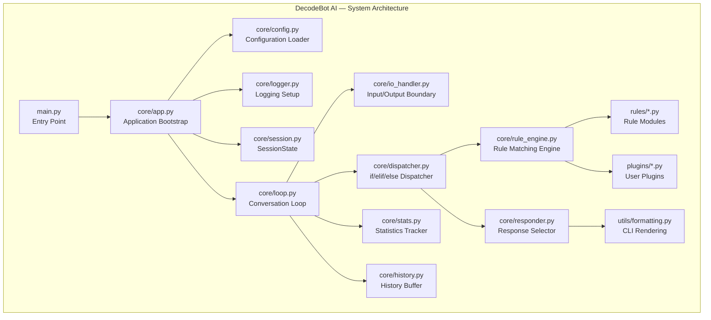

### Component Diagram

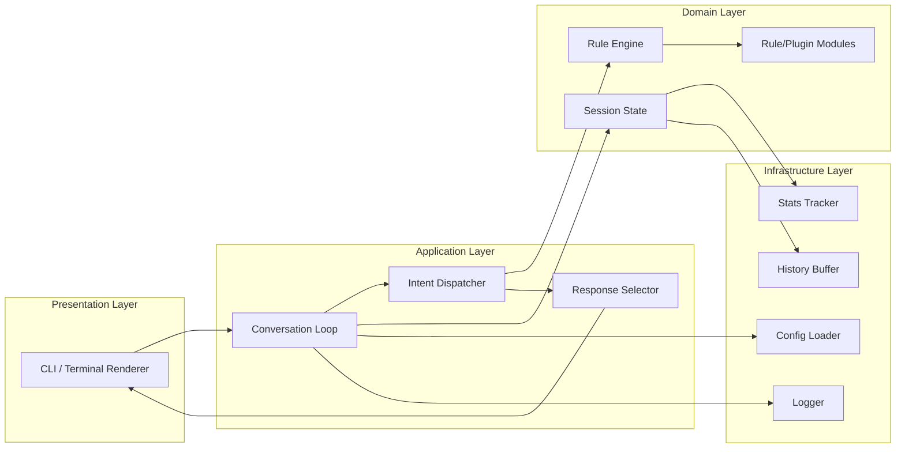

### Module Diagram

```mermaid
graph TD
    decodebot[decodebot package] --> core[core/]
    decodebot --> rules[rules/]
    decodebot --> plugins[plugins/]
    decodebot --> utils[utils/]
    decodebot --> tests[tests/]
    decodebot --> docs[docs/]

    core --> core1[app.py]
    core --> core2[loop.py]
    core --> core3[dispatcher.py]
    core --> core4[rule_engine.py]
    core --> core5[session.py]
    core --> core6[config.py]
    core --> core7[logger.py]
    core --> core8[stats.py]
    core --> core9[history.py]
    core --> core10[intents.py]

    rules --> r1[greetings.py]
    rules --> r2[exit.py]
    rules --> r3[help_about_version.py]
    rules --> r4[unknown.py]
    rules --> r5[easter_eggs.py]

    utils --> u1[normalization.py]
    utils --> u2[formatting.py]
    utils --> u3[terminal.py]
    utils --> u4[levenshtein.py]
```

### Data Flow Diagram

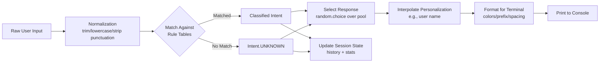

### Sequence Diagram

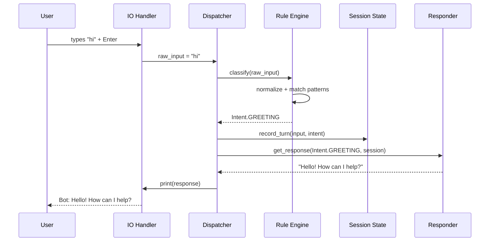

### Activity Diagram

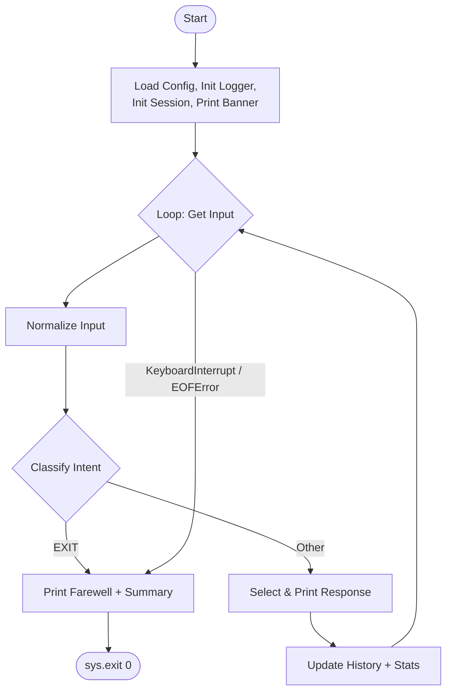

### State Diagram

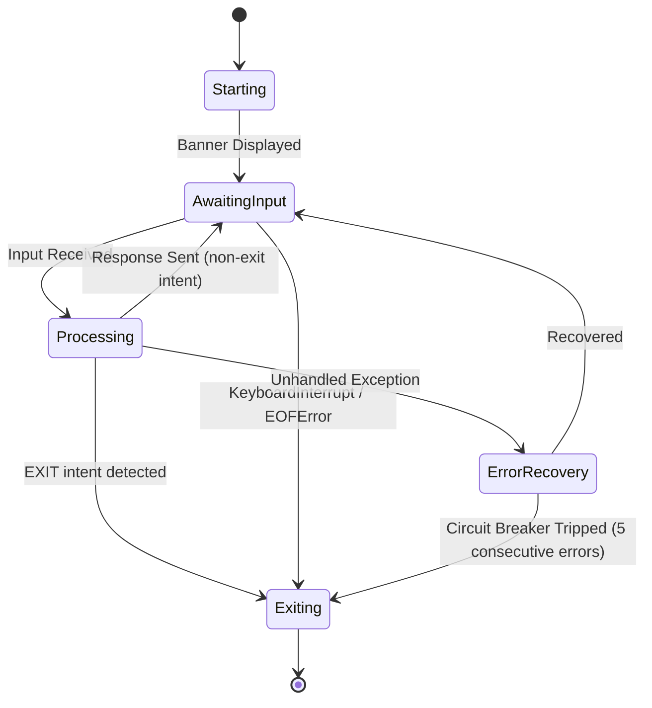

### Use Case Diagram

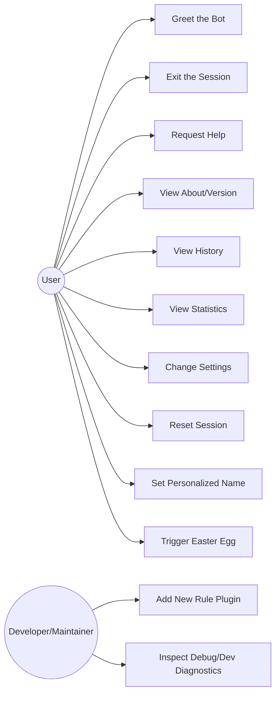


---

### Dual-Interface Architecture (CLI + Optional GUI)

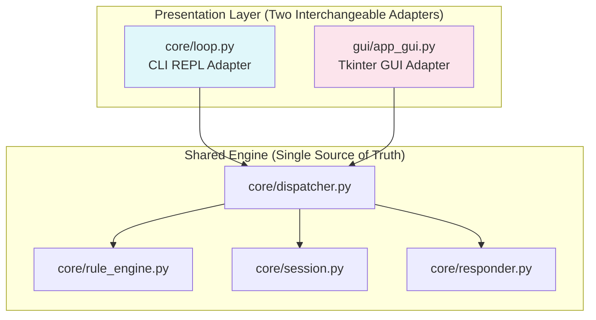
*Both adapters call identically into the shared engine - neither contains any conversational logic of its own (FR-145).*

---

## Folder Structure

```
decodebot-ai/
├── main.py                      # Entry point; guards with if __name__ == "__main__"
├── decodebot/
│   ├── __init__.py              # Package init; defines __version__ (single source of truth)
│   ├── core/
│   │   ├── __init__.py
│   │   ├── app.py                # Bootstraps config, logging, session; owns run()
│   │   ├── loop.py                # The while-loop conversation cycle (FR-004, FR-005)
│   │   ├── dispatcher.py          # Top-level if/elif/else intent dispatch (FR-006)
│   │   ├── rule_engine.py         # Normalization + pattern matching + plugin loading
│   │   ├── intents.py             # Intent enum definition
│   │   ├── session.py             # SessionState dataclass (FR-064)
│   │   ├── config.py              # Config file loading & validation (FR-088, FR-094)
│   │   ├── logger.py              # Logging setup, rotation (FR-096–FR-103)
│   │   ├── stats.py               # Runtime statistics tracking (FR-072–FR-079)
│   │   ├── history.py             # Conversation history buffer (FR-025, FR-064–FR-071)
│   │   ├── io_handler.py          # Injectable input()/print() boundary (FR-022)
│   │   └── responder.py           # Response selection & personalization interpolation
│   ├── rules/
│   │   ├── __init__.py
│   │   ├── greetings.py            # FR-026–FR-035
│   │   ├── exit.py                 # FR-036–FR-045
│   │   ├── unknown.py              # FR-046–FR-053
│   │   ├── help_about_version.py   # FR-054–FR-063
│   │   ├── personalization.py      # FR-080–FR-087
│   │   └── easter_eggs.py          # FR-112–FR-117
│   ├── plugins/
│   │   └── README.md               # Instructions + example for community plugins (FR-118+)
│   └── utils/
│       ├── __init__.py
│       ├── normalization.py         # trim/lowercase/punctuation-strip (FR-013–FR-024)
│       ├── formatting.py            # Boxed screens, colors, spacing (FR-127–FR-133)
│       ├── terminal.py              # Cross-platform clear-screen, width detection
│       └── levenshtein.py           # Pure-Python edit-distance for FR-049
├── tests/
│   ├── __init__.py
│   ├── test_compliance.py           # The 8 mandatory DecodeLabs checks (gate test)
│   ├── test_greetings.py
│   ├── test_exit.py
│   ├── test_unknown.py
│   ├── test_help_about_version.py
│   ├── test_normalization.py
│   ├── test_personalization.py
│   ├── test_config.py
│   ├── test_logging.py
│   ├── test_error_handling.py
│   ├── test_plugin_template.py
│   ├── test_no_prohibited_imports.py
│   └── fixtures/
│       └── sample_config.json
├── docs/
│   ├── ARCHITECTURE.md
│   ├── CONFIGURATION.md
│   ├── PLUGIN_GUIDE.md
│   └── HIDDEN_COMMANDS.md
├── logs/                              # Auto-created at runtime; gitignored
├── config.json                        # Optional; sane defaults if absent
├── requirements.txt                    # Empty / dev-only (pytest); no runtime deps
├── requirements-dev.txt
├── pyproject.toml                      # Formatting/lint config (black, ruff)
├── SPEC.md                             # This document
├── README.md
├── CONTRIBUTING.md
├── CHANGELOG.md
└── LICENSE
```

### Folder Responsibility Summary

| Path | Responsibility |
|---|---|
| `main.py` | Minimal launcher; delegates immediately to `decodebot.core.app.run()` |
| `decodebot/core/` | All engine logic: loop, dispatch, session, config, logging, stats |
| `decodebot/rules/` | First-party rule modules implementing each intent category |
| `decodebot/plugins/` | Community/contributor-provided rule modules (opt-in, auto-discovered) |
| `decodebot/utils/` | Stateless helper functions (string ops, formatting, terminal utilities) |
| `tests/` | Full automated test suite, including the mandatory compliance gate |
| `docs/` | Deep-dive documentation supplementing this SPEC.md |
| `logs/` | Runtime-generated log files (never committed) |


---

## Algorithms

### Input Normalization Algorithm
```
function normalize(raw_input: str) -> str:
    text = raw_input.strip()                       # FR-013
    text = text.lower()                             # FR-014
    text = collapse_whitespace(text)                 # FR-016 (regex: \s+ -> " ")
    text = strip_trailing_leading_punctuation(text)   # FR-015
    text = strip_control_characters(text)             # FR-024
    return text
```

### Greeting Matching Algorithm
```
function is_greeting(normalized_text: str) -> bool:
    if normalized_text in GREETING_PATTERNS:          # FR-027 exact match
        return True
    for pattern in GREETING_PATTERNS:                  # FR-028 word-boundary contains
        if re.search(r"\b" + re.escape(pattern) + r"\b", normalized_text):
            return True
    return False
```

### Intent Matching / Rule Engine Algorithm
```
function classify_intent(raw_input: str, session: SessionState) -> Intent:
    normalized = normalize(raw_input)

    if normalized == "":
        return Intent.EMPTY_INPUT                      # FR-021

    if is_numeric_only(normalized):
        return Intent.NUMERIC_INPUT                     # FR-019

    if is_symbols_only(normalized):
        return Intent.SYMBOLS_ONLY                      # FR-020

    candidates = []
    for rule in sorted(ALL_LOADED_RULES, key=lambda r: r.priority):   # FR-120
        if rule.matches(normalized):
            candidates.append(rule)

    if candidates:
        winning_rule = candidates[0]                     # lowest priority number wins
        return winning_rule.intent

    suggestion = fuzzy_suggest(normalized)                # FR-049
    if suggestion:
        session.pending_suggestion = suggestion

    return Intent.UNKNOWN                                  # FR-046
```

### Response Selection Algorithm
```
function get_response(intent: Intent, session: SessionState) -> str:
    pool = RESPONSE_POOLS[intent]
    response = random.choice(pool)                          # FR-029, FR-039, FR-047
    response = interpolate_personalization(response, session)  # FR-082
    return response
```

### Conversation Loop Algorithm
```
function run_session(io: IOHandler, session: SessionState) -> int:
    print_banner(session)                                    # FR-126
    consecutive_errors = 0

    while True:
        try:
            raw = io.get_input(prompt=build_prompt(session))   # FR-011, FR-012
        except KeyboardInterrupt:
            print_farewell(session, reason="interrupt")          # FR-104
            return 0
        except EOFError:
            print_farewell(session, reason="eof")                 # FR-105
            return 0

        try:
            intent = classify_intent(raw, session)
            if intent == Intent.EXIT:
                print_farewell(session, reason="command")           # FR-038
                return 0

            response = get_response(intent, session)
            io.print_response(response)
            session.record_turn(raw, intent, response)             # FR-064, FR-065
            consecutive_errors = 0

        except Exception as e:
            log_exception(e)                                        # FR-101
            io.print_response(FRIENDLY_ERROR_MESSAGE)                # FR-106, FR-111
            consecutive_errors += 1
            if consecutive_errors >= 5:
                log_critical("Circuit breaker tripped")               # FR-107
                io.print_response(CIRCUIT_BREAKER_MESSAGE)
                return 1
```

### Error Recovery Algorithm
```
function safe_execute(fn, *args, session, **kwargs):
    try:
        return fn(*args, **kwargs)
    except Exception as e:
        logger.error("Unhandled exception", exc_info=e)            # FR-101
        session.consecutive_errors += 1
        if session.consecutive_errors >= MAX_CONSECUTIVE_ERRORS:
            raise CircuitBreakerTripped from e
        return FRIENDLY_ERROR_MESSAGE
```

### Command Parsing Algorithm (Commands with Arguments, e.g., `set name X`)
```
function parse_command_with_arg(normalized_text: str, command_prefixes: list[str]) -> str | None:
    for prefix in command_prefixes:                    # e.g. ["set name ", "call me "]
        if normalized_text.startswith(prefix):
            argument = normalized_text[len(prefix):].strip()
            return sanitize_name(argument) if argument else None
    return None
```

### Fuzzy Command Suggestion Algorithm (Levenshtein Distance, Pure Python)
```
function levenshtein(a: str, b: str) -> int:
    # Classic dynamic-programming edit distance; O(len(a) * len(b)); no external library.
    dp = [[0] * (len(b) + 1) for _ in range(len(a) + 1)]
    for i in range(len(a) + 1): dp[i][0] = i
    for j in range(len(b) + 1): dp[0][j] = j
    for i in range(1, len(a) + 1):
        for j in range(1, len(b) + 1):
            cost = 0 if a[i-1] == b[j-1] else 1
            dp[i][j] = min(dp[i-1][j] + 1, dp[i][j-1] + 1, dp[i-1][j-1] + cost)
    return dp[len(a)][len(b)]

function fuzzy_suggest(normalized_text: str) -> str | None:
    best_match, best_distance = None, 3
    for command in PRIORITY_ORDERED_COMMANDS:            # FR-049
        d = levenshtein(normalized_text, command)
        if d <= 2 and d < best_distance:
            best_match, best_distance = command, d
    return best_match
```


---

### Folder Structure Additions — Animation & GUI (Category P/Q)

```
├── decodebot/
│   ├── gui/
│   │   ├── __init__.py
│   │   ├── app_gui.py          # Tkinter window bootstrap, event loop (FR-144, FR-146)
│   │   ├── widgets.py           # Chat bubble, entry field, send button components
│   │   ├── animations.py        # Fade-in, typing indicator (FR-149, FR-150)
│   │   └── theme.py             # Light/dark palette shared with CLI colors (FR-151)
│   ├── core/
│   │   └── animation.py         # CLI terminal animation effects (FR-134–FR-143)
├── tests/
│   ├── test_gui.py               # FR-144–FR-163
│   └── test_animations.py        # FR-134–FR-143
├── docs/
│   └── GUI_GUIDE.md
```

---

## Coding Standards

### PEP 8
- All code must conform to PEP 8. Enforced via `ruff`/`flake8` in CI with zero tolerance for errors (warnings reviewed case-by-case).
- Line length capped at 100 characters (documented exception to PEP 8's 79, common in modern Python projects; must be consistent project-wide).

### Type Hints
- All function signatures (parameters and return types) must be fully type-hinted using the `typing` module and built-in generics (`list[str]`, `dict[str, int]`, `str | None`).
- `mypy` (optional, dev-only) may be used for static verification; not a runtime dependency.

### Docstrings
- Every public module, class, and function requires a PEP 257-compliant docstring.
- Docstring format: Google-style (`Args:`, `Returns:`, `Raises:`) for consistency.
- Example:
```python
def classify_intent(raw_input: str, session: SessionState) -> Intent:
    """Classify raw user input into a discrete Intent using rule-based matching.

    Args:
        raw_input: The unmodified string captured from the user.
        session: The current session state, used for context-aware rules.

    Returns:
        The matched Intent enum value, or Intent.UNKNOWN if no rule matches.
    """
```

### Naming Conventions
- Modules/files: `snake_case.py`
- Functions/variables: `snake_case`
- Classes/Enums: `PascalCase`
- Constants: `UPPER_SNAKE_CASE`
- Private/internal helpers: prefixed with a single underscore (`_helper_function`)

### Logging Standards
- Use `logging.getLogger(__name__)` per module — never the root logger directly.
- Log levels used consistently: `DEBUG` (diagnostic detail), `INFO` (lifecycle events), `WARNING` (recoverable issues), `ERROR` (caught exceptions), `CRITICAL` (circuit breaker/fatal).
- Never use bare `print()` for diagnostic output outside the conversational response path.

### Error Handling
- Prefer specific exception types over bare `except:`.
- All exception handling at the loop boundary must log before recovering (FR-101).
- No `except: pass` silent swallowing anywhere in the codebase (all catches must log at minimum).

### Module Responsibilities
- `core/` modules may import from `utils/` but never from `rules/` or `plugins/` directly (only via `rule_engine.py`'s abstraction) — enforced by architecture review and import-linting.
- `rules/` and `plugins/` modules must not import from `core/loop.py` or `core/dispatcher.py` (one-way dependency direction, core → engine → rules, never reversed).

### Commenting Standards
- Comments explain *why*, not *what* (the code itself should be readable enough to convey *what*).
- Every non-obvious rule-matching heuristic (e.g., word-boundary safety, exit-adjacent exclusion list) must have an inline comment referencing its FR ID for traceability.


---

## Testing Specification

> **105 total test cases** across 7 categories, exceeding the 100+ requirement. Test IDs are stable identifiers referenced from the Compliance Matrix and Functional Requirements above.

### Compliance Gate Tests (Must Pass First — Maps to Compliance Matrix)

| Test ID | Description | Input / Steps | Expected Result |
|---|---|---|---|
| TC-CORE-001 | `.py` file exists and is valid | Static check on `main.py` | File exists, `python -m py_compile main.py` succeeds |
| TC-CORE-002 | Program runs via `python main.py` | Launch process | Banner + prompt appear, no error |
| TC-CORE-003 | `while` loop present and functioning | Source inspection + 3 sequential inputs | Loop iterates exactly 3 times |
| TC-CORE-004 | Loop terminates only on valid exit condition | Send 5 non-exit messages then `bye` | Loop exits on the 6th input only |
| TC-CORE-005 | `if`/`elif`/`else` dispatch present | Source inspection of `dispatcher.py` | Explicit `if`/`elif`/`else` chain found routing ≥6 intents |
| TC-CORE-006 | Dispatch correctly routes each core intent | Send one input per core intent | Each routes to its correct handler |
| TC-CORE-007 | Accepts user input via `input()` | Type `"hello"` | Exact string captured pre-normalization |
| TC-CORE-008 | Input capture is injectable/testable | Mock IO with scripted list | No real terminal blocking occurs |
| TC-GREET-001..010 | Greeting variants recognized | `"hi"`, `"hello"`, `"hey"`, `"yo"`, `"good morning"`, `"howdy"`, `"sup"`, `"greetings"`, `"HELLO!"`, `"hey there"` | All classify as `GREETING` |
| TC-EXIT-001..010 | Exit variants recognized | `"bye"`, `"exit"`, `"quit"`, `"goodbye"`, `"q"`, `"see you"`, `"stop"`, `"i quit"`, `"gotta go, bye"`, `"QUIT"` | All classify as `EXIT`, loop terminates, exit code 0 |
| TC-UNK-001..008 | Unrecognized input handled gracefully | `"asdkjfh"`, `"xyzzy"`, random fuzz strings (x6) | Fallback response shown, no crash, loop continues |
| TC-ERR-001..010 | Loop only terminates via valid means | `Ctrl+C`, `Ctrl+D`, forced internal exception ×3, 5 consecutive forced exceptions, valid exit, empty stdin, closed pipe, malformed config present, missing log dir | Each scenario terminates cleanly (0) or continues gracefully as specified |

### Unit Tests (30)

| Test ID | Description | Expected Result |
|---|---|---|
| TC-U-001 | `normalize("  Hello  ")` | Returns `"hello"` |
| TC-U-002 | `normalize("HELLO!!!")` | Returns `"hello"` |
| TC-U-003 | `normalize("hi\t\nthere")` | Returns `"hi there"` |
| TC-U-004 | `is_greeting("hello")` | Returns `True` |
| TC-U-005 | `is_greeting("history")` | Returns `False` (word-boundary safety, FR-033) |
| TC-U-006 | `is_greeting("hi, tell me the history")` | Returns `True` (contains genuine "hi") |
| TC-U-007 | `is_exit("bye")` | Returns `True` |
| TC-U-008 | `is_exit("quitter")` | Returns `False` (word-boundary safety) |
| TC-U-009 | `is_exit("don't go")` | Returns `False` (negation exclusion list, FR-042) |
| TC-U-010 | `is_numeric_only("42")` | Returns `True` |
| TC-U-011 | `is_numeric_only("42abc")` | Returns `False` |
| TC-U-012 | `is_symbols_only("!@#$")` | Returns `True` |
| TC-U-013 | `is_symbols_only("a!@#")` | Returns `False` |
| TC-U-014 | `levenshtein("help","halp")` | Returns `1` |
| TC-U-015 | `levenshtein("help","help")` | Returns `0` |
| TC-U-016 | `fuzzy_suggest("hepl")` | Returns `"help"` |
| TC-U-017 | `fuzzy_suggest("xyz")` | Returns `None` (distance too large) |
| TC-U-018 | `classify_intent("hi")` | Returns `Intent.GREETING` |
| TC-U-019 | `classify_intent("")` | Returns `Intent.EMPTY_INPUT` |
| TC-U-020 | `classify_intent("42")` | Returns `Intent.NUMERIC_INPUT` |
| TC-U-021 | `get_response(Intent.GREETING, session)` | Returns a non-empty string from `GREETING` pool |
| TC-U-022 | `SessionState.record_turn()` | History length increments by exactly 1 |
| TC-U-023 | `SessionState` history buffer overflow | Oldest entry evicted after 101st turn (max 100) |
| TC-U-024 | `sanitize_name("Alex99")` | Returns `"Alex"` (digits stripped) |
| TC-U-025 | `sanitize_name("A"*50)` | Returns 30-character truncated string |
| TC-U-026 | `load_config()` with missing file | Returns default config dict, logs `INFO` |
| TC-U-027 | `load_config()` with malformed JSON | Returns default config dict, logs `WARNING`, does not raise |
| TC-U-028 | `load_config()` with invalid type for a key | That key falls back to default; other keys retained |
| TC-U-029 | `interpolate_personalization()` with name unset | No literal `"{name}"` or `"None"` in output |
| TC-U-030 | `interpolate_personalization()` with name = "Sam"| Output includes `"Sam"` |

### Integration Tests (15)

| Test ID | Description | Expected Result |
|---|---|---|
| TC-I-001 | Full turn: greeting → response → history update | History contains 1 entry with correct intent |
| TC-I-002 | Full turn: name set → subsequent greeting personalized | Response contains the set name |
| TC-I-003 | `help` command output matches `COMMANDS` registry | All registered commands appear in output |
| TC-I-004 | `stats` after 5 mixed messages | Correct message count and intent breakdown shown |
| TC-I-005 | `reset` clears history, stats, and name | All three reset to initial state |
| TC-I-006 | `settings` toggle persists for session only | Setting changes mid-session; resets on restart |
| TC-I-007 | Plugin auto-discovery | New valid plugin file is loaded and its pattern matches |
| TC-I-008 | Broken plugin isolation | Broken plugin logged as error; core intents still function |
| TC-I-009 | Config `bot_name` propagation | Banner and prompt reflect custom bot name |
| TC-I-010 | Config `enable_colors: false` | No ANSI codes in any output |
| TC-I-011 | Debug mode diagnostic line appears | `[DEBUG]` line follows each response when enabled |
| TC-I-012 | Developer mode unlocks `dumpstate` | Command functions only when `developer_mode: true` |
| TC-I-013 | Logging captures full session lifecycle | Log file contains startup and shutdown entries |
| TC-I-014 | Exit summary reflects true session stats | Message count/duration in farewell matches `stats` output |
| TC-I-015 | Escalating fallback after 3 consecutive unknowns | 3rd unknown response includes help suggestion |

### Regression Tests (10)

| Test ID | Description | Expected Result |
|---|---|---|
| TC-R-001 | Adding new greeting synonym doesn't break existing ones | All prior greeting tests (TC-GREET-*) still pass |
| TC-R-002 | Adding new plugin doesn't alter core exit behavior | TC-EXIT-* all still pass |
| TC-R-003 | Config schema change preserves backward compatibility | Old-format `config.json` still loads with defaults for new keys |
| TC-R-004 | Version bump updates single source of truth only | Only `__init__.py` changed; `version` command reflects update |
| TC-R-005 | History buffer size change doesn't break pagination | `history` command still displays correctly at new bound |
| TC-R-006 | New Intent registration doesn't collide with existing enum values | No `ValueError` on startup |
| TC-R-007 | Refactor of `normalize()` preserves all normalization unit tests | TC-U-001–003, 005–006 still pass |
| TC-R-008 | CLI color scheme change preserves plain-mode fallback | `--plain` still strips all decoration |
| TC-R-009 | Log rotation logic change preserves size cap | Total log storage still ≤ ~4MB |
| TC-R-010 | Circuit breaker threshold change is reflected in both code and docs | NFR/FR text and implementation constant match |

### Manual / Exploratory Tests (10)

| Test ID | Description | Expected Result |
|---|---|---|
| TC-M-001 | First-time run experience on a clean checkout | Feels polished; no setup friction (NFR-052) |
| TC-M-002 | Resize terminal mid-session, then run `help` | Boxed output adapts or gracefully falls back to 80 cols |
| TC-M-003 | Paste a large block of text (~5,000 chars) | No crash, no visible slowdown |
| TC-M-004 | Try typing in a non-English language | No crash; graceful unknown/fallback handling |
| TC-M-005 | Try every documented easter egg manually | Each produces its intended fixed response |
| TC-M-006 | Run on Windows Terminal, macOS Terminal, and a Linux TTY | Consistent behavior and appearance across all three |
| TC-M-007 | Attempt to break exit detection with conversational phrasing | `"well i guess i'll say bye now"` still exits cleanly |
| TC-M-008 | Attempt rapid-fire input (spam Enter) | No lag, no crash, consistent empty-input handling |
| TC-M-009 | Review `help` output for typos/formatting issues | Clean, aligned, professional presentation |
| TC-M-010 | Full session walk-through as a first-time non-technical reviewer | Reviewer understands all functionality without external explanation |

### Acceptance Tests (15)

| Test ID | Description | Expected Result |
|---|---|---|
| TC-A-001 | All 8 DecodeLabs Week 1 requirements pass | 100% pass rate on `test_compliance.py` |
| TC-A-002 | Zero prohibited imports present | `test_no_prohibited_imports.py` passes |
| TC-A-003 | Test coverage ≥ 90% on `core/`/`rules/` | Coverage report confirms target met |
| TC-A-004 | README enables a new user to run the project in <5 minutes | Manual timing confirms target |
| TC-A-005 | All FRs traceable to at least one test | Traceability matrix has zero gaps |
| TC-A-006 | All NFRs have a measurable verification method | NFR table includes a metric for every row (already satisfied above) |
| TC-A-007 | Full test suite runs in <30 seconds | CI timing confirms target |
| TC-A-008 | Zero unhandled exceptions across 1,000-iteration fuzz test | Fuzz harness reports 0 crashes |
| TC-A-009 | Idle memory usage <50MB | Profiling confirms target |
| TC-A-010 | Startup time <300ms | Timing harness confirms target |
| TC-A-011 | `--plain` mode strips all decoration | Regex scan confirms zero ANSI/box characters |
| TC-A-012 | Plugin interface documented and demonstrated | `docs/PLUGIN_GUIDE.md` + working example plugin both present |
| TC-A-013 | GitHub repository meets structure standards | README, LICENSE, CONTRIBUTING, CHANGELOG all present and complete |
| TC-A-014 | Semantic versioning correctly applied | `__version__` matches latest CHANGELOG entry |
| TC-A-015 | All documented commands function exactly as described in `help` | Manual cross-check of every command |

### Negative Tests (10)

| Test ID | Description | Expected Result |
|---|---|---|
| TC-N-001 | Malformed `config.json` | App starts with defaults, warning logged |
| TC-N-002 | Missing `logs/` directory and no write permission | Falls back to console-only logging, no crash |
| TC-N-003 | Broken plugin file with syntax error | Logged and skipped; core still functions |
| TC-N-004 | Extremely long single-word input (10,000+ chars, no spaces) | Truncated safely, no crash |
| TC-N-005 | Binary/garbage bytes piped as input | Decoded with `errors="replace"`, handled as unknown, no crash |
| TC-N-006 | Five consecutive forced internal exceptions | Circuit breaker trips, clean exit code 1 |
| TC-N-007 | Attempted shell injection via clear-screen input (`"clear; rm -rf /"`) | Treated as literal unknown input; no shell execution occurs |
| TC-N-008 | Invalid numbered selection in `settings` menu | Gentle re-prompt, no crash |
| TC-N-009 | `set name` with no argument | Rejected with clarifying prompt |
| TC-N-010 | Plugin registering a duplicate `Intent` name | Startup error raised with clear message, does not silently overwrite |

### Edge Case Tests (15)

| Test ID | Description | Expected Result |
|---|---|---|
| TC-E-001 | Input is only whitespace | Classified as `EMPTY_INPUT` |
| TC-E-002 | Input is exactly `"q"` | Classified as `EXIT` |
| TC-E-003 | Input is `"quick question"` | NOT classified as `EXIT` |
| TC-E-004 | Input is `"???"` | Classified as `SYMBOLS_ONLY`, not generic unknown |
| TC-E-005 | Input is a single emoji `"👋"` with emoji-greeting feature enabled | Classified as `GREETING` |
| TC-E-006 | Input is a single emoji `"👋"` with emoji-greeting feature disabled | Classified per default fallback rules |
| TC-E-007 | Input contains mixed case and punctuation: `"HeLLo!!"` | Classified as `GREETING` |
| TC-E-008 | Input is a negative number: `"-42"` | Classified as `NUMERIC_INPUT` |
| TC-E-009 | Input is a decimal: `"3.14"` | Classified as `NUMERIC_INPUT` |
| TC-E-010 | Input contains a number with commas: `"1,000"` | Classified as `NUMERIC_INPUT` (comma-tolerant check) |
| TC-E-011 | First message of session is `"bye"` (immediate exit) | Clean exit; summary handles zero prior messages gracefully |
| TC-E-012 | `history` called with zero prior turns | Displays "No conversation yet!" message |
| TC-E-013 | `stats` called with zero prior turns | Displays all-zero statistics without error |
| TC-E-014 | Name containing only invalid characters: `"!!!"` | Rejected; user prompted to re-enter |
| TC-E-015 | Session with exactly 100 history entries, then 1 more sent | Oldest entry evicted; buffer stays at 100 |

### Animation & GUI Tests (20)

| Test ID | Description | Expected Result |
|---|---|---|
| TC-ANIM-001 | Typewriter effect timing | 40-char response takes ~0.67s at default speed |
| TC-ANIM-002 | Typewriter interrupt | Keypress mid-animation flushes remaining text instantly |
| TC-ANIM-003 | Thinking indicator cycles | Frame set cycles correctly within configured interval |
| TC-ANIM-004 | `enable_animations: false` | Zero `sleep()` calls invoked during a full session |
| TC-ANIM-005 | Non-TTY auto-disable | Piped output produces instant, undelayed text |
| TC-ANIM-006 | `reduced_motion` mode | Static indicators shown, no cycling frames |
| TC-ANIM-007 | Ctrl+C during animation | Exits within 100ms same as normal input wait |
| TC-ANIM-008 | Animation frames excluded from logs | Log contains one entry per response, not per frame |
| TC-GUI-001 | `--gui` flag launches window | Window opens with chat pane, entry field, send button |
| TC-GUI-002 | `python main.py` (no flag) unaffected | Behaves identically to pre-GUI CLI |
| TC-GUI-003 | Shared rule engine parity | `classify_intent("hi")` identical via CLI path and GUI path |
| TC-GUI-004 | Enter-to-send | Message submits and entry field clears |
| TC-GUI-005 | Chat bubble alignment | User right-aligned, bot left-aligned, correct order |
| TC-GUI-006 | GUI command parity | `stats`/`help`/etc. produce identical data to CLI |
| TC-GUI-007 | GUI exit via window close | Farewell/summary logic runs identically to typing `bye` |
| TC-GUI-008 | GUI error non-blocking | Forced exception caught, logged, window stays responsive |
| TC-GUI-009 | GUI logging tagged correctly | Log lines show `decodebot.gui` logger name |
| TC-GUI-010 | Headless fallback | `--gui` on a headless runner falls back to CLI with warning, no crash |
| TC-GUI-011 | Compliance Matrix unaffected | `test_compliance.py` passes with GUI module present, unused |
| TC-GUI-012 | Zero non-stdlib GUI imports | `test_no_prohibited_imports.py` extended check passes |

> **Test Count Summary (Part I — Chatbot/GUI/Animation):** 105 (original Week 1 suite) + 20 (Animation & GUI, TC-ANIM/TC-GUI) = **125+ total test cases** for Part I alone, exceeding the 100+ requirement. Part II (Week 2 ML Engine) adds its own dedicated test suite, counted separately below.


---

## Error Handling

| Scenario | Behavior | Related FR |
|---|---|---|
| Empty input | Dedicated gentle re-prompt response; no crash; not counted as a "real" message | FR-021 |
| Whitespace-only input | Normalized to empty; treated as empty input | FR-013, FR-021 |
| Very long input (>500 chars) | Accepted, processed normally; display/history truncated | FR-018 |
| Extremely long input (>10,000 chars, configurable cap) | Truncated with a user-facing notice; never crashes | FR-018 |
| Numbers | Classified as `NUMERIC_INPUT`; tailored fallback response | FR-019 |
| Special characters (symbol-only) | Classified as `SYMBOLS_ONLY`; tailored fallback response | FR-020 |
| Unicode (accents, emoji, CJK) | Accepted without crash; normalized where possible | FR-017 |
| `KeyboardInterrupt` (`Ctrl+C`) | Caught; graceful farewell; exit code 0 | FR-104 |
| `EOFError` (`Ctrl+D` / closed stdin) | Caught; graceful farewell; exit code 0 | FR-105 |
| Unexpected exception during processing | Caught at loop boundary; logged with traceback; friendly message shown; session continues | FR-106 |
| 5 consecutive unexpected exceptions | Circuit breaker trips; clean exit with code 1 and console pointer to logs | FR-107 |
| Invalid/malformed config file | Falls back to defaults; warning logged; app still starts | FR-108 |
| Broken plugin module | Isolated; logged as error; core functionality unaffected | FR-109 |
| Broken output stream (e.g., closed pipe) | Caught; session terminates gracefully instead of raw traceback | FR-110 |
| Invalid command | Routed to `UNKNOWN` with optional fuzzy "did you mean" suggestion | FR-046, FR-049 |


---

## CLI Specification

### Welcome Screen
```
╔══════════════════════════════════════════════╗
║               D E C O D E B O T   A I         ║
║        Rule-Based Conversational Agent        ║
║                  v1.0.0                       ║
╚══════════════════════════════════════════════╝

Type 'help' anytime to see what I can do.

You:
```

### Prompt
```
You: <cursor awaits input here>
```

### Help Screen
```
┌─ DecodeBot AI — Commands ───────────────────────┐
│ help      Show this help message                │
│ about     Learn about DecodeBot                  │
│ version   Show the current version                │
│ history   View this session's chat log             │
│ stats     View session statistics                   │
│ settings  View/change runtime settings                │
│ reset     Clear session state                          │
│ clear     Clear the screen                               │
│ bye       Exit DecodeBot                                   │
└───────────────────────────────────────────────────────────┘
```
*(Column alignment above is illustrative; actual implementation dynamically pads to terminal width per FR-131.)*

### About Screen
```
┌─ About DecodeBot AI ─────────────────────────────┐
│ DecodeBot AI v1.0.0                               │
│ A 100% rule-based conversational agent built in    │
│ pure Python — no ML, no NLP, no LLMs. Every reply    │
│ comes from an explicit, human-readable rule.          │
│                                                          │
│ Built for the DecodeLabs AI Internship — Week 1.         │
└─────────────────────────────────────────────────────────┘
```

### Statistics Screen
```
┌─ Session Statistics ─────────────────────┐
│ Messages:              12                 │
│ Session duration:      2m 14s              │
│ Unrecognized messages: 1                    │
│ Intent breakdown:                             │
│   GREETING   : 3                               │
│   HELP       : 2                                 │
│   UNKNOWN    : 1                                    │
│   EXIT       : (pending)                              │
│ Longest message:       42 characters                   │
│ Avg. response time:    0.4ms                              │
└───────────────────────────────────────────────────────────┘
```

### Exit Screen
```

──────────────────────────────────────────
 We exchanged 12 messages over 2m 14s.
 Goodbye! 👋 Thanks for chatting with DecodeBot.
──────────────────────────────────────────
```

### Settings Menu Screen
```
┌─ Settings ─────────────────────────────┐
│ 1. Colors:        ON                    │
│ 2. Debug mode:    OFF                     │
│ 3. Time-aware greeting: ON                  │
│                                                │
│ Type a number to toggle, or 'back' to return.   │
└───────────────────────────────────────────────────┘
```


---

## Acceptance Criteria

> Measurable, binary completion gates for every major feature area. A feature is **"Done"** only when every criterion below is checked.

| Feature Area | Completion Criteria |
|---|---|
| Core compliance (8 mandatory reqs) | ☐ All 8 rows of the Compliance Matrix pass their mapped tests |
| Greeting detection | ☐ 15+ patterns recognized ☐ word-boundary safe ☐ 8+ response variants |
| Exit detection | ☐ 10+ patterns recognized ☐ clean termination ☐ exit code 0 ☐ no false positives on negation phrases |
| Unknown input handling | ☐ never crashes ☐ 8+ fallback variants ☐ escalation after 3 consecutive unknowns ☐ fuzzy suggestion works |
| Help/About/Version | ☐ all three commands function ☐ single source of truth for version ☐ aliases work |
| Conversation history | ☐ session-only ☐ bounded buffer ☐ turn-numbered ☐ `history` command displays correctly |
| Runtime statistics | ☐ message count ☐ duration ☐ intent breakdown ☐ resets on `reset` |
| Personalization | ☐ name capture ☐ name interpolation ☐ `forget my name` works ☐ session-only |
| Configuration | ☐ file optional ☐ safe defaults ☐ per-key validation ☐ documented in `docs/CONFIGURATION.md` |
| Logging | ☐ rotating file logs ☐ no sensitive data ☐ configurable level |
| Error handling | ☐ `Ctrl+C`/`Ctrl+D` handled ☐ generic exceptions caught ☐ circuit breaker works |
| Plugin architecture | ☐ auto-discovery ☐ documented interface ☐ core rules protected from override |
| CLI presentation | ☐ banner ☐ consistent spacing/prefixes ☐ optional colors ☐ plain mode available |
| Testing | ☐ 100+ test cases ☐ compliance gate passes ☐ ≥90% coverage on core/rules |
| Documentation | ☐ README ☐ CONTRIBUTING ☐ CHANGELOG ☐ LICENSE ☐ this SPEC.md kept current |


| Terminal animations | ☐ typewriter effect ☐ thinking indicator ☐ animated banner ☐ globally toggleable ☐ auto-disabled when piped ☐ Ctrl+C always responsive |
| GUI mode | ☐ `--gui` flag works ☐ default CLI unaffected ☐ shared rule engine (no logic duplication) ☐ full command parity ☐ headless fallback ☐ zero non-stdlib deps ☐ Compliance Matrix still 100% via CLI |

---

## GitHub Standards

### Repository Structure
Follow the [Folder Structure](#folder-structure) exactly. Root must contain: `README.md`, `LICENSE`, `CONTRIBUTING.md`, `CHANGELOG.md`, `.gitignore`, `pyproject.toml`, and `SPEC.md`.

### README Expectations
The README must include, in order:
1. Project title + one-line tagline + badges
2. A short GIF/screenshot of a live session
3. "Why rule-based?" — a short philosophy paragraph
4. Features list (condensed from [Complete Feature Specification](#complete-feature-specification))
5. Installation (`git clone` + `python main.py` — no other steps)
6. Usage examples (sample conversation transcript)
7. Architecture summary + link to `docs/ARCHITECTURE.md` and this `SPEC.md`
8. Testing instructions (`pytest`)
9. Contributing link
10. License link
11. Acknowledgment of the DecodeLabs internship origin

### License
MIT License, `LICENSE` file at repository root, SPDX identifier referenced in `pyproject.toml`.

### Badges
Recommended badges (via shields.io): Python version, License, Build/CI status, Test coverage, "100% Rule-Based" custom badge, Code style (`black`/`ruff`).

### Versioning
Strict [Semantic Versioning 2.0.0](https://semver.org). Every release tagged in Git (`v1.0.0`) matching `__version__`.

### Releases
Each GitHub Release includes: version tag, changelog excerpt, and (optionally) a packaged `.zip`/`.tar.gz` of the source.

### Screenshots
At least one annotated screenshot or terminal-recording GIF (e.g., via `asciinema` or `vhs`) demonstrating: greeting, help, stats, and exit flows.

### Documentation
`docs/` folder contains `ARCHITECTURE.md`, `CONFIGURATION.md`, `PLUGIN_GUIDE.md`, `HIDDEN_COMMANDS.md` — all cross-linked from the README.

---

## Roadmap

### v1.0 — Core Release (This Specification)
- Full DecodeLabs compliance, complete rule-based feature set, full test suite, professional CLI, documentation.

### v1.1 — GUI & Animation Release ✅ (Implemented in this specification, Category P/Q)
- Terminal animation effects (typewriter printing, thinking indicator, animated banner/clear).
- Optional Tkinter GUI mode (`--gui` flag), reusing the CLI's rule engine unchanged.
- Accessibility audit and refinements (reduced-motion mode, `--plain` mode, font scaling).

### v2.0 — Machine Learning Data Classification Release ✅ (Implemented in this specification, Part II / Category R)
- New, separate Machine Learning Engine (`ml/`) for supervised classification, per DecodeLabs Week 2.
- Chatbot Engine (Categories A–Q) remains 100% rule-based and completely unaffected.
- See **PART II — WEEK 2: MACHINE LEARNING DATA CLASSIFICATION ENGINE** below for full detail.

### v2.1 — Extensibility Release (Chatbot)
- Public plugin marketplace/registry pattern (community-contributed rule packs distributed as separate installable modules).
- Optional persistent (opt-in) conversation history across sessions.
- Enhanced settings persistence (`settings save`).

### v3.0 — Multi-Surface & Multi-Model Release
- **Web:** Optional Flask/FastAPI web chat interface reusing the same rule engine core, unchanged.
- **Database:** Optional persistent storage backend (SQLite) for history/stats, strictly opt-in.
- **ML Expansion:** Additional classifiers (Decision Tree, SVM, Logistic Regression, Random Forest) and additional datasets beyond Iris, per future DecodeLabs weeks.

### Future — "Chapter 3" (Explicitly Out of Scope for This Spec)
- **Voice:** Speech-to-text/text-to-speech front end.
- **Deep Learning / Computer Vision:** Per the official DecodeLabs Week 2 materials ("Emerging Horizons": tabular data → computer vision, deep learning & CNNs), future weeks may extend the ML Engine from tabular classification (Iris, KNN) toward deep learning and computer vision tasks. This is explicitly a **future, separate** extension of the ML Engine, not part of this specification's Week 2 scope.
- **NLP:** A clearly separated, opt-in branch or mode exploring lightweight NLP (e.g., tokenization, intent embeddings) as an educational contrast to the rule-based Chatbot Engine — never replacing it.
- **LLMs:** A clearly separated, opt-in "DecodeBot Neural" mode demonstrating the difference between rule-based and LLM-backed conversational agents, marketed explicitly as a *separate project/mode*, never blended into the core rule-based Chatbot Engine covered by this SPEC.

> **Note:** Everything under "Future" is explicitly **out of scope** for the v2.0.0 implementation this SPEC.md governs. OpenCode must not implement any Future-section item unless a new, separate specification is authored for it.

---

## Risks

### Known Limitations
- Rule-based matching cannot understand semantics, context beyond simple session flags, sarcasm, or novel phrasing outside the authored pattern tables.
- Negation handling is limited to a small, fixed exclusion list (FR-042) — it is not general-purpose negation parsing.
- Emoji/Unicode support is best-effort, not exhaustive.
- Time-of-day-aware greetings rely on local system clock and do not account for time zones or DST edge cases robustly.

### Trade-offs
- Choosing explicit `if`/`elif`/`else` at the top level (per internship mandate) alongside data-driven tables beneath it is a deliberate compromise between rubric compliance and maintainability at scale.
- A rich feature set increases code volume and review burden versus a minimal script — justified by the Portfolio/Learning objectives.
- Bounded history/log sizes trade completeness of long-term record for guaranteed memory safety (NFR-019, NFR-039).

### Future Improvements
- Expand topic-adjacent fallback coverage based on real `UNKNOWN`-input logs (FR-052) gathered from actual usage.
- Consider a lightweight, fully local synonym/typo dictionary to further improve match recall without violating the no-NLP constraint.
- Explore opt-in persistent history/stats for users who want cross-session continuity.


### Animation & GUI-Specific Risks
- GUI animation and Tkinter rendering behavior can vary subtly across OS window managers (font rendering, default padding) — treat as a known cross-platform cosmetic limitation, not a functional bug.
- Headless/CI environments cannot exercise the GUI path at all; GUI tests should mock the Tk root window rather than requiring a real display where possible.

---

---
---

# PART II — WEEK 2: MACHINE LEARNING DATA CLASSIFICATION ENGINE

> **Scope of Part II:** This part documents the **new** Machine Learning Engine added in DecodeLabs AI Internship Week 2 ("Project 2: Data Classification Using AI"). It is **additive only**. Every requirement, diagram, and standard in Part I (above) remains unchanged, unweakened, and fully in force. The Chatbot Engine, its Rule Engine, its optional Tkinter GUI, and its terminal animations continue to be **100% rule-based** with **zero** ML/NLP/LLM involvement — that constraint (`CON-01`, `FR-009`) is scoped to the Chatbot Engine specifically and is **not** relaxed anywhere in Part II. Part II introduces `scikit-learn`-based supervised learning **only** inside a new, clearly bounded `decodebot/ml/` module, exactly as mandated by the official DecodeLabs Week 2 brief.

## Week 2 Executive Summary

Week 2 evolves **DecodeBot AI** from a purely rule-based conversational agent into a two-engine AI application: the existing **Chatbot Engine** (unchanged) and a new **Machine Learning Engine** implementing supervised classification per the official DecodeLabs "Project 2: Data Classification Using AI" brief. The ML Engine loads a small benchmark dataset (the classic Iris dataset: 150 samples, 3 balanced classes, 4 numeric features), validates and preprocesses it (feature scaling via `StandardScaler`, shuffling to remove order bias), splits it into training and test sets, trains a K-Nearest Neighbors (KNN) classifier using `scikit-learn`, generates predictions, and evaluates model quality using a confusion matrix and precision/recall/F1 metrics — explicitly going beyond raw accuracy, per the brief's "Accuracy Mirage" guidance ("In imbalanced data, accuracy is a lie. We must look deeper.").

Beyond the internship's minimum bar, DecodeBot AI's ML Engine is engineered as a **modular, reusable, portfolio-grade pipeline**: a dedicated dataset loader/validator, a configurable preprocessing stage, a trainer supporting multiple interchangeable classifiers (not just KNN), a persistence layer (saved/loaded models), a model comparison utility, visualization (confusion matrix heatmap, K-tuning elbow curve), and full CLI + GUI integration — all while remaining completely decoupled from, and non-disruptive to, the Week 1 Chatbot Engine.

## Objectives — Week 2 Additions

### Internship Objectives (Week 2)
- OBJ-INT-05: Load and understand a real dataset (Iris) using `pandas`/`scikit-learn` data-loading utilities.
- OBJ-INT-06: Split data into training and testing sets with reproducible, shuffled sampling.
- OBJ-INT-07: Apply a simple, well-understood classification algorithm (K-Nearest Neighbors) via `scikit-learn`.
- OBJ-INT-08: Demonstrate the full train → predict → evaluate supervised-learning workflow.

### Technical Objectives (Week 2)
- OBJ-TECH-06: Implement the ML Engine as a fully isolated module (`decodebot/ml/`) with zero coupling to the Chatbot Engine's rule logic.
- OBJ-TECH-07: Support multiple, swappable classification algorithms behind one consistent interface (Strategy pattern).
- OBJ-TECH-08: Persist trained models to disk and reload them without retraining, using `joblib`.
- OBJ-TECH-09: Achieve reproducible results via a fixed, configurable random seed across shuffling, splitting, and model initialization.

### Portfolio Objectives (Week 2)
- OBJ-PORT-04: Demonstrate supervised machine learning competency (data handling, model training, evaluation) alongside the existing rule-based engineering competency from Week 1.
- OBJ-PORT-05: Produce visualizations (confusion matrix, K-tuning curve) suitable for a portfolio README/demo.

### Learning Objectives (Week 2)
- OBJ-LEARN-05: Reinforce the supervised-learning pipeline: load → validate → preprocess → split → train → predict → evaluate.
- OBJ-LEARN-06: Build practical experience with `scikit-learn`'s `fit`/`predict` API and evaluation metrics (confusion matrix, precision, recall, F1).
- OBJ-LEARN-07: Understand *why* accuracy alone is an insufficient evaluation metric ("Accuracy Mirage").

### Stretch Goals (Week 2)
- OBJ-STRETCH-05: Support additional classifiers (Decision Tree, Logistic Regression, SVM, Random Forest) with a model-comparison report.
- OBJ-STRETCH-06: Automated K-value tuning via the elbow method (error rate vs. K).
- OBJ-STRETCH-07: CLI and GUI "predict" commands allowing a live user to submit new feature values and receive a classification.
- OBJ-STRETCH-08: Dataset-agnostic design so future weeks can plug in a different CSV dataset without rewriting the pipeline.

## Scope — Week 2 Additions

### In Scope (New — Week 2)
- A new `decodebot/ml/` module implementing: dataset loading, dataset validation, preprocessing (scaling, shuffling), train/test splitting, model training (KNN as the required baseline, plus optional additional classifiers), prediction, evaluation (confusion matrix, precision, recall, F1, accuracy), model persistence (save/load), model comparison, and visualization (confusion matrix heatmap, K-tuning elbow chart).
- `scikit-learn`, `pandas`, `numpy`, and `matplotlib` (or `seaborn`) as new, explicitly-scoped runtime dependencies — used **only** inside `decodebot/ml/` and its supporting CLI/GUI integration points.
- The bundled Iris dataset (via `sklearn.datasets.load_iris()` or a bundled CSV) as the default Week 2 dataset.
- New CLI commands (`train`, `predict`, `evaluate`, `models`) and GUI panels for interacting with the ML Engine.
- Configuration keys for the ML Engine (dataset path, test split ratio, K value, random seed, model directory).
- Logging and error handling for the ML Engine, consistent with the existing logging/error-handling architecture from Part I.
- A full automated test suite for the ML Engine (unit tests for each pipeline stage, integration tests for the full pipeline, model-quality regression tests).

### Out of Scope (Week 2)
- Deep learning, neural networks, or any `torch`/`tensorflow`-based model (explicitly deferred to a future week per the brief's "Emerging Horizons" slide).
- Computer vision / image classification.
- Any modification of the Chatbot Engine's rule-based classification logic (`Intent` classification in `core/rule_engine.py` remains untouched and 100% rule-based).
- Any use of the ML Engine's classifier to answer chatbot conversational intents — the two engines are and remain functionally and architecturally separate.
- Real-time/streaming data ingestion; the ML Engine operates on static, file-based datasets.
- Hyperparameter optimization frameworks (e.g., `optuna`, `GridSearchCV` is permitted as a `scikit-learn`-native utility; external AutoML tools are out of scope).
- Cloud deployment or model-serving infrastructure (e.g., REST API for predictions) — the ML Engine is invoked locally via CLI/GUI only, consistent with the project's local-first philosophy.

### Future Scope (Week 2 → Later Weeks)
- Deep learning and computer vision (per the brief's own roadmap: "From Tabular Data... to Computer Vision... Next: Deep Learning & CNNs").
- Support for user-supplied, arbitrary CSV datasets beyond Iris.
- A lightweight local REST API exposing `predict()` for integration with the Chatbot Engine (e.g., "ask DecodeBot to classify a flower") — explicitly **not** implemented in Week 2; if ever built, it must remain a thin bridge that calls the ML Engine's existing `predict()` function, never blending the two engines' internal logic.

## DecodeLabs Week 2 Compliance Matrix

> Mirroring the rigor of the Week 1 Compliance Matrix. Every official DecodeLabs Week 2 requirement is mapped to Functional Requirements and Test Cases below. All rows must pass before the Week 2 deliverable is considered complete.

| # | Internship Requirement (from official Week 2 brief) | Mandatory | Mapped Functional Requirements | Mapped Test Cases | Completion Criteria |
|---|---|---|---|---|---|
| 1 | Load and understand a dataset | Yes | FR-164–FR-172 | TC-ML-001–010 | Iris dataset loads successfully; shape, feature names, class names, and class balance are inspectable and logged |
| 2 | Perform necessary data preprocessing (scaling) | Yes | FR-173–FR-181 | TC-ML-011–020 | `StandardScaler` applied; post-scaling mean ≈ 0 and variance ≈ 1 per feature, verified in tests |
| 3 | Shuffle and split data into training and testing sets | Yes | FR-182–FR-186 | TC-ML-021–028 | Data is shuffled (`random_state` configurable) before an 80/20 (default, configurable) train/test split; no data leakage between sets |
| 4 | Apply a simple classification algorithm (K-Nearest Neighbors) | Yes | FR-187–FR-195 | TC-ML-029–038 | `KNeighborsClassifier` from `scikit-learn` is instantiated, fit, and used to predict, following the `INSTANTIATE → FIT → PREDICT` workflow from the official brief |
| 5 | Train the model | Yes | FR-189, FR-191 | TC-ML-031–033 | `model.fit(X_train, y_train)` completes without error; trained model object is retrievable |
| 6 | Generate predictions on the test set | Yes | FR-196–FR-200 | TC-ML-039–044 | `model.predict(X_test)` returns a class-label array of correct length and valid class values |
| 7 | Evaluate the model (beyond raw accuracy) | Yes | FR-201–FR-209 | TC-ML-045–058 | Confusion matrix, precision, recall, and F1 score are computed and reported per the brief's explicit "accuracy is a lie" guidance |
| 8 | Testing | Yes | All of Category R | TC-ML-001–070+ | A full automated test suite covers every pipeline stage; `tests/test_ml_compliance.py` gate passes |

### Compliance Statement (Week 2)

DecodeBot AI's Week 2 ML Engine (FR-164 through the end of Category R) is a strict superset of the DecodeLabs Week 2 checklist above, following the exact **IPO Framework** (Input → Process → Output) and **INSTANTIATE → FIT → PREDICT** workflow shown in the official brief, using the Iris benchmark dataset (150 samples, 3 classes, 4 features) and the K-Nearest Neighbors algorithm as the required baseline classifier. A CI gate (`tests/test_ml_compliance.py`) runs the 8-row compliance group on every commit and must pass before any other Week 2 test group is considered. **This compliance layer does not replace, weaken, or interact with the Week 1 Compliance Matrix — both matrices must pass independently and simultaneously.**

## Functional Requirements — Category R: Machine Learning Engine (FR-164 – FR-232)

> **69 new Functional Requirements**, bringing the project total to **232 Functional Requirements (FR-001 – FR-232)** across both Parts. Format matches Part I exactly: Priority, Description, Rationale, Dependencies, Acceptance Criteria, Edge Cases, Example.

### Category R1 — Dataset Loading & Understanding (FR-164 – FR-172)

**FR-164 — Dataset Loader Module**
- **Priority:** P0
- **Description:** A dedicated `decodebot/ml/dataset_loader.py` module shall load the Iris dataset via `sklearn.datasets.load_iris()` by default, returning features (`X`), target labels (`y`), feature names, and target/class names as a structured object.
- **Rationale:** Directly satisfies the Week 2 brief's "Load and understand a dataset" requirement.
- **Dependencies:** None
- **Acceptance Criteria:** `load_dataset()` returns 150 samples, 4 features, 3 classes, matching the official Iris benchmark shown in the brief.
- **Edge Cases:** `scikit-learn` version differences in `load_iris()`'s return format — the loader normalizes to a consistent internal `Dataset` dataclass regardless of `sklearn` version.
- **Example:** `dataset = load_dataset("iris")` → `dataset.X.shape == (150, 4)`.

**FR-165 — CSV Dataset Loading Support**
- **Priority:** P1
- **Description:** The dataset loader shall also support loading an arbitrary CSV file path (via `pandas.read_csv`) with a configurable target-column name, for forward-compatibility with future weeks/datasets.
- **Rationale:** Supports OBJ-STRETCH-08 (dataset-agnostic design) without expanding Week 2's mandatory scope.
- **Dependencies:** FR-164
- **Acceptance Criteria:** `load_dataset(source="path/to/data.csv", target_column="species")` loads correctly for a well-formed CSV.
- **Edge Cases:** Missing target column, non-numeric feature columns — raises a clear, caught `DatasetValidationError` (see FR-169).
- **Example:** N/A.

**FR-166 — Dataset Shape & Metadata Inspection**
- **Priority:** P1
- **Description:** The loader shall expose dataset metadata: number of samples, number of features, feature names, class names, and per-class sample counts.
- **Rationale:** Satisfies "understand a dataset" — not just loading, but inspecting it.
- **Dependencies:** FR-164
- **Acceptance Criteria:** `dataset.describe()` returns a dict including `{"samples": 150, "features": 4, "classes": 3, "class_counts": {"setosa": 50, "versicolor": 50, "virginica": 50}}`.
- **Edge Cases:** N/A.
- **Example:** See Acceptance Criteria.

**FR-167 — Class Balance Reporting**
- **Priority:** P2
- **Description:** The loader shall explicitly compute and report whether the dataset is class-balanced or imbalanced (max class count / min class count ratio), surfaced in logs and the `explore` CLI command (FR-225).
- **Rationale:** Directly ties to the brief's "Accuracy Mirage" warning — imbalance detection is a prerequisite for interpreting accuracy correctly.
- **Dependencies:** FR-166
- **Acceptance Criteria:** For Iris (50/50/50), balance ratio reports as `1.0` (perfectly balanced).
- **Edge Cases:** Single-class dataset (degenerate case) — flagged as an error, not silently processed.
- **Example:** N/A.

**FR-168 — Dataset Caching**
- **Priority:** P3
- **Description:** Loaded datasets shall be cached in memory for the duration of a CLI/GUI session to avoid redundant disk/network I/O on repeated `train`/`explore` commands.
- **Rationale:** Performance polish; Iris loads from `scikit-learn`'s bundled data, so this mainly benefits future CSV-based datasets.
- **Dependencies:** FR-164
- **Acceptance Criteria:** A second `load_dataset("iris")` call within the same session returns the cached object without re-invoking `sklearn.datasets.load_iris()`.
- **Edge Cases:** Explicit `--no-cache` / `reload` command bypasses the cache.
- **Example:** N/A.

**FR-169 — Dataset Validation**
- **Priority:** P0
- **Description:** A `decodebot/ml/dataset_validator.py` module shall validate any loaded dataset for: no missing/NaN values in required columns, consistent feature dimensionality across all rows, at least 2 distinct classes, and a minimum sample count (configurable, default 10) sufficient for a train/test split.
- **Rationale:** Prevents downstream training failures from malformed data; professional data-handling discipline.
- **Dependencies:** FR-164
- **Acceptance Criteria:** A CSV with a missing value in a feature column raises `DatasetValidationError` with a clear, actionable message.
- **Edge Cases:** All-NaN column, single-row dataset, dataset with only 1 class — each produces a distinct, clear validation error.
- **Example:** N/A.

**FR-170 — Missing Value Handling Strategy**
- **Priority:** P2
- **Description:** For CSV datasets with missing values, the validator/preprocessor shall support a configurable strategy: `"error"` (default, reject the dataset), `"drop"` (drop affected rows), or `"mean_impute"` (fill numeric NaNs with column mean).
- **Rationale:** Real-world CSV data (future weeks) will have gaps; Iris itself has none, so this is forward-looking robustness.
- **Dependencies:** FR-169
- **Acceptance Criteria:** With `missing_value_strategy: "drop"`, rows with NaN are excluded and the resulting row count is logged.
- **Edge Cases:** `"mean_impute"` on a column that is entirely NaN — falls back to `"error"` for that column with a logged warning.
- **Example:** N/A.

**FR-171 — Dataset Loading Never Crashes the Application**
- **Priority:** P0
- **Description:** Any dataset loading/validation failure shall be caught, logged, and surfaced as a friendly CLI/GUI message — never an unhandled traceback, consistent with the Part I error-handling philosophy (FR-106, FR-111).
- **Rationale:** Reliability parity with the Chatbot Engine.
- **Dependencies:** FR-164, FR-169
- **Acceptance Criteria:** Attempting to load a nonexistent CSV path produces a friendly error message and returns control to the CLI/GUI, not a crash.
- **Edge Cases:** N/A.
- **Example:** `train --dataset missing.csv` → `"Couldn't find that dataset file — check the path and try again."`

**FR-172 — `explore` Command (Dataset Understanding CLI)**
- **Priority:** P1
- **Description:** A new CLI/GUI command, `explore` (or `ml explore`), shall print dataset shape, feature names, class names, class balance, and basic per-feature statistics (min, max, mean, std) using only `pandas`/`numpy` — no plotting required for this command (see FR-217 for visualization).
- **Rationale:** Directly demonstrates "load and understand a dataset" as an interactive, inspectable CLI experience.
- **Dependencies:** FR-164, FR-166, FR-167
- **Acceptance Criteria:** `explore` on the Iris dataset prints 150 samples, 4 features, 3 classes, and per-feature min/max/mean/std matching known Iris statistics.
- **Edge Cases:** N/A.
- **Example:** N/A.

### Category R2 — Data Preprocessing (FR-173 – FR-181)

**FR-173 — Feature Scaling (StandardScaler)**
- **Priority:** P0
- **Description:** A `decodebot/ml/preprocessor.py` module shall apply `sklearn.preprocessing.StandardScaler` to numeric features by default, transforming each feature to mean ≈ 0 and variance ≈ 1, per the brief's "Gatekeeper Rule: Scaling."
- **Rationale:** Mandatory Week 2 requirement; KNN is distance-based and sensitive to unscaled feature magnitudes.
- **Dependencies:** FR-164
- **Acceptance Criteria:** After scaling, each feature column's mean is within `1e-9` of 0 and variance within `1e-6` of 1 on the training set.
- **Edge Cases:** Zero-variance feature (constant column) — `StandardScaler` handles this natively (results in 0s); documented, not treated as an error.
- **Example:** N/A.

**FR-174 — Scaler Fit-on-Train, Transform-on-Both**
- **Priority:** P0
- **Description:** The scaler shall be `fit()` **only** on the training set and then used to `transform()` both the training and test sets — never fit on the full dataset or the test set — to prevent data leakage.
- **Rationale:** Fundamental ML correctness requirement; a common beginner mistake the spec explicitly guards against.
- **Dependencies:** FR-173, FR-182 (train/test split)
- **Acceptance Criteria:** A unit test asserts the scaler's fitted `mean_`/`scale_` attributes are computed from `X_train` only, and that `X_test` is transformed using those same fitted parameters.
- **Edge Cases:** N/A.
- **Example:** N/A.

**FR-175 — Configurable/Swappable Scaler**
- **Priority:** P2
- **Description:** The preprocessing stage shall support swapping `StandardScaler` for `MinMaxScaler` or "none" via configuration, behind a consistent `Preprocessor` interface.
- **Rationale:** Extensibility (mirrors the Chatbot Engine's plugin philosophy — swappable strategies behind one interface) without changing the default Week 2 behavior.
- **Dependencies:** FR-173
- **Acceptance Criteria:** Setting `scaler_type: "minmax"` in config uses `MinMaxScaler` instead, verified by a distinct unit test.
- **Edge Cases:** Invalid `scaler_type` value falls back to `StandardScaler` (the default) with a logged warning.
- **Example:** N/A.

**FR-176 — Encoding of Categorical Targets**
- **Priority:** P2
- **Description:** For CSV datasets (FR-165) with string class labels, the preprocessor shall encode target labels to integers via `sklearn.preprocessing.LabelEncoder`, retaining a mapping back to human-readable class names for reporting.
- **Rationale:** Forward-compatibility with non-Iris datasets; Iris's `sklearn`-provided target is already numeric, so this path is exercised primarily by CSV inputs.
- **Dependencies:** FR-165
- **Acceptance Criteria:** A CSV with string labels `"cat"/"dog"` encodes to `0/1` internally while predictions/reports display `"cat"/"dog"`.
- **Edge Cases:** N/A.
- **Example:** N/A.

**FR-177 — Data Shuffling Before Split**
- **Priority:** P0
- **Description:** Data shall be shuffled (using a configurable `random_state` for reproducibility) before the train/test split, per the brief's "Structural Integrity: The Split" guidance ("Randomize before splitting to remove order bias").
- **Rationale:** Mandatory Week 2 requirement; the Iris dataset is ordered by class by default, so skipping shuffling would produce a broken split.
- **Dependencies:** FR-164
- **Acceptance Criteria:** With `shuffle=True` (default) and a fixed `random_state`, both the train and test sets contain a representative mix of all 3 classes.
- **Edge Cases:** `shuffle=False` (explicitly opt-out, for debugging/determinism testing only) is supported but never the default.
- **Example:** N/A.

**FR-178 — Reproducibility via Fixed Random Seed**
- **Priority:** P0
- **Description:** A single, configurable `random_state` (default `42`) shall be used consistently across shuffling, splitting, and any stochastic model initialization, ensuring identical results across repeated runs.
- **Rationale:** Scientific reproducibility; enables deterministic testing of ML behavior, mirroring the Chatbot Engine's `NFR-022` determinism philosophy applied to the ML domain.
- **Dependencies:** FR-177
- **Acceptance Criteria:** Two full pipeline runs with the same `random_state` produce bit-identical train/test splits and identical evaluation metrics.
- **Edge Cases:** N/A.
- **Example:** N/A.

**FR-179 — Preprocessing Pipeline Object**
- **Priority:** P1
- **Description:** Preprocessing steps (scaling, encoding) shall be composed into a single `sklearn.pipeline.Pipeline`-compatible object, allowing the entire preprocessing + model to be fit/predicted/persisted as one unit.
- **Rationale:** Professional `scikit-learn` best practice; simplifies persistence (FR-210) and prevents train/test preprocessing mismatches.
- **Dependencies:** FR-173, FR-187
- **Acceptance Criteria:** `pipeline.predict(raw_new_sample)` internally applies the same scaling used during training, without the caller needing to manually scale.
- **Edge Cases:** N/A.
- **Example:** N/A.

**FR-180 — Preprocessing Validation Report**
- **Priority:** P3
- **Description:** After preprocessing, a brief before/after report (feature ranges pre- and post-scaling) shall be available via the `explore --preprocessed` flag or equivalent.
- **Rationale:** Educational/portfolio value, directly visualizing the "Raw Data (Biased) → Standard Scaled (Balanced)" concept from the brief.
- **Dependencies:** FR-173, FR-172
- **Acceptance Criteria:** Report shows pre-scaling feature ranges (e.g., 0–1000-scale) and post-scaling ranges (≈ -2 to +2).
- **Edge Cases:** N/A.
- **Example:** N/A.

**FR-181 — Preprocessing Never Mutates the Original Dataset**
- **Priority:** P1
- **Description:** All preprocessing operations shall operate on copies of the loaded data; the original `Dataset` object returned by the loader remains unmodified and reusable.
- **Rationale:** Prevents subtle bugs from repeated preprocessing calls compounding transformations.
- **Dependencies:** FR-164, FR-173
- **Acceptance Criteria:** Calling `preprocess(dataset)` twice in sequence produces identical output both times (idempotent given the same input).
- **Edge Cases:** N/A.
- **Example:** N/A.

### Category R3 — Train/Test Split (FR-182 – FR-186)

**FR-182 — Train/Test Split via `scikit-learn`**
- **Priority:** P0
- **Description:** The pipeline shall split data into training and test sets using `sklearn.model_selection.train_test_split`, with a configurable `test_size` (default `0.2`, i.e., an 80/20 split, matching the brief's IPO diagram).
- **Rationale:** Mandatory Week 2 requirement.
- **Dependencies:** FR-177, FR-178
- **Acceptance Criteria:** With 150 samples and `test_size=0.2`, the split produces 120 training and 30 test samples.
- **Edge Cases:** `test_size` outside `(0, 1)` is rejected with a clear configuration error at startup.
- **Example:** N/A.

**FR-183 — Stratified Splitting**
- **Priority:** P1
- **Description:** The split shall use `stratify=y` by default, preserving the original class proportions in both the training and test sets.
- **Rationale:** Professional best practice beyond the bare minimum requirement — prevents a test set from accidentally excluding a class, which would corrupt evaluation.
- **Dependencies:** FR-182
- **Acceptance Criteria:** For Iris (50/50/50), both the 120-sample training set and 30-sample test set contain approximately equal proportions of all 3 classes.
- **Edge Cases:** Stratification is automatically disabled with a logged warning if a class has fewer than 2 samples (an edge case where stratification is mathematically impossible).
- **Example:** N/A.

**FR-184 — No Data Leakage Between Splits**
- **Priority:** P0
- **Description:** Test-set samples shall never be used in any preprocessing `fit()` or model `fit()` call — verified structurally (train/test are separate objects from the point of splitting onward) and by a dedicated regression test.
- **Rationale:** Core ML correctness guarantee (ties to FR-174).
- **Dependencies:** FR-182, FR-174
- **Acceptance Criteria:** A test asserts that `X_test` sample indices never appear in any array passed to `scaler.fit()` or `model.fit()`.
- **Edge Cases:** N/A.
- **Example:** N/A.

**FR-185 — Split Ratio Configurability**
- **Priority:** P2
- **Description:** `test_size` shall be configurable via `config.json` (`ml_test_size`, default `0.2`) without requiring code changes.
- **Rationale:** Consistency with the Chatbot Engine's configuration philosophy (FR-088).
- **Dependencies:** FR-182, FR-088
- **Acceptance Criteria:** Setting `ml_test_size: 0.3` produces a 70/30 split on the next `train` run.
- **Edge Cases:** N/A.
- **Example:** N/A.

**FR-186 — Split Summary Reporting**
- **Priority:** P2
- **Description:** After splitting, the CLI/GUI shall report the resulting training/test sample counts and per-class counts in each set.
- **Rationale:** Transparency and "understand your data" educational value.
- **Dependencies:** FR-182, FR-183
- **Acceptance Criteria:** `train` command output includes `"Training set: 120 samples | Test set: 30 samples"`.
- **Edge Cases:** N/A.
- **Example:** N/A.

### Category R4 — Model Training (FR-187 – FR-195)

**FR-187 — K-Nearest Neighbors as the Required Baseline Classifier**
- **Priority:** P0
- **Description:** A `decodebot/ml/trainer.py` module shall implement training via `sklearn.neighbors.KNeighborsClassifier`, following the exact `INSTANTIATE → FIT → PREDICT` workflow from the official brief.
- **Rationale:** Mandatory Week 2 requirement ("Apply a simple classification algorithm").
- **Dependencies:** FR-182 (needs `X_train`/`y_train`)
- **Acceptance Criteria:** `model = KNeighborsClassifier(n_neighbors=k); model.fit(X_train, y_train)` completes and `model.classes_` matches the dataset's known classes.
- **Edge Cases:** `n_neighbors` greater than the training set size — caught and reported as a clear configuration error before calling `fit()`.
- **Example:** Matches the brief's exact code shape: `model = KNeighborsClassifier(n_neighbors=5)`.

**FR-188 — Configurable K Value**
- **Priority:** P1
- **Description:** The number of neighbors (`k` / `n_neighbors`) shall be configurable via `config.json` (`knn_k`, default `5`), matching the brief's example.
- **Rationale:** Direct mapping to brief's example code and "Tuning the Engine: Choosing K" guidance.
- **Dependencies:** FR-187
- **Acceptance Criteria:** Setting `knn_k: 3` trains a 3-neighbor model on the next `train` run.
- **Edge Cases:** `knn_k <= 0` rejected as invalid configuration.
- **Example:** N/A.

**FR-189 — Model Fitting**
- **Priority:** P0
- **Description:** `Trainer.train(X_train, y_train)` shall call the underlying `scikit-learn` model's `.fit()` method and return a trained model object plus training duration.
- **Rationale:** Mandatory Week 2 requirement ("Train the model").
- **Dependencies:** FR-187
- **Acceptance Criteria:** After training, `model.predict(X_train[:1])` returns a valid class prediction without error.
- **Edge Cases:** N/A.
- **Example:** N/A.

**FR-190 — K-Value Auto-Tuning (Elbow Method)**
- **Priority:** P2
- **Description:** An optional `tune_k()` utility shall train the model across a configurable range of K values (default 1–20), compute the test-set error rate for each, and report the "elbow" (lowest stable error rate), per the brief's "Tuning the Engine" guidance.
- **Rationale:** Demonstrates deeper understanding of hyperparameter selection beyond a hardcoded K, as encouraged by the brief's conclusion ("experiment with unique solutions").
- **Dependencies:** FR-187, FR-201 (evaluation)
- **Acceptance Criteria:** `tune_k(k_range=range(1,21))` returns a list of `(k, error_rate)` tuples and identifies the K with the lowest error rate.
- **Edge Cases:** Ties between multiple K values — the smallest K among ties is selected (simpler model preferred, standard ML convention).
- **Example:** N/A.

**FR-191 — Multi-Classifier Support (Extensibility)**
- **Priority:** P2
- **Description:** The trainer shall support additional `scikit-learn` classifiers behind the same interface: `DecisionTreeClassifier`, `LogisticRegression`, `SVC`, `RandomForestClassifier`, selectable via config (`classifier_type`, default `"knn"`).
- **Rationale:** Professional enhancement beyond the internship minimum (OBJ-STRETCH-05); demonstrates the Strategy design pattern applied to ML models, mirroring the Chatbot Engine's plugin philosophy.
- **Dependencies:** FR-187
- **Acceptance Criteria:** Setting `classifier_type: "decision_tree"` trains a `DecisionTreeClassifier` instead of KNN, using the identical `train()`/`predict()`/`evaluate()` interface.
- **Edge Cases:** Unknown `classifier_type` value falls back to `"knn"` with a logged warning.
- **Example:** N/A.

**FR-192 — Training Time Tracking**
- **Priority:** P3
- **Description:** Training duration (milliseconds) shall be measured and reported after each `train` command.
- **Rationale:** Performance transparency, feeds NFR benchmarks.
- **Dependencies:** FR-189
- **Acceptance Criteria:** `train` output includes `"Model trained in 4ms."` (actual value varies by hardware).
- **Edge Cases:** N/A.
- **Example:** N/A.

**FR-193 — Training Never Crashes the Application**
- **Priority:** P0
- **Description:** Any exception during training (invalid data shape, invalid hyperparameters) shall be caught, logged, and surfaced as a friendly message, consistent with FR-106/FR-171.
- **Rationale:** Reliability parity with the rest of the application.
- **Dependencies:** FR-189
- **Acceptance Criteria:** Attempting to train with mismatched `X`/`y` lengths produces a friendly error, not a raw `ValueError` traceback to the console.
- **Edge Cases:** N/A.
- **Example:** N/A.

**FR-194 — `train` CLI/GUI Command**
- **Priority:** P0
- **Description:** A new `train` command shall run the full pipeline (load → validate → preprocess → split → train) and report a summary (dataset size, split sizes, chosen K/classifier, training time).
- **Rationale:** Primary user-facing entry point for the ML Engine's core workflow.
- **Dependencies:** FR-164–FR-193
- **Acceptance Criteria:** `train` with default config trains a KNN(k=5) model on Iris and reports a summary within 1 second.
- **Edge Cases:** N/A.
- **Example:** See CLI Specification additions below.

**FR-195 — Training Reproducibility Test Hook**
- **Priority:** P2
- **Description:** The trainer shall expose a way to retrain deterministically (same `random_state`, same data) for regression testing, ensuring model behavior doesn't silently drift across code changes.
- **Rationale:** Enables `TC-ML` regression tests to assert stable accuracy ranges.
- **Dependencies:** FR-178, FR-189
- **Acceptance Criteria:** Two consecutive `train` invocations with identical config and data produce identical trained model parameters.
- **Edge Cases:** N/A.
- **Example:** N/A.

### Category R5 — Prediction Interface (FR-196 – FR-200)

**FR-196 — Batch Prediction on Test Set**
- **Priority:** P0
- **Description:** `Predictor.predict(model, X_test)` shall return predicted class labels for the full test set in one call, mirroring the brief's `predictions = model.predict(X_test)`.
- **Rationale:** Mandatory Week 2 requirement ("Prediction").
- **Dependencies:** FR-189
- **Acceptance Criteria:** `predict(model, X_test)` returns an array of length equal to `len(X_test)`, with all values valid class labels.
- **Edge Cases:** N/A.
- **Example:** N/A.

**FR-197 — Single-Sample Prediction (Live/Interactive)**
- **Priority:** P1
- **Description:** The Predictor shall support classifying a single new sample (e.g., 4 user-entered feature values for Iris) via `Predictor.predict_one(model, features)`.
- **Rationale:** Enables the interactive `predict` CLI/GUI command (FR-225) — the "let a user try it live" experience.
- **Dependencies:** FR-196
- **Acceptance Criteria:** `predict_one(model, [5.1, 3.5, 1.4, 0.2])` returns `"setosa"` (a known correct classification for this canonical Iris sample).
- **Edge Cases:** Feature vector with the wrong number of dimensions is rejected with a clear error before reaching `scikit-learn`.
- **Example:** N/A.

**FR-198 — Prediction Confidence/Probability (Where Supported)**
- **Priority:** P2
- **Description:** For classifiers supporting `predict_proba()` (KNN, Logistic Regression, Random Forest), the Predictor shall optionally report per-class probability alongside the predicted label.
- **Rationale:** Richer, more informative output than a bare label; useful for portfolio demos.
- **Dependencies:** FR-196, FR-191
- **Acceptance Criteria:** For a KNN model, `predict_one(..., return_proba=True)` returns both the predicted label and a probability distribution over the 3 classes summing to 1.0.
- **Edge Cases:** Classifiers without `predict_proba()` support (e.g., some SVM configurations) gracefully omit probability output with a logged note, rather than erroring.
- **Example:** N/A.

**FR-199 — Prediction Requires a Trained Model**
- **Priority:** P0
- **Description:** Attempting to predict before any model has been trained (or loaded from disk, FR-210) shall produce a clear, friendly message directing the user to run `train` first, never a raw `NotFittedError`.
- **Rationale:** Guides users through the correct workflow order.
- **Dependencies:** FR-196
- **Acceptance Criteria:** Running `predict` immediately after a fresh install (no trained model present) produces `"No trained model found — run 'train' first."`
- **Edge Cases:** N/A.
- **Example:** N/A.

**FR-200 — Prediction Output Formatting**
- **Priority:** P2
- **Description:** Batch prediction results shall be presentable as a simple table: sample index, predicted class, (optional) true class (if known), (optional) correct/incorrect flag.
- **Rationale:** Readability for CLI/GUI users reviewing prediction results.
- **Dependencies:** FR-196
- **Acceptance Criteria:** `predict --show-results` on the test set prints a formatted table with all four columns when true labels are available.
- **Edge Cases:** N/A.
- **Example:** N/A.

### Category R6 — Model Evaluation (FR-201 – FR-209)

**FR-201 — Accuracy Score**
- **Priority:** P1
- **Description:** The Evaluator shall compute overall accuracy via `sklearn.metrics.accuracy_score`, reported alongside — never in place of — the deeper metrics below.
- **Rationale:** Baseline metric, explicitly framed by the brief as insufficient alone.
- **Dependencies:** FR-196
- **Acceptance Criteria:** For a well-trained KNN model on Iris, test accuracy is reported and is ≥ 0.85 in the reference test environment (documented expected range, not a hard business requirement).
- **Edge Cases:** N/A.
- **Example:** N/A.

**FR-202 — Confusion Matrix**
- **Priority:** P0
- **Description:** The Evaluator shall compute a confusion matrix via `sklearn.metrics.confusion_matrix`, per the brief's "Diagnostic Tool: Confusion Matrix" (TP/FP/FN/TN structure, generalized to the 3-class case).
- **Rationale:** Mandatory Week 2 requirement ("Evaluation," explicitly beyond raw accuracy).
- **Dependencies:** FR-196
- **Acceptance Criteria:** Confusion matrix is a 3x3 array (for Iris) whose diagonal sum plus off-diagonal sum equals the total test-set size.
- **Edge Cases:** N/A.
- **Example:** N/A.

**FR-203 — Precision, Recall, and F1 Score**
- **Priority:** P0
- **Description:** The Evaluator shall compute per-class and macro-averaged precision, recall, and F1 score via `sklearn.metrics.classification_report` / `precision_recall_fscore_support`, per the brief's "Strategic Trade-offs" (F1 as the harmonic mean of precision and recall).
- **Rationale:** Mandatory Week 2 requirement ("Evaluation").
- **Dependencies:** FR-196, FR-202
- **Acceptance Criteria:** Evaluation output includes precision, recall, and F1 for each of the 3 Iris classes, plus a macro-average.
- **Edge Cases:** A class with zero predicted samples produces a well-defined `0.0` (with `zero_division=0` explicitly set) rather than a runtime warning/crash.
- **Example:** N/A.

**FR-204 — "Accuracy Mirage" Educational Warning**
- **Priority:** P2
- **Description:** When the dataset is detected as class-imbalanced (FR-167) and accuracy exceeds a high threshold (e.g., > 0.95) while F1/recall on a minority class is notably lower, the evaluation report shall surface an explicit warning referencing the "accuracy can be misleading on imbalanced data" principle from the brief.
- **Rationale:** Directly encodes the brief's core pedagogical point into the software itself.
- **Dependencies:** FR-167, FR-203
- **Acceptance Criteria:** A synthetic, deliberately imbalanced test dataset triggers the warning; the balanced Iris dataset does not.
- **Edge Cases:** N/A.
- **Example:** `"⚠️ High accuracy but lower recall on 'virginica' — accuracy alone may be misleading here."`

**FR-205 — Evaluation Report Object**
- **Priority:** P1
- **Description:** All evaluation results (accuracy, confusion matrix, per-class precision/recall/F1, macro averages) shall be assembled into a single structured `EvaluationReport` object, consumed identically by the CLI, GUI, and visualization layers.
- **Rationale:** Single source of truth for evaluation output, avoiding duplicated metric computation across interfaces (mirrors FR-145's "no logic duplication" principle, applied to the ML Engine).
- **Dependencies:** FR-201–FR-203
- **Acceptance Criteria:** `evaluate(model, X_test, y_test)` returns one `EvaluationReport` object consumed by both `evaluate` CLI output and the GUI's evaluation panel.
- **Edge Cases:** N/A.
- **Example:** N/A.

**FR-206 — `evaluate` CLI/GUI Command**
- **Priority:** P0
- **Description:** A new `evaluate` command shall run predictions on the test set and print the full `EvaluationReport` (accuracy, confusion matrix, precision/recall/F1) in a readable, boxed format consistent with the CLI Specification style from Part I.
- **Rationale:** Primary user-facing entry point for Week 2's evaluation requirement.
- **Dependencies:** FR-205
- **Acceptance Criteria:** `evaluate` after `train` prints all required metrics without needing any additional flags.
- **Edge Cases:** Running `evaluate` before `train` produces the same friendly guidance as FR-199.
- **Example:** See CLI Specification additions below.

**FR-207 — Cross-Validation (Enhancement)**
- **Priority:** P3
- **Description:** An optional `--cv` flag on `evaluate`/`train` shall run `sklearn.model_selection.cross_val_score` (default 5-fold) and report mean ± standard deviation accuracy across folds, for a more robust performance estimate than a single train/test split.
- **Rationale:** Professional enhancement beyond the internship's minimum single-split requirement.
- **Dependencies:** FR-201
- **Acceptance Criteria:** `train --cv 5` reports 5-fold cross-validated accuracy alongside the standard single-split result.
- **Edge Cases:** `cv` folds greater than the smallest class's sample count is rejected with a clear error (stratified CV requires enough samples per fold).
- **Example:** N/A.

**FR-208 — Evaluation Metrics Are Deterministic**
- **Priority:** P1
- **Description:** Given the same trained model and the same test set, evaluation metrics shall be bit-identical across repeated calls (no non-determinism in metric computation itself).
- **Rationale:** Testability and trust in reported numbers.
- **Dependencies:** FR-201–FR-203
- **Acceptance Criteria:** Calling `evaluate()` twice on the same model/test-set pair yields identical `EvaluationReport` values.
- **Edge Cases:** N/A.
- **Example:** N/A.

**FR-209 — Baseline Comparison Metric**
- **Priority:** P3
- **Description:** The evaluation report shall optionally include a "dummy baseline" comparison (e.g., `sklearn.dummy.DummyClassifier` predicting the most frequent class) so the trained model's improvement over a naive baseline is explicit.
- **Rationale:** Reinforces good ML practice — a model should meaningfully beat a trivial baseline.
- **Dependencies:** FR-201
- **Acceptance Criteria:** Report includes `"Baseline (most-frequent) accuracy: 0.33 | Model accuracy: 0.97"` (values illustrative).
- **Edge Cases:** N/A.
- **Example:** N/A.

### Category R7 — Model Persistence & Comparison (FR-210 – FR-216)

**FR-210 — Model Persistence (Save)**
- **Priority:** P1
- **Description:** A `decodebot/ml/model_manager.py` module shall save a trained model (including its fitted preprocessing pipeline, per FR-179) to disk via `joblib.dump()`, into a configurable `models/` directory, with a timestamped or named filename.
- **Rationale:** Requested professional feature ("model persistence"); avoids retraining on every application launch.
- **Dependencies:** FR-179, FR-189
- **Acceptance Criteria:** `save_model(model, name="knn_iris")` creates `models/knn_iris.joblib` on disk.
- **Edge Cases:** `models/` directory missing — auto-created, consistent with FR-096's log-directory handling.
- **Example:** N/A.

**FR-211 — Model Persistence (Load)**
- **Priority:** P1
- **Description:** The Model Manager shall load a previously saved model via `joblib.load()`, verifying it deserializes to a valid, predict-capable object before returning it.
- **Rationale:** Enables `predict`/`evaluate` without retraining in a fresh session.
- **Dependencies:** FR-210
- **Acceptance Criteria:** `load_model("knn_iris")` returns an object whose `.predict()` produces the same results it did before saving.
- **Edge Cases:** Corrupted or missing model file — caught, logged, and surfaced as a friendly "couldn't load that model" message, never a raw crash.
- **Example:** N/A.

**FR-212 — Model Loading Security Boundary**
- **Priority:** P0
- **Description:** Because `joblib`/`pickle`-based deserialization can execute arbitrary code if given an untrusted file, model loading shall be restricted to the project's own `models/` directory by default, with a clear warning logged if a user explicitly points it elsewhere.
- **Rationale:** Security best practice — never silently deserialize arbitrary, potentially untrusted pickle-based files (mirrors the spirit of `NFR-006`/`NFR-007` from Part I, applied to the ML Engine's unique risk surface).
- **Dependencies:** FR-211
- **Acceptance Criteria:** Loading a model from outside the configured `models/` directory requires an explicit `--allow-external-path` flag and logs a security-relevant `WARNING`.
- **Edge Cases:** N/A.
- **Example:** N/A.

**FR-213 — Model Metadata Recording**
- **Priority:** P2
- **Description:** Each saved model shall be accompanied by a small metadata file (`.json`) recording: classifier type, hyperparameters, training date, dataset used, and evaluation metrics at save time.
- **Rationale:** Reproducibility and portfolio-grade "model card" practice.
- **Dependencies:** FR-210, FR-205
- **Acceptance Criteria:** `models/knn_iris.json` contains `classifier_type`, `hyperparameters`, `trained_at`, and `test_accuracy` fields.
- **Edge Cases:** N/A.
- **Example:** N/A.

**FR-214 — `models` CLI/GUI Command (List Saved Models)**
- **Priority:** P2
- **Description:** A `models` command shall list all saved models in the `models/` directory along with their recorded metadata (FR-213).
- **Rationale:** Discoverability of previously trained models.
- **Dependencies:** FR-210, FR-213
- **Acceptance Criteria:** `models` lists every `.joblib` file present with its classifier type and test accuracy.
- **Edge Cases:** Empty `models/` directory → `"No saved models yet — run 'train' to create one."`
- **Example:** N/A.

**FR-215 — Model Comparison Utility**
- **Priority:** P2
- **Description:** A `compare` command shall train (or load) multiple classifiers (per FR-191) on the identical train/test split and present a side-by-side comparison table of accuracy, precision, recall, and F1.
- **Rationale:** Requested professional feature ("model comparison"); demonstrates deeper ML competency (OBJ-STRETCH-05).
- **Dependencies:** FR-191, FR-205
- **Acceptance Criteria:** `compare --models knn,decision_tree,logistic_regression` prints one row per classifier with all four metrics, all evaluated on the identical test set.
- **Edge Cases:** N/A.
- **Example:** N/A.

**FR-216 — Best-Model Auto-Selection (Enhancement)**
- **Priority:** P3
- **Description:** After a `compare` run, the tool shall optionally report which classifier achieved the highest macro-F1 score and offer to save it as the "active" default model.
- **Rationale:** Convenience enhancement; demonstrates practical model-selection workflow.
- **Dependencies:** FR-215
- **Acceptance Criteria:** `compare --save-best` saves only the top-F1 classifier's model to `models/`.
- **Edge Cases:** N/A.
- **Example:** N/A.

### Category R8 — Visualization (FR-217 – FR-221)

**FR-217 — Confusion Matrix Heatmap**
- **Priority:** P2
- **Description:** A `decodebot/ml/visualization.py` module shall render the confusion matrix as a heatmap image (via `matplotlib`/`seaborn`), saved to `outputs/` (or displayed inline in the GUI).
- **Rationale:** Requested professional feature ("visualization"); directly illustrates the brief's "Diagnostic Tool: Confusion Matrix" slide.
- **Dependencies:** FR-202
- **Acceptance Criteria:** `evaluate --visualize` saves `outputs/confusion_matrix.png` showing a labeled 3x3 heatmap for Iris.
- **Edge Cases:** Headless/no-display environments — `matplotlib`'s `Agg` backend is used so image generation still succeeds without a display server.
- **Example:** N/A.

**FR-218 — K-Tuning Elbow Curve**
- **Priority:** P2
- **Description:** The visualization module shall plot error rate vs. K value (from FR-190's tuning results) as a line chart, matching the brief's "Tuning the Engine" elbow diagram.
- **Rationale:** Directly visualizes the brief's own guidance on choosing K.
- **Dependencies:** FR-190
- **Acceptance Criteria:** `tune-k --visualize` saves `outputs/k_tuning_curve.png` with K on the x-axis and error rate on the y-axis.
- **Edge Cases:** N/A.
- **Example:** N/A.

**FR-219 — Feature Scaling Before/After Plot (Enhancement)**
- **Priority:** P3
- **Description:** The visualization module MAY plot a before/after scatter comparison of raw vs. scaled feature distributions, matching the brief's "Raw Data (Biased) vs. Standard Scaled (Balanced)" illustration.
- **Rationale:** Educational/portfolio value.
- **Dependencies:** FR-173, FR-180
- **Acceptance Criteria:** `explore --visualize-scaling` saves a two-panel comparison image.
- **Edge Cases:** N/A.
- **Example:** N/A.

**FR-220 — Model Comparison Bar Chart (Enhancement)**
- **Priority:** P3
- **Description:** The visualization module MAY render a grouped bar chart comparing accuracy/F1 across multiple classifiers from a `compare` run (FR-215).
- **Rationale:** Portfolio-grade presentation of the model-comparison feature.
- **Dependencies:** FR-215
- **Acceptance Criteria:** `compare --visualize` saves `outputs/model_comparison.png`.
- **Edge Cases:** N/A.
- **Example:** N/A.

**FR-221 — Visualization Never Blocks the CLI/GUI**
- **Priority:** P1
- **Description:** All plot generation shall save to a file (non-interactive `matplotlib` backend) by default rather than opening a blocking GUI plot window, unless explicitly run inside the Tkinter GUI's dedicated visualization panel.
- **Rationale:** Preserves the CLI's responsive, non-blocking philosophy (consistent with `NFR-002`/`NFR-047` from Part I).
- **Dependencies:** FR-217
- **Acceptance Criteria:** Running any `--visualize` flag from the CLI never opens an unexpected blocking window; it always writes a file and returns control immediately.
- **Edge Cases:** N/A.
- **Example:** N/A.

### Category R9 — ML CLI/GUI Integration, Configuration, Logging & Error Handling (FR-222 – FR-232)

**FR-222 — ML Commands Registered in the Existing `COMMANDS` Registry**
- **Priority:** P1
- **Description:** New ML commands (`train`, `predict`, `evaluate`, `explore`, `models`, `compare`, `tune-k`) shall be registered in the same `COMMANDS` single-source-of-truth registry used by the Chatbot Engine (FR-058), automatically appearing in `help` output under a distinct "Machine Learning" section.
- **Rationale:** Consistency and discoverability — one unified command surface for the whole application.
- **Dependencies:** FR-058
- **Acceptance Criteria:** `help` output includes both Chatbot commands and ML commands, clearly grouped and labeled.
- **Edge Cases:** N/A.
- **Example:** N/A.

**FR-223 — ML Commands Do Not Alter Chatbot Intent Classification**
- **Priority:** P0
- **Description:** Invoking any ML command (e.g., typing `train`) shall be classified and routed by the existing rule-based dispatcher exactly like any other command (FR-006/FR-054-style routing) — the ML Engine itself performs zero natural-language intent classification.
- **Rationale:** Hard boundary preservation — the rule-based Chatbot Engine remains the *only* thing interpreting free-text conversational input; the ML Engine only classifies structured numeric feature vectors, never chat text.
- **Dependencies:** FR-006, FR-161
- **Acceptance Criteria:** A static-analysis test confirms no code path passes raw chat input into any `scikit-learn` model's `predict()` method.
- **Edge Cases:** N/A.
- **Example:** N/A.

**FR-224 — GUI ML Panel**
- **Priority:** P2
- **Description:** The optional Tkinter GUI (Category Q) shall gain a new tab/panel ("Machine Learning") exposing dataset exploration, train, evaluate, and predict actions with the same underlying functions as the CLI (mirroring FR-145's "shared engine, no duplication" principle).
- **Rationale:** Full feature parity between CLI and GUI, consistent with Part I's design philosophy.
- **Dependencies:** FR-144, FR-222
- **Acceptance Criteria:** Clicking "Train" in the GUI ML panel calls the identical `Trainer.train()` function invoked by the CLI's `train` command.
- **Edge Cases:** N/A.
- **Example:** N/A.

**FR-225 — Interactive `predict` GUI Form**
- **Priority:** P2
- **Description:** The GUI ML panel shall provide input fields for the 4 Iris features (sepal length/width, petal length/width) and a "Classify" button invoking `Predictor.predict_one()` (FR-197), displaying the resulting class and (if available) probability breakdown.
- **Rationale:** Tangible, demoable "live classification" experience for portfolio/recruiter review.
- **Dependencies:** FR-197, FR-224
- **Acceptance Criteria:** Entering `5.1, 3.5, 1.4, 0.2` and clicking "Classify" displays `"setosa"` with a probability breakdown.
- **Edge Cases:** Non-numeric input in a feature field is rejected inline with a clear validation message, never crashing the GUI.
- **Example:** N/A.

**FR-226 — ML Configuration Keys**
- **Priority:** P1
- **Description:** The existing configuration system (FR-088) shall be extended with ML-specific keys: `ml_dataset` (default `"iris"`), `ml_test_size` (default `0.2`), `ml_random_state` (default `42`), `knn_k` (default `5`), `classifier_type` (default `"knn"`), `scaler_type` (default `"standard"`), `models_dir` (default `"models/"`), `ml_missing_value_strategy` (default `"error"`).
- **Rationale:** Consistency with the Chatbot Engine's configuration philosophy; keeps the ML Engine fully configurable without code changes.
- **Dependencies:** FR-088
- **Acceptance Criteria:** All 8 keys are documented in `docs/CONFIGURATION.md` (extended, FR-095) with defaults and valid ranges.
- **Edge Cases:** Per-key validation and fallback-to-default behavior (FR-094) applies identically to these new keys.
- **Example:** N/A.

**FR-227 — ML Logging Integration**
- **Priority:** P1
- **Description:** The ML Engine shall use the existing rotating logger (FR-096) with a distinct `decodebot.ml` logger name, logging dataset loads, training events (with hyperparameters), and evaluation results at `INFO` level.
- **Rationale:** Single unified operational log, consistent with FR-156's chatbot/GUI logging parity precedent.
- **Dependencies:** FR-096
- **Acceptance Criteria:** After a `train` + `evaluate` session, `logs/decodebot.log` contains `decodebot.ml`-tagged entries for both events.
- **Edge Cases:** N/A.
- **Example:** N/A.

**FR-228 — ML Error Handling Parity**
- **Priority:** P0
- **Description:** All ML Engine error paths (dataset errors, training errors, prediction errors, persistence errors) shall route through the same friendly-message + logged-traceback + continue-session pattern established in Part I (FR-106, FR-111), never crashing the CLI/GUI process.
- **Rationale:** Reliability and UX consistency across both engines.
- **Dependencies:** FR-106, FR-171, FR-193, FR-199, FR-211
- **Acceptance Criteria:** A 1,000-iteration fuzz test covering malformed ML commands and inputs produces zero unhandled exceptions.
- **Edge Cases:** N/A.
- **Example:** N/A.

**FR-229 — ML Dependency Isolation Check**
- **Priority:** P0
- **Description:** A dedicated static-analysis test shall assert that `decodebot/core/`, `decodebot/rules/`, and `decodebot/gui/` (the Chatbot Engine and its presentation layers) contain **zero** imports of `sklearn`, `pandas`, `numpy`, `matplotlib`, or `joblib` — these libraries may only be imported within `decodebot/ml/` and its dedicated tests/CLI wiring.
- **Rationale:** Hard architectural boundary enforcing "the ML system is another module inside the existing project," never blended into the rule-based core, exactly as instructed.
- **Dependencies:** FR-009 (extended)
- **Acceptance Criteria:** `tests/test_ml_isolation.py` passes, confirming zero cross-contamination of ML libraries into the Chatbot Engine's namespace.
- **Edge Cases:** The thin CLI/GUI "wiring" files (`main.py`, `core/dispatcher.py`) are permitted to *import and call* `decodebot.ml`'s public functions, but must not import ML libraries directly themselves — all ML-library imports stay encapsulated inside `decodebot/ml/`.
- **Example:** N/A.

**FR-230 — `requirements.txt` Update (ML Dependencies, Explicitly Scoped)**
- **Priority:** P0
- **Description:** `requirements.txt` shall list `scikit-learn`, `pandas`, `numpy`, `matplotlib`, and `joblib` with pinned minimum versions, clearly commented as "Machine Learning Engine dependencies (Week 2) — not required by the Chatbot Engine."
- **Rationale:** Transparency about the scope of the new dependency surface, directly documenting the Part I vs. Part II boundary in the dependency manifest itself.
- **Dependencies:** None
- **Acceptance Criteria:** `requirements.txt` contains a clearly labeled section separating (previously empty) Chatbot Engine dependencies from the new ML Engine dependencies.
- **Edge Cases:** N/A.
- **Example:** N/A.

**FR-231 — ML Engine Does Not Require GUI or Animation Layers**
- **Priority:** P2
- **Description:** All core ML commands (`train`, `predict`, `evaluate`, `explore`) shall function fully via the plain CLI (`--plain` mode, FR-133) with zero dependency on the GUI (Category Q) or animation (Category P) layers.
- **Rationale:** Keeps the ML Engine independently testable/usable, consistent with the project's layered, decoupled architecture.
- **Dependencies:** FR-133
- **Acceptance Criteria:** All Week 2 Compliance Matrix tests pass using `python main.py --plain` with no GUI invoked.
- **Edge Cases:** N/A.
- **Example:** N/A.

**FR-232 — ML Engine Startup Does Not Slow Down the Chatbot**
- **Priority:** P1
- **Description:** `scikit-learn`/`pandas`/`numpy` shall be imported lazily (only when an ML command is first invoked), not eagerly at application startup, so that plain chatbot-only sessions retain their fast startup time (`NFR-003`, < 300ms).
- **Rationale:** Preserves the Chatbot Engine's performance guarantees even though heavier ML dependencies now exist in the project.
- **Dependencies:** NFR-003
- **Acceptance Criteria:** `python main.py` (chatbot-only session, no ML command invoked) still starts in under 300ms, measured with the ML dependencies installed but unused.
- **Edge Cases:** N/A.
- **Example:** N/A.

> **End of Machine Learning Engine Functional Requirements (Part II).** Total: **69 new Functional Requirements (FR-164 – FR-232)**. Combined project total: **232 Functional Requirements (FR-001 – FR-232)** across both parts.

## Non-Functional Requirements — Machine Learning Engine (NFR-066 – NFR-085)

> 20 new Non-Functional Requirements. Combined project total: **85 Non-Functional Requirements (NFR-001 – NFR-085)**.

| ID | Category | Requirement | Target / Metric | Priority |
|---|---|---|---|---|
| NFR-066 | Performance | Training time (Iris, KNN, default config) | < 100ms on reference hardware | P1 |
| NFR-067 | Performance | Prediction latency (single sample) | < 10ms on reference hardware | P1 |
| NFR-068 | Performance | Full pipeline (load → evaluate) | < 2 seconds end-to-end on reference hardware | P1 |
| NFR-069 | Reproducibility | Deterministic results given fixed `random_state` | Bit-identical metrics across repeated runs (FR-178, FR-208) | P0 |
| NFR-070 | Reliability | Zero unhandled crashes in the ML Engine | 0 unhandled exceptions across a 1,000-iteration ML fuzz test (FR-228) | P0 |
| NFR-071 | Security | No unsafe deserialization of untrusted models | Model loading restricted to `models/` by default (FR-212) | P0 |
| NFR-072 | Isolation | Zero ML library imports in the Chatbot Engine | `tests/test_ml_isolation.py` passes (FR-229) | P0 |
| NFR-073 | Dependency management | Pinned, documented ML dependencies | `requirements.txt` lists exact minimum versions for `scikit-learn`, `pandas`, `numpy`, `matplotlib`, `joblib` | P1 |
| NFR-074 | Memory | Peak memory during training (Iris-scale data) | < 150MB RSS | P2 |
| NFR-075 | Startup performance | Lazy ML imports preserve chatbot startup time | Chatbot-only session starts in < 300ms even with ML deps installed (FR-232) | P1 |
| NFR-076 | Testing | ML Engine test coverage | ≥ 90% line coverage on `decodebot/ml/` | P1 |
| NFR-077 | Testing | Model-quality regression floor | Trained KNN model on Iris achieves ≥ 0.85 test accuracy in CI (documented expectation, not a hard business SLA) | P2 |
| NFR-078 | Portability | ML Engine runs on the same OS/Python matrix as the Chatbot Engine | Verified on Windows, macOS, Linux, Python 3.9–3.13 | P1 |
| NFR-079 | Documentation | ML Engine fully documented | `docs/ML_GUIDE.md` covers pipeline, configuration, and CLI/GUI usage | P1 |
| NFR-080 | Explainability | Evaluation output never reports accuracy alone | Every `evaluate` invocation includes confusion matrix + precision/recall/F1 alongside accuracy (FR-203, FR-204) | P0 |
| NFR-081 | Extensibility | New classifiers addable with minimal changes | Adding a new `scikit-learn` classifier to `classifier_type` requires touching ≤ 2 files (FR-191) | P2 |
| NFR-082 | Data integrity | No silent data leakage between train/test | Verified structurally and by regression test (FR-184) | P0 |
| NFR-083 | Usability | ML CLI commands discoverable via `help` | 100% of ML commands appear in `help` output, correctly grouped (FR-222) | P1 |
| NFR-084 | Visualization performance | Plot generation does not block the CLI/GUI | All visualizations write to file via non-interactive backend (FR-221) | P1 |
| NFR-085 | Model file size | Persisted Iris KNN model stays small | < 1MB per saved `.joblib` file (Iris is a small, non-deep-learning model) | P3 |

## User Stories — Machine Learning Engine Additions

### Data Scientist / ML Engineer (New Persona)
- As a data scientist, I want to load and inspect a dataset before modeling, so that I understand its shape, features, and class balance.
- As a data scientist, I want feature scaling applied correctly (fit on train, transform on both), so that my model isn't biased by feature magnitude or corrupted by data leakage.
- As a data scientist, I want to try multiple classifiers with one consistent interface, so that I can compare their performance quickly.
- As a data scientist, I want evaluation metrics beyond raw accuracy (confusion matrix, precision, recall, F1), so that I don't draw false conclusions from an imbalanced dataset.
- As a data scientist, I want to persist a trained model, so that I don't need to retrain it every time I want to make a prediction.
- As a data scientist, I want visualizations of my evaluation results, so that I can quickly communicate model quality to others.

### Student (Internship Author, Week 2 Continuation)
- As a student, I want the Week 2 ML Engine to satisfy every official DecodeLabs requirement, so that I pass the internship's Project 2 assignment without ambiguity.
- As a student, I want my Week 1 chatbot submission to remain completely intact, so that I don't lose credit for previously-completed, previously-graded work.
- As a student, I want to experiment with different K values and classifiers, so that I build genuine intuition about supervised learning, per the brief's own conclusion ("experiment with unique solutions").

### Instructor / Reviewer (Week 2 Continuation)
- As an instructor, I want a Week 2 Compliance Matrix mirroring the Week 1 one, so that I can quickly verify the new submission meets the Project 2 rubric.
- As an instructor, I want to see the ML Engine cleanly separated from the chatbot's rule-based logic, so that I can confirm the student understood the distinction between rule-based and supervised-learning paradigms.

### Recruiter / Hiring Manager (Week 2 Continuation)
- As a recruiter, I want to see both rule-based engineering and applied ML skills in one coherent project, so that I can gauge full-stack AI engineering readiness, not just one narrow skill.
- As a recruiter, I want a live-demoable "predict a flower species" feature, so that I can quickly see supervised learning in action during a screen-share.

### End User (Non-Technical, GUI Context)
- As an end user, I want to enter simple feature values into the GUI and get an instant classification, so that I can experience machine learning without writing any code.
- As an end user, I want clear, friendly error messages if I enter invalid values, so that I'm never confused by a raw crash or technical error.

## Use Cases

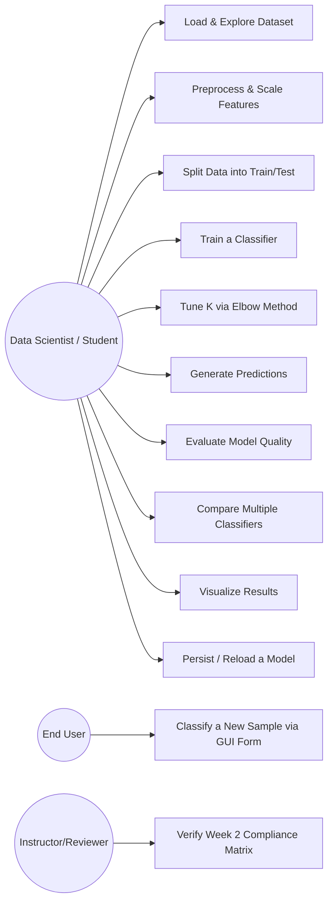

| Use Case | Actor | Preconditions | Main Flow | Postconditions |
|---|---|---|---|---|
| UC-13: Load & Explore Dataset | Data Scientist | None | Run `explore`; dataset is loaded, validated, and summarized (shape, features, classes, balance) | Dataset object cached in session |
| UC-14: Preprocess & Scale Features | Data Scientist | Dataset loaded | Run `train` (implicitly preprocesses) or `explore --preprocessed`; scaler fit on training data only | Scaled feature arrays ready for splitting/training |
| UC-15: Split Data into Train/Test | Data Scientist | Dataset loaded | Data is shuffled and split (default 80/20, stratified) | `X_train`, `X_test`, `y_train`, `y_test` available |
| UC-16: Train a Classifier | Data Scientist | Split complete | Run `train`; model instantiated, fit on training data | Trained model object available in session |
| UC-17: Tune K via Elbow Method | Data Scientist | Split complete | Run `tune-k`; error rate computed across a K range | Recommended K value reported, optionally visualized |
| UC-18: Generate Predictions | Data Scientist | Model trained | Run `predict`; model predicts labels for the test set (or a single new sample) | Prediction array or single label returned |
| UC-19: Evaluate Model Quality | Data Scientist | Predictions generated | Run `evaluate`; confusion matrix, precision, recall, F1, accuracy computed and reported | `EvaluationReport` produced and displayed |
| UC-20: Compare Multiple Classifiers | Data Scientist | Split complete | Run `compare`; multiple classifiers trained/evaluated on the identical split | Comparison table produced, optionally best model saved |
| UC-21: Visualize Results | Data Scientist | Evaluation or tuning complete | Run any command with `--visualize`; a plot image is saved to `outputs/` | PNG file(s) available for review |
| UC-22: Persist / Reload a Model | Data Scientist | Model trained | Run `train --save` or a subsequent `predict`/`evaluate` auto-loads a saved model | Model available across sessions without retraining |
| UC-23: Classify a New Sample via GUI Form | End User | GUI running, a trained/loaded model available | Enter 4 feature values in the GUI ML panel, click "Classify" | Predicted class (and probability, if available) displayed in a bubble/panel |
| UC-24: Verify Week 2 Compliance Matrix | Instructor/Reviewer | Full Week 2 test suite available | Run `pytest tests/test_ml_compliance.py` | All 8 Week 2 Compliance Matrix rows pass |

## Architecture — Machine Learning Engine

### Updated System Architecture (Both Engines)

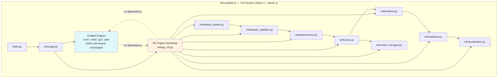
*The dashed "no dependency" lines are intentional and load-bearing — the Chatbot Engine and ML Engine share only the top-level `main.py`/`core/app.py` bootstrap and the common `core/config.py`/`core/logger.py` infrastructure; neither engine imports the other's domain logic (FR-229).*

### Machine Learning Pipeline Diagram (IPO Framework, per the official brief)

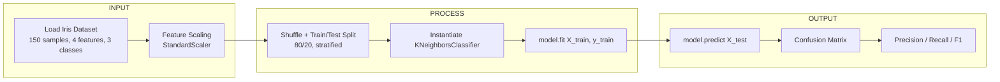

### ML Sequence Diagram

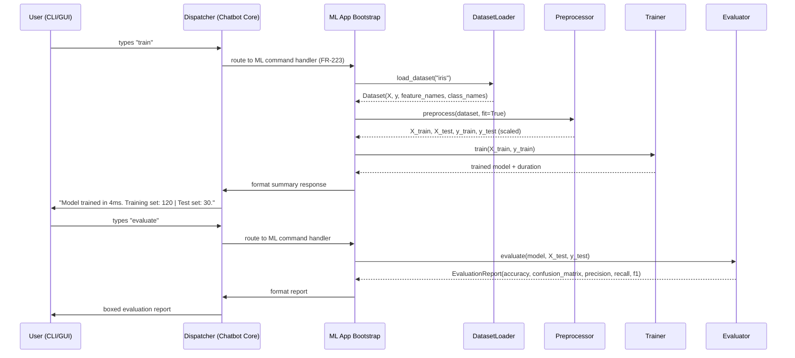

### ML Data Flow Diagram

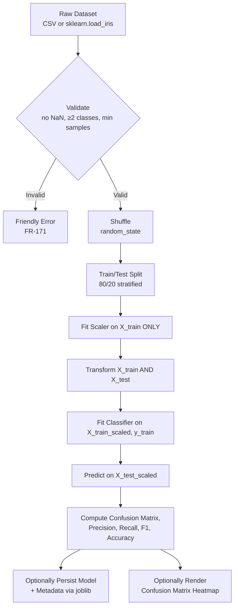

### Module Responsibilities — Machine Learning Engine

| Module | Responsibility |
|---|---|
| `decodebot/ml/dataset_loader.py` | Load Iris (default) or arbitrary CSV datasets into a normalized `Dataset` object (FR-164–FR-166, FR-168) |
| `decodebot/ml/dataset_validator.py` | Validate dataset integrity (missing values, class count, sample count) before any processing (FR-169–FR-170) |
| `decodebot/ml/preprocessor.py` | Feature scaling, encoding, shuffling, and train/test splitting; owns the fit-on-train-only guarantee (FR-173–FR-186) |
| `decodebot/ml/trainer.py` | Classifier instantiation and fitting; supports KNN (required) plus optional additional classifiers; K-tuning (FR-187–FR-195) |
| `decodebot/ml/predictor.py` | Batch and single-sample prediction, with optional probability output (FR-196–FR-200) |
| `decodebot/ml/evaluator.py` | Accuracy, confusion matrix, precision/recall/F1, cross-validation, baseline comparison (FR-201–FR-209) |
| `decodebot/ml/model_manager.py` | Model persistence (save/load), metadata recording, model comparison (FR-210–FR-216) |
| `decodebot/ml/visualization.py` | Confusion matrix heatmap, K-tuning elbow curve, and other plots, saved to file (FR-217–FR-221) |
| `decodebot/ml/app_ml.py` | Thin bootstrap wiring ML commands into the existing Chatbot Engine's dispatcher (FR-222–FR-225) |

### Folder Structure Additions — Machine Learning Engine

```
├── decodebot/
│   ├── ml/
│   │   ├── __init__.py
│   │   ├── app_ml.py             # ML command bootstrap/wiring into core/dispatcher.py
│   │   ├── dataset.py             # Dataset dataclass definition (shared structure)
│   │   ├── dataset_loader.py       # FR-164–FR-166, FR-168
│   │   ├── dataset_validator.py    # FR-169–FR-170
│   │   ├── preprocessor.py         # FR-173–FR-186
│   │   ├── trainer.py              # FR-187–FR-195
│   │   ├── predictor.py            # FR-196–FR-200
│   │   ├── evaluator.py            # FR-201–FR-209
│   │   ├── model_manager.py        # FR-210–FR-216
│   │   ├── visualization.py        # FR-217–FR-221
│   │   └── config_ml.py            # ML-specific config key definitions (FR-226)
├── datasets/
│   └── README.md                    # Notes on the bundled Iris dataset and CSV format for future datasets
├── models/
│   └── .gitkeep                      # Trained models saved here (gitignored by default; metadata .json is small and may be committed)
├── outputs/
│   └── .gitkeep                       # Visualization PNGs saved here (gitignored by default)
├── tests/
│   ├── test_ml_compliance.py          # The 8 mandatory Week 2 checks (gate test)
│   ├── test_dataset_loader.py
│   ├── test_dataset_validator.py
│   ├── test_preprocessor.py
│   ├── test_trainer.py
│   ├── test_predictor.py
│   ├── test_evaluator.py
│   ├── test_model_manager.py
│   ├── test_visualization.py
│   ├── test_ml_isolation.py            # FR-229 architectural boundary check
│   └── fixtures/
│       └── sample_dataset.csv
├── docs/
│   └── ML_GUIDE.md
```

> **Full updated top-level architecture (matches the internship brief's requested tree exactly):**
> ```
> DecodeBot AI
> ├── Chatbot Engine        (Part I — unchanged, 100% rule-based)
> ├── Rule Engine            (Part I — unchanged, inside Chatbot Engine)
> ├── Machine Learning Engine (Part II — new)
> │   ├── Dataset Loader
> │   ├── Dataset Validator
> │   ├── Preprocessor
> │   ├── Trainer
> │   ├── Predictor
> │   ├── Evaluator
> │   ├── Model Manager
> │   └── Visualization
> ├── Config                 (shared, extended with ML keys)
> ├── Logging                (shared, extended with ML logger tag)
> ├── CLI                     (shared, extended with ML commands)
> ├── GUI                      (Part I — extended with ML panel, Part II)
> ├── Tests                    (extended with ML test suite)
> └── Documentation              (extended with ML_GUIDE.md)
> ```

## Machine Learning Pipeline — Step-by-Step Specification

> This section documents the exact pipeline sequence an implementer must follow, matching the official brief's "Master Blueprint: IPO Framework" and "The Full Architecture" slides precisely.

| Step | Stage | Module | Key Operation | Related FRs |
|---|---|---|---|---|
| 1 | **Input** | `dataset_loader.py` | Load Iris (150 samples, 4 features, 3 classes) or CSV | FR-164–FR-166 |
| 2 | **Input** | `dataset_validator.py` | Validate: no NaN, ≥2 classes, minimum sample count | FR-169–FR-170 |
| 3 | **Input** | `preprocessor.py` | Shuffle (remove order bias) | FR-177 |
| 4 | **Process** | `preprocessor.py` | Train/test split (80/20 default, stratified) | FR-182–FR-183 |
| 5 | **Process** | `preprocessor.py` | Fit `StandardScaler` on `X_train` **only** | FR-173–FR-174 |
| 6 | **Process** | `preprocessor.py` | Transform both `X_train` and `X_test` | FR-174 |
| 7 | **Process** | `trainer.py` | Instantiate `KNeighborsClassifier(n_neighbors=k)` | FR-187–FR-188 |
| 8 | **Process** | `trainer.py` | `model.fit(X_train, y_train)` | FR-189 |
| 9 | **Output** | `predictor.py` | `model.predict(X_test)` | FR-196 |
| 10 | **Output** | `evaluator.py` | Confusion matrix (`sklearn.metrics.confusion_matrix`) | FR-202 |
| 11 | **Output** | `evaluator.py` | Precision, recall, F1 (`classification_report`) | FR-203 |
| 12 | **Output** | `evaluator.py` | Accuracy (reported alongside, never alone) | FR-201, NFR-080 |
| 13 | *(Optional)* | `model_manager.py` | Persist model + metadata via `joblib` | FR-210, FR-213 |
| 14 | *(Optional)* | `visualization.py` | Render confusion matrix heatmap / K-tuning curve | FR-217–FR-218 |

> **Implementation note for OpenCode:** Steps 1–12 are the **mandatory** Week 2 pipeline and must work end-to-end with zero configuration (running `train` then `evaluate` with default settings must "just work" on the bundled Iris dataset). Steps 13–14 are professional enhancements and may be implemented after steps 1–12 are verified against the Week 2 Compliance Matrix.

## Configuration — Machine Learning Engine

Extends the existing configuration system (FR-088) with the keys introduced in FR-226. Full documented table for `docs/CONFIGURATION.md`:

| Key | Type | Default | Description |
|---|---|---|---|
| `ml_dataset` | string | `"iris"` | Dataset identifier; `"iris"` uses the bundled `sklearn` dataset, or a file path to a CSV |
| `ml_target_column` | string | `null` | Required only when `ml_dataset` is a CSV path; the column to use as the classification target |
| `ml_test_size` | float | `0.2` | Fraction of data reserved for the test set (FR-182, FR-185) |
| `ml_random_state` | int | `42` | Seed for shuffling, splitting, and stochastic model steps (FR-178) |
| `knn_k` | int | `5` | Number of neighbors for the default KNN classifier (FR-188) |
| `classifier_type` | string | `"knn"` | One of `"knn"`, `"decision_tree"`, `"logistic_regression"`, `"svm"`, `"random_forest"` (FR-191) |
| `scaler_type` | string | `"standard"` | One of `"standard"`, `"minmax"`, `"none"` (FR-175) |
| `ml_missing_value_strategy` | string | `"error"` | One of `"error"`, `"drop"`, `"mean_impute"` (FR-170) |
| `models_dir` | string | `"models/"` | Directory for persisted models and metadata (FR-210) |
| `ml_outputs_dir` | string | `"outputs/"` | Directory for saved visualizations (FR-217) |
| `ml_log_level` | string | inherits `log_level` | Optional override of the shared logging level for `decodebot.ml` specifically |

All keys follow the same per-key validation and default-fallback behavior established in FR-094 — a single invalid ML key never prevents the application (chatbot or ML) from starting.

## Logging — Machine Learning Engine

- Uses the existing rotating file handler (FR-096) — no separate log file is created.
- Logger name: `decodebot.ml` (and sub-loggers `decodebot.ml.trainer`, `decodebot.ml.evaluator`, etc., where useful for filtering).
- Logged at `INFO`: dataset loads, training start/end (with hyperparameters), evaluation results (summary metrics), model save/load events.
- Logged at `DEBUG`: full confusion matrix values, per-fold cross-validation scores, preprocessing intermediate shapes.
- Logged at `WARNING`: class imbalance detected, config key fallback to default, model loaded from outside `models/` (FR-212).
- Logged at `ERROR`: dataset validation failures, training failures, prediction-without-trained-model attempts, corrupted model file loads — always with a caught, non-crashing recovery path (FR-228).
- **Never logged:** raw dataset contents beyond shape/statistics (avoids unnecessarily bloating logs with full feature matrices).

## Error Handling — Machine Learning Engine

| Scenario | Behavior | Related FR |
|---|---|---|
| Dataset file not found | Friendly error; ML command aborts cleanly, CLI/GUI remains responsive | FR-171 |
| Dataset contains missing values, strategy = `"error"` | Friendly error naming the offending column(s) | FR-169–FR-170 |
| Dataset has fewer than 2 classes | Friendly error; training cannot proceed | FR-169 |
| `test_size` outside `(0, 1)` | Configuration error surfaced at startup/command time, not a silent misbehavior | FR-182 |
| `knn_k` greater than training set size | Friendly error before calling `.fit()` | FR-187 |
| `knn_k <= 0` | Configuration error | FR-188 |
| Unknown `classifier_type` | Falls back to `"knn"` with a logged warning | FR-191 |
| Unknown `scaler_type` | Falls back to `"standard"` with a logged warning | FR-175 |
| `predict`/`evaluate` called with no trained/loaded model | Friendly message directing the user to run `train` first | FR-199 |
| Corrupted or unreadable saved model file | Friendly error; does not crash; existing in-memory model (if any) remains usable | FR-211 |
| Model file outside `models/` loaded without explicit opt-in | Blocked by default, with a security-relevant `WARNING` logged if overridden | FR-212 |
| Non-numeric value entered in GUI predict form | Inline validation error; GUI remains responsive | FR-225 |
| Mismatched feature vector length in `predict_one()` | Rejected with a clear error before reaching `scikit-learn` | FR-197 |
| Headless environment attempting to render a plot | Non-interactive `matplotlib` backend used automatically; file still saved | FR-217 |

## Coding Standards — Machine Learning Engine Additions

- **Library scope boundary (hard rule):** `scikit-learn`, `pandas`, `numpy`, `matplotlib`, `seaborn` (optional), and `joblib` may be imported **only** within `decodebot/ml/` and its dedicated tests. No file under `decodebot/core/`, `decodebot/rules/`, or `decodebot/gui/` may import any of these libraries (FR-229, enforced by `tests/test_ml_isolation.py`).
- **Type hints:** All ML functions use type hints, including `numpy.ndarray`/`pandas.DataFrame` type aliases defined once in `decodebot/ml/dataset.py` for consistency (e.g., `FeatureMatrix = np.ndarray`).
- **Docstrings:** Follow the same Google-style docstring convention as Part I (FR/Args/Returns/Raises), with an added `Reference:` line linking back to the relevant Week 2 brief slide/concept where applicable (e.g., "Reference: Gatekeeper Rule — Scaling").
- **Determinism discipline:** Any function involving randomness (shuffling, splitting, stochastic solvers) must accept an explicit `random_state` parameter — never rely on global/implicit random state.
- **No notebook-only logic:** All pipeline logic lives in importable, testable `.py` modules under `decodebot/ml/`; optional Jupyter notebooks (if added for exploration) live in a separate `notebooks/` directory and must not contain any logic that isn't also available as a proper module function.
- **Naming conventions:** Match Part I exactly (`snake_case` functions/modules, `PascalCase` classes/dataclasses, `UPPER_SNAKE_CASE` constants).
- **No bare `except: pass`:** Identical rule to Part I — every ML Engine exception handler must log before recovering.

## Testing Strategy — Machine Learning Engine

> Mirrors the rigor and structure of the Part I Testing Specification. New tests are prefixed `TC-ML-` and organized into the same seven categories used in Part I.

### Compliance Gate Tests (Week 2, Must Pass First)

| Test ID | Description | Expected Result |
|---|---|---|
| TC-ML-001–010 | Dataset loading & understanding (shape, features, classes, balance, CSV path support, caching, metadata) | Matches official Iris benchmark: 150 samples, 4 features, 3 classes |
| TC-ML-011–020 | Preprocessing & scaling (fit-on-train-only, mean≈0/var≈1, swappable scaler, no leakage) | Post-scaling statistics verified numerically |
| TC-ML-021–028 | Shuffling & train/test split (80/20 default, stratified, reproducible with fixed seed) | 120/30 split with proportional class representation |
| TC-ML-029–038 | KNN instantiation, fit, and the exact `INSTANTIATE → FIT → PREDICT` workflow | Model trains and predicts without error |
| TC-ML-039–044 | Prediction on test set and single-sample prediction | Correct-length, valid-class output for both paths |
| TC-ML-045–058 | Evaluation: confusion matrix, precision, recall, F1, accuracy, "accuracy mirage" warning | All metrics computed and internally consistent |
| TC-ML-059–070+ | Full pipeline integration, persistence round-trip, and isolation from the Chatbot Engine | End-to-end `train → evaluate → predict → save → load` succeeds; `test_ml_isolation.py` passes |

### Unit Tests (25)
Cover each module in isolation: `dataset_loader` (5), `dataset_validator` (4), `preprocessor` (5), `trainer` (4), `predictor` (3), `evaluator` (4).

### Integration Tests (12)
Full pipeline runs end-to-end on Iris; `train` → `evaluate` → `predict` CLI command chaining; GUI ML panel wired to the same functions as the CLI; model persistence round-trip (save, restart session, load, predict).

### Regression Tests (8)
Model accuracy stays within an expected range across code refactors (using a fixed `random_state`); confusion matrix shape stability; config schema backward compatibility for new ML keys; classifier-swap doesn't break the shared `train`/`predict`/`evaluate` interface.

### Manual/Exploratory Tests (6)
First-time `train` + `evaluate` walkthrough on a clean checkout; GUI "Classify" form tested with known canonical Iris samples; visualization images manually reviewed for correctness/legibility; `compare` command output manually cross-checked against `evaluate` run individually per classifier.

### Acceptance Tests (10)
All 8 Week 2 Compliance Matrix rows pass; `tests/test_ml_isolation.py` passes (zero ML imports in the Chatbot Engine); ML Engine test coverage ≥ 90%; chatbot-only startup time remains < 300ms with ML deps installed; full ML test suite runs in a reasonable time budget (< 30 seconds).

### Negative Tests (10)
Missing dataset file; dataset with NaN values (`"error"` strategy); single-class dataset; invalid `test_size`; invalid `knn_k` (zero, negative, larger than training set); corrupted model file on load; model loading from outside `models/` without opt-in; non-numeric GUI predict input; predicting before training; unknown `classifier_type`/`scaler_type` (fallback verified, not a crash).

### Edge Case Tests (10)
Minimum viable dataset size (exactly enough samples for a valid stratified split); perfectly balanced vs. deliberately imbalanced synthetic dataset (verifies FR-204's warning); `test_size` at extreme but valid values (0.05, 0.95); K value equal to the training set size minus 1; single-feature dataset; dataset with a constant (zero-variance) feature column; repeated `train` calls in one session (no state corruption); `compare` with only one classifier specified; visualization requested in a headless test environment; model metadata file manually deleted while the `.joblib` file remains (graceful degradation).

> **Week 2 Test Count Summary:** 70 (Compliance-mapped, itemized) + 25 (Unit) + 12 (Integration) + 8 (Regression) + 6 (Manual) + 10 (Acceptance) + 10 (Negative) + 10 (Edge Case) = **80+ new ML test cases**, on top of Part I's 125+, for a combined project total of **205+ total test cases**.

## Acceptance Criteria — Machine Learning Engine

| Feature Area | Completion Criteria |
|---|---|
| Dataset loading & understanding | ☑ Iris loads correctly ☑ CSV support works ☑ metadata/class-balance reporting correct ☑ validation rejects malformed data |
| Preprocessing | ☑ `StandardScaler` applied correctly ☑ fit-on-train-only verified ☑ swappable scaler works ☑ shuffling verified |
| Train/test split | ☑ 80/20 default ☑ stratified ☑ reproducible via `random_state` ☑ no data leakage (regression-tested) |
| Model training | ☑ KNN required baseline works ☑ configurable K ☑ multi-classifier support ☑ never crashes on bad input |
| Prediction | ☑ batch prediction correct ☑ single-sample prediction correct ☑ requires a trained model with a friendly guard |
| Evaluation | ☑ confusion matrix ☑ precision/recall/F1 ☑ accuracy reported alongside (never alone) ☑ "accuracy mirage" warning functions |
| Persistence & comparison | ☑ save/load round-trips correctly ☑ metadata recorded ☑ `compare` produces a correct side-by-side table |
| Visualization | ☑ confusion matrix heatmap saved ☑ K-tuning curve saved ☑ never blocks CLI/GUI ☑ works headless |
| CLI/GUI integration | ☑ ML commands appear in `help` ☑ GUI ML panel calls identical functions to the CLI ☑ zero chat-text ever reaches a `scikit-learn` model |
| Architecture isolation | ☑ `test_ml_isolation.py` passes ☑ chatbot startup time unaffected ☑ Week 1 Compliance Matrix still passes 100% |
| Testing | ☑ 80+ new ML test cases ☑ Week 2 Compliance Matrix 8/8 ☑ ≥90% coverage on `decodebot/ml/` |
| Documentation | ☑ `docs/ML_GUIDE.md` complete ☑ `docs/CONFIGURATION.md` updated with ML keys ☑ this SPEC.md's Part II kept current |

## GitHub Standards — Machine Learning Engine Additions

- **README additions:** A new "Machine Learning Engine" section following the existing Chatbot section, including a screenshot/GIF of `train` → `evaluate` output and, if the GUI ML panel is built, a screenshot of a live classification.
- **Badges:** Add a `scikit-learn` badge and a "Supervised Learning" custom badge alongside the existing Python/License/"100% Rule-Based" badges — the "100% Rule-Based" badge now explicitly annotated as describing the **Chatbot Engine only**, to avoid misleading portfolio reviewers about the ML Engine.
- **Dataset attribution:** README and `docs/ML_GUIDE.md` credit the Iris dataset (Fisher, 1936; distributed via `scikit-learn`) per standard dataset-citation practice.
- **Model card:** Each committed example model's metadata `.json` (FR-213) doubles as a lightweight "model card" — classifier type, hyperparameters, training date, dataset, and test accuracy — suitable for portfolio review.
- **`requirements.txt` clarity:** Clearly split into a "Chatbot Engine (stdlib only)" section and a "Machine Learning Engine" section, per FR-230, so a reviewer instantly understands the dependency boundary.
- **Releases:** The `v2.0.0` GitHub Release notes explicitly call out "Added: Machine Learning Data Classification Engine (Week 2)" and "Preserved: 100% rule-based Chatbot Engine (Week 1), unchanged."

## Risks — Machine Learning Engine Additions

### Known Limitations (Week 2)
- The Iris dataset is small (150 samples) and near-perfectly separable, so reported accuracy will typically be high (often > 0.90) regardless of classifier choice — this is expected and appropriate for an internship-level benchmark, not evidence of a flawed pipeline.
- KNN's performance is sensitive to the choice of K and to feature scaling; both are addressed (FR-173, FR-188, FR-190) but remain inherent characteristics of the algorithm, not implementation bugs.
- `joblib`/`pickle`-based model persistence carries an inherent deserialization risk for untrusted files; this is mitigated (FR-212) but not eliminated by design — never load a model file from an untrusted source, even with the override flag.

### Trade-offs (Week 2)
- Choosing `scikit-learn` (a full-featured ML library) as a new dependency directly contradicts the Week 1 "stdlib-only" philosophy — this is a deliberate, explicitly-scoped exception mandated by the official Week 2 brief, strictly confined to `decodebot/ml/` (FR-229), not a general relaxation of the project's engineering discipline.
- Supporting multiple classifiers (FR-191) adds flexibility at the cost of slightly more code surface than the bare KNN requirement — justified by the Portfolio/Stretch objectives.
- Persisting models to disk by default trades a small amount of disk usage for the significant usability win of not retraining on every launch.

### Future Improvements (Week 2 → Beyond)
- Expand beyond the Iris dataset to additional classic or user-supplied tabular datasets (the loader/validator/preprocessor are already dataset-agnostic per FR-165).
- Add hyperparameter search (`GridSearchCV`/`RandomizedSearchCV`) as a natural extension of the existing K-tuning utility (FR-190).
- Explore the brief's own stated "Emerging Horizons" — extending from tabular classification toward computer vision and deep learning in a future, separately-specified week, without disturbing either the Chatbot Engine or the tabular ML Engine documented here.
- Optionally expose the ML Engine's `predict()` as a rule-triggered "bridge" feature in the Chatbot Engine (e.g., a hidden command that asks for 4 numbers and calls the ML Engine) — explicitly deferred; if built, it must call the ML Engine's existing public function only, never duplicate or blend logic across the two engines (consistent with FR-145's "shared engine, no duplication" principle, applied here as "separate engines, no blending").

---
---

# PART III — WEEK 3: CONTENT-BASED TECH STACK RECOMMENDATION ENGINE

> **Status: PLANNED (not yet implemented).**
>
> **Scope of Part III:** This part documents the **Content-Based Tech Stack Recommendation Engine** proposed for DecodeLabs AI Internship Week 3. It is **additive only**. Every requirement in Part I (Week 1) and Part II (Week 2) remains unchanged, unweakened, and fully in force. The new engine lives in an isolated `decodebot/recommender/` package that reuses the ML libraries already scoped to the ML Engine (`FR-229`) without ever importing them — or being imported — by the Chatbot Engine (`decodebot/core/`, `decodebot/rules/`, `decodebot/gui/`). This part is documented as **PLANNED**: no production code, tests, or dependencies are to be changed for it until the corresponding plan (`PLAN.md`, Wave 3, milestones W3-M1–W3-M7) is approved and implemented milestone by milestone, with a mandatory stop for user approval after each milestone.

## Week 3 Executive Summary

Week 3 evolves **DecodeBot AI** from a two-engine application (rule-based Chatbot + supervised-classification ML Engine) into a three-engine application with the addition of a **Content-Based Tech Stack Recommendation Engine**. Given a short list of skills, the recommender ranks the built-in career/tech-stack corpus (approximately 24 curated profiles spanning backend, frontend, data/ML, mobile, DevOps/cloud, and cybersecurity) by cosine similarity between the TF-IDF vector of the user's skill query and the TF-IDF vectors of each profile's skills + description. The query and the corpus are vectorized under **one fitted vocabulary** (`FR-241`), results are deterministic and tie-broken (`FR-243`), Top-N defaults to 3 (`FR-242`), and cold-start / zero-match / partial-match fallbacks guarantee a friendly result for any input (`FR-244`). A new `recommend` CLI command and a Tkinter "Career Recommender" tab expose the identical underlying engine, mirroring the CLI/GUI parity principle established in Part I (`FR-145`) and Part II (`FR-224`).

The recommender is fully isolated, lazy-loaded, and configurable — it adds no dependency to the Chatbot Engine, never slows chatbot startup (`FR-234`), and ships with the same test rigor, documentation, and acceptance gates as the ML Engine.

## Objectives — Week 3 Additions

### Internship Objectives (Week 3)
- OBJ-INT-09: Recommend a career/tech-stack profile from a natural-language list of skills, demonstrating applied information-retrieval skill.
- OBJ-INT-10: Deliver the recommender as a self-contained, isolated module with CLI and GUI surfaces, without disturbing the Week 1 and Week 2 deliverables.

### Technical Objectives (Week 3)
- OBJ-TECH-10: Implement the recommender as a fully isolated package (`decodebot/recommender/`) with zero coupling to the Chatbot Engine's rule logic and zero eager imports of ML libraries at startup.
- OBJ-TECH-11: Build a deterministic content-based pipeline: normalize → vectorize (single fitted TF-IDF vocabulary) → cosine rank → fallback-handled Top-N output.
- OBJ-TECH-12: Support a built-in corpus plus user-supplied CSV corpora behind one consistent interface.

### Portfolio Objectives (Week 3)
- OBJ-PORT-06: Demonstrate a second applied-AI competency (content-based recommendation / information retrieval) alongside the Week 1 rule-based and Week 2 classification work.
- OBJ-PORT-07: Produce a demoable, screen-share-friendly "type your skills, get a career match" feature in both CLI and GUI.

### Learning Objectives (Week 3)
- OBJ-LEARN-08: Build practical experience with TF-IDF vectorization, cosine similarity, and deterministic ranking.
- OBJ-LEARN-09: Understand content-based vs. collaborative filtering trade-offs and why content-based is the right choice for a privacy-preserving, offline, cold-start-safe portfolio project.

### Stretch Goals (Week 3)
- Optionally surface the matched top skill per result, highlight exactly which of the user's skills matched each profile, and support a `--top-n` CLI override (validated 1–10).

## Functional Requirements — Content-Based Tech Stack Recommendation Engine (FR-233 – FR-248)

> New Functional Requirements for Week 3. Upon Wave 3 implementation the combined project total becomes **248 Functional Requirements (FR-001 – FR-248)**.

### Category S1 — Package & Architecture (FR-233 – FR-235)

**FR-233 — Recommender Package Isolation**
- **Priority:** P0
- **Description:** A new `decodebot/recommender/` package shall implement the Content-Based Tech Stack Recommendation Engine. No file under `decodebot/core/`, `decodebot/rules/`, or `decodebot/gui/` may import from `decodebot.recommender`. Within `decodebot/recommender/`, ML libraries (`scikit-learn`, `pandas`, `numpy`) are permitted but must be imported lazily (never at `decodebot.recommender` import time). The Chatbot Engine (Part I) and ML classification Engine (Part II) must behave identically before and after this package exists.
- **Rationale:** Preserves the architectural boundary discipline established in `FR-229` — a new engine is another isolated module, never blended into the rule-based core.
- **Dependencies:** FR-229
- **Acceptance Criteria:** `tests/test_wave3_isolation.py` passes, confirming (a) zero `decodebot.recommender` imports inside `decodebot/core/`, `decodebot/rules/`, and `decodebot/gui/`, and (b) zero eager ML-library imports at chatbot startup.
- **Edge Cases:** N/A.
- **Example:** N/A.

**FR-234 — Recommender Lazy Imports & Startup Preservation**
- **Priority:** P1
- **Description:** The `scikit-learn`/`pandas`/`numpy` imports required by the recommender shall occur only when a `recommend` command is first invoked (mirroring `FR-232`). `python main.py` (chatbot-only session) must still start in under 300ms with all recommender dependencies installed.
- **Rationale:** Extends `NFR-003`/`NFR-075` startup guarantees to the new engine.
- **Dependencies:** FR-232, NFR-075
- **Acceptance Criteria:** `python main.py` starts in under 300ms with recommender dependencies installed but unused.
- **Edge Cases:** N/A.
- **Example:** N/A.

**FR-235 — Recommender Configuration Keys**
- **Priority:** P1
- **Description:** The existing configuration system (`FR-088`) shall be extended with recommender keys: `recommender_corpus` (default `"builtin"`, or a CSV file path), `recommender_top_n` (default `3`, valid `1–10`), `recommender_min_skills` (default `3`), `recommender_threshold` (default `0.0`, valid `0–1`), `recommender_random_state` (default `42`). Per-key validation and fallback-to-default behavior (`FR-094`) applies identically to these new keys.
- **Rationale:** Consistency with the Chatbot Engine's and ML Engine's (`FR-226`) configuration philosophy.
- **Dependencies:** FR-088, FR-094
- **Acceptance Criteria:** All keys are documented in `docs/CONFIGURATION.md` (extended) with defaults and valid ranges.
- **Edge Cases:** An invalid value (e.g., `recommender_top_n = 0`) falls back to the default with a logged warning; it never prevents startup.
- **Example:** N/A.

### Category S2 — Dataset & Data Model (FR-236 – FR-238)

**FR-236 — Built-in Careers Corpus**
- **Priority:** P0
- **Description:** The recommender shall ship a built-in corpus of approximately 24 career/tech-stack profiles, each containing a title, a comma-separated skills list, and a short human-readable description. The corpus must cover at least 6 broad domains: backend, frontend, data/ML, mobile, DevOps/cloud, and cybersecurity.
- **Rationale:** Provides a demoable, offline, deterministic baseline without requiring user data.
- **Dependencies:** FR-233
- **Acceptance Criteria:** The built-in corpus loads successfully, contains ≥ 20 entries with non-empty skills lists, spans ≥ 6 domains, and has no duplicate titles (case-insensitive).
- **Edge Cases:** N/A.
- **Example:** A profile such as `("Data Scientist", "Python, SQL, Machine Learning, Pandas, Scikit-learn", "Analyzes data to drive business decisions.")`.

**FR-237 — Custom Corpus via CSV**
- **Priority:** P2
- **Description:** Setting `recommender_corpus` to a CSV file path shall load that file as the active corpus. Required columns: `title`, `skills`, `description`. The same validation rules as the built-in corpus apply.
- **Rationale:** Extensibility — users can recommend against their own catalog without code changes.
- **Dependencies:** FR-236, FR-235
- **Acceptance Criteria:** A sample CSV with ≥ 2 valid rows loads and recommends correctly; a malformed CSV (missing columns, empty skills) produces a friendly error, never a crash.
- **Edge Cases:** CSV missing a required column → friendly error naming the offending column(s).
- **Example:** N/A.

**FR-238 — Corpus Validation & Structured Data Model**
- **Priority:** P0
- **Description:** All corpora shall pass validation before use: ≥ 2 entries, every entry has a non-empty title and non-empty skills list, and no duplicate titles (case-insensitive). The engine shall expose structured result objects — `CareerProfile`, `SkillSet`, and `RecommendationResult` — so callers (CLI, GUI, tests) never manipulate raw arrays.
- **Rationale:** Structured data model consistent with the ML Engine's `Dataset` (`FR-164`) and the project's dataclass conventions.
- **Dependencies:** FR-236
- **Acceptance Criteria:** A unit test verifies validation rejects an empty-skills entry and a duplicate title; result objects expose typed fields (title, skills, description, similarity, matched skills).
- **Edge Cases:** A corpus with exactly 2 entries still works — Top-N is clamped to 2.
- **Example:** N/A.

### Category S3 — User Input & Normalization (FR-239 – FR-240)

**FR-239 — `recommend` Command & Skill Input**
- **Priority:** P0
- **Description:** A new `recommend` command shall be registered in the same `COMMANDS` registry used by the Chatbot Engine and ML Engine (`FR-058`, `FR-222`), accepting a `--skills` argument containing one or more comma-separated skills. Invocation: `python main.py recommend --skills "Python, SQL, Machine Learning"`.
- **Rationale:** Consistency and discoverability — one unified command surface for the whole application.
- **Dependencies:** FR-058, FR-222
- **Acceptance Criteria:** `help` output lists `recommend` under a distinct "Recommendations" section; the documented invocation returns ranked results.
- **Edge Cases:** Missing `--skills` → friendly usage message; the session continues.
- **Example:** N/A.

**FR-240 — Skill Input Normalization**
- **Priority:** P1
- **Description:** Skill tokens from the user query and from the corpus shall be normalized consistently before matching: trim whitespace, lowercase, strip trailing punctuation, and map common abbreviations to canonical forms (e.g., `"ml"` → `"machine learning"`). Comma-separated and space-separated skill lists shall tokenize equivalently.
- **Rationale:** Ensures `"Python,"` and `"python"` match; consistent with the input-normalization discipline of `FR-013`–`FR-024`.
- **Dependencies:** FR-239
- **Acceptance Criteria:** Unit tests verify that `"Python, SQL, machine learning"` and `"python,sql,machine learning"` produce identical token sets.
- **Edge Cases:** Empty or symbol-only skill tokens are dropped, never crash.
- **Example:** N/A.

### Category S4 — Profile & Feature Extraction (FR-241)

**FR-241 — TF-IDF Feature Extraction Over a Single Fitted Vocabulary**
- **Priority:** P0
- **Description:** The engine shall vectorize each career profile's combined skills + description text using `TfidfVectorizer` (lowercase analyzer, configurable max-feature bound), producing a document-term matrix. The user query (normalized skills) shall be transformed with the **same** fitted vectorizer, so profiles and query share one vocabulary. No corpus text may leak into the query representation beyond the shared vocabulary.
- **Rationale:** Content-based matching requires profiles and query to live in one common feature space.
- **Dependencies:** FR-236, FR-240
- **Acceptance Criteria:** A regression test confirms the profile matrix and the transformed query have identical feature dimensionality (the fitted vocabulary).
- **Edge Cases:** A query whose tokens all fall outside the vocabulary yields an all-zero vector — handled by the zero-match fallback (`FR-244`).
- **Example:** N/A.

### Category S5 — Similarity & Ranking (FR-242 – FR-243)

**FR-242 — Cosine Similarity & Top-N Ranking**
- **Priority:** P0
- **Description:** The engine shall rank profiles by cosine similarity between the query vector and each profile vector (via `sklearn.metrics.pairwise.cosine_similarity`), returning the top N profiles. `recommender_top_n` (default `3`, validated to `1–10`) controls N; N is clamped to the corpus size.
- **Rationale:** Cosine similarity is the canonical content-based ranking metric; Top-N gives a compact, useful answer.
- **Dependencies:** FR-241, FR-235
- **Acceptance Criteria:** For the canonical query `"Python, SQL, Machine Learning"`, the built-in corpus returns exactly 3 ranked results with the highest-similarity profile first.
- **Edge Cases:** Top-N larger than the corpus size returns all profiles; Top-N = 1 returns a single result.
- **Example:** N/A.

**FR-243 — Deterministic Output & Tie-Breaking**
- **Priority:** P0
- **Description:** Ranking shall be deterministic: identical input, corpus, and configuration must always yield identical ranked lists. Equal-similarity ties shall be broken by stable secondary keys — corpus order, then title alphabetically — never by hash or random order.
- **Rationale:** Matches the determinism discipline of `NFR-022` and `NFR-069`.
- **Dependencies:** FR-242
- **Acceptance Criteria:** Two consecutive `recommend` invocations with identical input produce byte-identical output.
- **Edge Cases:** N/A.
- **Example:** N/A.

### Category S6 — Cold Start, Zero-Match & Fallback (FR-244)

**FR-244 — Cold Start, Zero-Match & Fallback Handling**
- **Priority:** P0
- **Description:** (1) **Cold start:** invoking `recommend` with no `--skills`, or fewer than `recommender_min_skills` (default `3`), shall return a friendly guidance message listing example skills — never an error stack. (2) **Zero-match:** if all computed similarities are zero (query outside vocabulary), the engine shall return a `zero-match` status with a helpful message. (3) **Threshold fallback:** when configured, profiles below `recommender_threshold` similarity are excluded; if this empties the result list, the engine falls back to the best available profiles with a `partial-match` status clearly labeled.
- **Rationale:** Robust UX consistent with the project's friendly-error philosophy (`FR-106`, `FR-111`) and the ML Engine's guard rails (`FR-199`).
- **Dependencies:** FR-239, FR-242
- **Acceptance Criteria:** Tests cover all three paths (min-skills guidance, zero-match, partial-match fallback); none crash, all produce user-facing messages.
- **Edge Cases:** N/A.
- **Example:** N/A.

### Category S7 — CLI (FR-245)

**FR-245 — CLI Structured Output**
- **Priority:** P0
- **Description:** `python main.py recommend --skills "..."` shall print a boxed, ranked list (rank, title, similarity %, matched skills) using the existing formatting utilities (`FR-126`–`FR-133`), and honor `--plain` mode (`FR-133`). Output derives exclusively from structured `RecommendationResult` objects — the CLI never re-computes ranking logic.
- **Rationale:** Single rendering path, no duplicated logic (`FR-145`'s "shared engine, no duplication" principle applied to the new engine).
- **Dependencies:** FR-239, FR-243, FR-133
- **Acceptance Criteria:** The documented CLI invocation prints exactly 3 ranked rows in a boxed layout; `--plain` prints the same data with zero ANSI codes and zero box-drawing characters.
- **Edge Cases:** N/A.
- **Example:** N/A.

### Category S8 — GUI (FR-246)

**FR-246 — GUI "Career Recommender" Tab**
- **Priority:** P2
- **Description:** The optional Tkinter GUI (Category Q) shall gain a "Career Recommender" tab with a skills entry field, a "Recommend" button, and a results list, calling the identical engine function as the CLI (mirroring `FR-224`'s shared-engine principle). Results render with rank, title, and similarity.
- **Rationale:** Full feature parity between CLI and GUI, consistent with Part I's design philosophy.
- **Dependencies:** FR-144, FR-245
- **Acceptance Criteria:** Entering `Python, SQL, Machine Learning` and clicking "Recommend" displays the same top-3 as the CLI.
- **Edge Cases:** Empty entry → inline validation message; the GUI remains responsive.
- **Example:** N/A.

### Category S9 — Cross-Cutting (FR-247 – FR-248)

**FR-247 — Recommender Logging & Error Handling**
- **Priority:** P0
- **Description:** The recommender shall use the existing rotating logger (`FR-096`) with a distinct `decodebot.recommender` logger tag, logging corpus loads, query tokens, and ranking summaries at `INFO`. All error paths (missing corpus, invalid CSV, dependency import failures, malformed arguments) shall route through the friendly-message + logged-traceback + continue-session pattern (`FR-106`, `FR-111`, `FR-228`), never crashing the CLI/GUI process.
- **Rationale:** Single unified operational log and uniform error UX across all engines.
- **Dependencies:** FR-096, FR-228
- **Acceptance Criteria:** A 1,000-iteration fuzz test covering malformed `recommend` invocations produces zero unhandled exceptions.
- **Edge Cases:** N/A.
- **Example:** N/A.

**FR-248 — Recommender Testing & Acceptance**
- **Priority:** P1
- **Description:** The recommender shall be delivered with the TC-REC-* test suite and acceptance criteria defined in the Testing Strategy and Acceptance Criteria sections below, including ≥ 90% line coverage on `decodebot/recommender/` and full isolation/startup re-verification.
- **Rationale:** Every engine ships with the same test rigor as the ML Engine (`NFR-076`).
- **Dependencies:** FR-233–FR-247
- **Acceptance Criteria:** All TC-REC-* tests pass; isolation and startup gates green; Week 1 and Week 2 compliance matrices still pass 100%.
- **Edge Cases:** N/A.
- **Example:** N/A.

> **End of Part III Functional Requirements.** Total: **16 new Functional Requirements (FR-233 – FR-248)**. Combined project total upon Wave 3 implementation: **248 Functional Requirements (FR-001 – FR-248)**.

## Non-Functional Requirements — Content-Based Tech Stack Recommendation Engine (NFR-086 – NFR-090, NFR-096)

> New Non-Functional Requirements for Week 3. Combined project total upon Wave 3 implementation: **96 Non-Functional Requirements (NFR-001 – NFR-096)**.

| ID | Category | Requirement | Target / Metric | Priority |
|---|---|---|---|---|
| NFR-086 | Performance | Recommender ranking latency (query → ranked list) | < 100ms on reference hardware with the built-in corpus | P1 |
| NFR-087 | Reproducibility | Deterministic ranking | Bit-identical ranked output across repeated runs (FR-243) | P0 |
| NFR-088 | Isolation | Zero recommender imports in the Chatbot Engine | `tests/test_wave3_isolation.py` passes (FR-233) | P0 |
| NFR-089 | Testing | Recommender test coverage | ≥ 90% line coverage on `decodebot/recommender/` (FR-248) | P1 |
| NFR-090 | Startup performance | Lazy recommender imports preserve chatbot startup | Chatbot-only session starts in < 300ms with recommender deps installed (FR-234) | P1 |
| NFR-096 | Documentation | Wave 3 engine fully documented | `docs/RECOMMENDER_GUIDE.md`, extended `docs/CONFIGURATION.md`, README + CHANGELOG updates | P1 |

## User Stories — Week 3 Additions

- As a student, I want to type the skills I've learned and get a recommended career path, so that I can see how my skills map to real tech-stack roles.
- As a student, I want the recommender to stay strictly additive to my Week 1 and Week 2 work, so that I don't lose credit for previously-completed, previously-graded deliverables.
- As a recruiter, I want a live, screen-share-friendly "skills → career match" demo, so that I can quickly gauge applied information-retrieval skill.
- As an end user (non-technical, GUI context), I want to type plain skills into the GUI and see a ranked result, so that I don't need to learn CLI syntax.
- As an instructor, I want a clean isolation gate for the new package, so that I can verify the recommender never touches the rule-based core.

## Use Cases — Week 3 Additions

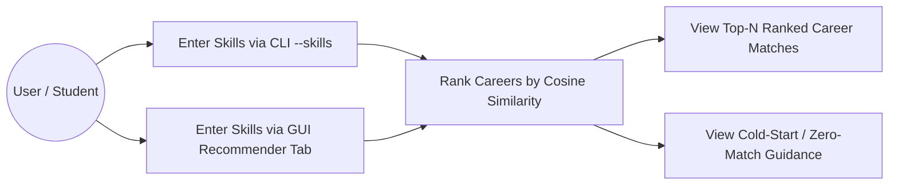

| Use Case | Actor | Preconditions | Main Flow | Postconditions |
|---|---|---|---|---|
| UC-25: Recommend a career from CLI skills | User / Student | `recommend` command registered | Run `python main.py recommend --skills "Python, SQL, Machine Learning"`; skills normalized and vectorized; profiles ranked by cosine similarity | Top-N ranked `RecommendationResult` printed in a boxed list |
| UC-26: Recommend a career from the GUI | User (GUI) | GUI running with Career Recommender tab | Type skills in the entry field, click "Recommend" | Same top-N results as the CLI displayed in the tab |
| UC-27: View top-N ranked matches | User | ≥ 1 profile with non-zero similarity | Ranking returns the best matches with similarity % and matched skills | Ranked list with deterministic order |
| UC-28: Cold-start / zero-match guidance | User | No/few skills, or query outside vocabulary | Engine detects the condition and returns guidance | Friendly guidance message; no crash |

## Architecture — Content-Based Tech Stack Recommendation Engine

### Updated System Architecture (Three Engines)

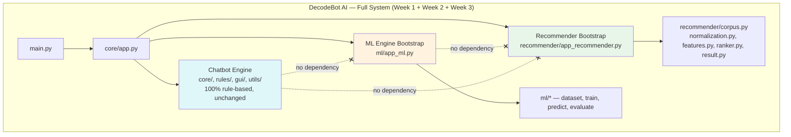

### Recommender Pipeline (Content-Based)

```mermaid
flowchart LR
    Q[Skills Query<br/>"Python, SQL, ML"] --> N[Normalize Skills<br/>FR-240]
    N --> V[TF-IDF Transform<br/>shared fitted vocabulary<br/>FR-241]
    C[Career Corpus<br/>FR-236 / FR-237] --> V2[TF-IDF Fit on Corpus<br/>FR-241]
    V2 --> M[Document-Term Matrix]
    V --> S[Cosine Similarity<br/>FR-242]
    M --> S
    S --> R[Deterministic Top-N Ranking<br/>FR-243]
    R --> F[Fallback Handling<br/>FR-244]
    F --> O[RecommendationResult<br/>FR-238 / FR-245]
```

### Module Responsibilities — Content-Based Tech Stack Recommendation Engine

| Module | Responsibility |
|---|---|
| `decodebot/recommender/corpus.py` | Built-in corpus, CSV loading, validation, and the `CareerProfile`/`SkillSet` data model (FR-236–FR-238) |
| `decodebot/recommender/normalization.py` | Skill-token normalization and canonical abbreviation mapping (FR-240) |
| `decodebot/recommender/features.py` | Single-vocabulary TF-IDF vectorization of corpus and query (FR-241) |
| `decodebot/recommender/ranker.py` | Cosine similarity ranking, deterministic tie-breaking, Top-N clamping (FR-242–FR-243) |
| `decodebot/recommender/fallbacks.py` | Cold-start, zero-match, and threshold partial-match fallbacks (FR-244) |
| `decodebot/recommender/result.py` | `RecommendationResult` dataclass and rendering helpers (FR-238, FR-245) |
| `decodebot/recommender/app_recommender.py` | Thin bootstrap wiring `recommend` into the existing dispatcher, config, and logger (FR-235, FR-239, FR-245, FR-247) |

### Folder Structure Additions — Content-Based Tech Stack Recommendation Engine

```
├── decodebot/
│   └── recommender/
│       ├── __init__.py
│       ├── app_recommender.py     # CLI wiring (FR-239, FR-245)
│       ├── corpus.py               # FR-236–FR-238
│       ├── normalization.py        # FR-240
│       ├── features.py             # FR-241
│       ├── ranker.py               # FR-242–FR-243
│       ├── fallbacks.py            # FR-244
│       └── result.py               # FR-238, FR-245
├── datasets/
│   └── careers_corpus.csv           # Optional custom corpus example (FR-237)
├── tests/
│   ├── test_wave3_isolation.py      # FR-233 isolation gate
│   ├── test_recommender_corpus.py
│   ├── test_recommender_features.py
│   ├── test_recommender_ranker.py
│   ├── test_recommender_cli.py
│   └── test_gui_recommender.py
├── docs/
│   └── RECOMMENDER_GUIDE.md
```

## Configuration — Content-Based Tech Stack Recommendation Engine

Extends the existing configuration system (`FR-088`) with the keys introduced in `FR-235`:

| Key | Type | Default | Description |
|---|---|---|---|
| `recommender_corpus` | string | `"builtin"` | `"builtin"` uses the bundled corpus (FR-236); a CSV file path uses the custom corpus (FR-237) |
| `recommender_top_n` | int | `3` | Number of ranked results to return; valid `1–10`, clamped to corpus size (FR-242) |
| `recommender_min_skills` | int | `3` | Minimum skills required before ranking; below this the engine returns guidance (FR-244) |
| `recommender_threshold` | float | `0.0` | Optional minimum similarity for inclusion; `0.0` disables threshold exclusion (FR-244) |
| `recommender_random_state` | int | `42` | Reproducibility seed for any future shuffling/vectorizer options (FR-243) |

All keys follow the same per-key validation and default-fallback behavior established in `FR-094` — a single invalid recommender key never prevents the application from starting.

## Logging — Content-Based Tech Stack Recommendation Engine

- Uses the existing rotating file handler (`FR-096`) — no separate log file.
- Logger name: `decodebot.recommender` (sub-loggers `decodebot.recommender.corpus`, `decodebot.recommender.ranker`, etc., where useful).
- Logged at `INFO`: corpus load events, normalized query tokens, ranking summaries (top match titles + similarity).
- Logged at `WARNING`: config fallback to default, corpus validation fallback to builtin, zero-match/partial-match fallbacks triggered.
- Logged at `ERROR`: corpus load failures, vectorization failures, CSV validation failures — always with a caught, non-crashing recovery path (`FR-247`).
- **Never logged:** full raw corpus text or full query strings beyond the normalized token list.

## Error Handling — Content-Based Tech Stack Recommendation Engine

| Scenario | Behavior | Related FR |
|---|---|---|
| No `--skills` or fewer than `recommender_min_skills` | Friendly guidance message listing example skills | FR-244 |
| Query tokens all outside the fitted vocabulary | `zero-match` status with a helpful message | FR-244, FR-241 |
| Threshold exclusion empties the result list | Falls back to best available profiles with `partial-match` label | FR-244 |
| Corpus CSV missing required columns | Friendly error naming the offending column(s) | FR-237 |
| Empty-skills or duplicate-title corpus entry | Corpus validation rejects it with a friendly error | FR-238 |
| ML dependency import failure inside the recommender | Friendly message; session continues (fuzz-tested) | FR-247 |
| Invalid `recommender_top_n` / `recommender_threshold` value | Config falls back to default with a logged warning | FR-235 |

## Coding Standards — Content-Based Tech Stack Recommendation Engine Additions

- **Library scope boundary (hard rule):** `scikit-learn`, `pandas`, and `numpy` may be imported **only** within `decodebot/ml/` and `decodebot/recommender/` (plus dedicated tests and the thin CLI/GUI wiring files that call public functions). No file under `decodebot/core/`, `decodebot/rules/`, or `decodebot/gui/` may import these libraries or `decodebot.recommender` (`FR-233`, enforced by `tests/test_wave3_isolation.py`).
- **Lazy import discipline:** any module-level import of ML libraries inside `decodebot/recommender/` is forbidden; imports occur inside the functions that need them (or behind a lazy bridge), mirroring `FR-232`.
- **Type hints:** all recommender functions use type hints, including the `CareerProfile`, `SkillSet`, and `RecommendationResult` dataclasses defined once in `decodebot/recommender/result.py`.
- **Docstrings:** Google-style convention (FR/Args/Returns/Raises) with a `Reference:` line linking back to the relevant FR.
- **Determinism discipline:** ranking must never depend on set/hash ordering; ties are broken by stable keys (`FR-243`).
- **Naming conventions, no bare `except: pass`, and complexity ceilings:** identical to Part I and Part II standards.

## Testing Strategy — Content-Based Tech Stack Recommendation Engine

> New tests are prefixed `TC-REC-` and mirror the rigor of the Part I and Part II testing specifications.

| Test ID | Description | Expected Result |
|---|---|---|
| TC-REC-001 | Built-in corpus loads and passes integrity checks | ≥ 20 entries, ≥ 6 domains, non-empty skills, no duplicate titles |
| TC-REC-002 | Custom CSV corpus loads | Valid rows load and are recommendable |
| TC-REC-003 | Malformed CSV (missing columns, empty skills) rejected | Friendly error, never a crash |
| TC-REC-004 | Skill normalization equivalence | `"Python, SQL, machine learning"` ≡ `"python,sql,machine learning"` |
| TC-REC-005 | Single fitted TF-IDF vocabulary invariant | Query vector dimensionality equals profile matrix dimensionality |
| TC-REC-006 | Top-N default-3 ranking on the canonical query | `Python, SQL, Machine Learning` → exactly 3 results, highest-similarity first |
| TC-REC-007 | Determinism & tie-breaking | Two runs byte-identical; ties broken by corpus order, then title |
| TC-REC-008 | Cold start / min-skills guidance | Fewer than 3 skills → friendly guidance, no crash |
| TC-REC-009 | Zero-match & partial-match fallbacks | Out-of-vocabulary → zero-match; threshold exclusion → partial-match |
| TC-REC-010 | CLI boxed output, `--plain`, and GUI parity | Boxed top-3 matches GUI; `--plain` has zero ANSI/box chars |
| TC-REC-011 | Fuzz: 1,000 malformed `recommend` invocations | Zero unhandled exceptions (FR-247) |
| TC-REC-012 | Isolation + startup gates | `tests/test_wave3_isolation.py` passes; chatbot startup < 300ms (NFR-088, NFR-090) |

> **Week 3 Test Count Summary:** 12 itemized TC-REC-* cases plus unit/integration/regression/negative tests per module (targeted at ≥ 90% line coverage on `decodebot/recommender/`, `NFR-089`), on top of the Week 1 + Week 2 suites.

## Acceptance Criteria — Content-Based Tech Stack Recommendation Engine

| Feature Area | Completion Criteria |
|---|---|
| Package & isolation | ☑ `decodebot/recommender/` isolated ☑ zero imports in core/rules/gui ☑ lazy imports verified ☑ chatbot startup unaffected |
| Dataset | ☑ built-in corpus loads (≥ 20 entries, ≥ 6 domains) ☑ custom CSV works ☑ validation rejects malformed data |
| Input & normalization | ☑ `recommend` command registered in `COMMANDS` ☑ `--skills` parses ☑ normalization equivalence verified |
| Feature extraction | ☑ single fitted TF-IDF vocabulary ☑ query shares the vocabulary |
| Ranking | ☑ cosine similarity ☑ Top-N default 3, validated 1–10 ☑ deterministic tie-breaking |
| Fallbacks | ☑ min-skills guidance ☑ zero-match status ☑ partial-match fallback |
| CLI | ☑ boxed ranked output ☑ `--plain` support ☑ never crashes on malformed input |
| GUI | ☑ Career Recommender tab calls the identical engine function |
| Testing | ☑ full TC-REC-* suite passes ☑ ≥ 90% coverage on `decodebot/recommender/` ☑ isolation gate green |
| Documentation | ☑ `docs/RECOMMENDER_GUIDE.md` complete ☑ `docs/CONFIGURATION.md` extended ☑ README/CHANGELOG updated |

## GitHub Standards — Week 3 Additions

- **README:** a new "Content-Based Tech Stack Recommendation Engine" section following the ML Engine section, including a transcript/screenshot of `recommend --skills "Python, SQL, Machine Learning"`.
- **Badges:** add a "Content-Based Recommendation" badge alongside the existing ones; re-annotate the "100% Rule-Based" badge as describing the Chatbot Engine only.
- **`requirements.txt` clarity:** the recommender reuses the existing ML dependency section (no new required packages); note this in the README dependency explanation.
- **Releases:** the `v3.0.0` GitHub Release notes explicitly call out "Added: Content-Based Tech Stack Recommendation Engine (Week 3)" and "Preserved: Chatbot Engine (Week 1), Machine Learning Engine (Week 2) — unchanged."

## Risks — Week 3 Additions

### Known Limitations (Week 3)
- The built-in corpus is small (~24 curated profiles), so recall is bounded by corpus breadth — users with niche skill sets may get partial matches. This is expected and appropriate for a portfolio-grade, offline system; custom CSV corpora (`FR-237`) mitigate it.
- Content-based recommendation only finds profiles whose text shares vocabulary with the query — it cannot generalize from skills to semantically related but differently-worded skills (no embeddings are used by design).

### Trade-offs (Week 3)
- Reusing TF-IDF + cosine similarity (already available through the Week 2 dependency scope) adds zero new required dependencies and keeps the pipeline fully deterministic and explainable, at the cost of no semantic synonym handling.
- A built-in corpus improves out-of-the-box demos but requires curation; CSV support transfers that burden to users who want custom catalogs.

### Future Improvements (Week 3 → Beyond)
- Add optional synonym/alias expansion tables and, in a future, separately-specified week, optional semantic embeddings — without disturbing the Chatbot Engine, the ML Engine, or the deterministic content-based core documented here.
- Expose a `--top-n` CLI override (validated 1–10) and a "why this match" explanation listing the matched skills per result (Stretch Goal).

---
---

# PART IV — WEEK 4: OCR IMAGE/TEXT RECOGNITION ENGINE (OPTIONAL EXTENSION)

> **Status: PLANNED and OPTIONAL-EXTENSION (not yet implemented).**
>
> **Scope of Part IV:** This part documents the **OCR Image/Text Recognition Engine**. Of the two optional extensions considered for Week 4, the **OCR path (OpenCV + `pytesseract`)** was selected over the object-detection path. This part is **additive only** and **optional** — nothing in Parts I–III depends on it, and the project remains complete and gradeable without it. OpenCV (`opencv-python-headless`) and `pytesseract` are **optional** dependencies installed only for this engine; Tesseract OCR itself is an external system binary invoked via `pytesseract`. This part is documented as **PLANNED**: no production code, tests, or dependencies are to be changed for it until the corresponding plan (`PLAN.md`, Wave 4, milestones W4-M1–W4-M6) is approved and implemented milestone by milestone, with a mandatory stop for user approval after each milestone.

## Week 4 Executive Summary

Week 4 adds a fourth, **optional** engine: **OCR Image/Text Recognition**, implemented with OpenCV for image preprocessing and Tesseract (via `pytesseract`) for text extraction. A user points the engine at a local PNG/JPEG image, which is preprocessed in a fixed pipeline — grayscale → Gaussian blur → deskew → adaptive thresholding (`FR-253`) — then fed to Tesseract in one of four supported page-segmentation modes (PSM `3`, `6`, `7`, `11`, default `6`; `FR-254`). Per-word confidence data is collected and filtered against a default **80% confidence threshold** (`FR-256`); every run returns exactly one status — `accepted`, `low_confidence`, `no_text`, or `error` (`FR-257`) — wrapped in a structured `RecognitionResult` (`FR-258`). A `recognize` CLI command and a Tkinter "Recognition" tab expose the identical engine (`FR-259`–`FR-260`). All processing is strictly local — no network, no uploads, no third-party OCR APIs (`FR-261`) — and oversized/malformed images are rejected before decoding to prevent resource exhaustion (`FR-252`).

## Objectives — Week 4 Additions

### Internship Objectives (Week 4)
- OBJ-INT-11: Demonstrate computer-vision/OCR competency by extracting text from a local image with Tesseract.
- OBJ-INT-12: Deliver the OCR engine as an optional, fully isolated module that never affects the Week 1–3 deliverables when absent.

### Technical Objectives (Week 4)
- OBJ-TECH-13: Implement the OCR engine as a fully isolated package (`decodebot/recognition/`) with **optional** dependencies imported lazily.
- OBJ-TECH-14: Build and verify the standard OCR preprocessing stack: grayscale → Gaussian blur → deskew → adaptive thresholding.
- OBJ-TECH-15: Deliver a confidence-filtered, status-bearing, structured `RecognitionResult` for consistent CLI/GUI/tests consumption.

### Portfolio Objectives (Week 4)
- OBJ-PORT-08: Demonstrate a fourth distinct AI competency (computer vision / OCR) in the portfolio, with a demoable "drop an image, get its text" feature.

### Learning Objectives (Week 4)
- OBJ-LEARN-10: Understand the practical OCR pipeline and why preprocessing quality directly determines Tesseract accuracy.
- OBJ-LEARN-11: Understand confidence-based output filtering and status modeling for real-world extraction quality.

### Stretch Goals (Week 4)
- Add a `--psm auto` mode that scans the four supported PSM modes and reports the best-confidence result, and/or a configurable deskew-angle override.

## Functional Requirements — OCR Image/Text Recognition Engine (FR-249 – FR-262)

> New Functional Requirements for Week 4. Upon Wave 4 implementation the combined project total becomes **262 Functional Requirements (FR-001 – FR-262)**.

### Category T1 — Package & Architecture (FR-249 – FR-251)

**FR-249 — Recognition Package Isolation**
- **Priority:** P0
- **Description:** A new `decodebot/recognition/` package shall implement the OCR engine. No file under `decodebot/core/`, `decodebot/rules/`, or `decodebot/gui/` may import from `decodebot.recognition`, `cv2`, or `pytesseract`. The Chatbot Engine (Part I), ML Engine (Part II), and Recommender Engine (Part III) must behave identically before and after this package exists.
- **Rationale:** Same architectural boundary discipline as `FR-229` and `FR-233`.
- **Dependencies:** FR-229, FR-233
- **Acceptance Criteria:** `tests/test_wave4_isolation.py` passes, confirming zero `cv2`/`pytesseract`/`decodebot.recognition` imports outside the allowed scope.
- **Edge Cases:** N/A.
- **Example:** N/A.

**FR-250 — Optional Dependencies & Lazy Import**
- **Priority:** P0
- **Description:** `opencv-python-headless` and `pytesseract` shall be declared as **optional** dependencies (documented in `requirements-ocr.txt` and the README) and imported only when a `recognize` command first runs. All Week 1–3 functionality must work with neither package installed.
- **Rationale:** Keeps the base install lean; OCR is an opt-in capability that must not burden every user.
- **Dependencies:** FR-249
- **Acceptance Criteria:** `python main.py` starts and the chatbot runs with neither OpenCV nor pytesseract installed; running `recognize` then yields a friendly installation message (see FR-255).
- **Edge Cases:** N/A.
- **Example:** N/A.

**FR-251 — Recognition Configuration Keys**
- **Priority:** P1
- **Description:** Extend the configuration system (`FR-088`) with recognition keys: `rec_image_path` (default `""`), `rec_psm` (default `6`, valid `3`/`6`/`7`/`11`), `rec_confidence_threshold` (default `0.80`, valid `0–1`), `rec_max_dimension` (default `4096` pixels), `rec_max_file_mb` (default `10`), `rec_output_dir` (default `"outputs/"`), `rec_overwrite` (default `false`). Per-key validation and default-fallback behavior (`FR-094`) applies.
- **Rationale:** Consistency with `FR-226`/`FR-235` configuration philosophy.
- **Dependencies:** FR-088, FR-094
- **Acceptance Criteria:** All keys are documented in `docs/CONFIGURATION.md` (extended) with defaults and valid ranges.
- **Edge Cases:** `rec_psm = 0` → falls back to default `6` with a logged warning.
- **Example:** N/A.

### Category T2 — Image Ingestion (FR-252)

**FR-252 — Image Ingestion, Formats & Size Bounds**
- **Priority:** P0
- **Description:** The engine shall accept PNG and JPEG images via `rec_image_path` or the `recognize --image` argument. File existence is checked first (friendly error if missing). Before decoding, file size is checked against `rec_max_file_mb` (default `10`); after decode, the longest edge is checked against `rec_max_dimension` (default `4096`). Out-of-bounds images are rejected with a friendly error — oversized files are never fully loaded into memory.
- **Rationale:** Prevents resource exhaustion from oversized or malformed images (`NFR-093`).
- **Dependencies:** FR-251
- **Acceptance Criteria:** Tests cover: missing file → friendly error; a synthetic > 10MB file → rejected; an image wider than 4096px → rejected; valid PNG and JPEG both process.
- **Edge Cases:** Corrupt/undecodable image bytes → friendly error, no crash.
- **Example:** N/A.

### Category T3 — Preprocessing (FR-253)

**FR-253 — Preprocessing Pipeline**
- **Priority:** P0
- **Description:** Before OCR, the image shall be preprocessed in this fixed order: (1) **grayscale** conversion, (2) **Gaussian blur** (5×5 kernel, configurable sigma), (3) **deskew** (automatic skew correction applied when estimated skew exceeds ~0.5°), and (4) **adaptive thresholding** (Gaussian adaptive threshold) producing a binary image for Tesseract. Each stage is a separate, testable function so a stage can be skipped or fixed independently.
- **Rationale:** A clean binary image materially improves Tesseract accuracy — the standard OCR preprocessing stack.
- **Dependencies:** FR-252
- **Acceptance Criteria:** Unit tests verify: output is single-channel; the blur kernel is applied; deskew corrects a synthetic 3°-skewed image to within ~0.5°; thresholding yields a binary (0/255) image. The pipeline runs headless.
- **Edge Cases:** A uniformly black or white image still runs the pipeline without crashing and yields a `no_text` status (FR-257).
- **Example:** N/A.

### Category T4 — Tesseract OCR Engine (FR-254 – FR-255)

**FR-254 — Tesseract OCR & PSM Modes**
- **Priority:** P0
- **Description:** Text extraction shall use `pytesseract.image_to_data(...)` with `config` selecting one of PSM modes `3`, `6`, `7`, or `11` (default `6` per `rec_psm`). Per-word data (text, confidence, bounding box) shall be collected for downstream filtering (`FR-256`). Tesseract is invoked only on the preprocessed image (`FR-253`).
- **Rationale:** `image_to_data` provides the word-level confidence needed for the 80% filtering requirement.
- **Dependencies:** FR-253, FR-251
- **Acceptance Criteria:** A fixture image with known text (e.g., `samples/sample_text.png`) extracts the expected words with per-word confidence values.
- **Edge Cases:** Empty/blank image → no words → `no_text` status (FR-257).
- **Example:** N/A.

**FR-255 — Missing-Dependency & External-Tool Failure Handling**
- **Priority:** P0
- **Description:** If `cv2`/`pytesseract` are not installed, or the Tesseract binary is not found on `PATH`, the `recognize` command shall print a friendly, actionable message (which package/binary to install) and continue the session — never a traceback. This mirrors the graceful-degradation precedent of `FR-221`.
- **Rationale:** OCR must fail softly; the chatbot session must never crash because OCR dependencies are absent.
- **Dependencies:** FR-250, FR-228
- **Acceptance Criteria:** Simulated missing imports and a missing Tesseract binary produce friendly messages and zero unhandled exceptions.
- **Edge Cases:** Tesseract installed but OpenCV missing (or vice versa) → the same friendly handling.
- **Example:** N/A.

### Category T5 — Confidence & Output Filtering (FR-256 – FR-257)

**FR-256 — Confidence Threshold & Word Filtering**
- **Priority:** P0
- **Description:** Words with confidence below `rec_confidence_threshold` (default `0.80`, i.e. 80%) shall be excluded from the final extracted text and reported separately in a `low_confidence_words` list. Confidence values (0–100 from Tesseract) are normalized to 0–1 for comparison. Words with empty text or empty bounding boxes are always excluded.
- **Rationale:** Default 80% threshold per the Week 4 requirement; low-confidence words remain inspectable, never silently dropped.
- **Dependencies:** FR-254, FR-251
- **Acceptance Criteria:** On a fixture image, words with confidence < 80% appear in `low_confidence_words` and not in the extracted text; accepted text contains only words ≥ 80%.
- **Edge Cases:** All words below threshold → accepted text empty → `low_confidence` status (FR-257).
- **Example:** N/A.

**FR-257 — Recognition Statuses**
- **Priority:** P0
- **Description:** Every recognition run returns exactly one status: `accepted` (≥ 1 word passed the threshold), `low_confidence` (words existed but none passed the threshold), `no_text` (no words detected at all), or `error` (any failure path). The status is exposed on the result object and rendered distinctly in CLI/GUI output.
- **Rationale:** Machine-readable outcomes enable consistent CLI/GUI presentation and testing.
- **Dependencies:** FR-256
- **Acceptance Criteria:** Tests construct each status deterministically and verify the corresponding status string.
- **Edge Cases:** N/A.
- **Example:** N/A.

### Category T6 — Output (FR-258)

**FR-258 — Structured `RecognitionResult` & Output**
- **Priority:** P0
- **Description:** The engine shall return a structured `RecognitionResult` with fields: `status`, `text` (filtered), `full_text` (pre-filter), `words` (word, confidence, bbox per accepted word), `low_confidence_words`, `image_path`, `psm`, `duration_ms`. The CLI renders a boxed summary (status, character count, word count, confidence range) plus the extracted text, honoring `--plain` mode (`FR-133`). An optional `--save` flag writes the extracted text to `rec_output_dir` (default `outputs/`) **without overwriting** existing files unless `rec_overwrite=true`.
- **Rationale:** Structured output consistent with `EvaluationReport` (`FR-205`) and `RecommendationResult` (`FR-238`).
- **Dependencies:** FR-256, FR-257, FR-133
- **Acceptance Criteria:** The documented CLI invocation prints status + text; `--save` writes a `.txt` file; an existing file with the same name is not overwritten unless `rec_overwrite=true`.
- **Edge Cases:** Non-writable output directory → friendly error, no crash.
- **Example:** N/A.

### Category T7 — CLI & GUI (FR-259 – FR-260)

**FR-259 — CLI `recognize` Command**
- **Priority:** P0
- **Description:** A new `recognize` command shall be registered in the `COMMANDS` registry (`FR-058`), accepting `--image` (path) and optional `--psm` (`3`/`6`/`7`/`11`, overriding `rec_psm`). Invocation: `python main.py recognize --image "samples/document.png" --psm 6`.
- **Rationale:** Discoverability and CLI/GUI parity per `FR-222`.
- **Dependencies:** FR-058, FR-252, FR-254
- **Acceptance Criteria:** `help` lists `recognize`; the documented invocation on a bundled fixture image returns `accepted` status and expected text.
- **Edge Cases:** Missing `--image` → friendly usage message; session continues.
- **Example:** N/A.

**FR-260 — GUI "Recognition" Tab**
- **Priority:** P2
- **Description:** The optional Tkinter GUI shall gain a "Recognition" tab with an image path field, "Browse"/"Recognize" buttons, and a text preview area, calling the identical engine function as the CLI. The status is shown prominently with a text label (per `NFR-028`, never color alone).
- **Rationale:** Feature parity and a demoable visual result.
- **Dependencies:** FR-144, FR-259
- **Acceptance Criteria:** Selecting a fixture image and clicking "Recognize" displays the same status and text as the CLI; a missing file shows an inline error.
- **Edge Cases:** The GUI remains responsive if OCR dependencies are missing (friendly message).
- **Example:** N/A.

### Category T8 — Security, Privacy & Testing (FR-261 – FR-262)

**FR-261 — Local-Only Processing & Privacy**
- **Priority:** P0
- **Description:** All OCR processing is strictly local: zero network sockets opened, no telemetry, no image upload, and no third-party OCR APIs (consistent with `NFR-008`). Images and extracted text are written only to the configured local directories and never overwritten without `rec_overwrite`.
- **Rationale:** Privacy guarantee for potentially sensitive documents.
- **Dependencies:** NFR-008
- **Acceptance Criteria:** A static scan finds zero network calls in `decodebot/recognition/`; a test verifies the save path never overwrites without opt-in.
- **Edge Cases:** N/A.
- **Example:** N/A.

**FR-262 — Recognition Testing & Acceptance**
- **Priority:** P1
- **Description:** The recognition engine shall be delivered with the TC-OCR-* test suite and acceptance criteria defined below, including ≥ 90% line coverage on `decodebot/recognition/` and full isolation/startup re-verification. Optional-dependency and external-binary paths are tested via mocks/monkeypatching so CI never requires OpenCV or Tesseract.
- **Rationale:** Same test rigor as the ML and recommender engines, without burdening CI with system OCR binaries.
- **Dependencies:** FR-249–FR-261
- **Acceptance Criteria:** All TC-OCR-* tests pass; isolation and startup gates green; Weeks 1–3 compliance matrices still pass 100%.
- **Edge Cases:** N/A.
- **Example:** N/A.

> **End of Part IV Functional Requirements.** Total: **14 new Functional Requirements (FR-249 – FR-262)**. Combined project total upon Wave 4 implementation: **262 Functional Requirements (FR-001 – FR-262)**.

## Non-Functional Requirements — OCR Image/Text Recognition Engine (NFR-091 – NFR-095, NFR-097)

> New Non-Functional Requirements for Week 4. Combined project total upon Wave 4 implementation: **97 Non-Functional Requirements (NFR-001 – NFR-097)**.

| ID | Category | Requirement | Target / Metric | Priority |
|---|---|---|---|---|
| NFR-091 | Isolation | OCR library imports confined to `decodebot/recognition/` | `tests/test_wave4_isolation.py` passes (FR-249) | P0 |
| NFR-092 | Privacy | OCR runs entirely locally | Zero network I/O during any recognition session (FR-261) | P0 |
| NFR-093 | Resource bounds | Image dimension/file-size limits prevent resource exhaustion | Images exceeding configured bounds rejected with a friendly error (FR-252) | P1 |
| NFR-094 | Testing | OCR test coverage | ≥ 90% line coverage on `decodebot/recognition/` (FR-262) | P1 |
| NFR-095 | Reliability | Graceful degradation without optional deps | Missing OpenCV/pytesseract/Tesseract yields a friendly message, never a crash (FR-255) | P0 |
| NFR-097 | Documentation | Wave 4 engine fully documented | `docs/OCR_GUIDE.md`, extended `docs/CONFIGURATION.md`, README + CHANGELOG updates | P1 |

## User Stories — Week 4 Additions

- As an end user, I want to point the app at a local image and get its text, so that I can extract text without an online service.
- As a privacy-conscious user, I want OCR to run fully offline, so that my documents never leave my machine.
- As a student, I want the OCR engine to be optional, so that my Week 1–3 deliverables remain complete and gradeable without it.
- As a reviewer, I want a demoable "drop an image, get its text" feature in both CLI and GUI, so that I can quickly verify the OCR pipeline.

## Use Cases — Week 4 Additions

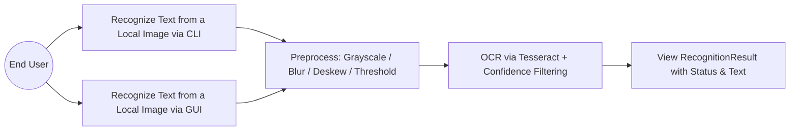

| Use Case | Actor | Preconditions | Main Flow | Postconditions |
|---|---|---|---|---|
| UC-29: Recognize text via CLI | End User | `recognize` command registered; image exists | Run `python main.py recognize --image "samples/document.png" --psm 6`; image ingested and preprocessed; Tesseract extracts words; confidence filter applied | `RecognitionResult` printed with status + text |
| UC-30: Recognize text via GUI | End User (GUI) | GUI running with Recognition tab | Select an image, click "Recognize" | Same status + text as the CLI displayed in the tab |
| UC-31: View status & extracted text | End User | Recognition run completed | Result rendered as a boxed summary (status, char/word count, confidence range) + text | Status and text visible; low-confidence words inspectable |

## Architecture — OCR Image/Text Recognition Engine

### Updated System Architecture (Four Engines)

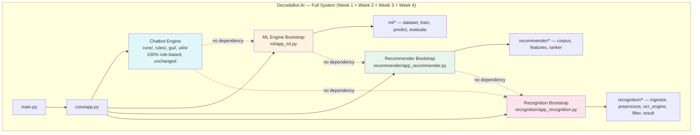

### OCR Pipeline (Preprocess → Tesseract → Filter)

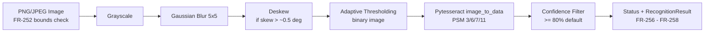

### Module Responsibilities — OCR Image/Text Recognition Engine

| Module | Responsibility |
|---|---|
| `decodebot/recognition/ingestor.py` | Existence/format/size/dimension validation and image decode (FR-252) |
| `decodebot/recognition/preprocess.py` | Grayscale → Gaussian blur → deskew → adaptive threshold pipeline (FR-253) |
| `decodebot/recognition/ocr_engine.py` | `pytesseract` wrapper, PSM modes, per-word data, missing-dependency handling (FR-254–FR-255) |
| `decodebot/recognition/filter.py` | Confidence threshold filtering and low-confidence routing (FR-256) |
| `decodebot/recognition/result.py` | `RecognitionResult` dataclass, status model, rendering helpers (FR-257–FR-258) |
| `decodebot/recognition/app_recognition.py` | Thin bootstrap wiring `recognize` into the dispatcher, config, and logger (FR-251, FR-259–FR-260) |

### Folder Structure Additions — OCR Image/Text Recognition Engine

```
├── decodebot/
│   └── recognition/
│       ├── __init__.py
│       ├── app_recognition.py      # CLI wiring (FR-259)
│       ├── ingestor.py              # FR-252
│       ├── preprocess.py            # FR-253
│       ├── ocr_engine.py            # FR-254–FR-255
│       ├── filter.py                # FR-256
│       └── result.py                # FR-257–FR-258
├── samples/
│   ├── README.md                    # Fixture image provenance/usage notes
│   └── sample_text.png              # Bundled fixture image (FR-254 acceptance)
├── requirements-ocr.txt             # Optional deps: opencv-python-headless, pytesseract (FR-250)
├── tests/
│   ├── test_wave4_isolation.py      # FR-249 isolation gate
│   ├── test_recognition_ingestion.py
│   ├── test_recognition_preprocess.py
│   ├── test_recognition_ocr.py
│   ├── test_recognition_filter.py
│   ├── test_recognition_output.py
│   ├── test_recognition_cli.py
│   └── test_gui_recognition.py
├── docs/
│   └── OCR_GUIDE.md
```

## Configuration — OCR Image/Text Recognition Engine

Extends the existing configuration system (`FR-088`) with the keys introduced in `FR-251`:

| Key | Type | Default | Description |
|---|---|---|---|
| `rec_image_path` | string | `""` | Default image path when `--image` is not supplied (FR-252) |
| `rec_psm` | int | `6` | Tesseract page-segmentation mode; valid `3`/`6`/`7`/`11` (FR-254) |
| `rec_confidence_threshold` | float | `0.80` | Minimum per-word confidence (0–1, normalized) to include a word (FR-256) |
| `rec_max_dimension` | int | `4096` | Maximum longest-edge dimension in pixels (FR-252, NFR-093) |
| `rec_max_file_mb` | int | `10` | Maximum input file size in MB (FR-252, NFR-093) |
| `rec_output_dir` | string | `"outputs/"` | Directory for `--save` text output (FR-258) |
| `rec_overwrite` | boolean | `false` | Whether `--save` may overwrite an existing file (FR-258, FR-261) |

All keys follow the same per-key validation and default-fallback behavior established in `FR-094`.

## Logging — OCR Image/Text Recognition Engine

- Uses the existing rotating file handler (`FR-096`) — no separate log file.
- Logger name: `decodebot.recognition` (sub-loggers `decodebot.recognition.preprocess`, `decodebot.recognition.ocr_engine`, etc., where useful).
- Logged at `INFO`: ingestion events (path, dimensions), preprocessing stages applied, OCR duration and status.
- Logged at `WARNING`: config fallback to default, image rejected for size/dimension bounds, no-text/low-confidence statuses.
- Logged at `ERROR`: decode failures, Tesseract failures, dependency/binary not found — always with a caught, non-crashing recovery path (`FR-255`).
- **Never logged:** extracted image text content (privacy, `FR-261`).

## Error Handling — OCR Image/Text Recognition Engine

| Scenario | Behavior | Related FR |
|---|---|---|
| Image file not found | Friendly error; command aborts cleanly; session continues | FR-252 |
| File > `rec_max_file_mb` or longest edge > `rec_max_dimension` | Rejected before full decode with a friendly error | FR-252, NFR-093 |
| Corrupt/undecodable image bytes | Friendly error, no crash | FR-252 |
| `cv2`/`pytesseract` not installed, or Tesseract binary not on `PATH` | Friendly, actionable install message; session continues | FR-255 |
| No words detected after OCR | `no_text` status rendered distinctly | FR-257 |
| Words present but all below 80% confidence | `low_confidence` status; words in `low_confidence_words` | FR-256, FR-257 |
| `--save` target already exists and `rec_overwrite=false` | File not overwritten; friendly notice | FR-258 |
| Non-writable output directory | Friendly error, no crash | FR-258 |

## Coding Standards — OCR Image/Text Recognition Engine Additions

- **Library scope boundary (hard rule):** `cv2` and `pytesseract` may be imported **only** within `decodebot/recognition/` (plus dedicated tests and the thin CLI/GUI wiring files that call public functions). No file under `decodebot/core/`, `decodebot/rules/`, `decodebot/gui/`, `decodebot/ml/`, or `decodebot/recommender/` may import them (`FR-249`, enforced by `tests/test_wave4_isolation.py`).
- **Optional-dependency discipline:** `cv2`/`pytesseract` imports occur lazily inside the functions that need them, behind a documented import helper that raises a friendly error when missing (`FR-250`, `FR-255`).
- **Type hints and docstrings:** identical to Parts I–III (Google-style, `Reference:` line, type-hinted signatures).
- **Privacy discipline:** extracted text is never logged and never written outside `rec_output_dir` (`FR-261`).
- **Naming conventions, no bare `except: pass`, and complexity ceilings:** identical to Parts I–III.

## Testing Strategy — OCR Image/Text Recognition Engine

> New tests are prefixed `TC-OCR-`. Optional-dependency and external-binary paths are tested via mocks/monkeypatching so CI never requires OpenCV or Tesseract installed.

| Test ID | Description | Expected Result |
|---|---|---|
| TC-OCR-001 | Ingestion: valid PNG and JPEG load | Both formats decode and enter preprocessing |
| TC-OCR-002 | Ingestion: missing file, oversize file, over-dimension image rejected | Friendly errors, never a crash |
| TC-OCR-003 | Preprocessing: grayscale/blur/deskew/threshold stages | Correct outputs; deskew corrects 3° skew to < 0.5° |
| TC-OCR-004 | Preprocessing: blank/black image runs pipeline | `no_text` status, no crash |
| TC-OCR-005 | OCR: fixture image yields expected words + per-word confidence | Known text extracted with confidence values |
| TC-OCR-006 | Filtering: < 80% words routed to `low_confidence_words` | Threshold behavior verified |
| TC-OCR-007 | Statuses: `accepted` / `low_confidence` / `no_text` / `error` | Each status constructible and rendered |
| TC-OCR-008 | Output: `RecognitionResult` fields; `--save` writes file; no overwrite without `rec_overwrite` | File behavior verified |
| TC-OCR-009 | CLI: `recognize` in `help`; invocation on fixture image | `accepted` status + expected text |
| TC-OCR-010 | Missing deps/binary (mocked) → friendly message | Zero unhandled exceptions (FR-255) |
| TC-OCR-011 | Privacy: static scan for network calls in `decodebot/recognition/` | Zero network I/O (FR-261) |
| TC-OCR-012 | Isolation + startup gates | `tests/test_wave4_isolation.py` passes; chatbot startup < 300ms |

> **Week 4 Test Count Summary:** 12 itemized TC-OCR-* cases plus unit/integration/regression/negative tests per module (targeted at ≥ 90% line coverage on `decodebot/recognition/`, `NFR-094`), all runnable without OpenCV/Tesseract installed.

## Acceptance Criteria — OCR Image/Text Recognition Engine

| Feature Area | Completion Criteria |
|---|---|
| Package & isolation | ☑ `decodebot/recognition/` isolated ☑ zero `cv2`/`pytesseract` imports in core/rules/gui/ml/recommender ☑ lazy optional imports ☑ chatbot startup unaffected |
| Ingestion | ☑ PNG/JPEG supported ☑ missing file friendly error ☑ size/dimension bounds enforced |
| Preprocessing | ☑ grayscale ☑ Gaussian blur ☑ deskew (3° → < 0.5°) ☑ adaptive thresholding ☑ headless |
| OCR | ☑ PSM 3/6/7/11 supported ☑ default PSM 6 ☑ per-word confidence collected ☑ missing-dependency friendly handling |
| Filtering | ☑ default 80% threshold ☑ low-confidence words routed separately |
| Statuses | ☑ `accepted` ☑ `low_confidence` ☑ `no_text` ☑ `error` |
| Output | ☑ structured `RecognitionResult` ☑ boxed CLI summary + text ☑ `--save` never overwrites without opt-in |
| CLI & GUI | ☑ `recognize` in `help` ☑ GUI Recognition tab calls the identical engine function |
| Privacy | ☑ zero network I/O ☑ no telemetry/upload ☑ local-only writes |
| Testing | ☑ full TC-OCR-* suite passes (CI without OpenCV/Tesseract) ☑ ≥ 90% coverage on `decodebot/recognition/` |
| Documentation | ☑ `docs/OCR_GUIDE.md` complete ☑ `docs/CONFIGURATION.md` extended ☑ README/CHANGELOG updated |

## GitHub Standards — Week 4 Additions

- **README:** a new "OCR Image/Text Recognition Engine (Optional)" section, including a transcript/screenshot of `python main.py recognize --image "samples/sample_text.png"` and the GUI Recognition tab.
- **`requirements-ocr.txt`:** optional-dependency manifest (`opencv-python-headless`, `pytesseract`) with pinned minimum versions and install instructions, clearly labeled "optional — only needed for the Week 4 OCR engine."
- **Releases:** the `v3.1.0` GitHub Release notes explicitly call out "Added (Optional): OCR Image/Text Recognition Engine (Week 4)" and "Preserved: Chatbot Engine (Week 1), ML Engine (Week 2), Recommender Engine (Week 3) — unchanged."

## Risks — Week 4 Additions

### Known Limitations (Week 4)
- Tesseract accuracy depends heavily on image quality and preprocessing; complex layouts, handwriting, or low-resolution scans may yield low-confidence or incorrect text. The 80% threshold and status model surface this honestly rather than silently returning garbage.
- The external Tesseract binary must be installed separately by the user; the engine can detect and explain its absence (`FR-255`) but cannot bundle it.

### Trade-offs (Week 4)
- OCR is an optional, separately-installed capability — a deliberate trade of convenience for keeping the base install lean and CI independent of system binaries.
- OpenCV-headless was chosen over the desktop build so the pipeline works on headless servers/CI with no GUI toolkit dependency.

### Future Improvements (Week 4 → Beyond)
- Add a `--psm auto` mode scanning the four supported modes and reporting the best-confidence result (Stretch Goal).
- Explore higher-level vision extensions (e.g., object detection) in a future, separately-specified week, without disturbing the deterministic OCR core documented here.

---
---

## Glossary

| Term | Definition |
|---|---|
| **Intent** | A discrete classification of user input meaning, determined entirely by deterministic rule matching |
| **Rule** | A pattern-to-intent-to-response mapping defined in code or a plugin module |
| **Rule Engine** | The subsystem responsible for normalizing input and matching it against all loaded rules |
| **Rule-Based AI** | An approach to producing intelligent-seeming behavior using explicit, human-authored conditional logic rather than statistical learning |
| **Session** | The runtime lifetime of a single process instance, from launch to termination |
| **SessionState** | The in-memory object holding all session-scoped mutable data (history, stats, name, flags) |
| **Fallback / Unknown Response** | The response category used when no rule matches the input |
| **Normalization** | Canonicalizing raw input (case, whitespace, punctuation) prior to matching |
| **Plugin** | A self-contained rule module conforming to the defined interface, auto-discovered at startup |
| **Circuit Breaker** | The safety mechanism that halts the session after repeated unrecoverable internal errors |
| **Compliance Matrix** | The mapping of DecodeLabs' 8 mandatory requirements to this project's FRs and test cases |
| **FR / NFR** | Functional Requirement / Non-Functional Requirement |
| **CLI** | Command-Line Interface |
| **REPL** | Read-Eval-Print Loop |
| **SemVer** | Semantic Versioning (`MAJOR.MINOR.PATCH`) |
| **Presentation Adapter** | Either the CLI (`core/loop.py`) or GUI (`gui/app_gui.py`) - an interchangeable front end that never contains its own conversational logic |
| **Reduced Motion** | An accessibility mode that disables frame-cycling animation while preserving static informational equivalents |
| **Chatbot Engine** | Part I of DecodeBot AI — the 100% rule-based conversational agent, its GUI, and its animations (Categories A-Q) |
| **Machine Learning Engine (ML Engine)** | Part II of DecodeBot AI — the new, isolated `decodebot/ml/` module implementing supervised classification (Category R) |
| **Supervised Learning** | A machine learning paradigm where a model learns to map inputs to known output labels from labeled training examples |
| **K-Nearest Neighbors (KNN)** | A classification algorithm that assigns a new sample the majority class among its K closest training samples |
| **Feature Scaling** | Transforming numeric features to a common scale (e.g., mean 0, variance 1 via `StandardScaler`) so no feature dominates due to magnitude alone |
| **Train/Test Split** | Dividing a dataset into a subset used to train a model and a separate, held-out subset used to evaluate it |
| **Data Leakage** | An error where information from the test set improperly influences training (e.g., fitting a scaler on the full dataset instead of the training set only) |
| **Confusion Matrix** | A table showing correct and incorrect predictions broken down by actual vs. predicted class |
| **Precision** | Of all samples predicted as a given class, the fraction that were actually that class |
| **Recall** | Of all samples actually belonging to a given class, the fraction the model correctly identified |
| **F1 Score** | The harmonic mean of precision and recall, balancing both into a single metric |
| **Accuracy Mirage** | The phenomenon where high overall accuracy hides poor performance on minority classes, especially in imbalanced datasets |
| **Model Persistence** | Saving a trained model to disk (via `joblib`) so it can be reloaded and reused without retraining |
| **Content-Based Recommendation** | Recommending items by measuring the similarity between a query's content features and each candidate item's content features — here, TF-IDF vectors over skills/description text compared by cosine similarity |
| **TF-IDF** | Term Frequency–Inverse Document Frequency — a weighting scheme that scores how important a term is to a document within a corpus |
| **Cosine Similarity** | The cosine of the angle between two vectors, used here as a 0–1 content-similarity score between a skill query and a career profile |
| **Top-N Recommendation** | Returning the N highest-scoring candidate items for a query (default 3, validated 1–10) |
| **Optical Character Recognition (OCR)** | Extracting text from images using Tesseract, invoked via `pytesseract` |
| **Page Segmentation Mode (PSM)** | A Tesseract setting controlling how an image is divided into lines/words/blocks; modes 3, 6, 7, and 11 are supported here (default 6) |
| **Adaptive Thresholding** | Converting a grayscale image to binary using a locally-computed threshold, robust to uneven lighting |

---

## References

1. IEEE Std 830-1998 — *IEEE Recommended Practice for Software Requirements Specifications*.
2. ISO/IEC/IEEE 29148:2018 — *Systems and software engineering — Life cycle processes — Requirements engineering*.
3. PEP 8 — *Style Guide for Python Code*, Python Software Foundation.
4. PEP 257 — *Docstring Conventions*, Python Software Foundation.
5. Semantic Versioning 2.0.0 — [semver.org](https://semver.org).
6. Python Standard Library Documentation — `logging`, `configparser`, `json`, `re`, `random`, `datetime`, `dataclasses`, `enum`, `typing`.
7. Mermaid Diagram Syntax Documentation — [mermaid.js.org](https://mermaid.js.org).
8. Keep a Changelog — [keepachangelog.com](https://keepachangelog.com).
9. DecodeLabs Artificial Intelligence Internship — Week 1, Project 1 assignment brief (internal reference).
10. DecodeLabs Artificial Intelligence Internship — Week 2, Project 2 ("Data Classification Using AI") official brief, Batch 2026 (internal reference; PDF supplied by the internship program).
11. Fisher, R.A. (1936). *The Use of Multiple Measurements in Taxonomic Problems* — original source of the Iris dataset, distributed via `sklearn.datasets.load_iris()`.
12. `scikit-learn` Documentation — `KNeighborsClassifier`, `StandardScaler`, `train_test_split`, `confusion_matrix`, `classification_report`. [scikit-learn.org](https://scikit-learn.org).
13. `pandas`, `numpy`, `matplotlib`, and `joblib` official documentation (used exclusively within `decodebot/ml/`).
14. `scikit-learn` Documentation — `TfidfVectorizer`, `cosine_similarity`. [scikit-learn.org](https://scikit-learn.org).
15. Tesseract OCR & `pytesseract` Documentation — PSM modes, `image_to_data`. [github.com/tesseract-ocr/tesseract](https://github.com/tesseract-ocr/tesseract), [pypi.org/project/pytesseract](https://pypi.org/project/pytesseract).
16. OpenCV Documentation — `cvtColor`, `GaussianBlur`, `adaptiveThreshold`. [docs.opencv.org](https://docs.opencv.org).

---

*End of SPEC.md. This document is version-controlled alongside the source code and must be updated in lockstep with any behavioral change to DecodeBot AI.*
